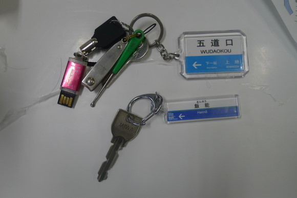
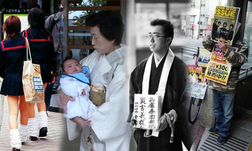

# 我该去恨的日本究竟在哪？

`**“走在街头看到小孩对着母亲哭丧着脸撒娇，女孩们穿着制服手拉手说笑过街，上班族表情寥落在垃圾桶边抽烟，看到越多就越觉得，他们和我们真的有区别吗？都是人而已啊。如果说他们上一辈做了对不起中国人的事，所以该叫这些人统统受罪，就该剥夺他们的家人他们的幸福，让他们从此一直生活在无止尽的痛苦中，这有任何道理吗？”**`

# ** **

# 我该去恨的日本究竟在哪？

## 文/尹璐（清华大学）

1 

在仙台的东北大学汇报方案的时候，haruka来找我拷文件。看到我的钥匙扣，问我这是什么，我说这是我学校那里的地铁站。她就很高兴把她的钥匙扣也拿出来给我看，说这是她家里的地铁站。很像吧。

那之前，和他们这些日本孩子交流的时候，心里不是没有芥蒂的。其实他们都干净腼腆有礼貌，而且感觉上挺单纯，很难让人讨厌。 可是心里没法忽略一个声音，这是日本人啊，日本人。 我猜，他们也不是没想过的吧。 在一起画图的时候也好，一起喝酒聚会说笑的时候也好，大家逐渐放开的时候，脑子里都还有根弦。那可是日本人。 拍下这张照片的时候，我突然觉得脑子里盘旋了许多天的这个问题，又迷糊了些。 是啊，五道口是我的宇宙中心，那这里就是她的。她生在这里，并且爱上她的家乡，并不是她的错啊。我究竟有什么理由恨她？凭什么去指责别人的命运？ 2 Haruka的汉字名字是晴香。无论中文还是日文，都是很好听的名字。人也很乖巧可爱，打扮得清爽干净，满脸单纯，虽然有点小寂寞，喝了酒就抱人，只要一笑起来天都晴了。我们去松岛玩，去一趟要40多分钟的火车，她还特意跟来陪着，没有任何人交待。那时候我真的是很喜欢她。 也很喜欢Fumi，Taka，Bob，好多人。Fumi看上去有点男孩子气，短发，唱歌喜欢晃脑袋，但是唱得真好。英语说不出来就扁着嘴画画解释，都画得特别萌。我和万总住在她家里，才觉得这日本女孩真是贤淑温柔，怎么看都是善良，对我们非常照顾。我简直要忍不住要爱她。为什么要恨她？ Sasai是个活宝，特别喜欢井上雄彦，而且长得就特像井上漫画里的人。看到他的脸和嘴唇，就觉得灌篮高手后期那个人设，根本就是素描啊。非常热血。讲着讲着方案就开始振臂高呼，说这是我们的梦想，我们会一直努力！那时完全笑抽了的我还是忍不住觉得，这小伙好可爱啊。 万总爱唱歌，他们就陪我们唱歌。Bob是个大个子，歌唱得很不错。不说话，英语不好，说不出来就会扮各种鬼脸，很傻很可爱。Koya烫着头发，明显是很得意的那种年轻人，很爱摆明星式的微笑，唱起歌来简直是专业的。唱到深夜了我们说想听灌篮高手，他就一首首唱，破了嗓子也吼上去。 看着屏幕上无论何时都能让人热血沸腾的熟悉画面，这是我们共同的青春记忆，无论哪个国家。那一刻的感觉真的很好。突然觉得去他娘的政治，我们都是年轻人，投胎在不同的国家而已。我们都是一样的啊。 3 我要去恨的那个日本，一定不在仙台。我要去恨的日本人，一定不是他们。 可那个日本，究竟在哪里？那些日本人，究竟在哪里？ 总共去了两次日本，加起来能有不到一个月，并不长。有说法是去过日本的中国人，对日本的印象会大大改观。对我来说真的是这样。 不止是因为他们干净勤勉有礼貌，当然肯定有这个原因。对我来说，最重要的，让我彻底改观的一个看法是，我发现，他们也是人啊。 说起来像个笑话。确实有个著名笑话是这样，日本人说他们是人，世界都笑了。在中国很流行的笑话。 可是，去了之后，我感到最困惑的是，我所设想的那个全是变态侵略者的集中营，其实只是一群像我们一样的人安居乐业的地方而已。他们也一样，有父母，有子女，会相爱，会失恋，会高兴，会难过。都是人而已啊。 走在街头看到小孩对着母亲哭丧着脸撒娇，女孩们穿着制服手拉手说笑过街，上班族表情寥落在垃圾桶边抽烟，看到越多就越觉得，他们和我们真的有区别吗？都是人而已啊。如果说他们上一辈做了对不起中国人的事，所以该叫这些人统统受罪，就该剥夺他们的家人他们的幸福，让他们从此一直生活在无止尽的痛苦中，这有任何道理吗？ 

4 而且，去过日本才会觉得，太像了。比起之前去的土耳其，这里亲切得多。上千年的沟通早就让两国文化上完全无法分开。去日本旅游比去土耳其方便得多，到处是汉字。在土耳其看建筑也是看看热闹，再好看也陌生。这里基本上都能理解，庙，神社，各种石像，祈福的人，不用看任何解释就差不多能知道他们在干吗，在想什么。 国内看到的媒体报道都是最异质的一面，似乎日本奇怪的地方太多了，那里简直就是异次元，根本就是外星人生活的地方。而去了才觉得，哪有差那么多。相比之下欧洲什么的才是无法理解的奇怪领域吧。文化是意识形态也隔断不了的最强大的力量。在日本，吃着拉面，看着旁边同样黄皮肤黑眼睛的人，无法立即分辨是哪国的，那种亲切感，实在令人忍不住有种同胞甚至亲人般的错觉。 我猜，会对这次事件叫好的人，一定没来过日本。日本在他们心目中，只是地图上的一块，新闻里的两个字。而且，即使是对日本的灾难叫好的人，也只敢面对着大画面，大地图，说大快人心吧。这也是课上听到的景深手法：一个行为滑稽的人，多是给远景，全身像，大家看到会忍不住哈哈大笑；而拉近镜头，看到他脸上的迷茫难过，就只会让人顿生悲凉怜悯之心。 来过之后，会记得一栋栋小房子，那是一个个家庭，高兴也好，难过也好，都在很不容易地生活着。可能我是女的所以就爱看到这些？不过，就是这些努力生活的场景，对我来说，太打人了。 我想不出，如果看到一个真实的日本家庭在灾难面前如何被命运折磨，看到那张如此像同胞的黄种人面孔伤心落泪，有多少固执的爱国者，可以完全免于伤心。很多人肯为赤名莉香哭得死去活来，却没想过，那里确实就是生活着许许多多有感情的活生生的人，谁有资格来拆散他们和至爱的亲人？何况，你那个理由，是他们的错吗？ 5 为什么会觉得自己就应该恨他们？ 想来想去，似乎就是那几篇重要的文章。一篇是说日本人把中国历史学得很好，说中国汉奸比日本兵还多什么的，在我高中的时候特别火，我还真为了这篇文章不再看日本漫画了。还有一篇白岩松的，说日本人如何欺负中国人，看不起中国人，影响力也很大。还有一篇说韩国人支持国货的，说中国人买日本货就是犯贱。 民族主义是很容易被激发起来的精神肿瘤。我也被深深煽动过。直到亲身去了那里，发现自己再没法宽泛去恨任何一个普通的日本人，才开始思考。为什么要恨？ 一，日本人侵略过我们，非常残忍杀了很多中国人；二，日本人现在还恨着我们，看不起中国人，去看看日本右翼；三，日本人可能还会发动再一次侵华战争，他们纪律严谨储备丰富，非常可怕。大概就这么几个原因吧。 一我也想不清。战争的问题太复杂。但是日本人真的有那么讨厌中国人？应该会有一部分是这样吧，虽然我没遇到。大概和中国人喜欢搞的地域歧视差不多，中国人喜欢说哪省的人都是坏人，他们就觉得某某民族都是劣等民族什么的吧。其实这和拼命骂日本人都是变态就都该死的人一样，遵守的逻辑完全相同。先是以偏概全，然后搞纳粹思维。这帮爱国愤青，扔到日本就是右翼。没有区别的。 问题是，骂他，他就看得起你了？ 我看过一篇文章说是几个日本人酒后聊天，说起中国要求道歉这件事。他们觉得无聊，觉得被欺负之后要求道歉这件事简直是女人的行为。如果真的很有实力，像是美国那样，他们就会直接拜服学习了。看到这文章觉得很窝火，他们居然会信奉这套恃强凌弱的逻辑。好像没有公理，只有实力。这和受道德统治几千年的中国确实不同。可是，要真的让日本人看得起，除了做出点成绩给人家看看也别无他法。 而且，就我对他们的那点认识而言，除了很穷很愤很闲的右翼之外，其他日本人才没工夫恨你。人家整天都在认真工作着呢。把自己的工作做好了，就谁都看得起你了，这个硬道理倒也没什么大错。 再说，在一个稳定的社会里，生活有保障的人，干嘛要整天琢磨着恨你？发动战争的人，都是对生活极度不满想要重洗整个社会秩序的。我不觉得现在的日本有那么多活不下去的人。去了这么多天，我也一直觉得，即使辛苦，他们也是在安居乐业。战争的惨象还在脑子里，又过了这么些年好日子，谁还想着打仗啊。 整天非得惦记着着打仗的，除了野心，就是害怕了吧。即使开战，能不能打得过？有多少人是因为这个才恨他们，还称之为忧患意识？想想多少觉得有点可怜。难道是除了仇恨，手中一无所有，所以只能恨下去？ 最恨日本的那帮人，请也加油做点实事吧。真的强大了，就自然没人瞧不起，没人欺负，也没人敢打了。自信一点啊！ 6 会被多少人骂我也想说，我觉得我碰见的日本人都挺好的。干净，文明，守规矩，有礼貌。在那么个社会，文明和秩序已经建立，大家其实相对活得单纯。我们在那里受到的，全是热心的帮助，看到的都是真诚的笑脸。其实看到别人有困难，过去帮一下，不需要分国籍啊政治倾向啊宗教信仰啊什么的吧。我从没觉得被谁欺负。如果他们自己活得好好的，干嘛整天想着害人？只要我尊重别人，我自己自重，别人也不会不尊重我。对日本的受虐妄想，去了一趟就无以为继了。 但是，就算他们再好，再干净再文明，我也一点不觉得中国人就比他们差。 中国人的许多可爱之处也是回来了之后才感觉到的。即使整天说世风日下，奇怪的让人伤心的报道越来越多，我也觉得，规矩是被推倒了正在重建，而人心还是善良可爱的，不会变，也不会输给任何国家的人。日本当年也一定有过这个阶段吧？他们走过来了，我们还没走到而已。 李承鹏在微博上转了视觉日刊的一条消息，“一位同事本来也是对日本地震幸灾乐祸，但是看了我发的灾难视频后，总算没有把嘲弄的笑容挂在脸上了，有点坐立不安的说去查查日本红十字会的地址，看能否给人家捐款，当她百度搜索‘日本红十字会’看到结果后，当场失声痛哭——全部都是日本红十字对中国的各种援助历史，都是她在国内媒体上不曾听闻的。” 他的评论是：“我们官方宣传有意无意让人们觉得所有的对手都没道德，没水准，没爱心，灭我亡我之心一直不死，我们整个国家生活在一种虚妄大梦和受虐中，可有一天我们得知世界真相，全体石化当场。” 而我更喜欢的一条回复是“看了这个我只想说中国人真心善良，知恩，感恩，宽容，也懂回报。我们是有血性的民族，在这一点上不比谁差。” 我相信是这样。 我信的就一条，将心比心，所有人都是一样的。 7 不过，传媒在有意识强化这种仇恨，倒是真的。 教科书那件事，我自己去书店查过他们的历史高考复习资料，人家说得清清楚楚，比我们的教科书上甚至还多了些国军抗战的东西，只是将南京大屠杀写成南京事件，那张提着人头的照片也有。此外，日本每年的对华援助款，和各种民间支持，我以前也几乎从未耳闻。还有人截图表示日本人在汶川的时候也是幸灾乐祸的，我听当时在的人表示，这个真没有。那个幸灾乐祸的论坛，大概相当于现在的百度贴吧或者腾讯空间左右吧。用户水准有限，没办法，也不用在意吧。 充斥着屏幕的都是几十年前鬼子的凶残，似乎电视剧也就只有这个可拍。难道是同样凶残的国内历史不太方便拍出来？我虽然不知道官方每年的舆论导向方针究竟是什么，可是似乎很明显，和仇恨相关的东西在被煽动，被放大。而关于友好发展的部分，被排斥了。如果稍微去查一下，就会发现很多民间力量在重塑友好。一些人日子过好了有能力做善事就想做做好人，这挺正常的吧。而仇恨传播得如此快速，友好几乎被掩埋。这纯是民间的力量？还是官方对于这种仇恨有什么考虑？ 我还不明白为什么。不过叫嚣着日本该沉没的人，逻辑好懂得令人无奈，懒得想。政治家们的立场，我也不想去懂。 8 我只知道，这两个国家无论怎么互相抵触，都是无法分开的。且不说文化上，离了任何一方都彻底失语，地理上就没法断绝关系。两口子变仇家可以离婚，兄弟反目可以分家，而我们连分居都做不到。如果真有一场那么强悍的地震，强到足以让整个日本沉没，中国东部也就完了。 我觉得还是了解不够。了解越多，就越难以痛恨，再刻骨的仇人，认识越深，就越发现彼此并没那么多不同，越会发现彼此都在命运的摆布中挣扎迷茫。一切皆苦。所有活着的人都很不易，我信这个。等明白了彼此本质上的相通，消灭对方也就像残害自己。即使仇恨无法消除，也无法忍心下手了。人是这样，国家也是吧。 有人说只是恨日本这个国家，不是恨人民。好奇怪的说法。对国家痛恨，而不是对人，那是在恨什么？你也困惑了？ 我只知道，我不会去恨现在正在受灾的那批民众。他们并不是侵略者，我找不到任何理由。 9 得到Haruka的邮件说，她一切平安，朋友们也都是，不过朋友的家里有的在海边，不知道家里是否安全。 什么政治，什么民族，什么国籍，我再也不想去想了。这和我们有半点关系吗？ 我们只是两个偶然相识的普普通通的人，现在我知道我的小姑娘一切安好，实在很想给她一个大大的拥抱。 快点好起来吧。 

（编辑：陈轩）
