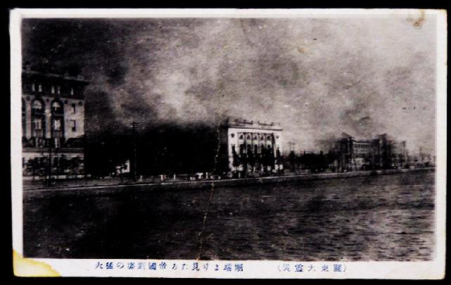

# 短论：日本是如何走上不归路的，从关东大震灾说起

`**“古人说，以德报德，以直报怨。对于邻国的善意，前脚刚走，茶还没凉，就编出各种谣言，总之就是日本坏，因为坏所以坏，他笑是奸笑，哭是诈哭，拿你的东西是掠夺，给你东西是收买！！你让他们怎么办？”**`

# ** **

# ** **

# 短论：日本是如何走上不归路的，从关东大震灾说起

## 文/陆遥遥（北斗撰稿人）

最近人人流行这样一则状态：“1923年日本关东大地震，我们集全国之力援助它们，结果换来了什么，五年之后就是济南惨案，8年之后就是918，14年之后就是七七事变，南京大屠杀!!!!” 是的，这个问题我也想过，思考了很久，甚至试图理解这个问题，就是我学习日语的主要原因。在今天，我很难讲，就已经明白了其中的深层原因，但从1923年到1945年，日本社会演进的脉络，我却可以大致看清，并且说清了。 实际上，如果当时的中国人的外交情报好一些，认真地研究关东大地震对日本的影响，就不应该做出援助日本的决定，或者就算援助的话，也只能适当、适度。因为紧接着关东大地震的，就是基于疯狂的民族主义情绪的，屠杀朝鲜人和社会主义者的行动。关东大地震后，人民被浓重的末世情结所笼罩，加之社会治安变坏，火灾、抢劫、强奸时有发生，不知怎么开始出现了在日朝鲜人纵火，在日朝鲜人计划暴动的谣言（即谣言有无官方背景，尚是日本史学界的一大悬案），然后日本警察和民间武力团体开始屠杀朝鲜人，有2000至6000人被杀害。因为朝鲜人说日语时清音和浊音比较含混，杀人者就在街上拦住疑似朝鲜人的，让他说“十五円五十钱”，说不标准的就殴打、杀害。很多日本人也被“误杀”。一些让当局头疼的社会主义者、无政府主义者更是被趁机杀害。 试问，被那样一个政府统治的，被那样一个政府驯化的民族，能理解中国人的善意吗？他们走上暴戾恣睢的侵略道路，给亚洲人民带来深重灾难，最后灭亡难道不是咎由自取？ 好的。我是中国人，我爱中国，我说日本长日本短，其实日本和我有啥关系？我还是想说中国： 汶川大地震后，日本派出救援队前往灾区。从2008年开始，有谣言盛传，什么日本救援队就是去探查我们军事机密的，什么一共没去了几个人，随行记者倒有一大帮，什么在绵阳来着不走了，什么回国时要带中国土壤，结果被外交部发现了，云云。 作为随行记者，我在此郑重说明。 第一、救援队具体去哪里，完全服从了外交部门的要求，而外交部门则是听从了四川省的意见。之所以先去唐家山，后去青川，最后去北川。是因为地方政府高估了日本救援队的能力，认为可以从泥石流中救出人来，结果失败了。怎么就成了日本想去哪就去哪儿？ 第二、我是随行记者，随行记者很多，但我们都没有用灾区的资源。我是自己在成都包了车，连夜往青川开。我从北京买了600块钱的口罩、退烧药、消炎药、止泻药，沿途分发。我在灾区，没有吃过一口灾区的粮食，全部消耗自带品。从绵阳到青川，沿途我带过3个武警战士，一个川师大学生（去志愿去灾区拍照），两个赶回家的农民工？怎么变成我们去添麻烦了？ 第三、带土壤回日本，如果真要搞间谍，还要救援队来搞？那么多日本民间志愿者在，那么多日资企业在，谁不能搞？这话就类似当年尼克松偷象牙筷子被我海关人员抓获的段子。只有民智极端低下的人民，才能相信。 古人说，以德报德，以直报怨。对于邻国的善意，前脚刚走，茶还没凉，就编出各种谣言，总之就是日本坏，因为坏所以坏，他笑是奸笑，哭是诈哭，拿你的东西是掠夺，给你东西是收买！！你让他们怎么办？ 盛传这种谣言，就这这种谣言做强国迷梦的人，和屠杀朝鲜人的日本军国主义分子有什么区别？ 范文澜先生写中国通史简编批判佛教，他说佛教把地狱设想得极其阴暗恐怖，恰恰说明佛教徒心理的阴暗。因为心智健康的人，很难想象出那种东西。基本的方法论正确，我以为心智但凡阳光一点的，健康一点的人，实在想不出什么救援队盗土壤的段子。 刚看到有人说“我们唯一能做的就是锻炼好身体，随时准备抗日。” 好啊，那就需要少看AV，少打飞机，你做得到吗？我看难啊。 我可以说死一句话，但凡汶川大地震时，在灾区经历过苦日子的，亲身参与抗震救灾的人，一般不会对日本人民遭受的大灾幸灾乐祸！！ 对于我这个经历者，你们知道地震意味着什么吗？地震意味着六层楼像压缩饼干般的垮塌成三层，意味着其中流出酱红色的血水，意味着不时飘来的类似带鱼干的尸臭，意味着探出废墟的已经腐见白骨的手，意味着回望北川那日的残阳…… 

（编辑：陈锴）
