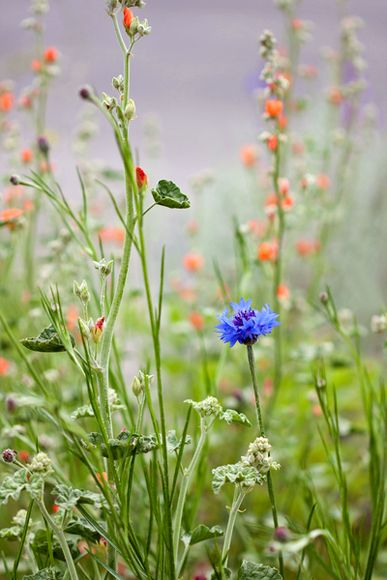

# 一个草民春天的梦想

**智慧并不像法条与事实的对照，而是自然对人类的启蒙！智慧从来不是照本宣科的演讲，更不能通过填鸭式的灌输得到。智慧就是一种淳朴的品质，在你拔掉一颗草的时候将它放到合适的篮子里，让他的天赋得到适当的运用。我不爱小草，但我尊重他们，尊重他们的秉性！他们和树不同，和我们更有差距，但是你无法将他们用一瓶农药全部杀死，那是人类的愚蠢和无知！** ****ibeidou.org ibeidou.org

# 一个草民春天的梦想

ibeidou.org

## 文/杨洪超（安阳师范学院）

ibeidou.org ibeidou.org 又到了四月，万物复苏的时节！童年的四月应该是和妈妈一起下田除草的时候。可恶的小草肆意在麦田里伸展着枝腰，而我的任务就是将他们一一剔除，然后把它们背回家喂我家的羊！现在的四月里，不再为了草而发愁，不再负有将它们消灭的责任，可是我依然爱不起这些可怜的小生命，可能是以前的阶级仇恨太深的缘故。更何况以前的屠夫，现在也不会为消灭一头猪而有所犹豫！当一种行为被认定是理所当然的时候，我们就不会有什么恻隐之心了,也不会为做这件事而去思考他的合理性。就像日本人爱吃鲸肉一样，他们并不为杀鲸行为而感受羞耻！所以，我对小草不热爱，但是它却深深的印在我的脑海。成为了一个不可忽视的形象。 “我是一棵小小草，没有树儿高"草和树他们是同一档次的，为什么这么说呢？因为草和树都是论棵的。为什么不把一棵草说成一朵草呢？树常常拿草和自己相提并论，已显示自己的高大、威望、挺拔！相比草来说，树是高贵的。这更能说明他们本身就是一类，人为了相互攀比，建立了等级，而所谓等级就是把人分成三六九等，有分类就有比较。与草民相比才有贵族、大夫、封疆大吏。人不能和禽兽相提并论的！ 对于草，我总是不分好坏一律等闲视之，将它们一一产出了。而妈妈却告诉我有些草是益草。有些草是可以食，有些草可以赏，有些草可以入药治病，有些草可以松土，有些草可以羊所喜…………原来草还有这些用途，我很佩服我们的祖先的智慧，能认识到生物的不同，依据其性来对他们区别对待。这应该是对实践方法论的很好的阐述了吧！ 智慧并不像法条与事实的对照，而是自然对人类的启蒙！智慧从来不是照本宣科的演讲，更不能通过填鸭式的灌输得到。智慧就是一种淳朴的品质，在你拔掉一颗草的时候将它放到合适的篮子里，让他的天赋得到适当的运用。我不爱小草，但我尊重他们，尊重他们的秉性！他们和树不同，和我们更有差距，但是你无法将他们用一瓶农药全部杀死，那是人类的愚蠢和无知！ ibeidou.org

ibeidou.org 我是一颗草，春天是我最喜欢的季节，我使劲力气顶破了僵硬的土地，日复一日，我在阳光和雨露的滋润下伸展腰肢。虽然我知道我的寿命不长，但是我依然的要绽放我的生命，因为这是造物主给我的权利，与生俱来，没有人可以剥夺！ 我是一个草民，春天里，我退去了厚重的衣衫，思绪在疯长。我的梦想是长成一颗树，因为这是我的天赋。而我所看到的是春天来了，许多树像草一样的被别人踩踏，成为树的梦想有时顶不住房价、言论、和就业的压力还没有破土而夭折了。我的生存的权利在被任人践踏，造物主赋予我的天赋，因人为的打压而畸形发展！我在春天里依然在造物主的指引下舒展枝腰，怀揣着一个梦想，让我有尊严的活着，让我的天赋（权利）得到合理的施展！ I hold the wheel，And know where I'm going. Please don’t interfere too much! ibeidou.org ibeidou.org

（采编：自北斗投稿邮箱；责编：陈锴）

ibeidou.org ibeidou.org
