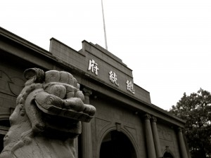
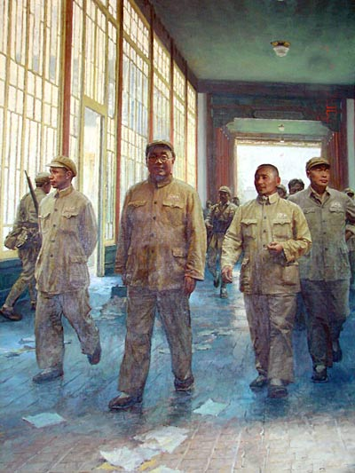
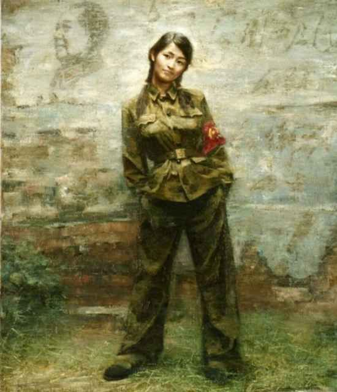
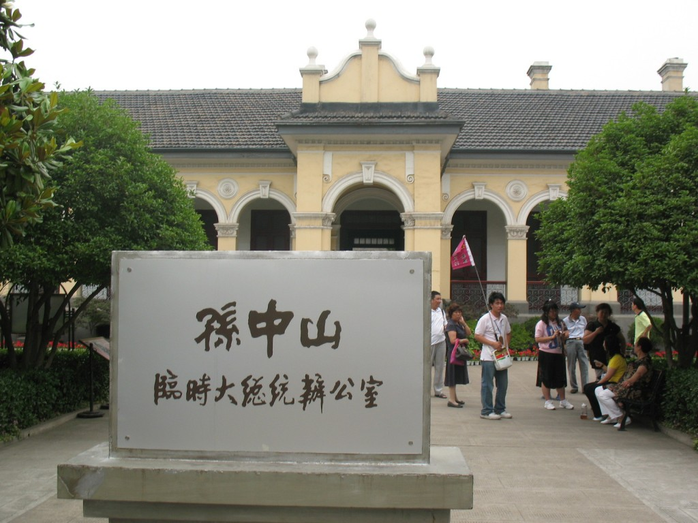

# 丢失的总统府

**整整一甲子，足以让沧海化为桑田、豆蔻少女长成雪鬓老妪，可这总统府的主人们，在度尽劫波之后却永远无法衣锦还乡了。你眼睛有些湿润了，那日历上的数字开始变形扭曲，弥漫开来，直到充满你的眼帘。你感觉恍恍惚惚，好像被那捉弄人的大时代吞噬了。** ibeidou.org

ibeidou.org

# 丢失的总统府

ibeidou.org

## 文 / 居华（Macalester College）

ibeidou.org ibeidou.org

#### 本文谨送给本文的主人公。

ibeidou.org **一** 哦，你走下人声鼎沸的公交，拢一拢马尾辫，在铺满梧桐叶的街上漫无目的地寻找着什么。你听你的南京朋友说，这附近有一座建筑值得一看，它叫总统府。 你感叹时间像块磨刀石，再刻骨铭心的历史印迹都会在岁月的蚀刻下变得黯然无光。环顾四周，一幢幢高楼大厦把你的视野切割得支离破碎。远方，那写字楼的玻璃窗反射着刺眼的阳光，也反射着这座城市空虚而浮躁的心灵。你用手轻轻抚摸着法桐树的枝干，想要在它细腻的纹理中找到一丝六朝古都的影子，而你却先看到了“办证刻章”四个未干的油漆字。你的身后投下一块阴影，那是一个巨型广告牌在向你耀武扬威，八个偌大的广告词体现出房地产商的狡黠与睿智：民国故里，共和新城。 你提着裙摆来到这广告牌跟前，深棕色的背景上，画着一个风流雅韵的女子轻曳小扇，一幢巴洛克式的建筑里走出一位着长衫戴眼镜的先生。你的嘴角微微上挑了一下，仿佛在看一幅附庸风雅的拙劣粉彩画。你无奈地叹道，民国故里何处觅？共和新城奠业艰。那呼啸而过的汽车、千篇一律的高楼和匆匆过客脸上的麻木神情，似乎都在嘲笑你的迂腐与单纯。 你顺着街边走，终于看到了那座久违的拱门。“总统府”三个烫金大字依然熠熠，门楼上的国旗却已经变了颜色。走过西班牙风格的长廊，府内的景象突然变成了烟水江南的亭台楼榭。你推开一间间办公室的门，屋里的摆设俨然是一甲子前的原貌，墙上高悬着国父遗像，“礼义廉耻”四个遒劲的颜楷字，仿佛蒋公那瘦削的脸庞。茶杯没有盖上盖子，似乎还装着隔夜的茶水，可茶杯的主人却再也无暇归来品一壶新茗；桌正中放着一本日历，日历停在那刺眼的数字上：中华民国三十八年四月二十二日。 整整一甲子，足以让沧海化为桑田、豆蔻少女长成雪鬓老妪，可这总统府的主人们，在度尽劫波之后却永远无法衣锦还乡了。你眼睛有些湿润了，那日历上的数字开始变形扭曲，弥漫开来，直到充满你的眼帘。你感觉恍恍惚惚，好像被那捉弄人的大时代吞噬了。 

ibeidou.org

ibeidou.org **二** 哦，你站在街的那边，惶恐地看着一列人马走进了府邸。为首的是一位矮小清瘦的中年绅士，穿一件略显陈旧的西装，不时地用浓重的广东腔和秘书们说着什么。你数了数大门上那新国旗的颜色，红黄蓝白黑，正好像金陵云锦的五种颜色。 城头变换大王旗，你方唱罢我登场，在这种乱世中，实属司空见惯。于是你不屑地笑笑，颠着小脚继续走你赶集的路。 ibeidou.org

ibeidou.org 两边的围墙上，蚀刻着几行若隐若现的行草书法，四周陪衬着雍容华贵的牡丹花叶。你听你母亲讲过，这是东晋一个喜爱王献之的皇帝动土修造的，不料完工之日，即城亡国破。母亲还说，有两户富可敌国的大门阀为了决出财产的多寡，曾经比赛在这条街上挂满紫色绸缎，以致绵延十余里，遮天蔽日。然而，旧时王谢堂前燕，飞入寻常百姓家。南京烟水气太重，并不是个留得住锦衣玉食、荣华富贵的地方。 你正走着，有位报童拦住你问，“小姐，你要不要《申报》、《明报》和《民国日报》？今有特大新闻，‘孙大总统今日就职，宣誓图谋民众幸福’。”那孩子一板一眼地向你介绍着，剃掉了辫子的小平头显得格外精神。你听人说，随着满清的半壁江山插上了五色旗，各色报馆像雨后春笋一般拔地而起，新闻的繁荣养活了这些无书可读的孩子。 你怜爱地接过一份《申报》，开始阅读那套红的标题。“倾覆满洲专制政府，巩固中华民国，图谋民生幸福，此国民之公意，文实遵之，以忠于国，为众服务。至专制政府既倒，国内无变乱，民国卓立于世界，为列邦公认，斯时文当解临时大总统之职。谨以此誓于国民。”你虽不甚理解那段半文半白的誓词，但你隐约读出，这大总统颇有些体恤民众、安抚社稷的慈悲。改朝换代的开国之君，都是挟天命以令庶民，真正不恋栈又不贪权的能有几个？而这孙文既不僭位号、又不传子孙，那他奋不顾身地打下这江山究竟意义何在？ 你总想不通这个问题。傍晚回家，你坐在缝纫机前，点燃一根“光亚”牌洋火，一缕明亮的光晕立刻驱散了这小屋的黑暗。火柴盒上是一幅秋海棠般的中国地图，上面插着五色旗和铁血十八星旗，还有七个大字：“雄鸡一唱天下白”。 ibeidou.org **三** 哦，你穿了件连衣裙，站在秦淮河畔的城墙上俯瞰总统府。枪炮声已经平息了三四年，这座命途多舛的六朝古都，又一次名正言顺地成为国家的首善之地。总统府的街两边，陆陆续续建起了两层小楼，那是民国新贵们待人接物的公馆。日渐频繁的工商实业，迅速填平着内战枪炮留下的弹坑。每到晚上，总统府邸的周遭灯火通明，公馆的围墙隔不住悠扬的萨克斯管乐，而酒店外彻夜通明的霓虹灯，也无时无刻诱惑着人们摆脱长袍马褂的束缚。 而白天，这条街上来往的都是一袭中山装、不苟言笑的政界要人。偶尔有一辆福特汽车呼啸着而去，驶过那“百雀羚雪花膏”的广告牌，驶过那“劳力思高级钟表”的广告牌，也驶过那蒋总裁手书的“新生活运动，提高妇女权益功在千秋”的广告牌，然后扬起一阵尘垢，须臾间不见踪影。 你脱下眼镜揉了揉眼睛。你正在晨读，手上有那还没复习完的格致学笔记，上面布满着眉清目秀的蝇头小楷。为了考取那中大附中的题名，你让自己忘掉小时候私塾里读过的《列女传》和《女孝经》，却努力背下诸如“水之比重几何？”“碳素燃烬，其归何处？”之类西洋的奇技淫巧。中大附中的奠基人，办了一辈子洋务的晚清栋梁张之洞，不愿让国家的菁华受到陈规陋习的束缚，毅然上奏开设新学、男女并举。而他的夙愿二十载之后，终归告成。 然而你实在无心看书，因为城墙脚下的嘈杂已经使你心猿意马。一厢厢卡车满载着小树苗驶向国府路，工人们走下车，把每棵树苗轻轻栽在路边每隔五米的坑里。放眼望去，坐北朝南的总统府已经被星星点点的嫩绿所环绕。你想起了林森主席信誓旦旦的承诺：期三年之功，建设我国都为东方之华府、现代之巴比伦。你自信地想，这虎踞龙蟠的王者风范加上国民政府的苦心经营，必可以镇住让六个朝代折寿的靡靡烟水气，葆我华夏江山之一统。 ibeidou.org **四** 哦，你穿了件军装，拿一本语录，刚走上长江路就已被红绿两色所笼罩。自从江山易帜后，华夏大地便湮没在一片红潮中，芸芸众生被这个火热的时代日复一日地抛起又扔下。建国十七年，伟人一声号令，立刻让乾坤倒覆，律令不行，跳梁小丑高居于庙堂之上，忠义之士却被视作草芥蝼蚁。总统府前，一群南京师院的师生兴高采烈地扭着秧歌，那拙劣的舞步显得既滑稽又丑陋。高音喇叭中反复播放着伟人的叮咛与嘱咐，时不时把游行队伍的情绪引向高潮。长江路两边的围墙已不知被红色的油漆洗礼过多少次，每一次都象征着一群热血青年们的无限忠诚与高度觉悟。正门匾额的“总统府”三字当然也未能幸免红色的侵蚀，在那象征着剥削阶级血盆大口的大门下，一位贫下中农向革命群众义愤填膺地诉说着旧社会的腐朽与没落，修正主义者昭昭的狼子野心，和走资派企图复辟的痴心妄想。而总统府里十七年的主人，江苏省政协的民主人士、统战领袖们，却挂着那厚重的铁牌子，在众目睽睽之下遭受革命小将们的无情专政…… ibeidou.org “革命不是请客吃饭，不是做文章，不用那么雅致，革命是暴动，是一个阶级反对另一个阶级的暴烈的行动！” ibeidou.org …… 你对眼前的景象有些迟钝，全然迷失在一片猖獗的红色中了。在建康城的历史上，红色确实是城市文化不可或缺的一部分。皇帝朱笔的赭红，东晋窑烧的砖红，民国壮士的血红，都为这原本阴柔的城市添上了一笔阳刚，决定了这座古城温润又不失坚毅的性格。然而，你眼前的景象却截然不同，你陡然发现，这种蔓延而失控的红色，必将烧毁人们的理性思维与是非观念，乃至烧断整个城市的地域特色和性格，烧尽那些能把南京与其他城市区分开来的文化元素。 ibeidou.org

ibeidou.org 红潮中又添了一笔亮丽的火红。张公馆，这个藏污纳垢三十年的国民党府宅，被嫉恶如仇的革命群众点燃了。从地基开始燃起，直到熊熊的火舌吞噬了那镂金的罗马式落地窗，和屋顶每一片青色的瓦砾…… ibeidou.org **五** 你默默地站在总统府里，你前面是一块文物保护单位的金字招牌，而此番冥想，却不知不觉耗费了你两个时辰。你拢一拢秀发，大步朝出口走去，想赶上远远驶来的一班公交。 ibeidou.org

ibeidou.org 四周是参天的高楼广厦，低矮的总统府默默躲在现代化都市的阴影之中，如同一头忍辱负重的雄狮。六朝历史的积淀、百年民国的跌宕，在有的人看来如同百无一用的齑粉，在经济发展的大潮中应该随波扬弃。就在一街之隔的大行宫，错综复杂的地铁轨道如同条条长蛇，六十年树龄的法桐老树都被它们连根拔起。林森主席若有机会旧地重游，怕是要仰天长叹了吧。 虽时运不济、道阻且长，但我们依然充满梦想。 ibeidou.org ibeidou.org

#### 【编者注】

本文来自：http://fancci.com/archives/2142/comment-page-1#comment-157 歡迎訪問：Fancci.com，為了莊嚴華麗的中國 ibeidou.org ibeidou.org

（采编：麦静 责编：黄理罡）

ibeidou.org ibeidou.org
