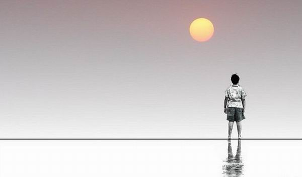
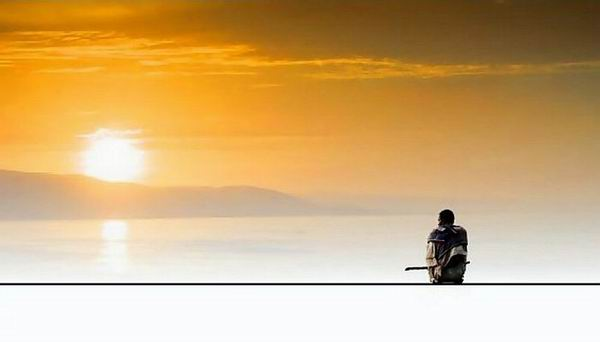

# 北风吹过地道桥

“**每条主干道和铁轨交接的地方，就有一座地道桥。随着城市的发展进程，这些地道桥即将成为历史的废墟。在送我去北京上学的时候，蔡小强告诉我，他会一直留在这个城市，虽然这里不是他的故乡，但是他会像守卫回忆一般守卫我们的地道桥。如果有人强拆他愿意死在那里，让他的骨灰、热血和扳手，随着吹过地道桥的北风，一去不返。”**

### 

### 

# 北风吹过地道桥

### 

## 文/岳少昆（中国农业大学）

### 

### 

在我九岁的时候，蔡小强搬到了我家的楼下。小强的父母都在铁路局工作，一家三口随着组织调动来到这座工业城市，成为了我的邻居。当然这一切都是在他们搬来几天以后，我才知道的。我还记得那是某个无风的蝉鸣的凌晨，302室发出的争吵声足以惊醒整座铁路家属楼。蔡小强愤怒的童声华丽地透过了他父亲的谩骂和母亲的抽泣，贯穿了整个黑夜。从小到大，关于儿童和父母的对峙，我一直以为只有哪吒和蔡小强可以做到真正意义上的势均力敌。我至今仍然记得小强当时的激动而又有条不紊的嘶吼和控诉，时而夹杂的玻璃杯碎裂的声音，犹如洒满了肉松的椰子茶，让那时躲在被子里的我兴奋而又不能自拔。长大后，我曾向他提起当时那个有关于哪吒的比喻，蔡小强不屑地点了根烟问我：“你说我像内个刚断了奶成天光着屁股戴着红肚兜乱跑的孙子？”他说完，我们哈哈大笑。过了好久，他掐了烟，直视着我，告诉我，其实那个时候他的父亲打他真的下狠手，可是他从来不哭不叫，因为那时候他已经是个男人了，而我当时还只是个男孩…… 

 蔡小强顺其自然地转入了我们小学，虽然老师同学对于他的斑斑劣迹早已有所耳闻，但是大家都没想到，这孩子在上学第一天就惊天动地百鸟纷飞。口口相传的是，小强骑在了全校最大的混混杨宇宙的脖子上，逼他声情并茂地朗读课文《小蝌蚪找妈妈》。这件事发生在大课间，同学们刚做完眼保健操，看到走廊里发生的这一幕，所有人都找回到刚才按太阳穴轮刮眼眶时的晕眩感。小强用骑脖子侮辱了杨宇宙的体力，又用逼背课文侮辱了杨宇宙的智力，更重要的是杨宇宙这倒霉孩子已经上六年级了，没人可以忽略那“三年大变样”的发育差距。三年级干倒了准初中生，谁看都是件热血沸腾的事实。而后教导主任和体育老师相继赶到，每个人都听到了体育老师对小强脱口而出的一句话：“我草，你这小土匪……” 放学回家的路上，小土匪找到了我。“你住我家楼上吧”，他问，“我不知道路，你带我回家。” 神知道我当时的双腿有多无力，我用极其娘炮的颤音问他：“你不会打我吧？”小强像个领袖似地摆摆手，道：“老子只打装逼的人，比如那个什么宇宙，你不装逼我肯定不打你，但是……我他妈的只是想知道回家的路！” 于是我和他一起回家，一回就是三年。 就这样，我竟然和小流氓成了朋友，前提是我不干涉他打架，他不影响我学习。说出来你信吗？现在的我都不信，但是这是事实。事实上蔡小强对于我真的比任何人都要和气，包括他的父母。据他说，我是他唯一的朋友，我相信这一点，但是我并没有试图去改变他，我们在学校形同陌路，只是回家路上，他终于可以收起内心深处的暴躁和固执。我们一起吃着冰袋儿或是话梅，大声谈论铁胆火车侠和足球小将，手里拿着砸炮儿或是悠悠球，戴着黄色的帽子，在90年代末的石家庄的街头追逐。后来我想，那时的自己是不是个跟狮子玩耍的人？再后来我明白了，那个被人当作狮子的男孩，内心深处也有着母鹿般的温柔。 在我们回家的路上，有一座地道桥。如果不是亲眼看到，没去过石家庄的人也许永远无法理解地道桥是个什么东西：列车从桥上驶过，行人和汽车从桥下穿过，铁路运输和公路运输有交错但井水不犯河水，像我和小强。地道桥下的人行道上，有着拾荒的人躺在瓦楞纸上酣睡，有着卖爆米花的人摇着黑乎乎的炉子，等着下一次的巨响，有着打竹板卖耗子药的小贩，有着装瞎的算命先生，有着童年的我们结伴回家。小强特别喜欢桥下的空间，巨大的灯泡发出昏暗的灯光，照亮了地上的潮湿。他总是喜欢对着每一个骑车经过的人叫骂，竖中指，甚至解开裤带，掏出小鸡鸡放水，乐此不疲。对于这一点，我表现得总是比他还要心惊胆战，我问他：“你不怕他们停下车子打你吗？”小强一脸轻蔑的告诉我：“惯性，惯性你懂吗？他们一旦停下来，就再他妈的骑不上去了！”理解了这一点，我也加入了叫骂和竖中指，我觉得特别的刺激。遗憾的是我永远无法对着路人掏出小鸡鸡放水，总是觉得肌肉紧张，但是在小强看来，这跟心理素质有关。 后来上了初中，我们就分开了。我去了一中，他去了职中。我开始骑车上学，在地道桥我不再踩着阶梯上下，而是在单车上飞驰而下又狠命地蹬回地面。每当车子划过桥底那熟悉的空间，我仿佛都能看到小强对着我霸气又猥琐地笑，而我知道我们的生命从今再不会有交集。有时去他家，我试图用初中物理课本上的动能和重力势能的转变，来跟他解释神奇的地道桥在科学上是怎么一回事。他却只是躺在床上摆弄着着一个破BP机，琢磨怎么和他那群差劲学校的差劲朋友鬼混。我知道他听不懂我说的是什么玩意，就像我听不懂他说的街机上牛逼的八神和草雉京。我还是识趣地走了，临走前我尝了一个他家碗橱里的凉饺子，茴香鸡蛋馅儿的，香极了。在我碰上他的家防盗门的一个刹那，我发誓我不再回来，一声响动延伸为火车经过桥洞时的轰鸣，而别人却听不见。 “年华似水，匆匆一瞥，多少往事，轻描淡写。”这是黄磊的一句歌词，我觉得他写的很精准，青春不就是这样吗。谁没有交过几个坏朋友，然后因为你的原因，他的原因，老师的原因，家庭的原因，或是没有原因的，你们分开了。你们各自活在自己的世界，寂寞的时候想想那个不知死活无关痛痒的人，带着庆幸、遗憾或是怀念。然后看到离中考还有几天，离高考还有几天，翻开一本本赌博性质的辅导书，诅咒写书的人生个孩子没屁眼，在作者的名字上用红色的水笔画个方框，画得心里痒痒。 高考结束后不久，哇擦，我在家门口被一群混混群殴了。他们没有用到跳刀，只是木棒和拳头，所以我保住了宽广的肩膀和英俊的脸庞，只是小腿骨折，废了三个月。几天后，小强来我家找我，悄悄告诉我是怎么回事。原来那帮孙子在门口蹲了小强好几天了，错把我当成了他，结果越打越觉得死狗一样的我不像传说中牛逼的强哥，才知道打错了，作鸟兽散。 小强说：“这些年我不理你是为你好，你和我不一样，你会读书，我不会。跟我做朋友会毁了你。但是我们永远是兄弟，从我干掉杨宇宙跟你一起回家的那一天开始。” 我说：“为啥把我当朋友？” 小强说：“因为你不装逼。” 我说：“为啥后来你不理我了？” 小强说：“因为我在装逼。” 我忽然没话说了，只是觉得这样也好，我们成年后还是朋友，只是我不参与他的暴力，他不干涉我的生活，还是和以前一样，唯一不同的是，我得残废一些日子。 小强决定在我们的地道桥和打残我的人决一死战，我告诉他，算了吧。他恶狠狠地告诉我，你个大学生懂个球啊。我说，好吧。后来他向我描述他是怎样为我出气，他是怎样敲开啤酒瓶底，他是怎样用它插入欺负我的人的大腿，他是怎样看了看瓶盖是否中奖，确定没有再来一瓶然后丢掉，他是怎样听见绿皮火车从头顶隆隆而过，他是怎样地忽然脆弱然后靠着写有办证电话的墙壁，想起过去，嘤嘤哭泣。 我们在这三个月补全了没有在一起的青春，我彻底成了一个听众。小强告诉我他对于社会的认识。告诉我他怎经如何深爱一个姑娘，但那个姑娘对于他始终只是恐惧。告诉我他对于城市文化的理解。告诉我他是如何成为一个汽修工以及扳子在他的手上不但可以打架还可以用来修车。告诉我他身上和心里每一道伤疤的由来。告诉我他的梦想和他已经慢慢克制的性格。 我说，我觉得我像是个只会读书的白痴。 他说，没有只会读书的白痴，只有不会读书的天才。 在我拆掉石膏的那个晚上，我们一共喝掉了二十瓶啤酒，我八瓶，他十二瓶。 醉到连哭的力气都没了，然后我们长大了。 两年以后，我看到海角七号这部电影，范逸臣在片头摔了吉他，骂道：“我草你妈，我草你妈的台北！”我忽然理解了一件事情，如果你爱上了一个地方，然后互相渗透，然后无力自拔，然后你会发现，自己每一句咒骂里包含了温柔。我和小强，和范逸臣，和你，都一样…… 

 在石家庄，火车站就在市中心。每条主干道和铁轨交接的地方，就有一座地道桥。随着城市的发展进程，这些地道桥即将成为历史的废墟。在送我去北京上学的时候，蔡小强告诉我，他会一直留在这个城市，虽然这里不是他的故乡，但是他会像守卫回忆一般守卫我们的地道桥。如果有人强拆他愿意死在那里，让他的骨灰、热血和扳手，随着吹过地道桥的北风，一去不返。 我告诉他，地道桥是东西走向，北风吹不过地道桥。 他说，有他在，北风就能吹过。 后记：多年后我看到新闻里说，夏季雨后，石市某地道桥的积水有一人深，某市民骑车下地道桥时刹车不及冲入水中淹死，我就想起来小强跟我说的所谓惯性，我就想起来小强这个人，我就决定写这个东西，写到这里，泪如雨下。 

### 

### 

(编辑：黄理罡)

### 

### 
