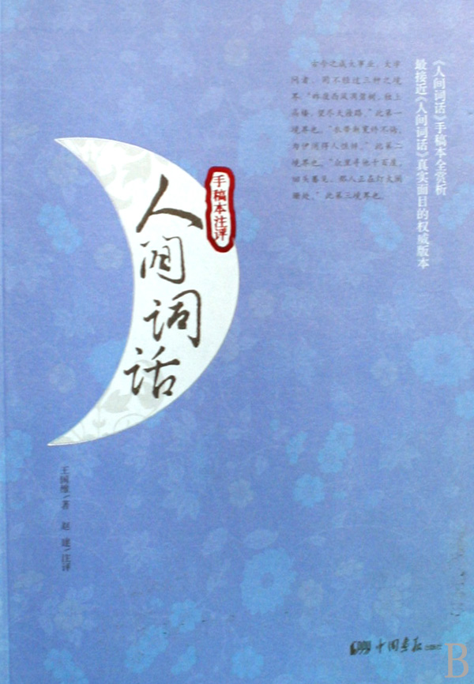

# 千年词史的回顾、承继与超越

**“晚清三大词话因其理论与意旨的绝对高度，回顾千年词史，梳理出了词学发展的历史脉络、构建出了词学理论的批评体系、提炼出了词学美学的概念内涵，对后来的词学、诗学研究和美学研究甚至艺术创作，都产生了深远的影响。孙维城先生为这本书取名“千年词史待平章”，正是以三大词话在文学批评史上的成就与地位为视角的切入点，而进行单文本的细致分析和跨文本的比较研究的。”**

### 

### 

# 千年词史的回顾、承继与超越

##  文/谷卿（暨南大学）

### 

### 

词学研究学者孙维城先生在荣休之后，非但没有“闲居终日”，反倒愈见劬勤。不久前，由安徽大学出版社出版的《千年词史待平章——晚清三大词话研究》一书，洋洋五十万言，观察视野高阔、研究方法得宜，实可谓词林鸿著，也可视之为孙先生学术研究的代表力作。 词作为一种特别的诗体，生发于宴间樽前，以和乐而唱、句式参差为特点，最宜自剖心史、寄托情志。其肇于隋唐，盛于两宋，衰于元明而中兴复振于清。传统词学发展一千余年，取得了辉煌的成就，而百年前新文化运动的兴起则给予以词为代表的诸多文艺形式以精神传统上的终结。不过，就在新文化运动风生水起的当夜和前夕，词学史上出现了三部具有总结性质的伟大词话，它们就是陈廷焯的《白雨斋词话》、王国维的《人间词话》和况周颐的《蕙风词话》。我们知道，有清一代可谓是帝制时代一切文艺和学术获得自觉性的全面总结的时代，诗文、书画、金石、经史、科技等领域，都出现了集大成的人物与著作，词学也是如此。晚清三大词话因其理论与意旨的绝对高度，回顾千年词史，梳理出了词学发展的历史脉络、构建出了词学理论的批评体系、提炼出了词学美学的概念内涵，对后来的词学、诗学研究和美学研究甚至艺术创作，都产生了深远的影响。孙维城先生为这本书取名“千年词史待平章”，正是以三大词话在文学批评史上的成就与地位为视角的切入点，而进行单文本的细致分析和跨文本的比较研究的。 虽然晚清三大词话的写作发表顺序是白雨在前、蕙风殿后，但此书上中下三编的先后次序却是《蕙风词话》、《人间词话》、《白雨斋词话》，与成书时间的先后正好颠倒。读者可能会感到疑惑，是不是这样的安排不妥、有误？或是作者另有高论，要在三部词话的文学批评成就和价值上排出座次？其实，这样安排三部词话的论述顺序恰恰展现了孙先生的研究理路，他早年以况周颐的《蕙风词话》研究进入词学研究领域，处女作即为《况周颐与蕙风词话研究》（黄山书社1995年出版）。此书是国内研究况周颐的第一部专著，学术水准很高，为后来研究况蕙风及晚清词学的学者提供了很多值得借鉴参考的观点、方法和资源。因《况周颐与蕙风词话研究》出版时间早、印刷数量少，又是该领域研究绕不过去的一部重要参考著作，故无此书者多百般找寻，为求一册在手；已觅得者则珍视其书，不啻拱璧。 

### 

### 

就在研究况周颐的过程当中，孙维城先生也开始逐渐关注起《人间词话》，他比较了况周颐与王国维的“意境观”，认为他们对于意境的总结是相辅相成、桴鼓相应的，对于意境的构成要素、意境的真实内核、意境的表现形式、意境的象外空间都作了全面的概括与总结；同时，它们划分并一一探讨了意境的各种类型，开发出情境、穆境、隔境等范畴，从丰富意境理论的角度大大地发展了传统的意境观，而王国维对“无我之境”的研究更使得意境说回归了哲学母体，从一个阔大的文化视角上重新赋予意境的文化哲学意义。由于王国维一直是近年来学术界研究的重大热点对象，《人间词话》也广为人们所熟知，所以孙先生特意避开一些阐释殆尽的熟旧话题，专从人们不太注意的几个方面来讨论，比如境界层次问题、对刘熙载忧患意识分类的继承问题以及强调诗词尚“真”的问题等等，而且以《人间词话》作为一种美学著作来研究，并将之与《蕙风词话》进行了一系列的比较研究，故而生发出许多新的理论意义和价值。无疑，这种学术思维和研究视角是很能启人思路的。 

### 

### 

关于陈廷焯《白雨斋词话》的研究，孙维城先生用时最短，用功也最强，从2008年开始研究到这部专著的脱稿，前后不过两年左右的时间。但因他对千年词史和清代词学史早已有了详细的了解和研究，基础厚实，故而在短短的时间内得出十几万字的研究成果，完全是一个水到渠成、喷薄而发的事。我记得当年曾为孙先生通过网络购买到一部屈兴国先生的《白雨斋词话足本校注》，后来去他家拜访时，在书房看到此书已被翻看得近乎烂了，每页上面都有密密麻麻的阅读札记。孙先生在这本《千年词史待平章》中也谈到，屈先生的这本校注以及后面附录的三篇相关论文，给了他很多启示和借鉴，为他进一步研究陈廷焯和《白雨斋词话》打下了很好的基础。不掠前人与同道研究之美，是孙先生治学的一贯原则，他总是将在自己之前就已经公开发表的相同论题的书、文一一列出，并指出这些研究工作的得失，再严谨地分析自己的观点有何出新之处，且详分层级、次第道来，不仅给人一目了然的感觉，也为我们后学作文提供了一个堪资借鉴的范本。 孙维城先生在自序中言，以后不大可能有大型的系统研究了，听来不免有些怅惋。不过也确实如此，一个真正的学者应该是不问名利大小、不问课题大小、不问成果多少的，像孙先生这样用大半辈子来精心钻研这几种研究对象，恐怕当代很多年轻的学者是难以认同的。但孙先生显得很达观，他不认为这个世界上有什么“大学问”，只要自己耕好属于自己的那一片田地、种出不错的果实，便可算是一个合格的学者了。从这层意义上来看，这本《千年词史待平章》不仅体现了孙先生数十年词学研究的成果、体现了他个人的词学研究历程，可能还体现了他对于人生的理解与感悟，就像他经常引用的清代词人项鸿祚的那句“不为无益之事，何以遣有涯之生？”这种对学问、对人生的态度是极其真诚的。 

### 

### 

孙先生常年在安庆师范学院这所百年学府教授唐宋文学，并为研究生开设词学专题研究课程。作为一个“蹭课大户”，当年的我有幸跟听了孙先生的全部课程。我至今清晰地记得他每次进教室时的形象，都是将一只深褐色的单肩皮包拎在左手，右手执一玻璃口杯，衣裤永远是那么洁净光鲜、纤尘不染；待一踏上讲台，课即开始，间或扫一眼讲稿，断无粘连、往复，两节课下来，听课者不但毫无倦容，而且大多精神奋振。记得孙先生曾多次说过：“我上唐代文学课的时候，同学们都说，孙老师真像个唐人啊；上宋代文学课的时候，同学们又说，孙老师真像个宋人。孙老师到底是像唐人还是像宋人呢，我自己也搞不清楚！”每次讲这段时，他的面上都不无得意之色。我知道，虽然孙先生极看重学术研究，但更重视课堂教学，学生听课后的反应是他最为在乎的。他这种“教唐代文学时‘像唐人’”、“教宋代文学时‘像宋人’”的效果，正说明他对文学和文学史有着深刻的理解，每每涵泳其间而不自知，精神与那个时代的古人相通接、相契合、相协洽，仿佛在诉说着自己的日常生活，显得那么自然又那么有趣。很可惜，人文学科这种传统的治学途径，目今已经逐渐淡出现代高校的教研过程中了，我们现在有太多的理论、方法和技巧，唯缺这种浸润、感受和体悟。读孙先生的《千年词史待平章》，能让我们有机会再度重温经典——这个重温经典的过程，不是一次紧张枯燥的科研行为，而是在一个晚秋初冬的傍晚，一场我们轻吟小词后枕书而眠所做的美丽的梦。 

### 

### 

（采编：安镜轩 责编：刘一舟）

### 

### 
