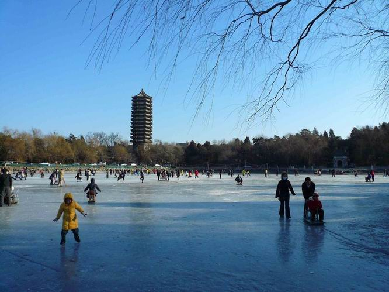
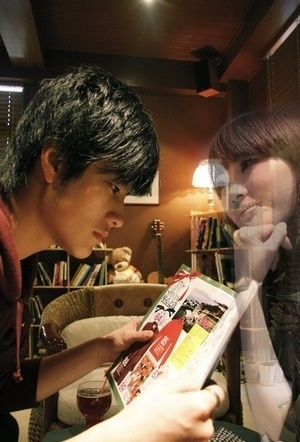

# 康敏终究要嫁给马大元，穆念慈也不会在原地等你

**p大的每个人都带着一股子傲气，觉得自己该是主角，干什么事儿都是不遗余力不计后果的，也不知道啥时候整明白了其实世界上真的有那么一种人叫不该爱的人，譬如乔峰和杨康，也不知道是纯情都给磨干净了还是事实本身如此，前些天一个朋友和我叨叨着爱一个人没有错也没有不该爱的人所以一定不要随便放弃之类的，我啥也没说只是觉得这孩子是不是还得磨练磨练，殊不知到了最后，世界是属于马大元和彭连虎的。**

### 

### 

# 康敏终究要嫁给马大元，穆念慈也不会在原地等你

### 

## 文 / 朱知翔 （University of Wisconsin-Madison）

### 

### 

从P大滚蛋快两年，怀着小媳妇回娘家省亲的激动心情要滚回去的时刻看完了此间的少年。

顺序比较奇怪，先是看了各种剧照，对人设莫名其妙，然后看到了片花，然后听到了片尾曲，然后挑了2月22号这么一个2得要死的日子，在床上赖了一天，把一本书看完了。

大旗飘飘的迎新，蹬三轮车的师兄师姐，拥挤的北新，让人转向的三角地，南门的餐馆，图书馆占座，三教自习，宿舍里的绿漆书柜，学三，学五，未名湖，好多东西在我经历之前便不在了，好多东西在我经历之后又不在了，好多东西至今仍然存在，可能只有在P大呆过的人才能深有共鸣，不对，要在P大读过本科的人。

### 

### 

### 

康敏毕业那一段直接把我看嚎了，散伙饭上喝得晕头转向的康敏轻轻把手按在乔峰胸口，说以后要自己多小心，然后就哭了，哭得跟个纸片人似的，就那几句话，看得我放声大哭，震惊四邻，好久没嚎得那么动情了，不知道的还以为我是小康的原型，也不知道是不是天龙看了特别多次，觉得金庸笔下的女人，大概没有比康敏更狠的了，得不到的全都要毁掉，说她是天龙的大boss也不为过，也不知道江南是不是同情这个大boss，此间算是给她正了名，乔峰终究还是喜欢康敏的，只是没想到他们直到分离，也没再靠近一步，到后来乔峰和阿朱在一起，只能叹气而已。

后来乔峰毕业，打死不卖的那本GRE，因为要去丐帮工作和阿朱吵翻了天，仍然看得颇为揪心，乔峰这么一个纯爷们，临到毕业，自己的感情竟还是一团糟，康敏早已嫁给了马大元，也不知道他在那个当口追去苏州还能有什么用，倘若是段誉那样的情种，我便相信他只想呆在小康身边，在她身边就好，只可惜乔峰不是段誉，我就总觉得他似乎是想干点儿啥，可是你还能干啥呢？于是这个结局难免让我感到有点狗血，乔峰，你早干嘛去了？

到了穆念慈和杨康这里，嚎不起来了，大概是太真实了，看到穆念慈接完一通电话就放弃了对杨康那么多年的小执着，都不觉得她撒手得太容易，只是在彭连虎在学一为她撑腰的时候想起当年为她敢拿板儿砖的杨康，然后看看那一刻只能在一旁打酱油的杨康，想问他一句，杨康，你早干嘛去了？据说这是江南在写书的时候最感到伤感的三个场景之一，其实杨康自己估计一时半会都缓不过神来，意识不到穆念慈的离开对他意味着什么，也可能他永远只是有那么一点点失落而已，毕竟穆念慈之于杨康，不像康敏之于乔峰，能那么铭心刻骨，说起来，算是性质不同的两种故事。

猪老师在特别纯情的年代认识一个小男生，干过很多纯情的小闹钟之类的事情，和穆念慈对杨康那个劲儿有得一拼，在很多年以后还有点儿缓不过劲儿来，时不时有点儿念旧，还是想偶尔做做小闹钟，后来也碰上了类似的打电话事件，终于豁然了，看到这段的时候真是有一种发自胸腔的共鸣感，可是共鸣归共鸣，我觉得杨康还是别在n年之后捶胸顿足呼天抢地哎呀呀当时我怎么就让穆念慈跑了呢，最好大家各自幸福地生活着，真的，我费半天劲得出结论说杨康不是属于穆念慈的，他敢给我整个中年危机悔不当初啥的我跟他没完。

其实又想一想，这两个故事性质是一样的，都是那个陈淑桦唱的那个什么，你说你爱了不该爱的人，你的心中满是伤痕，康敏师姐要是和乔峰师弟该有点儿啥，以乔峰师弟那么爷们的性格，早该有啥了，也不至于临毕业了哭得山崩地裂的，不信，你看他搞定阿朱那叫一个迅速……所以乔峰师弟后来也就是比较不释然，康敏都解套嫁人了，他还因为那一顿恸哭套在里头，除了早干嘛去了，我也只能对他说一句你活该，早些时候看片花，觉得演乔峰那哥们（先替我们村儿里一个同名同姓的哥们汗一下）太面太矬，现在再想想，妈的，乔峰绝对就是这么个矬人啊，矬还拉着阿朱垫背，我们都被他那爷们的外表欺骗了……

看完此间少年，想想P大的银杏叶，想想我和我身边的姑娘们遇见过的乔峰和杨康们，有点百感交集的意思，我在p大那些年认识的男生，大多是乔峰和杨康，大概是郭靖那么憨的上不了p大，段誉那么花痴的早成了wsn，令狐冲这种学工路线的我又从来不屑打交道，在p大那些年认识的女生，有黄蓉，有阿朱，有阿紫，有王语嫣，年轻的时候都或多或少当过穆念慈，渐渐长大了八成都变成了康敏，p大的每个人都带着一股子傲气，觉得自己该是主角，干什么事儿都是不遗余力不计后果的，也不知道啥时候整明白了其实世界上真的有那么一种人叫不该爱的人，譬如乔峰和杨康，也不知道是纯情都给磨干净了还是事实本身如此，前些天一个朋友和我叨叨着爱一个人没有错也没有不该爱的人所以一定不要随便放弃之类的，我啥也没说只是觉得这孩子是不是还得磨练磨练，殊不知到了最后，世界是属于马大元和彭连虎的。

### 

### 

### 

其实这并不是很讽刺，马大元和彭连虎或许一直是主角，视乎你什么时候发现而已，祝所有的康敏和马大元白头偕老，祝所有的穆念慈早日傍到彭连虎，真心地祝愿。

### 

（采稿：陈轩 责编：陈轩）
