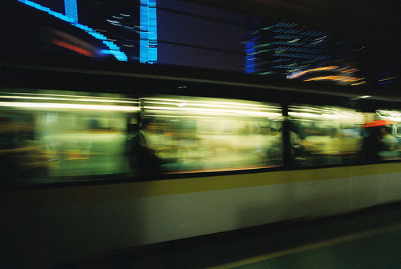
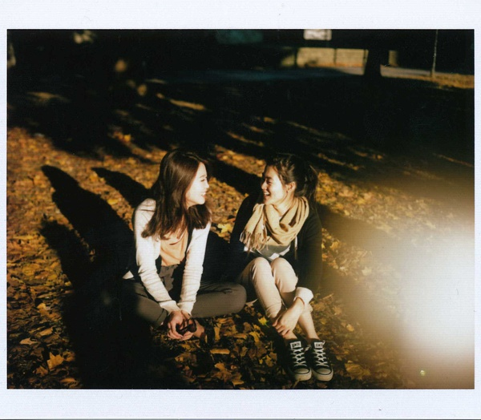
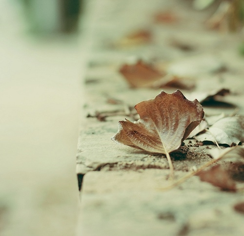
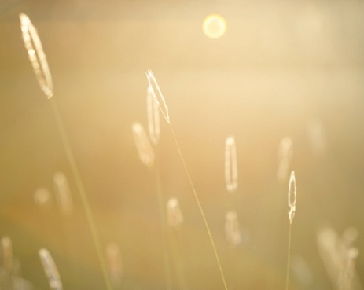
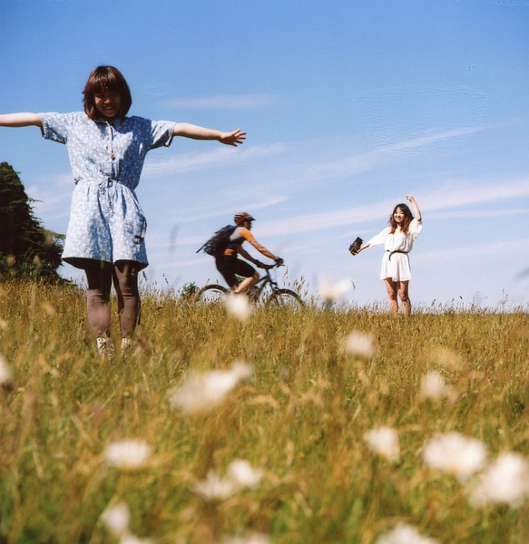
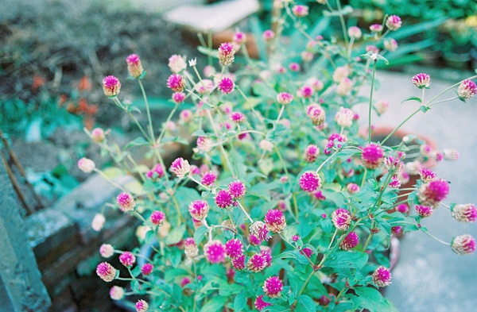

# 我们消失，就像一片风景（上）

**经过一冬的忍耐，原本千篇一律的秃枝，将开出不同颜色的花，那是它们各自的不同之处。春天到了，百花齐放的时候，我将需要怎样的快乐换走封闭的悲观？就像在问自己，现在你心里的那个梦还是光秃秃的，你有足够的耐心等下去，直到它开出美丽的花吗**？

# 我们消失，就像一片风景

## 文 / 小井（北京大学）

 **题记：**

**你要像一个原人似的练习去说你所见，所体验，所爱，以及所遗失的事物。**

** ——里尔克**

 我一直觉得，从小北离开的那一天起，我也不复存在于北大了。 时间已走过一年，孤独感伤早就与最初分离时的新鲜感一同淡去。可是这一年，一切都变了。我看到整个世界都在改变，虽然我什么也没做，连动也没动一下，仅仅是坐在公车上盯着车窗玻璃，窗外的风景就已经跑了那么远。 时间是不是也和我乘着同一辆车？它好像是静止的，又好像一刻也没停过。时间像行色匆匆的路人，一个一个与你擦肩而过，你不以为然。直到其中一个撞了你一下，把你撞疼了，你才有所察觉。只有停下脚步回头望，才能看清他的样子。但大部分时候，你看到的只是他的一个渐行渐远的背影。 在人群里我总是忍不住想起小北，我觉得她就在其中，像潮水一样起伏的人头里，她的脸如同水面的月光，时而轮廓清晰，时而摇晃着碎成一片幻影。 还记得是她带着我第一次乘坐地铁。那是一种最初十八年生涯里我从未见过的交通工具，当时的我还不懂得认路，这封闭空间、声声巨响和沉默的拥挤都让我有种不敢作声的恐惧。那天我和小北不知道为了什么事情又吵架了，我赌气不跟她并排走，却小心翼翼地紧跟着她。她也无言地走在前面，时不时回头看我一眼。后来，人群突然把我们冲散，更糟糕的是手机在地铁里没有信号，无法联系。我着急地东张西望。人们快速地走进车厢，或爬上楼梯走出车站，方向非常一致。在两辆方向相反的列车轨道之间，我傻了，人们陌生的脸在我周围或明或暗地晃动着，然而，都不是她。我无法挪开脚步，只能蹲在一根柱子下，盯着疾驰而过的列车一次次将黑洞洞的轨道填满，又一次次将它抽空，心里也一阵一阵地汹涌和空白。不知道过了多久，才听到小北的声音。 一切都急驰而去。我们在拥挤的人群里一前一后地走着，谁也没有说话。我的手紧紧地拽着小北的书包，跟着她离开，跟着她回去，就这么跟了一年。后来她走了，我还在这里。 

 下了车，依然是步行回到北大，在门口出示学生证，然后走进校园。在这个逐渐比家乡更熟悉的北方城市，我哪也不能去，只能回到这里。然而回到这儿，不管走在哪里，面对一个场景，我总是能在脑海中想象小北出现的样子，她的举手投足，一瞥一笑，都历历在目。她不属于这所大学，但她存在过，并且和我的大学生活紧紧相连。大学的第一年，我们看着彼此的莽撞和虚妄，把自己那段最忧郁、最孤单的年华，挥霍在了这个美丽的地方。 成长由期待变成了回忆。一年后，只剩下回忆和一些梦想，如同我们那时常在半夜的湖边点起的烛光，逐渐熄灭。有时候我甚至怀疑，过去的时光是不存在的，小北是不存在的，我也从来没有存在过。存在的仅仅是我的一些感觉，只有感觉是唯一的真实，而我们都在改变，即使心还不肯变。 **一、我们在风中唱歌** 现在我还常常想起，走进这个校园的第一个晚上，第一次和新同学聚到一起，由老师带领着学唱《新秋之歌》。老师告诉我们这首歌的歌词来自林庚爷爷的一首诗，是他生前最爱的一首诗。当唱到那一句“世界变了多少模样”的时候，我的眼睛莫名地湿了。可我为什么会流泪？那时我能懂得什么呢？我还不知道，什么叫“历史”。我不知道，有些东西会成为刻骨铭心的历史。那时候的我，其实有永久的坐标意义。那时的我，将是一个走在半路上的人关于起点站的记忆。 在那以前，我享受着当下的快乐，只为一些小事情黯然神伤，安于生活的表象和白日梦的诙谐，没有损伤，也没有太大的期盼。我能一个下午地做无意义的即兴发挥式的发呆，能一整天地生某人的气，我不知道17岁的遭遇会让我的时间从此寿命变得那么短，感伤变得那么长。更不知道，考上北大的奇迹就这样紧接着生命的低谷，降临到我头上。 在那以前，日子过得太过简单平淡，太往复无奇。日子是平面的，缺少纵横感，我还意识不到时间流动与命运格局的存在。 在那以前，我知道什么是文学吗？我还能很平静地谈论我的梦想，不会为它流眼泪，也不会为它牺牲全部的娱乐和天真。读的书不多，也不经典，常常挂念一部言情小说的某个人物，很肤浅、但很窝心地挂念着，仿佛我见过他们，或者有一天我会和他们相遇。我还不知道，有一天我看到了真正的文学，看到什么是幻想，什么是深刻的时候，过去那些稚气的感动瞬间过时。更不知道，在大学的第一门文学课结束后，我竟然傻乎乎地去找一个老师谈我已无力支付的文学梦想，泣不成声。 在那最初的日子里，我深深地预感到，自己的生活将要发生变化。学习之余，几乎天天在校园里拿着地图，学习辨别北方的东南西北，学习与陌生的一切兼容。徜徉于美景和新知中，我过着游历般的生活，虔诚地铭记一些故事并且虚妄地将它们也视为自己的历史，于是，眼睛和耳朵随时与易受感动的心相通联，生命好像越来越丰润。有一天，我在日记里写道：“绿影诗意缭绕的校园，无论食堂、过道、树下、湖边、草地、石头，常有人坐在一处专注地看书，也许他们大多早就有这样一个自己固定的空间，一个让自己诗意地栖居的天地。嗯，很快，我也会有自己的位置。别人找得到我，我也看得见自己。这一个人的位置，不是舞榭楼台，也有湖光塔影……不必自卑，我是来学习的，只是来学习的。”眼前向我敞开的世界是如此大，我的心是如此震颤，惊喜而又恐惧。 就是在这个时候，小北和我在一起。 

 迷茫尚未降临的日子，我常常坐在小北的自行车后座上逛校园，穿行于湖边的每一条夜路。有时上下坡时，车子东倒西歪，我们会紧张的大叫大笑。风刮过我们的耳际，将四周的喧嚣与我们隔离，宁静的校园里回荡着我们歌唱《燕园情》的声音。回到宿舍楼，话还没聊完，我们便不想这么快告别，往往坐到花坛边赖着不走继续聊，或者在小白房点上一碗麻辣烫，或者干脆出校门找个二十四小时的餐馆，一直聊到半夜。 聊什么呢？无非是每天经历的事情，关于这所美丽的学校，关于高手云集，关于令人敬仰的教授学者们，关于生活的奇妙变化，关于如何适应和承受这一切幸福……有一次告别时，她骑上自行车，转向我，用一种很奇怪的口吻说：“要开心啊……你开心吗？”我傻傻地笑着说：“我跟你在一起觉得很开心啊。”她把脸转向一边，很快地回答了一句：“我和你一块也挺开心的。”就骑动车离开了。我目送她快速离去的背影，脑子里只想着，今天和小北聊得好开心。对未来，我一无所知，也不急着追问。在这个没有归属感的地方，小北是我唯一的依靠。和她在一起的日子，阳光很明媚，她的言语维系着我向上的心情。如果时光可以延长，我愿意为此绕更长的路。 可是，时光不可能为我们延长。她是一名北大委培生，一年后就得离开。她曾经给我讲一个在曹文轩老师的课上听来的故事。一只小鸟天天为它心爱的大树唱歌，后来大树被砍断运走，小鸟历经千辛万苦找寻它，最后大树成了一盒火柴，小鸟点亮火柴，对着那束光，唱完最后一首歌。我能理解小北的感受。在北大的每一天，对她来说都是多么珍贵，因为每一天都即将失去。她就像一棵已经扎了根的树，离开，就是斩断根茎的疼痛。而我，我当时突然想做那一只小鸟，至少陪她走完这一段路。她把自己放置在迷茫和渴望之间，听讲座，看表演，参加社团活动……比任何北大人都要认真地享受这段时光的恩赐。她的离愁别绪深深改变了我，以至她的许多生活方式在她离开以后，被我生吞活剥地延续下来。 学业逐渐变得繁忙，我们见面机会不多，只能短信联系，互道晚安。偶尔相约去看一场感人的演出，在剧场里无声地泪湿眼眶，演出结束后，再携带着沉默归去。北京的夜晚常常凉得让人禁不住发抖，小北的沉默越来越浓，她偶然的只言片语我已经没什么印象了，但是在我后来的记忆里，那些时刻，连她的样子也渐渐渗出些许凉意。 渐渐地，我感受到天气的变化。 某天在校园里晨跑时，不经意掠目，突然发现很多树的叶子黄了，那种金色，不是耀眼的，而是温柔的，如此时北京的阳光般温暖。脚下铺成片的落叶黄绿参杂，在鞋底沙沙作响，于是跑着跑着，就停了下来，站在树下发很久的呆。 

 刹那间失魂。一直不敢相信自己是生活在秋天里了。对于我这个南方的孩子，叶子总是绿色的,只有当它们老了枯朽了，才会变黄落下来，而此时秋叶给我的感觉是，它们在自己最美的年华飘落了。最后剩下光秃秃的黑色枝桠，参差交错，浓密又不粘稠地趴在天空上，使天空支离破碎的，像面掉漆的镜子。很喜欢北方的树，高大威严，有距离感，冷峻但深情款款。黑色郑重地在眼前静止成一幅画面，让人不敢忽视。这画面让我着迷。 小北就像那些树，突然出现在风景里，美得感伤，美得刺眼。有时候是那么不真实，似乎只有当我敏感地注视着所有的变化，只有把激烈的悲伤情绪倾注在她身上时，才能把握我们的存在。我为了莫名其妙的理由跟她吵架，赌气，接着开始深感留恋，又重归于好。像刺猬一样相互刺痛，又在一次次争斗中将对方的刺渐渐磨平，更加靠近。现在再翻看我们当时的对话，觉得真的很傻。也许我对自己唯一能把握的——在陌生环境里唯一关心我的人，也逐渐没了安全感。 秋天并不漫长。07年12月11日，是我生命中的第一场雪，我和小北都早早出了门，在散步中相遇。那天，她第一次告诉我，她不想离开，她留恋这里。在路上，她能认出某某经过的路人是哪位知名教授，她看过他什么书，他做了什么让人难忘的事情等等。看到几个男生在艰苦地收集薄薄的雪来打雪仗，我们都淡淡一笑。走到湖边，我在某一面斜坡的积雪上压上我的手印，小北心神领会，也把手压上去。我们的手，一左一右，清晰地呈现在那里，等待被灰白的雪埋葬。 分别时，她大步地走开，不肯让我帮她把书包上的雪花弹掉。我出神地望着她渐行渐远，脑子里闪现她刚才说的话。在远处，她突然回头，看到我还站在那里，一愣，挥挥手，好像在说，走吧走吧，然后再次转身继续走远。这时我才感觉到，雪下得真的很冷。 半年还不到。小北开始说，我就要走了。 “你不要太在乎我，我早晚都要走的，你好好过自己的生活。”她说。 **二、08****年春夏的自画像** 08年的元旦，我和小北再次激烈地吵架。这一次，我们都流下眼泪，各自离去。我预感到这个冬天的尾声。所以那段日子我开始写日记，带着一种虔诚、强烈、几乎是固执的幸福感，生活在等待中，等待着一个像一夜间满地白雪般，神奇地出现的春天。这个春天，是小北在我身边的最后一个春天，也是一个开始预习失去小北的春天。 

 3月 初春的天气似乎在延续冬天的一些残余，依旧干燥的气候下，手掌开始脱皮，泛起的白色好似一种萌芽。接着，开始流鼻血，嗓子发哑。心情不好，自己一个人喝酒。洗澡的时候，看着沐浴露的泡沫顺着水流从身上滑下去，就像从酒瓶里涌出来的一样，所有脱皮引起的粗糙的皮肤，都变得光滑如酒瓶玻璃，我便怀疑过去的我也随着水，流失了。 当身边的一切变化微启，我不安地重视意象的力量。某个时刻秒针的停滞可能带回几行险些流失的诗。一粒随风入眼的沙子惹来干涩的泪花。走在左边的女孩突然蹲下来系鞋带，两鬓的长发将她的侧脸遮挡。在饭桌对面的那碗表面浮满辣椒油的汤，像一片花田油画。一个年轻的父亲蹲下来，从背后把幼小的孩子搂住，脸颊紧贴在一起，以和孩子一样的视线去教他看世界。我注视他们，像注视一道突然开启的风景。 后来不再躲在暖气里，开始到外面走走。 柳树开始萌芽，玉兰已经开花，沿路的迎春花和榆叶梅不断跃入眼帘。一对在未名湖里相依的鸭子，向着落日的倒影缓缓游去。那一天我和小北慢慢地在湖边散步，检验春天刚刚画好的草稿，途中偶遇一棵白皮松，她告诉我，她想参加北大的军训，想穿一件颜色与这棵树一样的军装。我一直记着那棵树的颜色。 路两旁的银杏树新生出的细密绿叶，像雪碧的鲜亮气泡粘附在树枝上，风吹过时重复着分散与重组的旋律。松林和学一食堂交界的那片草坪上，两棵树喷染出淡淡的红色，特别显眼。桃花在无人察觉的时候开了。我感到一种侵袭，我的脖子还蜷缩在毛衣的高领里，习惯手插在口袋中渗着汗液。我还没做好心理准备承受世界，由灰冷色调瞬间进入彩色斑斓。 经过一冬的忍耐，原本千篇一律的秃枝，将开出不同颜色的花，那是它们各自的不同之处。春天到了，百花齐放的时候，我将需要怎样的快乐换走封闭的悲观？就像在问自己，现在你心里的那个梦还是光秃秃的，你有足够的耐心等下去，直到它开出美丽的花吗？如果做到了，我将像冯至一样，带着骄傲 “用赞叹唐代文艺的心情去惋惜那个年代的我的消亡”。 小北说，别着急，该改变的，自然会改变。 

 4月 春天的铺天盖地之势正如那飘飞的杨絮，我惊异于它们的肆无忌惮，毫无边界，天空中，地面上，凋落的，晃过的，扑面的，抓不住，也赶不跑。急急奔上公车，企图将它们抛弃在玻璃窗外，接着一个西装革履的男子也上了车，门刚关上，他便拍拍衣服，抖落一身杨絮在满车蔓延。下了车直奔回宿舍，关上门，顿时静了，但是走到窗边，猛一拉开窗帘，看到一团杨絮缓缓地从头发上飘出来，在射进屋子的光柱里轻轻旋转。 要怎样才不再排斥外界无法摆脱的东西，淡泊宁静，处变不惊？ 对周围熙熙攘攘的人开始失去热情，对物却增长了耐心。静静一人看小北的日志，看她近来可好，在做些什么。简短地给她发短信，让她知道我还在关心她。一些感情容量过分夸张的词汇逐渐失去功效，我告诉自己，要顺其自然。 某天课后，小北积郁已久的情绪再也控制不住，上前与主讲老师谈话，谈到自己的渺小和理想的困惑，想到不久就要离开这里的一切，竟泪流不止。她告诉我，生命中的热爱比生命更重要。她说，你要珍惜你拥有的一切。 某天我终于壮起胆子与老师说话，仅仅是为了向老师借一本书。在老师的信封上战战兢兢地写上我的名字。几天后，我把书归还老师。他拿出信封，指着我的字迹，告诉我书名号写错了，应该把单括号写成双括号。我抬头，看见他笑得很和蔼，黑乌乌的眼睛看着我。那节课后，老师播放童声版《送别》，似乎在送我们离场。我们走过时都对他笑，他只是自顾自地收拾教案，教室外面也不断有人探头进来看。出了教室门，走到楼梯口还能听见音乐。我回头望望他的背影，心里突然有某种东西被触动。 绵绵春雨。灰蒙蒙冷冰冰的雨。再次流失。 雨后，天越来越暖，脖子和手臂都从衣服里露出来，裂纹消失。 花谢了，树茂盛了。 人们忘记了对春天的期待，留存下来的花在万绿中少了初生时孑然独立的夺目。当嫩绿的叶子变得坚硬且色泽深沉，我的手从它们身上掠过，不再有雨滴落入掌心般的触感。我们看到的已经不是春天了，而是春天走过的痕迹。夏天就要到来。 春天带着一些秘密，就这样老去，和死亡。像青春。 

 我等待的春天一晃而过，稍纵即逝，一切恢复原样，好像从来没出现过，好像时光被偷走了。即使被偷走的只不过是些不愉快的日子，我还是感到心酸。我会怀念一个突然的好天气，一个温馨的日子，在它不可置疑地成为过去时态以后，每每回忆起来依然惊异于它的不可思议，感叹我们的一言一行都那么恰到好处，那样的风景，那样的心情，那样的相视而笑，平淡清澈的美好让我觉得惊心动魄。 厌倦了自卑和怀疑，渴望拾回一些温和的字句，缓冲感情的或浓烈或沉郁的极端。也开始能感受到一些微小字眼中的力量。给小北发短信的时候，把“爱”分解为“天冷多穿”、“记得好好吃饭”、“早点睡，晚安”会不会更好？这样，她还能感觉的到我的存在吗？北大其实很小，可是人们的方向不像地铁里那么统一，即使在同一栋楼里，要想相遇还是很难。有一次在三角地经过，收到她的短信，“我刚才好像看到你了”，会有种怦然的幸福，停下脚步，回过头久久地看着陌生的人群，傻傻地笑着。至少，我们还在同一个校园里。快乐变得深奥，但感动还是那么容易。觉得自己是一个人的时候，真的很容易放弃。但回过头看，会发现原来自己身后还有人默默支持着。 春天已经改变了我。而小北，开始以另外一种方式伴随我。对待久别的朋友，“我永远爱你”不是一个合适的句子，因为那是“我失去你”的另一种说法。 （未完待续）
