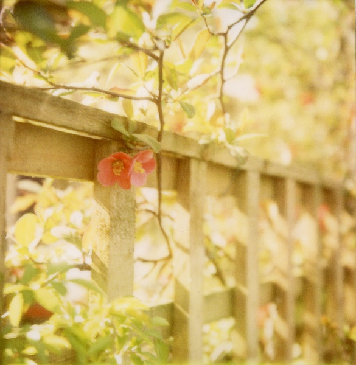
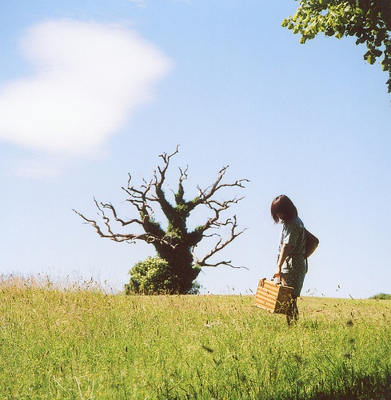
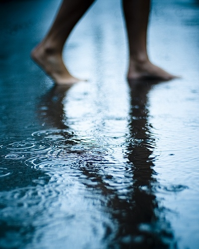
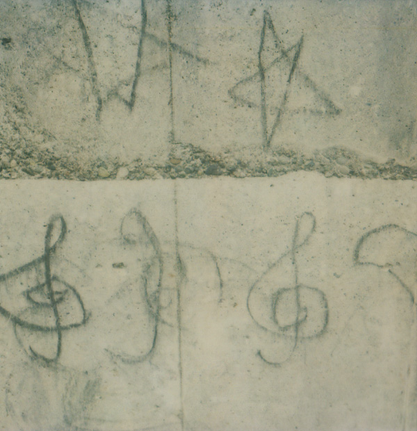
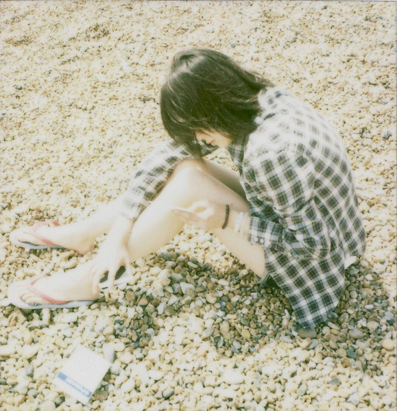

# 我们消失，就像一片风景（下）

**当我再次经过那些熟悉的场景，看到它们在改变或消失，陌生的人在那儿徘徊，似乎过去的事从来没有发生。我总有一天也会离开这里，而四季变幻，风经常在，它们是影像中的名胜，而我们是如此平凡的过客，它们不会记得我们。**

# 

# 我们消失，就像一片风景

## 文/小井（北京大学）

**题记： ** **你要像一个原人似的练习去说你所见，所体验，所爱，以及所遗失的事物。 ** ** ——里尔克 ** ** ** ** ** **三、斯人此去一城空** 小北是一个北方的孩子，她的心里有一片辽阔的内蒙古草原。 以前很喜欢席慕容的抒情小诗，她写内蒙古的文字却有另一种截然不同的大气。我也曾为照片里的内蒙古草原那种粗犷壮美所震撼，但那个地方对我毕竟只是个遥远抽象的地理概念。在冯至的《山水》里读过一篇《蒙古的歌》，我第一次真正听到有人给我唱蒙古的歌时，和他一样，不是在那片广袤的草原天堂，而是在忧郁绚烂的人世间。 110周年校庆前的暴雨带来一天的好天气。夜黑如幽深湖水，狂欢的人群早已心满意足地散去，只剩下不甘心寂寞的人稀稀落落地四处寻找释怀的角落。我和小北走到湖边，点亮十一根蜡烛。在蔡元培先生的塑像面前，我们点燃第十二根蜡烛，小北深深地做三次鞠躬，眼泪奔涌而出。那一刻我永远无法忘记。 在静园奇遇两个人坐在草地上敲出令人晕眩的鼓声，在鼓声带来的旋转里，我抬头仰望星空，我们点的蜡烛全在深邃的夜空中闪耀着，也许是从未名湖那边映上来的倒影吧。草地上有人在唱陕北民歌。我对小北说，我还没听过内蒙古的歌。不料，小北低头微微一笑，唱起《父亲的草原母亲的河》。 多么美好，你从未去过那个风景美丽而寂寞广大的地方，却仍可能在一个恰好的时刻，恰好的忧伤情绪中，以恰好的方式听到一个恰好的人为你唱起那里的歌。就像，你从未和那个来自内蒙古的流浪的孩子一起经历过，相遇前她所经历的故事，却可以没有预兆不计成本地将整个温热如家的心接纳了她，接纳那颗因漂泊而不能安定的心，接纳她沉重的行囊和秘密，接纳你可以承受的她带来的破坏，和你所不能承受的对她的爱。 全世界都知道要安静。 

 我知道这是一个唯一、永恒的短暂时刻，也许不会再有了，所有的曲调只会在这个因为突然所以奇妙的时刻才能爆发出这样动人的力量，当这个时刻过去了，歌的旋律和言语将被遗忘，只有倾听时的感觉将全部烙在心里。只记得其中一句歌词，让所有漂泊的孩子都能找到回家的路。 我在跟随什么，我在执着什么，我在错过什么。我是不是只能选择坚守，同时沉默，面对一片无边无际的内蒙古沙漠？而眼泪是什么，而我是什么？离开的时候，我紧紧拥抱着小北痛哭，她的声音在耳边非常清亮，她说，早晚都要走的。她奋力挣脱我，离开。 逝者如斯，不舍昼夜，我留不住什么。 所有汹涌的，积郁的，失语的，绝美的，易逝的。时光，你离去的背影苍凉而急促，你离去的背影苍凉而急促。 第二天晚上是中日诗歌朗诵音乐会，讲堂多功能厅布置精巧，舞台上上升的蓝色星光，银光闪耀的流苏珠帘，灼得我心凉。诗歌被日本学生的配乐改写得离奇诡异而躁动不安，笛子，钢琴，手风琴，一切属于童年游乐场的，都变了色调，尖声地拉开黑夜那锈迹斑斑的铁门。世界早就变了，这一次的离别，不是放学，也不是毕业。 

 小北离开的前一天，我冒着雨从中关村走回学校，积水及脚踝，我索性脱下鞋，赤着脚步行于灰色的地面。冰凉的大地第一次亲吻我，亲吻得我的脚心一阵一阵的冰凉。走过马路，走过公交站，走过路边摊和小巷，我忽然自恋地觉得我单薄的蓝色连衣短裙在城市冷漠的注视下，发着蔚蓝的光。 回到学校宿舍，立刻去浴室洗脚，检查脚掌有没有被什么东西弄伤。好在，除了磨得通红脱皮，有一点痒痛之外，安然无恙。这时，手机响了。我拿起来看一眼来电显示，是小北。 傍晚再次回宿舍，看着空空的走廊，回想起放暑假前，每次下雨后，走廊两边的门前的都会晾着撑开的花花绿绿的伞，好像一条花径。甚至伞上淌下来流在地上的雨水，都像是有颜色的。现在，同学们军训的军训，回家的回家，走廊空荡荡的。我的双脚赤裸裸地踩在地板上，仿佛能感受到一道道门缝透出来的冰凉。疲惫地沐浴在温热的浴室里，我开始努力回想刚才发生的一切，希望能全部记得。背影，表情，声音，话语，还有离别时那一握手。热水覆盖了我的额头，我的眼睛，我慢慢意识到，并开始惊于那一握。 小北说，我这人不适合拥抱，我们握手吧。 我说，不了吧，我的手很脏现在。 她笑了一下，转过身要背向我，手却用力地握住了我的手。 她开始大步地朝宿舍楼走去，不知道是她拉着我，还是我扯着她，我就这样握着她的手，不由自主地跟着她一起上了好几个台阶，才放开手，看着她走到门口。 “你去香港以后，会主动跟我联系吗？” “放心吧，回家还可以再见的啊，还有网络，多方便啊。相见不难，别才难。” “可是你到时候会很忙吧？我怕又找不到你了。” “对，很忙，会死人的，呵呵。” “只能网络吗……我比较喜欢看到你本人，从你的字里行间我看不出你是什么心情。”她没有回答我什么，笑嘻嘻地弯着腰，把头斜靠在抓着门把手的手背上，这样慢慢地把门关上。我被隔在玻璃门外。突然从宿舍楼里走出来很多人，小北走了进去。在楼梯拐角处，她回过头看了我一眼，笑着向我招手，瞬间消失。 “早晚都要走的。” “好好过你的生活。” 我懂，小北，你说过了，反反复复地说过。那时，你是不是也哭了？ 隔着玻璃，招手。那一刻，在我意识到自己正在失去什么之前，我什么都还没失去。所以我不想把自己搞得怅然若失的，我轻快地转身离开这栋楼，走进雨中。 

 小北离开的那一天，我一个人在万圣书园的咖啡厅呆了整个白天，傍晚我穿过一条围栏开满花的路，和一个喧闹的马路十字路口，才回到学校。我没有立刻回宿舍，带着莫名的感伤漫步校园。尽管我的凉鞋磨破了我的脚脖子，还是想要走更多的路。松林那面墙不知道何时开了一排萎靡的向日葵。走过师生缘咖啡屋，看见门前的招牌上那把霓虹灯吉他，不知何时变成了两把。未名湖还有穿学士服的毕业生在拍照，他们很积极地寻找拍摄点，像刚走进大学的新生一样。后来不知道怎么的，就走到蔡元培先生的塑像前，塑像下依旧放着百合，四束百合花。我走过去，对他深深地三鞠躬，说：“您还记不记得？您也会记得的，对吗？” 我抬头，看静园上空群鸟的慌乱飞窜，鸣叫不断的黑色身影，让人晕眩，像听到一阵从四面传来的鼓声，歌声。这个年代，有太多浮躁的来来去去，患得患失的诺言，和仅限于慰藉的暧昧依偎。所以，如果你真的爱一个人，一定要让他/她知道。小北对于我，就是这样的一个朋友。 小北说了一句话，让我印象深刻。她说，每一个北大人，都会在某一刻突然意识到，自己是在这片土地上。 而我意识到了。过去，我从小北对这里的热爱中意识到。现在，这种意识更加强烈，因为小北的离开，让这片土地变得空旷，安静。它开始真正属于我。 小北，因为你的到来，和离开，我得重新生活。 我慢慢意识到，并开始惊于那一握。 对不起，我还是哭了。 **四、离开，是为了回来** 也许是因为走到了一些地方，认识了一些人，见识了一些事情。 我延续着小北的生活方式，不停地看书，到处听讲座，看各种展览，参与一些非功利性的活动。 奥运会志愿者工作开始前，我单独留在北京，游览了许多地方。常常在一些展览品和阅读体验中，被莫名地唤起一些自己生命里古老的记忆，追溯到童年泛黄发脆的纸页里。好多次，突然我得以为那些只有形色与声音残存在记忆里的事物，找到了名字；另一些从未遇见的事物，给我一种很模糊又很强烈的触动，似乎是我潜意识中等待的、与我有共鸣的、或突然给了我某种吻合感，让我想要亲近和理解它。 而我居然在这样瞬间迷失的奇妙时刻，会湿了双眼，或者内心一阵颤栗。 我在哪里，为什么来到这里。这里是北大吗？谁能证明我真的属于这里？ 时间给了我们什么？ 时间在我们能认出他之前，就已经远去了。我以为我记得一切，我以为此刻我在写我的故事，其实，我什么故事都没有。可以用玛格丽特·杜拉斯的一句话概括我的大学生活：“我自以为我在写作，但事实上我从来就不曾写过。我以为我在爱，但我从来也不曾爱过。我什么也没有做，不过是站在那紧闭的门前罢了。” 即使这样，我仍时刻感觉着周围澎湃的变化以及它们在我身上发生的作用，像是自己被抛到了一个断块山的最高峰，看见自己身后，记忆断层的那一部分，一块接一块地，塌方，陷落。 真的无法与别人描绘自己的感受，每一刻都在意识着自己的浅陋，平静的生活让人有危机感，每一刻都在感受世界的慷慨，慷慨而又残暴地向我打开。可以说我找到了热爱而奋不顾身，也可以说我有野心有企图，还可以说我害怕。 周围的同学都找到了自己的路，我呢？我是如此平庸，没有任何经历，没有任何成就，也没有任何野心。可是，在广阔的世界面前，我已不再有勇气过平淡生活。 那种感觉真的很难受，不敢回首，又不甘失去。身后的已经不再，眼前的还什么都没有，“不曾归乡，就开始漂泊”，真的就像小北说的，“曾经以为是自己，以为是生活，走了一圈，看了一圈，发现原来都不是。”然后，再走下去呢？走下去，又会是什么？ 小北现在在一个遥远的城市。我以为，我还一直陪在她身边，我也知道她一直在陪着我。我并没有走远，只是我真的比她幸运多了。真的幸运得太多了。 可是，我还没有足够的气度，来承受这样的幸福。也许与能力有关，我的幸运还未带来幸福感，相反，平静地享受让我深深羞愧和不安。有人相信我吗？ 我还没有真正静下来，我知道。我也不知道我要走多远，还能走多远。 

 但我看到镜子里的自己，对照着自己一年一年的照片，变化得似乎很准确，刚刚好，仿佛这个时候本该是这个样子。一些人在我生命里，来了，又走了，我还是一直在这里，从来没有走远。 

和小北在网上的每一次对话都让我感觉很孤单，不是无亲无朋的孤单，而是我们不在彼此身边的那种孤单。“孤单”在我或明或暗地滥用以后，经过了生活真正的经历与思考，渐渐变成一个空阔、洁白而又晴朗的词语，也许还很难不掺和一些孩子气。我不知道一些事情在我身上发生过什么作用，只知道，时间过得很快，我和小北各自承受着自己的生活，在还没来得及把故事彼此诉说时，它们就变得很远，很不重要了。 我不知道友情还会维持多久，一切都在改变。但这已经不重要了，那些承诺。生活、记忆、友情和一些信仰给我们的那些承诺。 小北，这样一个你还记得的我，你还相信着的我，你还想念着的我，还能给你什么安慰？我不知道自己还能保证什么，还能怎样对你证明永恒的存在，信念的力量。我甚至不愿意自己对你也抱有这样的想法。也许我只能和你相视无言，但此刻，很想双手搭着你的肩膀，看着你疲倦的脸，轻轻地笑一笑。少年时代的承诺是多么经不起事过境迁，可是它们又是那样可贵，那样真诚。也许不要当真的好，否则友谊变得坚硬，而易碎。 重要的是，我们都要过好自己的生活，还有很多需要付出心力的事情，为之痛苦的，不应该是生活以外的东西，不是吗？但曾经的那些纯真的郑重的话，带给我的那种仅仅承诺所能给的幸福感，我想永远记得。 08年的秋天，随之而来的是新的学年，我开始了一个人的大学生活。晚上下课回来，偶遇吉他协会的男孩们在大讲堂外面即兴弹唱，很多人围观。大多数听众是08新生，他们有的很开心地给朋友发短信，有的很认真地跟着节奏拍掌，几个男孩跟着大声唱，还有几个女孩发誓当晚回去要写一篇日记。黑暗中我看不清楚身边的人的脸，天气有点凉，站在人群里很温暖。吉他手们在浓重的烟酒气味和粗俗的嬉笑怒骂中，撕扯着嗓子，不着边际、乱七八糟地合唱了一曲又一曲。 

我沉浸其中，有时欢笑，有时动情地跟着唱起来，有时因忽然间坠入空落落的心境而一时惘然。07年的中秋，我也在这样的吉他声中，这样地驻足过，看到的也是这样的情景，也这样地突然挂念起一个遥远的人。不同的相似时刻，听到同一首《外面的世界》，有种尖锐的时空飞离感。

每年的同一时刻，学校里就有相似的事物出现，入学，招新，聚会，演出，典礼......生活在校园里的人很幸福，在一个回忆永远不会断流的地方，总是可以不断地重温新的四季。四季分明，时间短暂，频繁的变化让记忆显出鲜明的轮廓，如同触觉所能感受到的无处不在的气候。 生活不会再像我出生的那座热带岛屿，四季常青。小北，有时候我真希望自己也是个北方的孩子。生命不应该总是停滞在一片绿色的阳光里，这会让我学不会真正的坚强。 新来的孩子们享受着他们的大学新生活。这新的一切是属于他们的，可是他们现在拥有的我已经亲历过了，我已经拥有了，体悟了，所以不羡慕，没什么遗憾了。一年四季，消失的风景还是会回来。而我们，将一去不复返。 我的大学故事写完了，回头看才发现，我没有什么可以诉说的故事，只有对那段日子的感受。我无法用线形的语言描绘这些感觉，它们只有无法计量的空间。也许因为经历得太平淡，深入内心的只有一些刻骨铭心的感觉。这些感受恍如隔世。我想起了饯别宴席，很多同学抢着跟小北合影，我当时竟然感到极不自然，和小北站到一起竟然身子僵硬，做不出任何亲密的动作。在相机闪光的瞬间，我下意识地伸出手，在镜头之外，握紧小北的手，闪光过后却立即松开。后来这张照片还没有经我过目，就不翼而飞。我和小北唯一一张合影奇怪地失踪，这意味着什么？ 现在的小北已不再是当时的小北，北大也不再是那时的北大。当我再次经过那些熟悉的场景，看到它们在改变或消失，陌生的人在那儿徘徊，似乎过去的事从来没有发生。我总有一天也会离开这里，而四季变幻，风经常在，它们是影像中的名胜，而我们是如此平凡的过客，它们不会记得我们。许多的故事只有我们两个知道，如果小北和我都被时间的洪流冲走了，那些短暂的美好记忆，谁会帮我们记得呢？ 也许只有改变是永恒的，也只有改变是美丽的，生命的轮回总给人以重新开始的希望。看到眼前的希望，就不应该做太多的回首。我似乎开始意识到，我自己也应该有所改变，去尝试一些我不能辨认的世界，借此不断地观照自己的过往，也审问自己的内心，同时清醒地认识自己的局 限，走近生活，承担这一切可能的责罚。 

小北是我大学生活里一段未名的故事。故事能否延续不再重要，我的生活没有那么多深刻的故事，是一部断代史。故事的叙述也不再重要，就当这是我的一段独白吧。不知道下了这趟车，还能不能回到原来的地方。我此刻坐在车窗边，以一种粗心的方式，和不可挽回的心态，凝视着窗外急速后退的风景。

（全文完） 
