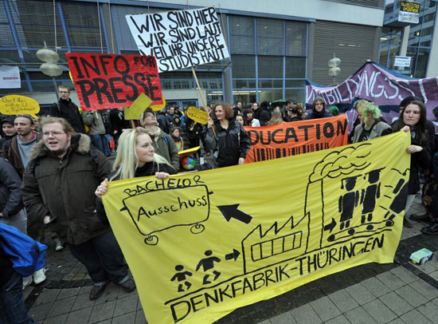

# 我所知道的德意志

**“我曾经参加过几次中小学生的历史教育课，印象很深，例如，他们会自导自演盖世太保抓犹太人的小话剧、或是观看《安妮日记》的作者小安妮的纪录片等等，形式多种多样。孩子们就在这种轻松、愉快的氛围中了解自己祖国的过去，完全是旁观者的眼光，老师也丝毫不避讳告诉孩子们，当时的德国人的行为叫做****“****集体荒谬****”****。”**

### 

### 

# 我所知道的德意志

### 

## 文/崔文超（复旦大学）

### 

### 

### 【题记】

他们本是蛮族，扎根在欧洲大陆的时候连自己的文字都没有，却在历史长河中孕育了世界上最伟大的音乐家、文学家、哲学家和科学家。 

### 【前言】

考完了呕心沥血的德语文学史，终于长长舒了一口气，也由此完成了本科阶段最后一门德语专业课。回想起自己和德语相伴的这四年，感慨良多：从四年前的今天练习小舌音开始，到三年前在北区留学生公寓和德国学生谈天说地，再到一年半前游走德国近二十座城市，又到如今从晦涩难懂的文学作品中去解读文字背后的深意——这个过程让我从不同的角度去触摸德意志民族的个性和脾气，爱她、恨她也嫉妒她，崇拜她、害怕她也讨厌她一直捉摸不透，不过最重要的是——这个过程苦中作乐、是收获也是成长。 现在，抛开沉重的课本，也舍弃条条框框的讲义，我很想整理一篇自己对德意志民族的体会。这是一件庞杂的工程，语言是有限的，试图用这个有限的工具去诠释一个无限元素构成的民族，恐怕是痴人说梦。但我仍然要写，因为歌德说过，理论是灰色的，而生命之树长青——我记录的绝非理论，而是生命轨迹中的斑斓风景。无关学术，只关乎自己的所见所闻、所感所想。 

### 【可怕的德语】

马克·吐温把德语骂得狗血淋头，末了还不忘说一句，这个语言真从世界上消失才好。他的这番嘲骂势必引起所有学德语的人拍手叫好。 每次德国人对我说：“中文真难，要记住每个字的四声，这怎么可能呢！”我就会回敬说：“德语才可怕呢，每个名词都有性别。女人是阴性，男人是阳性倒也算了，凭什么太阳是阴性、月亮是阳性？”德国人自己也笑了。要是我得理不饶人，还能接着说：“我们中文可灵活了：我爱你，他爱你，他们爱你，就一个爱，没有单数复数，也不分第一人称第二人称，爱的多轻松，你们呢？爱成这么多种形式，累都累死了。”德国人便会哈哈大笑，不再抱怨中文复杂了。 其实文章读多了，就知道德国人语言复杂是为了防止写出来的东西让别人有歧义。大一的时候我在熊学亮的语言学导论写过一篇名为《从德语的“格数”看德意志民族严谨的性格》的论文，尝试去寻找其中的关系。德语为什么能成为哲学的语言? 我想，很重要的原因就是用繁复的性、数、格来堆砌出极为庞大的句子，当你解构剖析之后才知道，这种表达方式杜绝了误解的可能，所以才能承载和传递更深刻的思想。当然，这也不是绝对——中国古典哲学的载体就是极为凝练、简短的文言文，被省略的甚至可以是谓语动词。这种区别源于汉族和德意志民族思维方式出发点的不同，简单来说，中国人讲求含蓄，要留给你足够的想象空间，供你“玩味”，而德国人喜欢把话说全，一个句号结束，你觉得该说的都被他说走了。 记得汪勇豪老师曾这么打过比方：中国人吃饭喜欢用筷子，这么轻轻一夹，就完成了人与自然的合二为一；西方人则没这么好打发，他们左右开工，又是刀来又是叉，把自然之物细细解剖，在这个过程中，人是主体，自然界就是客体。我想，从这番比较重应该能窥探，思维方式的不同和语言结构的不同，是异曲同工的吧。 

### 【爱管闲事的德国老太】

 在德国生活久了的中国人，一定有过这种经历：空荡荡的马路上，你看到了红灯，不过思忖着怎么都不会有车开过，所以就理所应当地穿了过去，却不知什么时候就会蹒跚走来一个老太太对你说：“哎，没看见啊，是红灯，你这样多危险，要是有转弯的车子怎么办？”知道理亏，只好悻悻离去。超市里、公车上，这样的老太太比比皆是。她们在你违规的时候直言相劝，也在你需要帮助的时候耐心解围，丝毫不理会你心里也许早已暗暗嘀咕了一句：“老太婆，真是多管闲事！” 在我看来，德国的老太太并非多管闲事，她们管的是一种叫做“规则”或者“秩序”的东西（die Ordnung），这个东西是德意志人民的命根子，触碰不得，谁要是扰乱了它，德国人跟你没完。年轻人大约是行色匆匆、顾不上管你，但这些不用围着孙子孙女团团转的老太太可有的时间来管你。 正是德国人的一根筋到底，才创造了地铁没有闸机验票口的神话。你若刚从巴黎去到德国，一定深深惊叹，这里的地铁没有旋转的闸机，也没有开开合合锻炼你反应能力的玻璃门，简单的展台，全开放。按照中国人的逻辑，德国铁道局一定血本无归。但是，他们依然是赢家，因为比车票值钱得多的是人的诚信，也是从日耳曼民族征服罗马帝国以来知道今天都流淌在血液里的东西，它就叫做“秩序”。偶尔也有搭黑车被随机抽查的检票员查到的“倒霉鬼”，他们付出的代价是高昂的，不仅有DB的不良诚信记录，还有相当于车票价格20倍的罚款，得不偿失。没有人愿意冒这个险，在众目睽睽之下颜面扫地。 下次，当你在德国倒垃圾、过马路或者在超市里挑东西的时候，请一定小心，说不定什么时候就有一个拄着拐杖牵着小狗的德国老太太对你说：“哎，不是这么做的！” 

### 【诺基亚的最旧款手机】

在上海，地铁上随便哪个农民工朋友从裤兜里掏出来的手机没准就是Nokia的N系列，“喂喂喂”叫得仿佛要全世界都知道他有个价格不菲的手机。高峰时间，通勤的人们，一手扶栏杆，另一个手握的也准是手机，或者PSP，或者Ipad、Iphone、Itouch，反正怎么新潮怎么来，打发时间也要往高端里走。不过，您要是去德国的地铁瞅一瞅，决不会相信他们的人均收入是中国的10倍。不论多年轻多时尚的小伙子小姑娘，要是他们用手机，那必定是Nokia最古老的版本，还常常不是彩屏的。最重要的是，根本没有人会用手机来打发时间；不管男女老少，手里捧的一定是书本或杂志，您若多多观察，一定觉得难以置信：这些书不是成功励志类，也不是发财致富类，清一色都是文学历史类。德国的书都比较轻，所以砖头一样的书，也不比一部N系列的手机重。寂静的车厢、安详的神态，全民阅读。这番情景让初来乍到德国的爸爸妈妈十分惊讶，回国之后也一直津津乐道，他们说：德国人就是爱读书啊！其实，这只是表面现象。深层次的原因有很多，比如：优厚的社会保障体系、避免贫富差异过于悬殊的税收制度让德国人不必疲于奔命，为工作所累，生活是悠闲自得的，所以才有了闲情逸致，在rush hour的车厢里还静静阅读。 到了德国，我做的第一件事情就是买了一款Nokia的古老版手机（相册图片为证），那个N81也锁在了抽屉里，唯有深夜和家里发发短信才拿出来。 

### 【“德国，德国，高于一切”】

这原本是德国国歌中的一句，却在二战后被硬生生删掉了。但是能从德国人心里删掉吗? 去年6月世界杯的时候，我在柏林亲历了德国人的热情。大街小巷挂满了三色国旗，如果遇到德国比赢了，那球迷们的狂欢真是可以用crazy来形容。走到大街上，他们遇见外国人就要大喊：“德国！德国！”空荡荡的马路，还把汽车喇叭按得响彻天际，大大的国旗铺满整个前车盖，后视镜上也裹了黑红金三色旗。 我想，德国人爱国爱到了骨子里。四年一度的世界杯，恐怕就是他们压抑在心里不得抒发的感情喷泄而出的大好契机。说“压抑”，是因为爱国这两个字在德国是敏感词，随随便便说不得，搞不好就被列为“新纳粹”。记得魏老师说，他在德国从来没有听到公共场合播放国国歌（足球比赛除外），大约只有凌晨的电台里，才播放一曲没有歌词的旋律，聊表慰藉吧。 对于爱国这个话题，我想说说德国人对历史的态度。德语中有一个词汇叫"Vergangenheitsbewältigung"，我原先一直以为，它的意思就是说，德国人从纳粹执政这段黑暗时期中走出来，使过往之痛痊愈。后来在柏林的Haus der Wannseekonferenz实习的时候才领悟，这个Bewältigung有两个意思，一个是“克服、解决”，另一个意思是“掌握、熟悉”，也就是说，要想克服这段伤痛，就先要熟悉它、掌握它的来龙去脉。不怕揭伤疤，不怕反复琢磨这个伤是怎么来的，等到一切都了然于心，这个伤口才能真正痊愈。这就是为什么德国中小学生的必修课外活动之一就是参观集中营或者二战时期的历史纪念馆，老师们用各种方法来讲解那段历史。我曾经参加过几次中小学生的历史教育课，印象很深，例如，他们会自导自演盖世太保抓犹太人的小话剧、或是观看《安妮日记》的作者小安妮的纪录片等等，形式多种多样。孩子们就在这种轻松、愉快的氛围中了解自己祖国的过去，完全是旁观者的眼光，老师也丝毫不避讳告诉孩子们，当时的德国人的行为叫做“集体荒谬”。 其实德国人是不怕你们揭伤疤的，因为他们了解这段过去，比谁都了解。他们依然深爱祖国，但在那个癫狂的、集体去理智的年代渐行渐远之后，这种爱就悄悄放在了心里，只是每隔四年都拿出来叫嚣一次，让全世界知道德国战车的耀武扬威。 

### 【轰轰烈烈的罢课与罢工】

什么是民主？倘若您觉得写几条微博发发牢骚算是民主，那么您一定要看看德国的大学生是怎么做的。 在柏林自由大学上课的第二个月，我就经历了辐射整个德语区（德国、瑞士、奥地利）的“罢课事件”（Bildungsstreik），长达三个多月，不达目的誓不罢休。事情的起因主要有这么几个：德国开始引进英美体系的Bachelor、Master学制，而原先德国并没有“本科”这一概念，清一色读五年，出来的是介于本科和硕士之间的一种学历，叫做“Diplom”或者“Magister”。改革之后，变成了3+2，也就是Bachelor三年，Master两年，目的是“和国际接轨”。这样一来，原本至少四年乃至五年的课程量就被压缩到了三年，学生苦不堪言。另一个原因则是部分州(如北威州、巴符州)引入了高校收费制度，一年500欧，而原先德国的高等教育是免费的，属于福利范畴。其他一些零零碎碎的原因就很让我们中国学生费解了：提交论文有deadline, 学生能高觉得应当取消；上课有点名制度，与分数挂钩，学生觉得不合理，等等等等。 

 我的相册里有很多关于这场罢课的照片。学生们在教学大楼上拉起横幅，触目惊心地写满了标语口号，还把校长的头像贴在柱子上，意思是要把这样不能解决问题的校长拉下台云云。大厅里摆放着沙发、餐具、饮料和点心，大有拉开持久战的意思。而走廊里会有一个“问讯台”，如果你不知道这里为何如此混乱，会有学生细心为你讲解，并发给你传单，邀请你参加他们的活动。整整一个学期，他们都霸占了学校最大的阶梯教室，我们有一门公共课就一直像游击战一样东躲西藏地找地方。有一次上课的时候，罢课学生还走进教室，从胡须花白的老教授手里拿过话筒，让我们签名支持他们的主张，还热血沸腾地说明了他们的动机。这一切对于一个从不敢对教育制度说“不”的中国学生而言，真是石破天惊！ 事情闹大了以后，学校就引起了重视。我们日耳曼系也开始召开会议，这个会议上，学生是主角，大家纷纷表态，而老师则成了配角，不是主持会议、就是做会议记录。百来人的大教室里，学生的随便倒苦水、发牢骚，老师耐心听、认真记。我也参加了。 结果如何，我也不是很清楚。反正德国已经没有别的州继续收学费，虽然上课依然点名，但不和考试挂钩了，而那个“无辜”的校长，最终还是下台了。至于三年学制还是五年学制，恐怕不是一朝一夕可以解决的，但至少学生的心声已经让全世界都知道了。 值得一提的是，食堂的阿姨大叔也效仿起来。他们看到学生罢课罢得有声有色，居然也在某一天集体罢工。那天我去食堂吃饭，发现门口占满了带着白帽子穿着白衣服的大叔大婶，他们说：今天没饭吃！然后就发现食堂前拉满了各种横幅，主要控诉工资太低、要求加薪。这件事情似乎不了了之，但夏天的时候我还遇见有人拉我联名签字，让校方给食堂装空调降低温度的动议。反正，大事也好，小事也罢，不满意了就可以抗议，这在德国是不能违抗的人权。 除此之外，德国的报纸上随处可见公开批评政治家见解、政策的言论。措辞犀利、甚至不乏尖刻的嘲讽，这不仅是允许的，也是一些知名媒体得以受欢迎的原因。Meinungsfreiheit（舆论自由）是写进德意志宪法里的，受到绝对的保护，而这种近乎刻意的“自由”，也是60多年前那场极端的“不自由”所换来的。普鲁士精神强调一致、军事化、服从，可是这些被信奉到骨子里的教条终于被一个叫做阿道夫·希特勒的人推向了深渊。 

### 【那些“乏善可陈”的电影和文学】

美国有个好莱坞，印度有个宝莱坞，德国却没有一个让世界期待的大片制作地。德国人制作的影片，很少有特级特效大场面，也没有宝莱坞式的载歌载舞、幽默连连，说“乏善可陈”一点不为过。不过，德国电影也有独特的功力——不给你感官享受和刺激，但是给你心灵的启迪。打个比方来说，就是用笔在你的心里划一道线，清淡得让你不知不觉，却在之后越来越清晰、深刻，乃至很久以后的某个人生阶段回想起来，顿时恍然大悟。比如《罗拉快跑》（音乐和镜头的效果虽然很不错，但我个人觉得和宝莱坞比起来还是差很多），看的时候也只是一笑而过：罗拉三次奔跑带来了不同的结局，真是太戏剧性了，我的理解就到这里为止。大约好多个月之后，在我开始选择未来的方向的时候，才突然又想起了这部电影，才品味出一些味道来，比如奔跑的场景和生活的快节奏、未来的不可知，最重要的是影片开头那句话：“我们不放弃探索。探索的终点将是它的起点。让我们重新认识探索吧。” ——艾略特。 在柏林的时候看了一部片子叫“窃听风暴”（Das Leben der anderen），我也是后来在读了更多的历史之后才渐渐懂得的。平淡无奇的描述、毫无戏剧、夸张成分的情节，但就是这份真实，才还原了一个原原本本的东德和Stasi（国安工作人员）。包括在柏林看的那些30年代的电影，也都是表面的乏善可陈，实质却是大音希声。 即使是根据德国小说改编的、由英国人来拍的电影比如《朗读者》，也一样平平淡淡。由此可见德语文学就更加不可接近。情节的荒诞、文字的晦涩，足让以读书来消遣娱乐的人都退避三舍。一个典型的作家就是卡夫卡。读过《城堡》的人一定不会忘记，这是一本让人从头读到尾都不知所云的书，情节冗长荒诞，就是讲一个土地测量员想要进入一个城堡去工作，手头有各种文件证明他的合法性，但城堡里的人就是不让，说是没有接到上级指示，也不需要这么一个岗位。主角就开始漫漫挣扎路，在想要进入城堡和被拒绝搪塞之间周旋。这么个过程写满了整整一本书。当我硬着头皮读完的时候，心都碎了，一来是我实在无法理解为何这么个简单的事情能写这么多，二是全书笼罩着一种黑色忧郁、令人窒息和压抑的氛围，荒诞而离奇，光是“土地测量员”这一Titel就让我觉得陌生无比。但是我却在两年之后的柏林的课堂上醍醐灌顶。那次我们讲到了一个瑞士作家想到柏林去寻求新的未来 ，因为那里是欧洲文化中心，他本以为柏林会张开臂膀来接纳这个文人，却没想到在那里碰了一鼻子灰，从火车上下来，到去登记户口，直到安家的这个过程都困难重重，看似简简单单的手续却怎么也办不下来，氛围也是和《城堡》中如出一辙的压抑、忧郁、绝望，只因那是纳粹统治前期。我顿时就读懂了《城堡》，或者说获得了诠释《城堡》的一种可能性。人与人的交往、人心的难以进入，抑或是一种体制、一个社会、一座城市、乃至某种意识形态的难以进入和融入等等，都可以是《城堡》所映射的。 这样的例子还有很多，例如黑塞的《荒原狼》、托马斯曼的《魔山》、《浮士德博士》、《威尼斯之死》、布莱希特的《三分钱戏剧》、Doeblin的《柏林——亚历山大广场》等等。我难以通过这个小小的章节来谈尽浩瀚德语文学之特征，谨以此东拉西扯的感想，来记录我的思考和拙见吧。 

### 【结尾】

如此几个角度，洋洋洒洒，还是意犹未尽，总觉得不能把我所知道的全都呈现和分享。 不过，在读这篇文章之前，若您对德国的理解还只是啤酒、汽车、足球和香肠，而读完之后对德意志三个字有了新的想法，或是对德国产生了兴趣，那就我不枉费我的一番功夫了。需要说明的是，和中国一样，东南西北的人各有特性，难以一概而论，德国人的个性也是随着地域的不同而大相径庭的，巴伐利亚人的热情奔放和柏林人的内敛严肃就形成鲜明对比。我所总结的，只是一个大致印象，难免有疏漏和偏颇，恳请朋友们不吝指正。 

### 【后记——旅行的意义】

写到这里，就想起来我旅行时候的一些小事：冬天去莱比锡的时候坐在火车站里等车时，和生活在这座城市里一辈子了的老爷爷聊了很多东德的事情，当时也是感触很深；又比如在巴黎迷路的时候，为我带路的一为老妇人一边和我说明方向，一边还陪我穿过大街小巷和塞纳河畔，沿途聊了很多自己的经历，她在英国教书教了好多年，这次是回巴黎度假的，虽然在异国工作，却深深想念家乡，巴黎的一草一木都是她热爱的，等等。书本上的历史、旅游手册上的描述、照片里的图景都比不上亲身经历的实实在在，但是，若没有事先的阅读，也不会有事后的思考和感悟。所以古人云：读万卷书，行万里路，这真是千真万确的道理。 斯图大哥说，青春就是无尽的暴走，年轻时候就应该去流浪，去经历，只要不忘了回家的路。我想这也是旅行的意义吧——让青春更充实，去看更多和自己以前生活的环境不一样的风景，去接触更多不同文化背景的人，博采众长。 交换生的经历不仅让我看到了另一种生活方式和人文景观，也让我清醒地审视自己熟悉的环境；知彼知己，也是相辅相成的。法国诗人兰波的那句“生活在别处”，总能引起我的共鸣。旅行，让我不再生活在“单向度”（马尔库塞《单向度的人》）的世界里，心里已经留有一个“别处”。此处与别处之间，构成了一个立体的饱满的人。 

 谨以这篇不怎么符合德意志“严谨”精神的小文，来纪念我与德语相伴的四年时光。 

### 

### 

(编辑：陈轩) 

### 

### 
