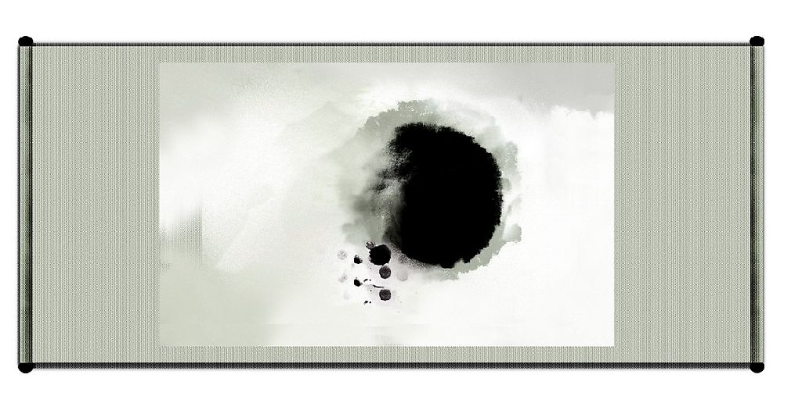

# 我是文青我自豪

**“我想起初我们的“老鼻祖”为什么要以“文学”二字作为社名恐怕也是出于无奈吧，我看到在80年代还叫“诗社”的，后来可能是人员数量实在是可怜得要命才不得不扩大社团的适用范围吧。谁能想到在当今人口爆炸的年代，以人为中心的文学竟会沦落至此呢？每念及之，未尝不扼腕抚心而叹。”**

### 

### 

# 我是文青我自豪

### ——为华理文学社鼓与呼

### 

## 文/蔡超 （华东理工大学）

### 

### 

从上世纪80年代末期开始，“文学”二字在中华大地上似乎瞬间消失了踪影。五四时期所掀起的文学浪潮已是回旋乏力，现代最后一位诗人——海子在面对90年代大门时也向我们摇手而去。老一辈的大师们都相继老去，他们的意气风发，他们的慷慨陈词，他们的大声疾呼，他们的白衣飘飘，他们的音容笑貌都只能留与我们引以为传奇了。是的，他们都老了！他们留给了我们什么？他们没有交好这一棒，我们什么也没有得到！如今我们两手空空。这是一个大空白期，注定是一个缺乏文学热情的年代！ 然而，我们就什么都不能做了吗？不，我们正和上世纪初期的年轻人遇到的一样，事实证明，他们遇到的比我们还要糟！查拉斯图拉早已下山宣告上帝已死，世界文化的基本格局是一片荒原。中国的政治、文化、社会体制也在近代西方文化的强烈冲击下如沧海孤舟，悬崖之石，这一时期的年轻人遇到的更是一个无可救药的烂摊子。但是，困境并不代表只能固步自封，迷茫困惑并不代表只能停滞不前，在这一时期，梁启超毕竟还在《少年中国说》中呼吁少年之责任；陈独秀毕竟发表了《敬告青年》；鲁迅毕竟写出了《狂人日记》；胡适之毕竟还前往美国留学。当然他们所贡献的远远超出文学的范畴，然而他们的态度与精神确是普适的，这自然也是他们一代人所必须要担当的。 时间拉向我们，我们的情况又如何呢？我们的总体外部环境好于他们，而我们的总体内部环境简直糟糕透了。在这里，我用到了“总体”一词，因为局部，最起码是我了解到的局部，无论是外部还是内部都一样乏善可陈，我想对于这一点大家都心知肚明。我们的时代，知青也好，愤青也罢，最难以让人忍受的乃是“愣青”！一群永不知真相的群众，一群没有担当，没有责任感的浑噩青年，一群被时代绑架被时间抛弃的愣头青！我所担忧的正在于此，我们的年轻人（包括我在内）都太浑噩了！神志不清、体懈乏力、没有目标、缺乏斗志是其普遍症状。上大学就像回到了童年，数着一天一天，一年一年，把岁月空度，韶华辜负，却还整日嘻嘻哈哈，游手好闲，不学无术，不知老之将至，悲哉！ 

内部环境如此糟糕，那外部呢？我不知道其他地方怎么样，但就我所在的大学——理工大学，实在是一点儿人情味没有，太没有人文关怀了！中央集权，整齐划一，思想老旧，体制刻板，印象最深的一次是我借教室放电影，被拒绝，其一理由是可能涉及敏感内容，毒害祖国下一代的健康思想。这是大学！呆板守旧至此，你还指望跟他谈什么“独立之精神，自由之思想”？如今的大学太浮躁，“众人熙熙，皆为名来；众人攘攘，皆为利往。”宣传栏上，各种讲座，成功学，功利学无不泛滥，愕愕然随大流者更是不计其数。当然，我也不是一昧地反对这种讲学，只是它表现的太过活跃了！不知情者初来乍到会以为这是某公司培训基地，万不会把它同大学联系起来，这不是太令人寒心了吗！我们不禁愤慨：看看，看看，我们都遇到了什么样的时代？！我们看不到谁还热情地宣讲着自由，茶馆里喝茶闲谈的大师，树荫下思考的学者，也没有谁还热衷于对人生意义的探索。我们的青春在固定的时代里注定是灰色的，暗淡的，一成不变的，老气沉沉的了吗？ 五十年代的台湾，李敖还和我们一样走在大学校园中，他的境遇与我们太相似了（几十年来一成不变甚至愈演愈烈？），他在日记中不断地自勉自励，自求上进，他的《大学札记》文字动人，催人奋进，记录的就是他在大学中的时刻的所行所思所悟。六十年代的李敖可以说是台湾一代人的欣慰，他毕竟没有在死气沉沉的时代荒原里垂垂死去，凭着“虽千万人吾往矣”的韧劲在已残喘的文化界注入了一道新的活力。他的《十三年与十三月》使多少年轻人激动得流出泪水，并发大宏愿，寝食难安。但就是这个一辈子拿着棒子追打老年人的“年轻男神”自己也成了老年人。他们都老了，他们同他们的那个时代都已老了，我们的时代正如孤岛，又回到了艾略特呐喊的荒原时期。 回到一开始的问题，我们的情况这样糟糕，还能做些什么呢？我相信你已经看出了答案，那个理想主义横行的年代已经老去，我们面对的将是一个全新的时期，就是因为它的空白，我们才有更多的憧憬与空间。我们已经浪费了太多的时间了，不可再浑噩下去！堂吉诃德尚有同风车作战的勇气，我们为什么不可以有“吾曹不出，如苍生何？”的狂劲？为什么不可以有“虽千万人吾往矣”的魄力？一百年前的年轻人能够做到的我们也一样能够做到。我总相信人文人文乃在“人”之中，而不在“文”之中。我们不可否认外界环境对一个人的影响，可对于一个人来说，他有闲暇，有主观能动性，内部的变化总能带动外界的变化。沙漠之中尚有绿洲，更何况我们这里阳光和煦，风调雨顺？ 或许有人说“你太理想主义了！太不实际了！你想创造下一个理想主义的时代吗？”我想说这个时代不缺的是现实主义者，功利主义者，行动主义者，缺的就是理想主义者，不可一辈子宣扬理想主义，难道在我们的青春岁月里，在大学里也不可以吗？铺开你的人生画卷，你希望看到堆砌的都是一堆腐朽烂泥吗？“总有一些世界观，是傻逼呵呵地矗立在那里的，无论多少的现实，多少的打击，多少的嘲讽，多少的鸽子都改变不了。我们总是要怀有理想的。”韩寒如是说。 被环境所挟制，我们能做的似乎太有限了，但请不要轻易自怨自艾，自暴自弃。你们都有对文学的爱好，也可以看作是一种理想，须知文学乃是为人之学、创造之学，在文学的世界中一切皆有可能，你们要做的就是创造，怎么可以轻易放弃呢？也不可把它看得太廉价，因为此刻，除了理想，我们一无所有。 如今，我们还能以文学的名义相聚此处，我们还能够自由地阅读、思考，我们还有天赐的禀赋与手中的笔，最最重要的是，我们还年轻。不管文学在时代中的地位怎样，在我们的心中的地位怎样，我们都必将且必能为它做出点什么，比如思考与写作。 在这白驹过隙的弹指一瞬，在我们的青春韶华里，没有人会我们记下什么，能记下什么的只有我们自己，胡适之就曾经建议过年轻人多做日记，可以为自己的人生留点东西。每个人都有表达的欲望与需要，只是我们平时都疏于表达，懒于表达，或是只在脑海中一闪而过，就算能做些停留，也无法在时间或空间上留下任何痕迹，这些都实在是太浪费了！或许你认为你的想法不够成熟，不成体系，但那个思想家或作家在推出自己的思想与作品之前在脑海中就将一切酝酿成熟了呢？有谁是这样一蹴而就的呢？或许你还害羞，正如同每个真实写出自己思想的人一样，一方面迫切的想把这拿给全世界看，一方面又恨不得将它烧掉希望它从没有出想在这个世界上过，告诉你，就连伟大的“西方文学之父”卡夫卡都曾有过这种想法，历史证明，这是多么地不可取啊！余华曾经说过“真正的作家永远只为自己的内心而写作”，一个人的写作动机必然是出于自己的内心，万不可因为它直面自己的内心就要将它毁弃。 “文章本天成，妙手偶得之。”可见好的文章不一定非要经过太多的营营苟苟，也许就是不经意的感悟与想法，偶然间的，不经太多考虑的，不经雕饰的，“兔起鹘落，稍纵即逝”的，这样往往会有“清水出芙蓉，天然去雕饰”的意想不到的感受与效果。这比起“郊寒岛瘦”式苦吟派比起来似乎要取巧得多，但这其实也是一种美，甚至是一种大美，几千年前的陶渊明就发现了这种不张扬的美，这种“采菊东篱下，悠然见南山”的不经意的淳朴之美，当同时代的人都还在追求华丽修饰的骈文辞赋的时候，陶渊明却成为这种“非主流”美的化身，当起隐士来，并还高唱起“归去来兮”来，这真真正正是一件意料之外，情理之中的事情。当然要做到这些远非这么容易，它有个最大的先决条件，那就是思考，只有勤于思考的人才会有用不尽的灵感。 

说了这么多，无非是想劝大家能够多思多写，纵然你不想成为什么劳什子作家或思想家，也请你不要放弃。既然你有文学的爱好与梦想，为什么不坚持一下呢？记得在上次招新的时候很多人都问：“你们到底是干嘛的啊？这个有意思吗？”这个问题我真不好回答，其实我们又能干嘛呢？于是我问他：“你有对文字的爱好吗？你认为它有意思吗？”他说：“你说，你一说我说不定就觉得有意思了。”态度傲慢。我忽然觉得悲哀，文学不仅没落，人们对它似乎还有一种成见。于是我说：“引经据典，慷慨陈词，指点江山，激扬文字，你认为有意思吗？”他摇头；“痴男怨女，儿女情长，花前月下，吟风弄月，你认为有意思吗？”他又摇头；“那对酒当歌，人生几何？放浪形骸，浮游逍遥，你认为有意思吗？”他再摇头；“那为是非曲直，世道人心，为民喉舌，大声疾呼，你认为有意思吗？”他没有摇头，默默走了，看来他是真的没有兴趣。其实“文学”二字真的是太宽泛了，几句话又怎么能说的清楚？我想起初我们的“老鼻祖”为什么要以“文学”二字作为社名恐怕也是出于无奈吧，我看到在80年代还叫“诗社”的，后来可能是人员数量实在是可怜得要命才不得不扩大社团的适用范围吧。谁能想到在当今人口爆炸的年代，以人为中心的文学竟会沦落至此呢？每念及之，未尝不扼腕抚心而叹。 所以你们能有对文学的爱好，我们能以文学的名义聚到一起，这是多么令人欣喜的一件事！尤其是在我们这样的中央集权制的整齐划一的理工大学更是难能可贵，所以就请大家千万不要放弃。当然，对于一个年轻人来说，得不到激励与认可是可怕的，但是这样也请你不要放弃！如果没有人为你叫好，我也一定会为你鼓掌。 天道苍茫，苍茫自有其运行之理；天生我材，我材必有其用武之地。况于今日今时，君不可与往昔同日而语，君才惊天，君才震地，君才可移三山，君才可光日月！君之所当，世之任也，文之所钟，正在我辈！况高山流水，知音难觅，古人云：“杨意不逢，抚临云而自惜；钟期既遇，奏流水以何惭？”此处虽非比兰亭滕阁，大厦高楼亦足慰君平生之志。请诸君弃所顾忌，弃所桎梏，“请洒潘江，各倾陆海云尔”！ 由于准备仓促，手头资料不足，难免陈说乏辞，引喻失义，不够翔实，望诸位能够见谅。 （编者注：此文为蔡超同学写给华东理工大学文学社全体社员的公开信，经作者同意，略有删改。） 

（责编：项栋梁）
