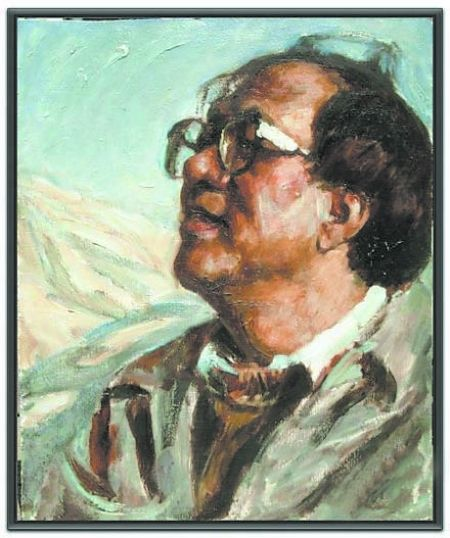
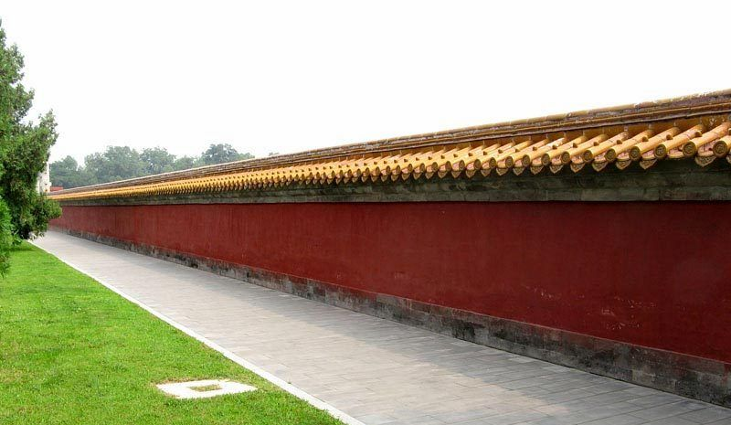
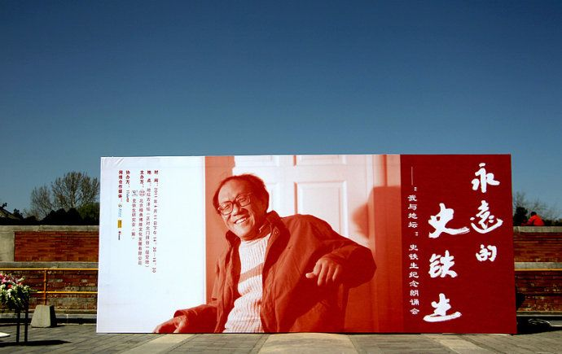

# 我的地坛

**对史铁生的纪念大抵应如是，他并不对生痴迷留恋，只是如同完成了对信仰的允诺，报尽了生在这世间的神恩，了无遗憾地走向了生命必然的终结，我幻想他应是微笑着走完最后的时刻，他所遭受的折磨和苦难终于停止在肉体的死亡，倘若灵魂不死，那么他在天国或许是更幸福的。** **他的死之于我，也应如地坛之于他。**  

# 我的地坛

## 文/柳雨青（复旦大学）

 

**我轻轻地走，正如我轻轻地来，扫尽尘嚣。**

**——史铁生**

 史铁生逝世已经有一个月了，期末的那段时间，我常自想着无论如何要为史铁生写点什么。而今终于回到家里，坐在我自小读书写字的布满浓荫的窗台前，也终于有了足够寂静的心情去悼念植根在我精神深处的庄严的地坛，那诗意动人的遥远的清平湾，和那命若琴弦的人生。 从书柜里抽出陆陆续续买的好几本史铁生的集子，就着透过绿荫的阳光，随意地翻到那篇《想念地坛》径自念起来。我听见自己的声音回荡在空旷寂寥的空气里，每一个字每一个字，连成一片宁静的深深的秋池。念着念着，便泣不成声。我不知道如何去形容这份感情，就像我当初听闻他在这世上离去的消息一样，不是因为死亡而种下的深重的悲哀，也不是对逝者哭天抢地的挽留，或是一种落寞，如人生走向冬天的宁静，回头看见通向终点的道路上满地的繁花与荆棘。你懂，那是怎样一种心情。 

 最喜欢的史铁生的集子倒不是他的小说，而是许多杂乱的只言片语拼凑成集的《病隙碎笔》，高三那段时间，常常在复习完功课的深夜盘腿坐在堆满书本的宽大的窗台上，就着微弱的灯光默默地读上一段，书页间映着床边巨大的玻璃窗外茫茫无际的夜色，大地温柔安静。那时学校旁租来的小家楼下有一条铁轨，其后是一大片花田，偶尔一辆列车披着远方的星空与夜幕缓缓而来呼啸而过。整个世界仿佛淡褪了喧嚣，剥蚀了华彩，只剩下夜的精灵与我遥遥相望，一起凝神谛听灵魂高旷的低诉。我念完了一段后，常抑止不住内心的波澜，便长久地望向窗外沉寂的苍茫夜幕，看花田中盏盏微暗的灯火，看远处低矮的丘陵起伏，感觉天地无尽地辽远，感觉生命在这世间的高贵和孤独，感觉果然有神明以最高的智慧温柔地注视着悲喜交加的人间剧目。 后来，那本《病隙碎笔》是唯一一本我一起带到复旦的书，虽然那些了熟于心的文字，不必再每天入睡前过目，但放在书架上，总是一抬头便能看见。心绪极乱的时候捧在手里默默读上几页，便觉得日子再迷惘艰难也能有了泰然处之的力量。史铁生早是看破了生死的人，他长长的一辈子都垂落在生死边缘，承受着最惊心动魄的苦难，像被上帝悬在半空，生命的选择早已不是自己的了。而他的心又使得他比这世上的众人更接近死亡而更看清死亡，他不再恐惧不再怨愤，他在死与丑的逼视中看见生的美的本质，读懂信者与生者的道路。于是他带着淡淡的笑意说：“死是一件不必急于求成的事，死是一个必然会降临的节日。比如你早起熬夜准备考试的时候，忽然想起有一个长长的假期在前面等待你，你会不会觉得轻松一点？并且庆幸并且感激这样的安排。”这话多少带着庄子旷达的意味，却没有挣扎，温柔平静，亦不必隐藏痛苦，只是笑笑把所有因为残损的肢体被剥夺的幸福都化成天际的云，了无痕迹。 生是一盅苦药，而死却是灵魂永恒的皈依。 “我也曾这样祈求过神明，在地坛的老墙下，双手合十，满心敬畏（其实是满心功利）。但神明不为所动。是呀，恺撒尚且哀告无功，我是谁？古园寂静，你甚至能感到神明在傲慢地看着你，以风的穿流，以云的变幻，以野草和老树的轻响，以天高地远和时间的均匀与漫长……你只有接受这傲慢的逼迫，曾经和现在都要接受，从那悠久的空寂中听出回答。” 读史铁生，总是寂静的，如那荒旷的地坛，静静地看春花秋雪年复一年，他沉淀了所有芜杂的怨恨与心绪，不再乞求什么，他明白这是上天为他铺设的路，是神明冥冥中让他领受的磨难与心境，他于是远离了人生虚浮的繁华，在那片寂静的光影与四季中阅读和写作。那是唯有他能写出的文字，美得纯净温情而带着生的辉光与力量。 他说：“重病之时，我总想起已故好友周郿英，想起他躺在病房里，瘦得只剩一副骨架，高烧不断，溃烂的腹部不但不愈合反而在扩展……窗外阳光灿烂，天上流云飞走，他闭上眼睛，从不呻吟，从不言死，有几次就那么昏过去。就这样，三年，他从未放弃希望。现在我才看见那是多么了不起的信心。三年，那是一分钟一分钟连接起来的，漫漫长夜到漫漫白昼，每一分钟的前面都没有确定的许诺，无论科学还是神明，都没给他写过保证书。我曾像所有他的朋友一样赞叹他的坚强，却深藏着迷惑：他在想什么，怎样想？ 可能很简单：他要活下去，他不相信他不能够好起来。从约伯故事的启示中我知道：真正的信心前面，其实是一片空旷，除了希望什么也没有，想要也没有。 但是他没能活下去，三年之后的一个早晨，他走了。这是对信心的嘲弄吗？当然不是。信心，既然不需要事先的许诺，自然也就不必有事后的恭维，它的恩惠唯在渡涉苦难的时候可以领受。” 这才是真正的信者的道路。 我不曾有一座地坛，不曾有过那样一座精神的圣地。但或许我是有的，或许史铁生早已化身成我心底一处寂静的荒园，我一次次的在寻找中走进那安静的浓荫里，在这园子任何角落，喧嚣都在远处。只剩下残垣断壁上夕阳缓缓沉落的辉光，或秋空万里萧瑟的梧桐落叶陡然飘落送走夏日的余温，或一日浩荡春光草地上的野花开得铺铺展展。每一幅画面都是内心的沉静。他曾说，地坛在那儿静静地驻足了五百年，黯淡了所有历史的灿烂与华彩，便是为了等待他的到来。“一个无措的灵魂，不期而至，竟仿佛走回到生命的起点。” 

 我曾走在长沙的一段尚未拆除的老街小巷，恍然看见热闹的巷陌深处立着一块碑牌，便驻足阅读，上面写着某某某故居旧址，清末状元，历任兵部尚书、军机大臣、内阁总理大臣之类的身份名号，大概也曾是一时名震四海呼风唤雨的人物。但那名字或许问遍街头巷尾的人们都只能摇头，曾装潢华丽的故居也成了小商小贩做生意的几家店铺，人来人往，谁也不再去留意墙角石碑上模糊的字迹。这一番今昔比照，平添了多少人生虚妄的况味。一百多年岁月的淘洗，让各路英雄也不免成了历史中一片薄薄的烟云，浮宦人生，到底什么才是真实？ 每一个生命的到来或许都伴随着一次对意义的询问，然而古今悠悠，谁也没有给出答案，大概但凡有生便将无数次地疑问下去。而一次次疑惑和询问，都是“一次次投靠安静，走回到生命的起点，重新看看，你到底是要去哪儿？”是回归，是写作的零度。 对人的精神而言，生和死只因为赋予了意义才得以存在。 “有时候我设想我的墓志铭，并不是说我多么喜欢那路东西，只是想，如果要的话最好要什么？要的话，最好由我自己来选择。我看好《再别康桥》中的一句：我轻轻地走，正如我轻轻地来。在徐志摩先生，那未必是指生死，但在我看来，那真是最好的对生死的态度，最恰当不过，用作墓志铭再好也没有。我轻轻地走，正如我轻轻地来，扫尽尘嚣。 但既然这样，又何必弄一块石头来作证？还是什么都不要吧，墓地、墓碑、花圈、挽联以及各种方式的追悼，什么都不要才好，让寂静，甚至让遗忘，去读那诗句。” 对史铁生的纪念大抵应如是，他并不对生痴迷留恋，只是如同完成了对信仰的允诺，报尽了生在这世间的神恩，了无遗憾地走向了生命必然的终结，我幻想他应是微笑着走完最后的时刻，他所遭受的折磨和苦难终于停止在肉体的死亡，倘若灵魂不死，那么他在天国或许是更幸福的。 他的死之于我，也应如地坛之于他。 

 史铁生在写下那篇著名的《我与地坛》之后许多年，搬了几次家，离地坛也远了，便不常再去。偶尔一次请朋友开车送他去看它，也早已面目全非。没有惋惜没有憾恨，他只是轻轻地说：“我想，那就不必再去地坛寻找安静，莫如在安静中寻找地坛。恰如庄生梦蝶，当年我在地坛里挥霍光阴，曾屡屡地有过怀疑：我在地坛吗？还是地坛在我？现在我看虚空中有一条界线，靠想念去迈过它，只要一迈过它便有清纯之气扑面而来。” “我已不在地坛，地坛在我。”  

(采编:安镜轩 责编:刘一舟)

 
