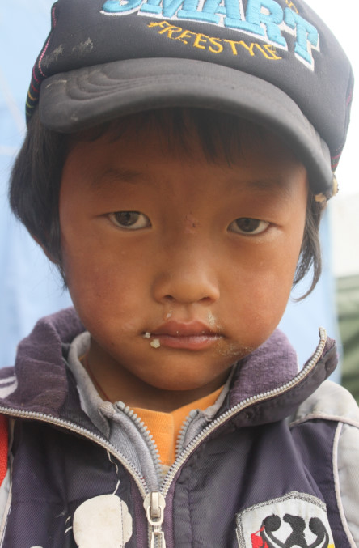
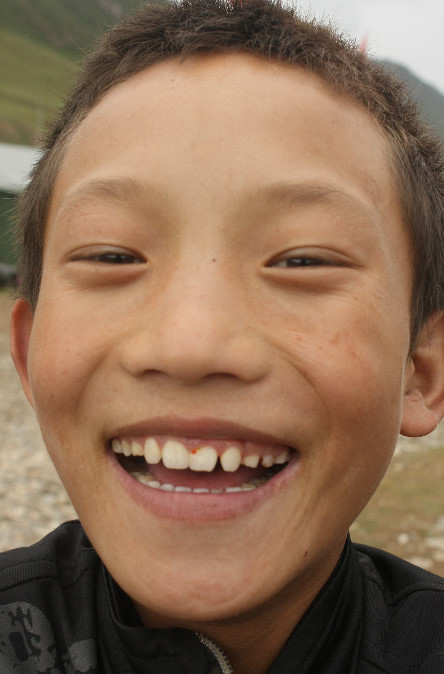
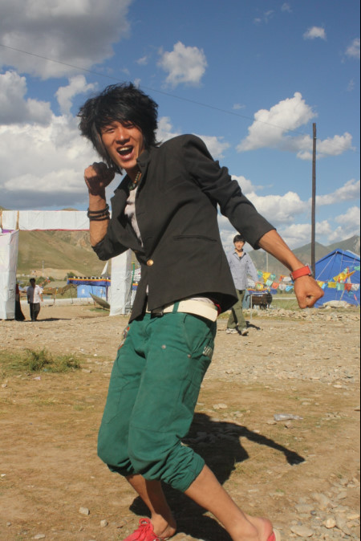
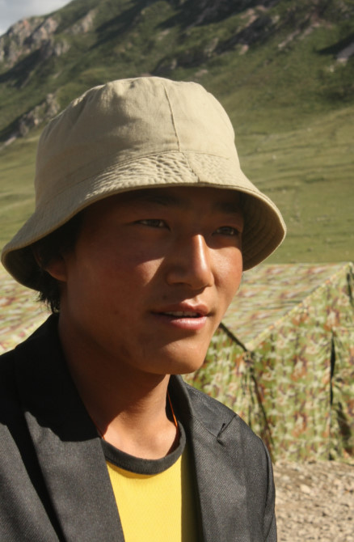

# 献给孩子们（一）

**编者按：****作者去青海旅游的时候，特意安排前往玉树，从西宁买了些文具和糖想带给灾区的小朋友。到了玉树后，问路时巧遇藏族志愿者罗格，他是传媒大学大一的学生，利用暑假来玉树支教。罗格带作者等去了他所在的学校，作者被当地恶劣的灾后环境、受灾的求学少年儿童以及辛勤耕耘的老师所震撼，于是结束旅游后，作者返回玉树，在当地停留了16天进行支教。作者回北京组织了两次募捐，并由朋友押送物资到玉树。** **作者说，玉树的冬天已经很冷了，如果朋友们有棉衣、大衣，可以邮寄到以下地址，地址是玉树利民学堂求松校长的家，他肯定会把物资发放到灾民手中的，考虑到二手衣服可能会产生疫情，所以希望大家还是捐赠新衣服，感谢。** **援助物资接收地址：青海省玉树县胜利路71号玉树州关爱生命协会 求松（收），邮编：815000。** ** **

# 献给孩子们（一）

## 文 / 小5（首都师范大学）

### 

### 

这些是我们没有完成的心愿：为利民学堂的孩子们制作一本属于他们的画册，这个主意是罗格相出的，但遗憾的是我们没有能把每个孩子都拍下来，我们一定会完成这个心愿。 

### 

已经在西宁沉淀了几天 脑子里竟还是自己躺在玉树-西宁的长途车上的情景 肆无忌惮的被窗外的阳光照射着 回想在玉树的每个点滴、片段 纵然，G214国已经走过一遍 纵然，一路上看到的风景已经看过 纵然，去开往回家的路 但很难受 对着片片白云，任泪水就这么往下淌，不记得有过几次 放不下很多…… 这几天，一直在努力回忆，记录 读完了《酥油》，看完了《唐山大地震》，在挣扎，在徘徊 责任，到底应该如何去排序，如何去定义 我不能做到了无牵挂，所以我不能承诺给孩子和老师们我一定会回来工作 这次，觉得自己不潇洒 希望经过沉淀，能做出心灵的选择 献给那些最可爱的孩子们： 

### 

### 

这个娃娃叫白玛群宗，你们猜是男孩还是女孩？我一直以为他是男孩，其实是个小女娃娃，是闹布老师家人的孩子。小家伙很害羞，问她一堆问题，她只会笑，但偶尔会大声的蹦出我听不懂的藏语。最好玩的是，她每次都喜欢拉着我的手到处跑。有一次，不知道她拉着我，只要看到一个人，就把我拉到那个人得身边，不管认识的不认识的，把我的手递给别人，示意让我们握手，我和别人笑着握手并哈哈大笑地聊天说话，她就会特别开心，然后拉着我跑，去找下一个握手的人。在她看来，这是一个多好玩的游戏啊，小家伙跑到可快呢！她饭量很小，每次中午饭，都盛挺少的，但还是吃不完，然后拿着剩饭眼巴巴的看着我们，我们也真没辙，每次都跟她说不能浪费，但每次还是剩下，当把剩饭从她手里接过来，小家伙就笑了，呵呵。 

### 

### 

这个孩子的脚有些残疾，走路是一拐一拐的，每天都流着鼻涕。有次他站在我旁边，眼看着鼻涕要流到嘴里，拿着手纸给他擦干净，然后他冲我不好意思的一笑。他是我比较关注的几个孩子之一，他特别矮小，每次看到上课哨声响起，孩子们一窝蜂的冲向教室，而他总是落在后面一拐一拐地用力拼命跑，背上的书包一颠一颠的，每当这个时候，鼻子总是酸酸的。 

### 

### 

这个家伙，呵呵，最聪明好学，课堂上，他总是最踊跃回答问题，唱歌也特别牛，声音翠翠的，亮亮的。记得我给他们上完第一节英语课的中午，他拿了一包零食，非要塞给我吃，我不说不要，他硬塞给我，我偷偷的把零食放回他的小课桌里，他这才罢休，我知道他肯定是想把最好的东西给我。第二天，我加入了孩子们的铅丝手工课和他们一起做铅丝，他坐在我的后面，时不时的就来看我作品，然后感叹到：哇，老师，你做的可太快了……做到一半，他看到我的铅丝没了，就到前面给我找了根最长的递给我，冲我一笑。过了一会，又递给我一根棒棒糖，这回我收下了，很甜很甜的棒棒糖，那种味道我永远都忘不了…… 

### 

### 

哈哈，这是我最稀罕的帅锅阿布，高高瘦瘦帅帅的。他是唐卡（编者注：藏族的一种特有的工艺）班的，还记得我第一次跟他打交道是去唐卡班看学生们的作品，他正在画唐卡，那么大的一副唐卡，他在认真的画，我问了很多关于唐卡的问题，他都耐心的解答，时不时的羞涩的笑。这之后，每次见面都会和他聊几句，有一天他没来，我挺担心的，怕他是不是逃学了……第二天见到他，他说他回家有些事情所以没有来，放心了我就。记得他有件红色的背心，上面画着姚明，呵呵，他穿着很帅。帅帅的阳光的笑容，阿布…… 

 又是个有型的帅锅，我们都觉得他很会搭配衣服，而且很高大，他特别逗，看着痞痞，但绝对是个重情义的孩子。英语课上，他虽然底子不好，但很用心学习，总是问问题，有此他问我：老师，“你的电话号码是多少”英语应该怎么说？我心想：小子，你肯定是想学会这句然后去泡妞吧！哈哈，但是还是教给他们了，果真一学就会，嘎嘎。 

### 

未完，待续。
