# 献给孩子们（二）

**编者按：作者去青海旅游的时候，特意安排前往玉树，从西宁买了些文具和糖想带给灾区的小朋友。到了玉树后，问路时巧遇藏族志愿者罗格，他是传媒大学大一的学生，利用暑假来玉树支教。罗格带作者等去了他所在的学校，作者被当地恶劣的灾后环境、受灾的求学少年儿童以及辛勤耕耘的老师所震撼，于是结束旅游后，作者返回玉树，在当地停留了16天进行支教。作者回北京组织了两次募捐，并由朋友押送物资到玉树。** **作者说，玉树的冬天已经很冷了，如果朋友们有棉衣、大衣，可以邮寄到以下地址，地址是玉树利民学堂求松校长的家，他肯定会把物资发放到灾民手中的，考虑到二手衣服可能会产生疫情，所以希望大家还是捐赠新衣服，感谢。** **援助物资接收地址：青海省玉树县胜利路71号玉树州关爱生命协会 求松（收），邮编：815000。**

### 

# 献给孩子们（二）

### 

## 文 / 小5（首都师范大学）

### 

翻看日记，回忆起我的第一堂课： 因为语言关系，我一直没有机会给孩子们上课，其实挺郁闷的，因为我来这里的最大目的就是能把知识教给她们，但一直没实现，我所做的就是帮关爱生命协会改改稿子，帮罗格打打下手，虽然这也是在帮孩子们的一种方式，但我还是想当老师…… 直到有一天，顿珠加要去做关于藏獒的采访，他让我代替他上一节课，好家伙，我老兴奋了！一时间竟不知所措，不知道该给孩子们讲什么，他们能听懂么？然后去书架上翻书，翻到一本英汉字典，抄上这家伙，大概在脑子里构出了结构，讲单词，讲关于水果和动物的单词。然后朝教师走去，孩子们课间都在教室外面，有几个小男孩看着我拿着字典朝教室走过去，问我：“老师，这节课是你来上么？” 我说：“对呀，你们的老师临时有事，我代他上一节。” 孩子们欢呼起来，跑回教室，向大家宣布这节课由我来上。一进教室，被欢呼声吓了一跳，那种幸福感啊，我说都不会话了……可能孩子们不知道我成天在学校做些什么，这天我终于可以和他们交流了，他们也很高兴，其实之前也有孩子时不时的叫我一声老师，但我觉得我枉费了这个称号，我并没有做老师做的事情，直到那一刻…… 他们起立，鞠躬，大声喊：“老师好！” 我先回了鞠躬给他们，进而教他们说good morning teacher，他们竟又刚学的英语重新向我问好。课讲的再顺利不过了，他们大声的读单词，我一遍遍的强调发音，他们一遍遍的重复，他们的求知欲望很强，这让我讲起来很有激情。到了结尾，我想换一种方式让他们更活跃，就带他们做单词的游戏，20个人分为4组，5个人代表一个单词，我念到哪个单词的中文，代表那个单词的孩子就要站起来，大声念出英语，看哪组站的最整齐，结果，全班乐的啊，有站错单词的，有不知道自己代表什么单词的，也有5个人齐刷刷站起来的，乐的呀，我们在笑声中竟忘了已经到了下课该吃午饭的时间，闹布老师站在窗外用手指着手表示意我已经下课了，但学生们完全没有下课的意思，其他班的孩子被我们的笑声吸引来，趴在窗户外面看，有得甚至从后门悄悄溜进来，坐在后面看我们做游戏，最后，站错了的同学要到课堂前为大家表演节目，就是每人唱一首歌，然后小型歌唱会就开始了，我们随着歌声一起为演唱者拍手，那绝对是最最动听的声音。第一节课，让我更加的爱上了他们每个人…… 

### 

[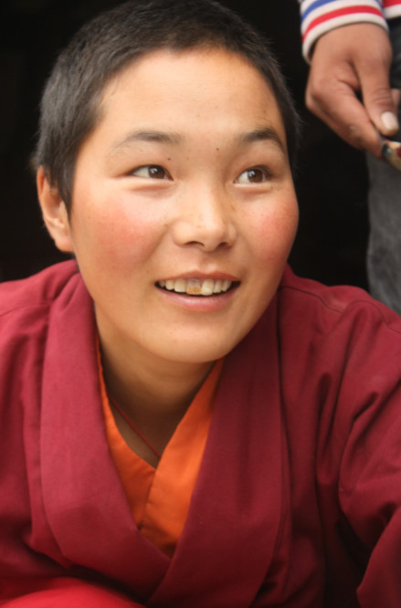](983d0b74-7a36-46e8-a365-1c4c2a16b8a5.jpg)

 次群巴珠，一个让我崇拜的女子。 第一次与她接触，是在接受捐赠图书后，许多学生在图书馆整理图书，我好奇的问了些关于图书分类的问题，她主动的帮我做解答。我惊讶于她汉语的流利和发音的标准。后来得知她不仅汉语好，英语也很好，她曾与色达的佛学院学习了3年——色达，还是我在澡王带到来青海的那本《不负如来不负卿》的书里知道的，是个具有传奇色彩的地方。在最后我们一起去巴塘草原野炊的时候，看着她和其他的老师在小溪边跳舞，那么明亮美好的笑脸和轻盈的舞步，很难想象她曾在地震中被压在废墟下，我不敢再多问细节，怕勾起她不舒服的回忆，但其实可能我多想了，佛法或许早已让她忘记所有的痛苦，用宽容的心接纳发生的一切。我俩很有缘，有好几个人都曾在我俩站在一起的时候指着我俩说我们长的有点像， 嘻嘻，或许是那种感觉很像，安静、恬淡、舒服。 

### 

[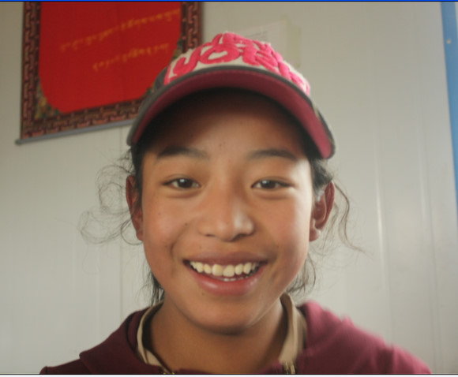](71302cf3-dfa2-4100-aa17-e7b926b9aeba.jpg)

### 

越看越觉得我好像在哪里见过这个女孩，明亮的眸子，卷卷的长头发，还有美丽的笑容。最后一天，和她照了合影，她下午请了假不上学，但知道我们第二天要走了，却迟迟不回家，问了好几次： “老师，你什么时候还回来？你还会回来么？你回来的话，还给我讲英语吧。” 

### 

[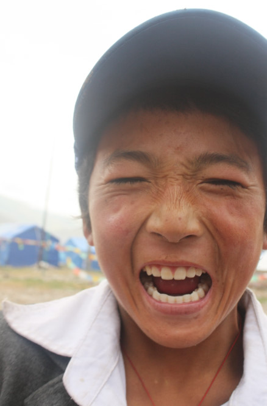](1b6bcd75-80d0-4e9e-aa3c-e4aa5074e0a3.jpg)

### 

我们的小歌唱家才仁囊佳，唱歌唱的老牛了，和上篇提到过的桑巴丹增是差不多大的，唱歌都特别棒！他特别努力学习，第二节英语课我讲的是简单的句子，他有点跟不上，着急啊，用藏语在英语旁边标注音节，一遍遍的问我发音，当他终于把一句话读出来并得到我的认可后，紧锁的眉头终于解开了，他笑了。 

### 

[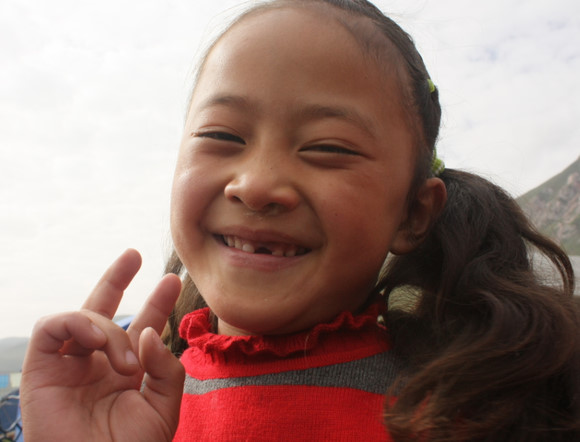](16612410-f72d-4f94-ba7d-c931ac64bbe4.jpg)

### 

这个小妞是和弟弟一起上学的，别看这么可爱，其实有点调皮，上课老是和旁边的同学说话，你一说她，她就用无辜的大眼睛望着你，望着啊。小家伙汉语和英语底子都不错，好几个单词我还没教她就会了，大声的读出来，还读的很标准，要是再乖点，绝对有班长的潜质。 

### 

[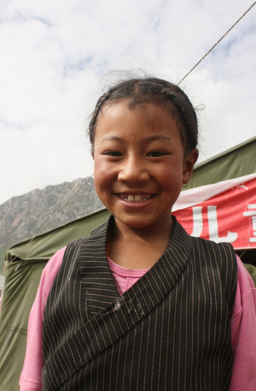](70cd8aea-bc1c-4e19-b0b6-6ab7206d1e50.jpg)

### 

很少有孩子穿传统的藏袍上学，她是个例外，坐在教师的第一排，总爱突然站起来举报上课说话的同学，呵呵，特别热心，还老是主动举手回答问题，想不起来的时候，大眼睛就转呀转的，一副机灵的样子，让人有种特别的亲切感和好感。 

### 

[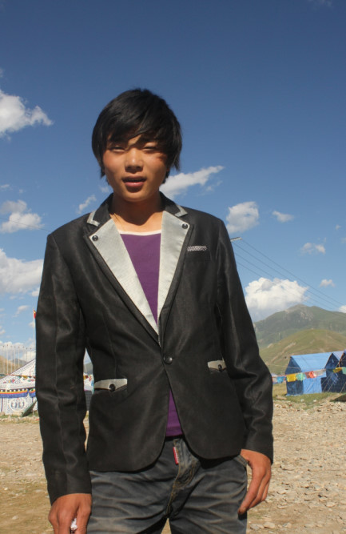](cca68de1-834c-45ab-bc02-5137197f5624.jpg)

### 

我们开玩笑说他长的像个女孩子，呵呵，可有范儿了，老是拿着一个类似于微型音响的设备放歌，有好几首歌都好听，旋律就烙在我心上了，打听完歌名，特意在西宁买了盘收藏。 记得有天买菜做饭，已经是晚上8点多了，天很黑，帐篷里的灯光又比较暗，桑措和另一个住在学校的男孩进到帐篷里帮忙，帮我照着手电，倒油，刷锅，盛饭。好几次被在端锅的时候烫到手，然后赶紧摸耳朵，在炒西红柿鸡蛋的时候，他不自觉地在旁边发出感叹，因为真的很香，哈哈！孩子们中午饭是由学校来负责，但花样可没自己家做饭那么多，土豆、粉条、圆白菜居多，主食一般是米饭，吃腻了的时候，就着榨菜和辣椒酱往嘴里送，香！ 

### 

[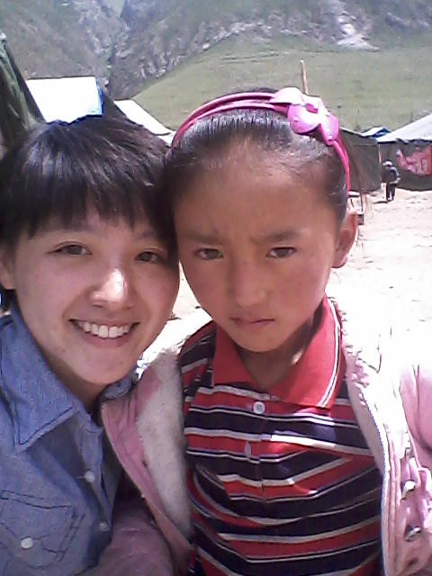](f7f25489-e736-4b0d-80d2-7bb0d861f127.jpg)

### 

美丽的卓玛，一个很文静的女孩子，安静，害羞，聪慧。一双大眼睛会说话，有那么些深沉和忧郁的美。我们的交谈不多，更多的时候是她握着我的手，看着我和别的孩子说话，她会摸摸我的脸，很亲昵，很想念她…… 

### 

[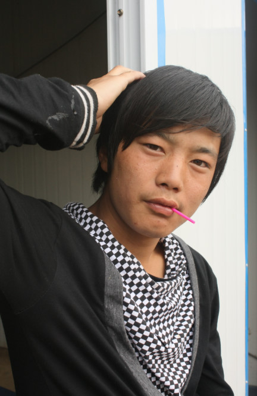](a4177411-448a-4315-9c56-fb1ad1c5e309.jpg)

### 

最最最酷的一个，时常你会看到他一个人，带着一副耳机，就那么靠在窗边，目光没有聚点，阳光再一打下来，哇，完全啊，我完全被打败了…… 

### 

[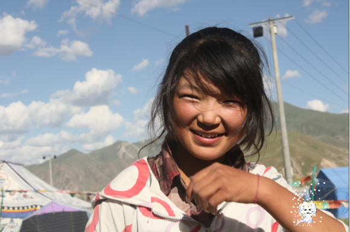](669f5cc0-4014-45ae-952b-45702db7c374.jpg)

### 

很可爱的索朗康珠，班上爱学习的孩子之一，学的快，用的也快，还会时常向我请教问题，最爱她圆圆的笑脸和害羞的笑。 

### 

[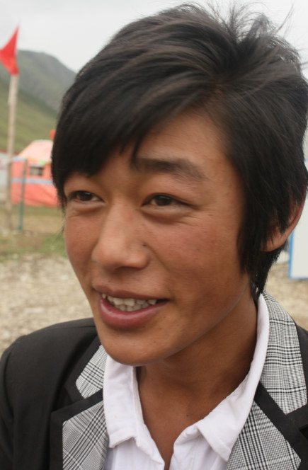](a15bc46f-9c64-4464-892a-12dc849f395b.jpg)

### 

很有镜头感的帅锅，时常喜欢带着一顶小礼帽，跟我的话不多，每次只是笑呵呵的打招呼。做饭的那天，他也来帮我，不声不响地帮我。最珍贵的照片我竟然没有拷贝过来，在家长会的那天，他偶然对着镜头看的那一刻被我定格，那纯净的眼神和明媚的笑容让我至今铭记…… 

### 

[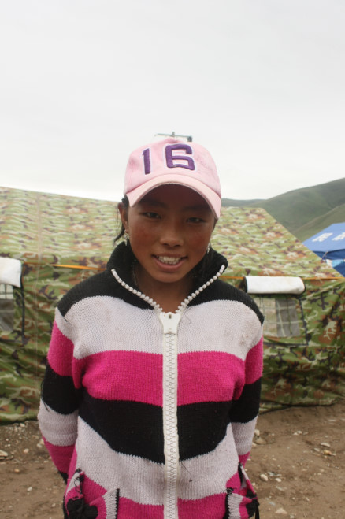](8e66b0bc-568f-4661-906a-f4d477008c78.jpg)

### 

代永宗吉，我记得她坐在前排。在我们离开的前一天，午饭后，我在河边洗碗，遇到她和其他2个女孩，我们都往碗里放沙子，因为碗挺油的，用沙子才能把油洗干净，这个方法是和孩子们学来的。 我刷完了，要起身离开，她们问我：“老师你什么时候回来？” 我笑着说：“我希望我能尽快回来。” 她们说：“老师，我们希望你能回来，我们都特别欢迎你回来！” 我能说什么，我不敢承诺，因为我知道一个承诺对她们来说多么重要，我不想食言。 学校不仅教给孩子们知识，还开展技术班，教授传统手工艺，比如面具制作、唐卡绘画、铅丝手工，学校有个计划就是把孩子们的作品卖出去，得来的利润的一部分给孩子们用于他们的生活补贴。我觉得这是很可行的一个计划。下面的这幅铅丝画就是我在孩子们的课堂上和他们一起做的，他们有的做的远比这个精致、复杂，我画的这个是最简单的六字真言图： 

### 

[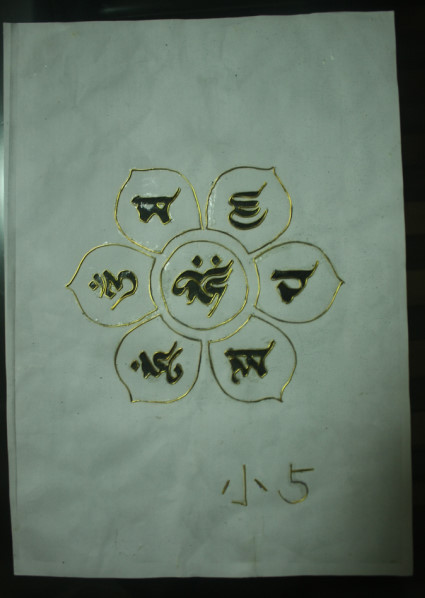](f9bbe017-7f03-4396-8af6-4376d914a566.jpg)

### 

下面的这个是学生的唐卡作品，惊艳： 

### 

[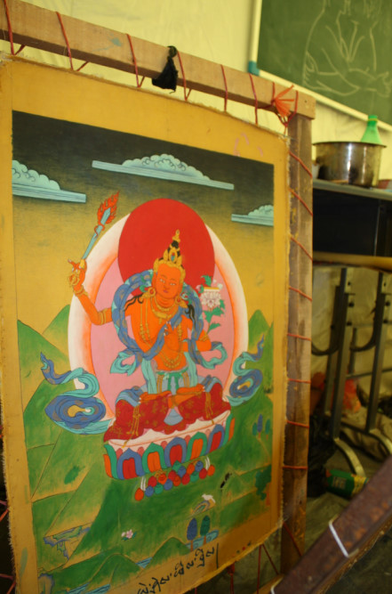](ce5fce5c-e357-40b6-8d09-6dee9ee8c17f.jpg)

### 

这是个机会，也是个可以长远发展的项目，需要实干。 未完，待续。
