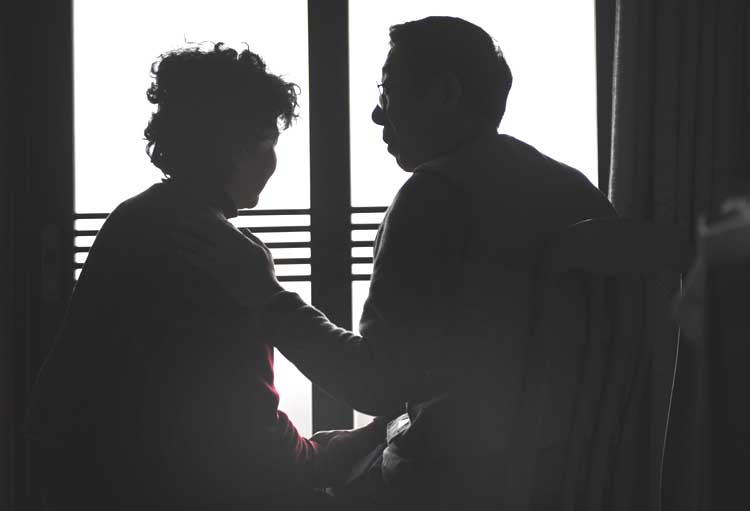
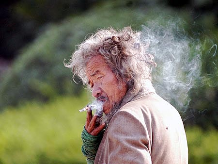

# 腾华里考察报告

**“科技大学还是一个巨大的噪音源。且不说国防生每天早晨的干吼会惊起熟睡中的婴儿。他们为了一次十分钟的阅兵出场可以辛苦训练一个月磨破四五双鞋，也肯为一个节目挥舞着红旗猎猎作响，却不想去一墙之隔的贫民窟外为白发苍苍的老人收拾一下楼底碎裂的蜂窝煤。”**

# 

# 腾华里考察报告

## 文/宁（天津科大 ）

 凡是有着幸福的地方，那儿早就有人在守卫： 或许是开明的贤者，或许是暴虐的君王。 如果写小说，要考虑的因素很多。时间地点人物，还要有一个能催人泪下的故事。往往该看的人不会流泪，别人读了也一头雾水。所以有人写杂文或者散文，可以骗自己说这是写给自己看的，或者别人并不理解自己——别人对自己根本就不算什么——喜欢不喜欢无所谓。所以有人高不成低不就地写很多戏谑的东西，有人为了脑海中的一句小聪明的话就写一整篇文章。我写文章则是为了喜欢的人。卡夫卡在《骑桶人》中苦苦乞求自己的主人借他几块煤，否则就要冻死。主人拒绝后一气之下大骂，之后骑桶飞升而去。我现在也在苦苦乞求我喜欢的人能施舍我一份情爱，能够使我不至于干渴而死。毕竟我既不愤怒也不会飞升。 每当提笔时候总痛苦不堪。我的小区非常破败。你无论如何也不会想到一所大学旁的生活竟然如此贫穷。就像我之前无论如何也不会想到北京火车站旁的人居然在垃圾堆的海洋苦苦挣扎。当时铁路上飞驰的动车组与旁边平房的一堆堆垃圾，以及在垃圾山旁边背着婴儿洗衣服的妇女形成了我对北京的印象。后来我就想，会不会每个大学旁都有一个贫民窟？会不会每个大城市的光鲜背后总会有生活在底层的人在为一口饭而出卖自己的生命？甚至连一个出卖生命的地方都找不到？他们永远被遮挡在高楼下，生活在阴影中，在朗朗的读书声里，将洗完尿布的水泼在马路边下水道。 我住的地方叫腾华里。这里有一半以上的居民是六十岁以上的老人，70%的居民是外地人，一半以上的居民住二十年以上的楼房，剩下的就住在楼房下面存放自行车的小仓库。平房非常低矮，大概两米高。老人每天都无所事事地坐在外面晒太阳。牌局和棋局更是每天都有。 这里人受科大的影响不仅仅在于科大挡住了他们出去的路。每天晚上一墙之隔的科大小花园里都会聚集大量的情侣。他们三三两两躲在墙角野合，亲吻爱抚轻咬耳垂抚摸下体呻吟等等等等的声音很小，至少他们自己认为很小。他们却不会注意到离他们五米高的三层楼上，正有一个红色的烟点，火光一亮一灭，就好像摩天大楼上的红色信号灯，在漆黑的深夜闪亮着属于他自己的寂寞。然而远远不止这些。科技大学还是一个巨大的噪音源。且不说国防生每天早晨的干吼会惊起熟睡中的婴儿。他们为了一次十分钟的阅兵出场可以辛苦训练一个月磨破四五双鞋，也肯为一个节目挥舞着红旗猎猎作响，却不想去一墙之隔的贫民窟外为白发苍苍的老人收拾一下楼底碎裂的蜂窝煤。 然而远远不止这些。科技大学每天早晨还会播放音乐，从中国国歌一直到德国的班德瑞，总是不合时宜。我在小学六年级第一次买的正版磁带，就是班德瑞的《仙境》，那时的我怎么也不会想到，十年后的今天，在肮脏的科技大学旁边的小区听到这声音。这是死亡的气息，尤其当早晨六点钟被吵醒的时候，睁开眼外面还只有一团雾气。闭上眼想继续睡，那感觉就像是在一片无边无尽的精液的海洋中游泳。我根本不会游泳，因此浓浓的白色的精液不停地灌入鼻子和耳朵，有新鲜大枣的香气。我也不断下沉。但最终再次睡去。因为腾华里的大爷大妈们出动了。他们互相打招呼的声音让我安心。我还活在这个世界上而不是精液的海洋。 前面我说过，大多数的人都是外地人。湖南人，河南人，新疆人，山东人，河北人，所有人的口音都不再纯正，因为在这里挣扎的时候全都渐渐忘了自己是什么人。大妈跟我说，她是山东梁山人。我问梁山是哪个市的，她遗憾地摇头，已经不记得了。自从十九岁那年她跟随自己的男人嫁到天津，到现在已经不知道多少年头，只知道第二年天津才解放。她现在唯一干的事情就是坐在扔在马路边的破沙发上，摇着扇子，在我早晨上班的时候跟我说出去啦。然后在我下班的时候说回来啦。她说当她儿子结婚的时候这里的楼刚刚建好，平房改造在当时还是一件大事，即使是裸露着红砖的三层楼房。现在她孙子20多岁，也到了谈婚论嫁的年龄。 离她不远的地方就是一排平房，不知道从哪捡来的破门，围墙就是一圈铁丝网。铁丝网里放一辆自行车，旁边是鸡笼，三五只鸡在里面踱来踱去。也有高雅一点的，养鸭子。鸭子臭味浓重，尤其下过大雨之后，砖砌的粗陋的鸭舍就不停往外淌着臭水。这也就是我非常不喜欢吃鸭子的原因之一。在这臭气中奔跑的，是一个新疆孩子。除了大眼睛高鼻梁之外，与我在家乡见到的孩子无异：黒中透红的脸蛋，是长期在太阳下玩耍的标志，胳膊和腿都很瘦，脏乎乎的T恤，扣子已经掉光了，卷曲的头发上沾着一些白色的粉末。粉红色的拖鞋。拖鞋还是去年迪斯尼流行的那种上面都是洞洞的。只不过脏的快看不出原本的颜色。他是腾华里生活的标志。 他手里拿着一个破皮球，低着头一边拍一边在狗屎遍地的小巷中前进。他走向一个小伙伴，然而那男孩正在挨训。大概是刚把一只甜瓜摔到地上了，甜瓜籽撒了一地。他父亲用粗陋的方言骂着，我听不懂是什么，但是声音非常大，整个腾华里都能听见。新疆孩子于是低头走开。这时他母亲出来了，说话的意思基本上是她出去买点面粉，他在家把鸡喂了。每天早晨都会有人骑着三轮车拐进小巷，车斗里装的都是烂菜叶子，有人买了喂鸡喂鸭，有人则自己吃。男孩子听话地站在屋前拍皮球。我走过去问平时都吃什么。他说吃面条。我问还有什么，他说，菜和鸡蛋。新疆人的主食就是面条吧。这点跟山东人很像吧。我在平度老家吃了二十年的面条作为早餐，上初中的时候我就在疑问究竟什么原因让每天的面条都吃不腻。最后只是想到了我的母亲。新疆小孩子的家基本上一塌糊涂。连门都合不上缝。铁丝网大门上是一把链子锁。我往小屋里看，漆黑一片。 这就是天津一个普通家庭的写照。我并不是要丑化天津。天津的夜晚非常迷人，我总是沉醉其中不能自拔，但现在是大白天，地点是在科技大学高墙外的腾华里。这不禁让我想起我曾经的小朋友小同学现在在新疆过的舒适的日子。实际上只要有钱，无论在任何地方都能过上好日子。我见到有人开着豪华的车子去打网球。但不是在这里。这里似乎所有的人都在为钱而挣扎，挣扎在生命的边缘。 

 在这里，幸福被一位暴君牢牢守卫，叫做金钱。另一位暴君叫炎热。天津的夏日又热又闷，极其难熬。这里住的老人，最热的那几天隔三差五出殡，有的悲悲戚戚，有的却是喜葬。我大爷爷就是喜葬，但我没参加。这一次我在马路上看见一群吹鼓手吹吹打打，还有一个人高高兴兴用手甩一挂鞭炮。开始以为是婚礼，到了队伍最后却见一口棺材。那种高温老人当然忍受不了，我都要睡前洗两次澡，然后拿小风扇把身上都吹凉了才行。好在现在入秋了，死人大潮过去了，大爷大妈们又出现了，就像雨后的蚯蚓。聚在一起在树荫下摇起了扇子，从我上班到下班。笑眯眯地跟我打招呼时，我总在想，如果每天都这样聊天，什么时候话题才会用完？ 腾华里的牌局以及棋局从来没有停止。每天晚上我也会站在昏暗的灯光下，与二十多位大爷一起看擂主与挑战者的对战。在这里住下的往往都是挣扎后失败的外地人，只有在晚上，在棋盘边，他们才能成为一位王者，谈笑风生，指点江山，忘掉生活中的艰辛，忘掉他们向市中心进发的豪情壮志。 他们守护住了腾华里的安全。但其实我的屋子不用守护。光是长达三百米的阴仄的小巷就够贼受的了。那巷子只有一米宽，到处都长满了青苔，一到下雨地上滑的要命，旁边的排水管直接把水引到了半空中，成为一条小型瀑布。狗屎多的不可计数，步伐必须轻盈才好。小巷里还停着不少自行车，就在一米五的低矮屋檐下。空中还有挂着晾晒的衣服，裤子什么的往往从我头顶掠过。谁都想不到华丽的科技大学旁边居然是这个样子。再加我在阳台上晾衣服时候水都能滴进科大院墙。 我在高处观察着小花园中的情侣，男的搂住女孩，掏出了她的奶子，轻轻噬咬，女的也把手伸进了男的裤裆，反复揉捏……祖冲之爷爷的大头雕像就在不远处背对着他们，给他们把风。交通大学里立着詹天佑的雕像，那是因为詹天佑在活着的时候曾经在交通大学干过。现在就成了他们的镇校之宝。但我想不明白科技大学里面摆一个吓人的祖冲之人头有何目的。祖冲之难道也是科大校友？或者之前也曾在科技大学的杨树下漫步思考？或许是名誉教授？如果成立，科大在世界历史上都会有一席之地。 小小的珊瑚虫在忙碌地盖房子。他们为了一座宏伟的建筑，不停地交流。人听不懂这种交流。但是人在大烧瓶外观察这珊瑚虫的工程，而珊瑚虫则认为他们生活在一个伟大的宇宙中，这个宇宙什么都很有秩序，精密得吓人。他们当中的科学家会做出正确的判断，就是说这个宇宙在四周以及底部都是有限的，只有宇宙上方是无穷无尽的空间。我们在烧瓶外观察了一周，烧瓶中的珊瑚虫生老病死，战争疾病，朝代更迭，延续了十代之久。他们丝毫不觉。因此我也坚信会有一个或者一群观察者在宇宙外面观察我们。或许我们都不是观察对象。他们的观察对象是整个宇宙热力温度的变化，地球是爆炸中产生的一粒微尘，一个误差。 凡是有着幸福的地方，那儿早就有人在守卫： 或许是开明的贤者，或许是暴虐的君王。
