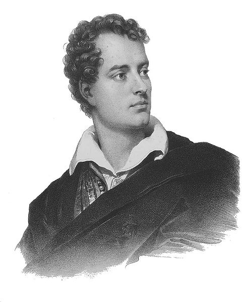
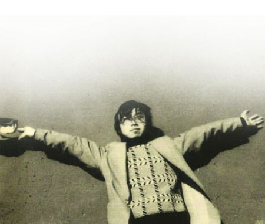

# 诗人之死：谁也无法阻挡死亡对我的诱惑

**我们都觉得，死在自然的怀抱里，月亮也好，绑着石头沉到水底也罢，与天地万物一体，是诗人最佳的归宿，但浪漫只是旁观者一厢情愿的残忍看法，至于当事人，要么是无奈，要么是偶然，绝不会认为，死本身是什么好事。**

# 诗人之死：谁也无法阻挡死亡对我的诱惑

## 文 / 张亮 （北京大学）

 有一天我看到一个朋友讲起诗人海子的诗，说他五次恋爱都因为清贫被女朋友甩了，于是看透了现世的污浊，抱着《圣经》升上了天堂。 这当然是很形而下很简单的解释。其实，对海子死亡原因的解释，可谓汗牛充栋，朱大可在《先知之门》中认为，海子的死“意味着海子从诗歌艺术向行动艺术的急速飞跃。经过精心的天才策划，他在自杀中完成了其最纯粹的生命言说和最后的伟大诗篇，或者说，完成了他的死亡歌谣和死亡绝唱。” 这种非正常的死亡歌谣或者死亡绝唱，要放到中国古代，确实是不可思议。 中国古代诗人中，也有过多种“非正常死亡”。在这所有的死亡里，最轰轰烈烈，无疑是两人。一是李白，一是屈原。李白六十岁时，喝醉了酒，以为天上的月亮在长江里洗澡，就乘着酒兴扑到水里去捉。这样的死真浪漫。中国古代文人最高的生活理想，总该归为天人合一，所以李白为了月亮和长江融为一体，屈原为了想念楚怀王和汨罗江融为一体，千百年来，这种死，虽然总有些遗憾，但却让人感觉很美，我们都觉得，死在自然的怀抱里，月亮也好，绑着石头沉到水底也罢，与天地万物一体，是诗人最佳的归宿，但浪漫只是旁观者一厢情愿的残忍看法，至于当事人，要么是无奈，要么是偶然，绝不会认为，死本身是什么好事。 但是在西方，我们就少有看到这种情绪，为了爱情而死，政治而亡，反倒像是一个传统，谁也无法阻挡这两者散发的死亡诱惑。那个写出《少年维特之烦恼》的歌德，教唆了广大怀春文学青年纷纷殉情自杀，却顾盼自如，成为一代文豪。普希金把恋爱抒情诗发挥到登峰造极，并且与老婆的奸夫决斗。决斗时，对方先开枪，他受了致命的重伤。抬回家后，他在痛苦中安慰妻子：“你放心，你没有任何过错！”当剧痛难忍时，他就让她走开，不愿让她看着自己受伤痛折磨的样子，嘴里不断地说：“我可怜的妻子！”。恰似杜拉斯所说：“爱情于我，不是肌肤之亲，不是一饭一蔬，它是一种不死的欲望，是疲惫生活里的英雄梦想。”为所爱之人战死，在诗人们那里，正是殉道者的英雄梦想。 在爱情之外，还有政治的殉道。 那个跛了脚的英国爵士拜伦，为了八竿子打不着的国际友谊，千里迢迢赶到希腊，高唱“起来，希腊的儿男！”，鼓动全希腊年轻人找寻古希腊的荣光。在希腊期间，他自知不起，临终高呼：“不幸的人们！不幸的希腊！为了她，我付出了我的时间，我的财产，我的健康，现在，又加上我的性命。此外，我还能做什么呢？”夜间，他在昏迷中呓语：“前进——前进——要勇敢！”希腊的独立政府宣布拜伦之死为国葬，全国哀悼三天。举行殡礼时，希腊士兵列队肃立街头，一队牧师跟着灵柩高唱赞歌。灵柩上置宝剑一柄，盔甲一套，桂冠一顶。诗人生前的坐骑也跟在其后。 

 与屈原忍辱含垢投江的屈辱心态不同，拜伦之死，是他英雄梦想的顶点，是一个烈士最壮美的墓志铭。 无论为了女人，或者为了政治，诗人之死无不彰显英勇与壮烈，其实是有中世纪“游吟诗人”的传统作祟。欧洲封建时代，贵族的城堡被广袤的农田和森林所包围，时间久了不好玩，就想游历四方。游历四方的动力在哪里？饱暖思淫欲，面包不愁，牛奶不愁，女人总是该换换胃口。于是就有情诗，有了为贵妇人的决斗，有了游吟诗人，这便是近代浪漫主义的鼻祖。在高贵美丽的贵妇人面前，每一个披上祖传铠甲，骑上宝马手持长矛，口诵情诗的贵族骑士都是折翼的天使，这些天使中最著名的就是唐吉可德爵士，他一辈子最大的幸福和光荣，就是为了妓女杜尔西内亚勇斗风车，不惜一死。但是换到中国，如果李白或者屈原为了抢一个女人而死，大家都会觉得他窝囊，没有出息，更不会有什么美感。这也是我们不同的传统所致。中国古代的大家闺秀都是门当户对，平时绝对不在公共场合抛头露面，文人轻浮的对象，大半都是青楼女子，出身低贱。文人写诗，也不过是道德文章之余的副产品，从来都是小道，不登大雅之堂，最多私底下写几笔淫词浪语，才子佳人小说调剂，爱情不是上流社会的必需品。除了柳永这样被上流社会鄙弃的风流浪子，正统的诗人们大都“爱惜羽毛”，为爱情而死？简直是天方夜谭。 因此，早先的中国诗人总是节制的，写你喜欢一个女孩子，最露骨的不过是“窈窕淑女，君子好逑”。写饥渴而找不到女人，最多不过是“出其东门，有女如云。虽则如云，匪我思存。”意思是，出了东门好多美女啊，但是这么多美女啊，却找不到我一个喜欢的。他都不直接说自己想找女人，而是说自己没一个喜欢的，这就叫“发乎情，止乎礼”。诗人自己的生活和诗歌的世界本身是分开的。除开中国人，世界人民都没有这种顾虑，印度文豪泰戈尔的散文诗其实也沾染了这种“直抒胸臆”，“我握住你的双手，我的心投进你眼睛的幽暗里寻找你，你总是躲在言语和沉默的背后回避我”这种冶艳嚣张的句子，在他《情人的礼物》里俯拾即是。 当然，新文化运动以来，情势发生了变化。苏曼殊、徐志摩、戴望舒等老一辈情诗圣手已驾鹤西去，八十年代以来朦胧诗异军突起，顾城在几个女人中间周旋，为了情人砍死老婆然后自杀，骆一禾长年生活在疯人院里，据说也跟政治有关，北岛漂流海外，也是为了和这个“不自由”的国度保持距离，只有舒婷老老实实做了一个家庭妇女。而海子抱着《圣经》的殉道，似乎给新一代中国诗人的“殉道”精神画上了一个句号或者破折号。恰似他的一首小诗：“我被带到身体之外，菊花之外，我是世界上第一头母牛（死的皇后），我觉得自己很美，我仍在沉睡。（海子：《死亡之诗》之三）”死亡，因为物质和精神对抗带来的死亡诱惑，因为女友抛弃带来的绝望情绪，在海子的诗歌里是美的。于是，这个黑夜的儿子，沉寂于冬天，倾心死亡的儿子，终于选择了殉道，一种牵缠反复，纠结了爱情与政治、神性的多重殉道，当飞驰而来的火车终于夺走了他的生命，他终于“道成肉身”，和西方基督教传统里无数的殉道者们，和浪漫主义传统里无数的殉道者们，合为一体。 于是，世界之美终于在对面向死亡的路途中次第展现，于是，英雄梦想终于在一群西化的中国诗人中间成为绝响。在这场惊世骇俗的决战之后，诗人的命运不可避免的去魅，最终归向猥琐一途。余华在一篇名为《战栗》的小说里，写到过一个八十年代新诗人的命运。多年以后，当八十年代已经过去，商品大潮洪波涌起，这个曾经辉煌的诗人发现邮箱里一封久未拆封的信，那是一封来自十八年前女粉丝的来信。诗人从不记得有这么一个人，那正是他鼎盛的年代，人人都爱着他，他有无数的女粉丝成为他的炮友，那时，他不会注意到这封信的主人曾经被她调戏，请他到她的别墅中去，和她做爱，但今天，他突然发现，自己久已枯萎的生活，竟被十八年前那一封迟来的信扰乱，于是他按照信的线索找到了她，他们在那间老别墅的老床上完成了迟到十八年的做爱，那时，诗人听到老床吱呀的声音，感到一股强大的战栗感通遍全身——他不再是那个英雄，他已经失去了创作的激情，他只不过是在不断重温一个永已故去时代自慰的猥琐男。 

 当那个老去的诗人在床上战栗时，海子是幸运的，尽管他被女人们抛弃，尽管他生活清贫，尽管他的身体被拼命的创作所累，他没有感受到这种战栗，他死在诗歌黄金时代谢幕之前，死在自己才华鼎盛之时，他接续了游吟诗人和宗教圣者的传统，尽管这个传统在我们伟大祖国显得如此先天不足，成分可疑，他像那个单枪匹马冲进敌营的赵子龙，他终于找到了他所要寻找的阿斗——在最辉煌的时刻死去，做一个精神的殉道者。 多年以后的今天，当我们已经习惯在未名湖畔高声朗诵海子的诗句，习惯大声表达对一个已逝之人的敬意或者惋惜，我们是否也能感受到海子的幸运和我们的不幸？除了做一个战栗中的猥琐男，我们还有多少值得献身的东西，诗人之死，竟然也是一曲充满了悲伤的欢歌，让我们不忍正视。 

（采编：项栋梁 责编：项栋梁）
