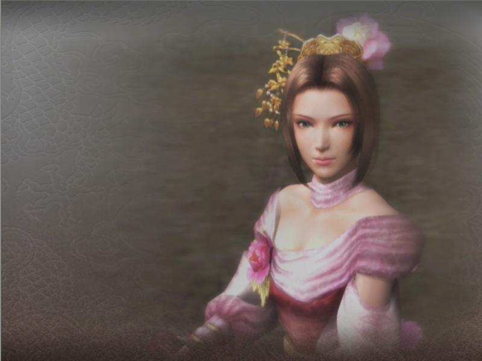
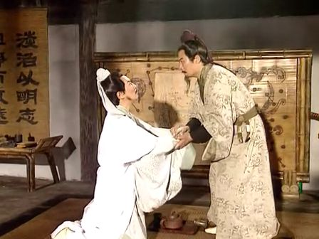
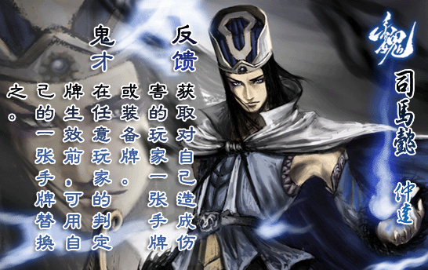
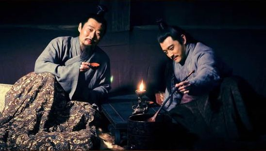
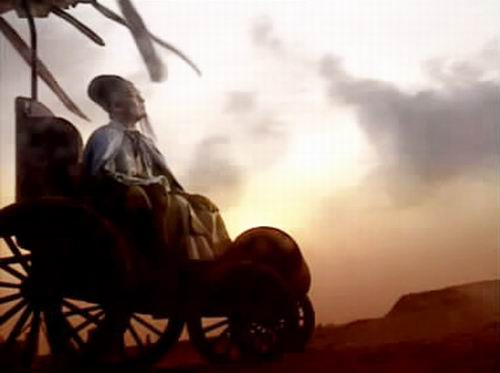

# 远去的演义：青山依旧在，几度夕阳红

**“后来也想，其实完全可以把演义和传说看做历史不可或缺的一部分，就如同地上的影子一样。影子比起实体的确存在着扭曲和变形，但它们却必然相伴相生。原来许久以来，我一直在跟影子较真。** **还是放宽心的好。演义逐渐远去，但影子婀娜变化，生出万千思绪。”**

# 远去的演义：青山依旧在，几度夕阳红

## 文 / 邱靖（厦门大学）

 少读三国时，不知道有多少人有过这样的感觉，孔明一死，后头的章节就再也没心思看下去了？而五虎大将每一人离世，心都会抽搐一次。演义的魔力就在于此。不知觉中，神智和心绪已被其诱控，甚至连价值观也无形中被其渗透。 

 后来长大了，逐渐也就有了许多的“不相信”。比方说，我不相信鲁肃是个老好人，不相信刘备是个只会哭的枭雄。而那个儿时曾经在心中奉若神明的诸葛亮，也不再那么光辉。夜观天象之类的鬼话固然不会信，而那种让部将像机器人一样照锦囊行事在我看来也十分扯淡。关于草船借箭，我现在会想，如果曹军射出的是火箭，草船又当如何？关于空城计，哨探一试便知，何至于仓皇撤军？至于温酒斩华雄、千里走单骑、单刀赴会、华容道，都是作者杜撰的情节。 其实我没有任何理由责怪什么，因为人家明明白白就叫做“演义”；既谓之演义，自然有编的成分。只是少时只在意三国，却稀里糊涂地把它当正史去在乎。现在通行的《三国演义》，是毛宗岗修过的，至于这和罗贯中的原著相比变化多大就不得而知了。只是有一点可以确信，毛宗岗成功地将他所期盼大众吸收的人物形象乃至意识形态推销到了九州千家万户。 曾有一段时间，我的确像当代官方给《三国演义》作的序里所说的那样，把此书看做一个地主阶级为了维护其阶级统治而对历史进行任意摆弄的范本。曾经被我视为启蒙的名著，长大了再读，可能会坏了脑子。此种前后反差，不可谓不大。 近来，三国重新进入我的视线，因为三国杀和新《三国》连续剧。 我毫不吝惜我对三国杀这种桌游的赞叹，我的确认为它是当代最伟大的发明之一，它的诞生是国人之幸。 

 三国杀中的武将技能，深深地打上了历史的烙印，也深刻地反映了人物性格，如张飞之【咆哮】、赵云之【龙胆】、吕布之【无双】。而各种典故也在武将技能中得到反映，如周瑜之【反间】、貂蝉之【离间】、诸葛之【空城】、许褚之【裸衣】、黄盖之【苦肉】。马超的【铁骑】应与他在潼关之战中逼得曹操割须弃袍有关，夏侯惇的【刚烈】应与他中箭失明扑杀敌将有关。 有的武将技能的设计远比它表面看来的要耐人寻味。如孙尚香的两个技能，【结姻】极好理解，意指孙刘联姻；而【枭姬】一项则大有道理，当刘备洞房花烛之夜，见到新娘子的侍女们都持凶器而立，才晓得他的夫人如此的与众不同，而“失去一张装备牌则可摸两张牌”暗喻着孙尚香因祸得福、有得有失、难以言说的一生。每想到此节，都不由得击掌大赞，这发明三国杀的人当真绝了。 人物间的相生相克更有意思。熟悉三国杀的牌友都晓得，刘备单挑是菜鸟，却惟独能降伏诸葛亮，以【仁德】破坏【空城】；周瑜和诸葛亮互相克制，两雄不能并立；张辽【突袭】手牌，最克吴将，威震逍遥津；颜良文丑【双雄】再勇，也抵不过红牌皆杀的【武圣】关羽；诸葛亮【观星】的精心布局，往往被司马懿【鬼才】一搅局就功亏一篑，仿佛上方谷那场倾盆大雨。 最令我感慨的还是荀彧。荀彧的两个技能【驱虎】和【节命】，正反映了发明者对这个人物了解到了骨子里。荀彧有王佐之才，常常借力打力，辅佐曹操平定北方群雄，驱虎吞狼是他惯用的手法。而【节命】（每受一点伤害可令一名角色补满手牌）正是荀彧强大而又可悲的地方。有牌友感慨，荀彧就是个忠臣命，既不适合做反贼也不适合做内奸，历史上如此，三国杀中也如此。因为【节命】补牌，给主公最多可补五张，给其他人则补不了这么多；而如果同伙都满手牌，荀彧就无法【节命】了。某种程度上，荀彧对于他人来说也如同夜壶，没牌的时候人家才想起他；而荀彧忙碌一生，心属汉室，到头来却辅佐了一个奸雄，苦恨年年压金线，为他人作嫁衣裳。而不论如何也难以否认的是，三国杀中，和荀彧最配的主公绝对是刘备，是否也暗喻着荀彧身在魏营心在汉的悲哀？ 三国杀和新《三国》连续剧，两股风潮让我的2010年多了许多情趣。而老话题衍生出新样式，正如同陈年好酒，越发醇香。 四大名著若都翻拍连续剧，三国或许是最难拍砸的，因为三国是明白地呈现博弈，不比其他三部暗流涌动。而新《三国》还是给了我许多惊喜，因为它所呈现的是能自圆其说的逻辑，将许多空白的环节填充上了解释，那种近乎指鹿为马的诸葛式智慧淡去了神明的光环。纵然字幕和台词中不乏别字，剧情中也存在着诸如关羽自刎这样大幅的改动，但是新《三国》演绎出了风格，它就是成功的。那个酷像葛优的鲁肃，那副淡定从容的神态、大巧若拙的谈吐、冷静谦逊的风度令人钦服，这才是高瞻远瞩能撑起东吴半边天的鲁子敬，不是那等愚夫蠢货；而张博把孙权演绎得十分出彩，大度与猜忌同生、豪气与隐忍相成、兼听与独断并存，正应了赵咨对他的评价——“聪明、仁智、雄略之主”。 

 剧中屡屡涌现的阴谋论，诸如孙权治死了吕蒙、曹丕谋害了曹冲，看似夸张，其实或许还真的发生过。剧中频频出现的诛心之语，最能刺透人心，大实话从陶谦、陈宫、刘表这些人嘴里说出来，原著里那些不合人情的YY细节就显得不值一哂了。我更相信、更欣赏、也更喜欢新《三国》里的刘备，他和其他豪杰一样地渴望地盘、渴望实力、渴望成功，但他有自己坚钢不可夺志的信念，泰山压顶不变色，穷途末路也不放弃心中的原则。 对于历史，尚且可以有见仁见智的百家之言，何况于演义？演义中的人物也罢，荧屏上的人物也罢，都可能与历史上的真相相去甚远。然而对这种差别较真已然没有多大意义，因为无法复原的终究无法复原。而复原本身的意义也不可能超过演义本身的意义。关羽的脸未必是红的，张飞的脸未必是黑的，而我们的记忆里留存着许多或许和历史原型相去甚远的“脸谱”们，而这些“脸谱”们却深刻地影响着每一个人的性格、思考、行为乃至选择。三国已不只是一段历史，三国也不只是一部小说；三国，已经成为了一种习惯，至少是国人茶余饭后最热门的谈资之一。家喻户晓、妇孺皆知，三国已经是渗透到炎汉后裔骨子里头的习惯。 《三国演义》赞扬的是忠诚和信义，维护的是道统和纲常，否定的是残暴和混乱，反对的是奸诈和野心。细想来，这样鲜明的价值观主张倒也不错。 后来也想，其实完全可以把演义和传说看做历史不可或缺的一部分，就如同地上的影子一样。影子比起实体的确存在着扭曲和变形，但它们却必然相伴相生。原来许久以来，我一直在跟影子较真。 还是放宽心的好。演义逐渐远去，但影子婀娜变化，生出万千思绪。 曾记得那一年在岐山，从五丈原的武侯祠下来，渡过渭河往蔡家坡，看着浊水东流，而诸葛亮竭尽一生都没能渡过这条河。 曾记得那一年在当阳，长坂坡成了一个车水马龙的三岔路口，城外关陵四周，油菜花漫野无垠，关羽的身躯埋在花海之下，脑袋却在千里之外的洛阳。 还是杨慎的那首《临江仙》好：青山依旧在，几度夕阳红。 

 转自：【南墙】七月稿 其一（南墙地址：[http://nanqiang.org/](http://nanqiang.org/)）
