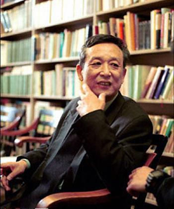
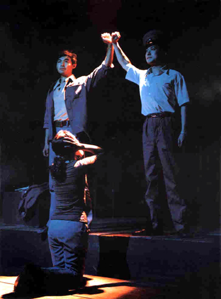
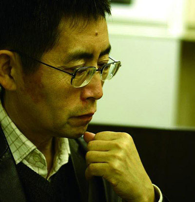
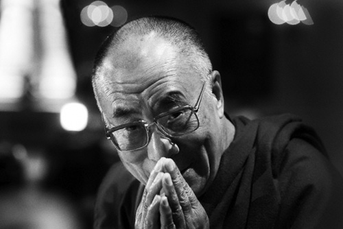

# 那一代流亡者，已经老去

**“那一代的流亡者都老了，或者正在老去。后来人不再知道他们，也就不再可能窥知那所谓的真相。（——而真相不过是更大的谎言，它的编织者是所有人。当事人被迫或者自愿保持沉默后，真相便是我们的猜测。真相之下总有更多的真相，如同谎言总带着一系列谎言。）”**

# 那一代流亡者，已经老去

## 文 / 徐芳园（中国矿业大学）

有些名字，直到成为禁忌，才逐渐为人所知。然而又因着这一层禁忌，它们最终都会湮灭在后人的记忆中。昨天我尝试着在豆瓣发一句话，包含“灵山”二字，后面是这句话：把文学还给文学，让政治滚回自己的地盘去。我甚至发了两遍，不知道是没有发送成功还是很快被删了，总之后来我再去看的时候丝毫踪迹也找不到。这虚拟世界的规则就是如此，可以无中生有，也擅长毁尸灭迹。我也终于了解，这表达，也是禁忌的一种。 

### 

 《灵山》自然看的是电子版，而且不完整，只有一半的样子。电脑里收集了一些相关作品与评论，那个据说已经不是很敏感的名字的主人生于1940，现年已经古稀。距离他获奖到现在，足足十年。昨天（12月9日）除了是一个历史运动纪念日之外还是一个颁奖日，十年的轮回不知是历史的吊诡之处，还是如某些喉舌所称的是“别有用心”？ 

### 

 对于高的兴趣，坦白地说就是因为他的“反动”。是在初中的时候听语文老师说的，中国没有诺贝尔文学奖获得者，其实有一位，但是因为思想与政府不合，不被承认。那时候还很天真，以为反政府的就真的是豺狼虎豹，也没多想为什么诺贝尔文学奖要颁给这么一个反动的人。（如果追求自由被认定为反动，那么我们所处的社会，是多么可怖的反自由集合体？）一星期前我是抱着看批判性抨击性言论的心态去看《灵山》的。没想到书里写的都是南方乡土以及一个作家在其中的游历与寻觅。人称的变化，心灵的追索。语言是美的，可惜电子版诸多纰漏，不得不在漏词漏字和错别字之间苦苦摸索其中的韵律和节奏。 意犹未尽，于是看了一些关于高的生平、采访以及评论。大部分是围绕着他获奖而展开的。关于诺贝尔文学奖，大概有两种看法：一是爱羡不已而不得，一心想出个获奖者，最后有华人得了又如吞了苍蝇般厌弃其“有政治目的”，可以说是酸葡萄心理；二是认为西方对于中国文学的了解不够，诺贝尔文学奖的评选有其话语形态和倾向，水平好过高的中文作家大有人在，高的获奖不过是因为与评委熟悉云云，这也可以用一个词概括，鸡肋心理。当然也有好友衷心祝贺，为其高兴，剩下的是无知者：“他是谁？我都没听说过！” 高的戏剧在大陆上演的时候我尚未出生，后来其作品被查禁，我更是无从得知，要不是这一个国际性的诺贝尔奖，我大概也不会知道有这么一个人存在。他是小说家、戏剧家、翻译家、画家，作品翻译到许多国家，戏剧也在欧洲各国上演——惟独到达不了的地方，是中国大陆，他的祖国。这不得不让人联想起易卜生和乔伊斯两位大师在母国的遭遇：不被了解不被认同，作品只能在外国出版。他们是走得太远太快的人，时人跟不上他们的脚步，所以误解，斥责。后来他们重又成为祖国的骄傲。这样的事会不会同样降临到高身上呢？我想这实在是很难的事情。他已经七十岁了，有生之年大概是回不来了。再后来会怎么样，谁也不敢说。所幸是法国包容了他，对于法国和中国，都是一件幸事。流亡与作品的价值并不成正比（在法国的安定，也抵消了流亡感了吧），重要的是他发出了自己的声音，并且这声音冷静有力，没有对政治的指责。 

### 

 我看《逃亡》的时候便发现，高本人并不热衷政治。他探索的是人的内心和艺术的可能。真正“别有用心”的是动辄以此指责他人的人。很简单的一个奖，竟然会引出如此多的风波，只能说是可笑了。喜欢说别人带有政治目的，为什么不先想想这政治目的到底何在？抹黑你这个国家的形象，与他一个评奖委员会何干？这样的心态，是做贼心虚还是患有被害妄想症？由此想起的，是进入翡翠城的多萝西一行人最后发现翡翠城并非由翡翠造成，而是由进城时戴上的绿色眼镜折射的幻象。 还有一个流亡者，北岛。上高中的时候很喜欢语文书上他那首《回答》：“卑鄙是卑鄙者的通行证，高尚是高尚者的墓志铭”，“我不相信”里体现出来的怀疑态度，是我向往的思维倾向。那时候知道的不多，我喜欢的现代诗人里，海子卧轨，顾城用刀砍死了自己，于是自然而然地把北岛也归入死者一类。后来在书店看到他的近作，才知道他是在国外。不管怎么说，一个诗人还活着并且还在创作，对于读者来说都是莫大的幸运。只是后来写的诗少了，散文、评论和翻译成了主要作品。他在《失败之书》里说他以前写诗，被人看做不正经，后来改行写散文，人家看他才好一点。 

### 

 对于北岛，我同样不了解。是在去年的一个小规模讲座里才知道他流亡的原因，同样的事件。现在他已经老了，香港大学聘他作教授，香港的报纸称他为“离祖国最近的人”。这样的可望而不可即，对于一个老人来说，是何等的哀伤。——这是我的揣度，我并不知道他老人家的思乡之情有多强烈。这一种流亡，是要不时引起某些人物的阵痛的吧。还好，他们都老了，只剩下说话力气了，而话语的扩音器并不掌握在他们手里。流亡在外之后的危害小了，只要不让他们回来就好。 那一代的流亡者都老了，或者正在老去。后来人不再知道他们，也就不再可能窥知那所谓的真相。（——而真相不过是更大的谎言，它的编织者是所有人。当事人被迫或者自愿保持沉默后，真相便是我们的猜测。真相之下总有更多的真相，如同谎言总带着一系列谎言。） 

### 

