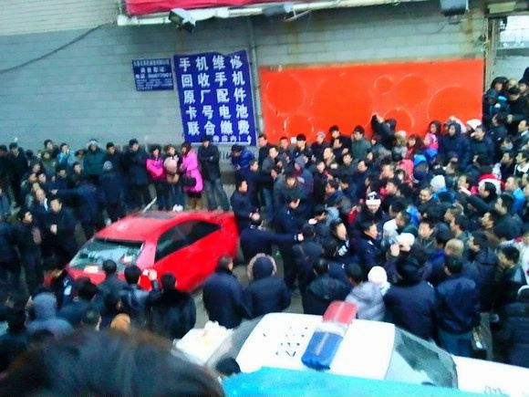
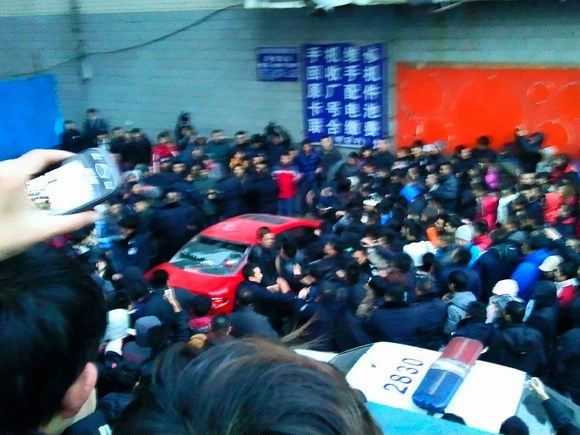
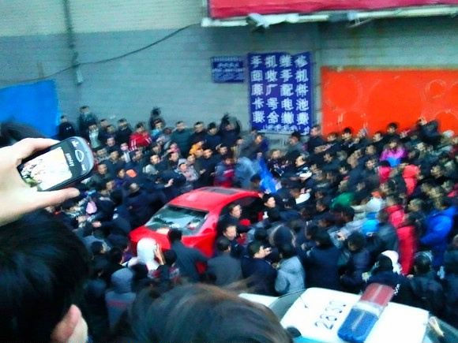

# “率土之滨，莫非王臣”——评长春马六事件

**“不过也有不对，天下的人，并非都是王臣。所谓那500个家族，那3000个家族，那5000个海外账户，时刻提醒我们。所谓王，并不是一两个人，而是一群食肉寝皮的恶人。唯这个王未免太扩大、膨胀得太厉害。西汉时官民比约为1:7900；唐朝时约为1:3900；到今天变为约1：200。”** ** ** ** **

# “率土之滨，莫非王臣”

# ——评长春马六事件

## 文 / 陆遥遥（清华大学）

 题引两句语出《诗·小雅·南山》。所谓“率土之滨”指沿着王土之边，即指四海之内。四海之内，凡喘气的人，没有不是统治者的臣；不想做臣了，就不能为噍类了。所谓臣没有那么好康，不是什么大臣、干部。臣，在甲骨文字中，象一只竖立的眼睛形。人在低头时,眼睛即处于竖立的位置,字形正表示了俯首屈从之意。本义是男性奴隶。在这里就是臣民之意。 我们的祖先实在了得，两三千年前说的话，现在还那么切合中国国情！传统文化之魅力，居然可知。畿内的河北被李启铭撞的女孩，和东陲长春被姜晓舟打的母女，远隔数千里，他们在没有公民权利，只有臣民身份方面，不也一模一样吗？ 不过也有不对，天下的人，并非都是王臣。所谓那500个家族，那3000个家族，那5000个海外账户，时刻提醒我们。所谓王，并不是一两个人，而是一群食肉寝皮的恶人。唯这个王未免太扩大、膨胀得太厉害。西汉时官民比约为1:7900；唐朝时约为1:3900；到今天变为约1：200。 李启铭的父亲，当地一个公安分局的局长，正科级。姜晓舟的父亲是镇赉县府办公室的主任，也是正科级。在古代都是不入流的微末小吏，连官都算不上。而今天，俨然就是独霸一方的藩王了。否则，他们的衙内敢于撞了人，还要殴打，边打边谩骂“我有的是钱，我就打死你，我宁可给你赔”吗？！ 李启铭的官司，到今天没有了断。姜晓舟的事情，则很快出了结论。一、他是无业人员，二、警服是私着。又是一派挑动群众斗群众的算计。只是现在不同往年，网民还没有死绝。早有人爆料：“姜晓舟，在吉林烟草工业有限责任公司工作。父亲姜德贵，镇赉县办公室主任；姜晓舟岳父白某，镇赉县公安局工会主席。”根本不是什么无业人员。烟草公司，肥着呢！公安局工会主席的女婿，私着警服，他的岳父难道没有责任？ 长春警方对这件事情的处理，倒是直截了当，径直“借机鼓动闹事、打砸车辆的当事人，扔撇物品造成公安民警受伤的违法人员开展调查，并依法追究法律责任”了。 一直以来，我们往往惊讶，何以李刚那么牛，可以调动整个公检法系统。想必因为有更大的后台吧？然而我们错了，因为把持整个公检法系统的头头脑脑，除极少数外都是李刚。他们同气连枝，一荣俱荣，一损俱损。骂李刚就是骂他们，治李刚就是治他们。他们怎么会配合？ 长春方面，因为东北人民急公好义，动起手来，他们就慌了。他们明白，人民群众骂李刚，实际上是骂出李刚的社会，骂护李刚的体制。所以他们也不糊涂，要追究法律责任了。正是：你对领导讲法律，领导对你讲政策；你对领导讲政策，领导对你耍无赖；你对领导耍无赖，领导对你讲法律！ 普天之下，莫非王土；率土之滨，莫非王臣。这个黑黢黢的“王道乐土”不砸碎，李刚就绝不了根！ 

