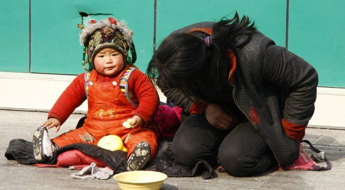
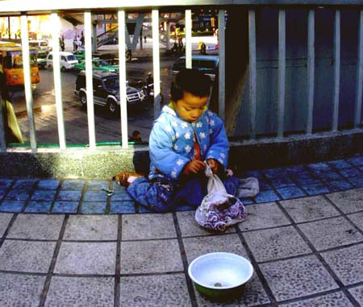
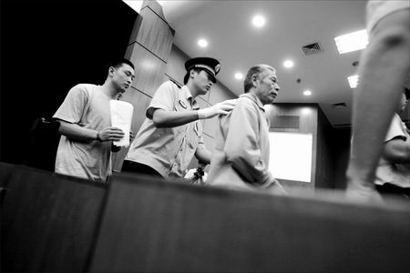

# 你丢掉了什么，又肩负了什么？（外一篇）

**随手拍照乞儿提供打拐线索本身并没有什么不好。只是一旦这些信息在赛博世界里被公开发布、传播，它就必然会遵循人际消息传播的规律，激发出人群里隐藏的愤怒。原本可以正常进行的身份核实与信息筛选，常常会招致人们跟风而行的围观者暴力。这是网络人际传播的规律，一旦发出，便常常偏离原意。这场运动所引发的关于禁止儿童乞讨的讨论，更让人觉得无奈。**

### 

### 

# 你丢掉了什么，又肩负了什么？（外一篇）

### 

## 文 / 王垚（中国人民大学）

### 

### 

哺乳动物对幼仔总有一种特殊的感情，人类自然也不例外。在中国，儿童的拐卖现象业已成为越来越严重的社会问题。丢失孩子的父母撕心裂肺的悲痛，冷血残忍的人贩子带给孩子的惨不忍睹的人身伤害。很容易激发人们的同情与愤怒。拐卖儿童与组织行乞的结合，更把这种愤怒推到了极致。 在新浪微博，一个名为“随手拍照解救乞讨儿童”正在如火如荼的进行着。组织者动员各地网友将所见的乞讨儿童拍照上传至微博客，为寻找丢失孩子的家长们提供可能的线索。这场运动其实也是一种无奈之举，由于多方因素，在我国，拐卖儿童这种对孩子身心和正常生活伤害极大的犯罪行为，远远不能算被遏制。 大家都明白，茫茫人海，大千世界。指望一张照片能带来什么家人团聚的完美结局，是几无可能的极小概率事件。除了心底里残存的一点美好的期望，更多的人，是希望以全民动员的方式，向我们的政府施加压力，改善在这方面的相对不作为状况，拯救更多的孩子，团圆更多的家庭。 然而，这种运动式的方式本身，也是个潘多拉的盒子。希望依然在里面，邪恶则散播四方。 在广东珠海，一对乞丐父子被网友拍照上传微博客之后，有网友辨认觉得这孩子很像自己走失的孩子，于是会同志愿者星夜前往。在经过激烈的对峙争执，最终，战战兢兢的父子等到了公安部门的亲子鉴定结果，他们确实是父子。然后，围观的网友们遗憾的散去，一场本可能轰轰烈烈的奇迹，草草收场。 

### 

### 

### 

这样事情的发生令人遗憾？还是失望？这种没有底线围观行为，只能说是人肉传播的必然结果。可社会化网络上人们原本善良的愿望带来的围观者暴力，给这对原本就在最底层挣扎的父子的伤害，又有谁来抚平。而假如你就是这样一个挣扎在社会底层的流浪乞讨者，你又是否会愿意，自己孩子的照片被放在网上千万人评说，仅仅因为孩子被网友们怀疑是拐来的？ 我一直反对网络世界里的种种人肉搜索行为。说到底，这样的行为，是人群振振有词的把调查与审判的权柄从公权收回了自己掌中，看起来每个人所掌握的都是微不足道的一丁点，但十万个人的唾沫，已经足够淹死一个人。 随手拍照乞儿提供打拐线索本身并没有什么不好。只是一旦这些信息在赛博世界里被公开发布、传播，它就必然会遵循人际消息传播的规律，激发出人群里隐藏的愤怒。原本可以正常进行的身份核实与信息筛选，常常会招致人们跟风而行的围观者暴力。这是网络人际传播的规律，一旦发出，便常常偏离原意。这场运动所引发的关于禁止儿童乞讨的讨论，更让人觉得无奈。 对于这个“随手拍照解救乞讨儿童”活动，我的态度很简单。拍照行为本身不是问题，非要把这个扯上肖像权乃至侵犯人权，属于不顾前提的扯淡。但把这样的照片放在微博客乃至范围更大的网络世界里随意传播，是不恰当的。这种行为本身能带来奇迹的可能性微乎其微，副作用却显而易见。 我的一个朋友几天前说，满屏都是找孩子的，我看倒是大人丢了。很多时候人们的愿望是美好的，但在努力去实现这个愿望的路上，我们能不能先问自己一句：你丢掉了什么？又肩负了什么？ 新浪微博的 @天使妈妈莉莉 根据自己本身的工作经验构想出了一个解救被拐流浪乞讨儿童的流程图。我希望每个急着拍照上传的人们，能把上传照片的功夫花在报警或者报给专门的救助机构上。运动式的全民动员与网络病毒传播的结合对寻找孩子父母和厘清孩子身世并不见得有多大裨益，而由此引来的围观者暴力，确实实实际际存在着的，你感受到了吗？ 

### 

### 

### 外一篇：关于儿童行乞

### 

孩子是世界的未来。保护未成年人不受伤害是现代社会不同文明之间少有的基本共识。但不同的价值观对伤害的定义，存在众多的偏差与歧义。当年一部《刮痧》曾直面了东西方文化与法律之间的价值差异以及因此产生的误解。而对于儿童行乞，有人的态度是，政府和社会应该彻底禁止禁止和杜绝这种行为，以保护孩子不受伤害。 对此，我的态度很明确，反对禁止儿童行乞。 

### 

### 

### 

禁止一切儿童乞讨，配合强制收容救济乃至政府监护是必然的后续措施。的确，很多国家都有监护人虐待孩子而被剥夺监护权，孩子被政府收容抚养的判例。但请注意一点，这样的判例都是在侵犯孩子人身权利的前提下，比如，殴打孩子，让孩子忍饥挨饿，以及各种精神上的侮辱等等。而并非是因为孩子的父母是挣扎在社会的底层，无法给孩子提供令人满意的生活条件。当然这也与发达国家社会福利状况优于我国有关，底层民众虽然艰辛，但物质条件也不至于太过挣扎。 罗斯福在那次注明的讲话里将“免于匮乏”定义为人类的四大基本自由之一。然而，对于这个定义本身以及怎样定义“匮乏”，经济学家，政治学家，伦理学家乃至心理学家们至今也没有一个统一的共识。在这里我不讨论这些理论上的东西，我想先讲一段历史。 澳大利亚政府从上个世纪初开始强行推行“白澳政策”，并以此为名义，强行从土著人家中带走混血孩子，把他们送到保育所或者白人家庭里，接受白人文化教育。这些孩子被称为“被偷走的一代”。一个个土著民族家庭破裂，亲人永隔，仅仅因为，他们的生活方式不被文明世界喜欢，还有，让孩子免于贫困。“白澳政策”在70年代被废止，但强制收容土著孩子情况依然时有发生。 这些“被偷走的一代”从小就被迫于父母亲人分离，又很难融入到白人社会，造成了巨大的社会问题。对此，澳大利亚政府长期采取漠视的态度，直到2008年2月13日，时任总理的陆克文才对原居民及其文化所遭受的“侮辱和贬低”做出正式道歉。尽管原住民的生存境遇相比一个世纪之前依然故我，但澳大利亚人已经开始了反思。 

### 

### 

### 

我不知道你们对这段历史会有怎样的看法。但以“免于匮乏”和从贫穷中拯救孩子为名义所造成的这一系列悲剧，值得我们所有人警惕。贫穷和愚昧不是罪恶，用暴力强迫其他人做出违背意愿的选择才是。禁止一切儿童行乞也是一样。一旦颁布这样的法律，那些带着孩子乞讨的底层父母们，如果不愿意接受福利和救济（鉴于我国特殊的体制和当年收容所的种种劣迹，这样意愿的人恐怕更不在少数），宁愿乞讨度日，孩子就必须被强制收容，和父母分离吗？这样的孩子不能享受良好的生存和教育条件已经是悲剧了，而强制收容，只会制造新的悲剧。 对底层家庭的儿童福利和基础教育福利是社会福利的底线，也是能让这样生存境遇下长大的孩子，在成人后能拥有平等的身体素质和知识水平与其他人在社会中竞争的唯一机会。说来奇怪，我国是世界上不多的拥有成文的《未成年人保护法》的国家，但在对儿童权益的保护现状上，反倒远没有一些没有成文法的国家做的好。但不管这片土地如何糟糕与不堪，请不要以正义的名义剥夺人们选择生活方式的自由。这样，甚至比什么都不做更坏。 

### 

（编辑：乔淼）

### 
