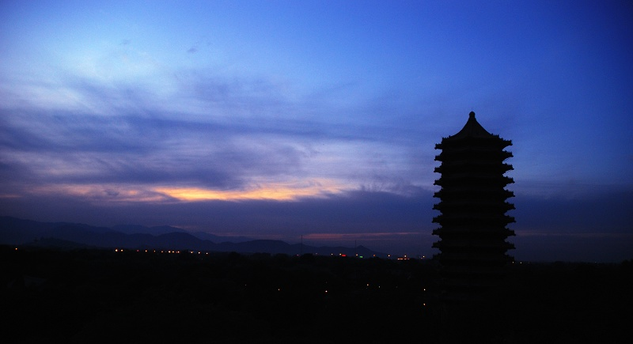

# 北大，给中国留下一点偏激的种子吧

**短短不过百年，这些往事，北大全忘了。可是却有人替他记得。这个人便是整个中国。想当初北大倡导“偏激”引得社会舆论围剿，而如今北大会商思想偏激的学生却引得舆论痛心疾首，这恐怕是北大建校百年来对中国的最大贡献，这一巨大反差象征了中国舆论的进步与光荣，却是北大这位贡献者逾百岁之时的悲哀与耻辱。**

### 

### 

### 

### 

# 北大，给中国留下一点偏激的种子吧

### 

## 文 / 孙宇晨（北京大学）

### 

### 

北大会商制度被曝光已经一周有余了。二十多年过去了，北大可能是第一次发现自己居然站在了全社会的对立面。无论是普通北大学生，还是在北大教书的老师，普通的大学生，乃至普通工人，白领，商人，活跃于中国高校的知识分子，因拍裸照而红的女模特，全国各地保守的党报与党媒，知名当红的电视节目主持人，第一次全部似乎商量好一般，站在了北大的对立面。 平时北大遇到任何公共事件，都会像一只鸵鸟一般把自己插在沙堆里，任社会的风评。社会上的舆论往往会分化为两类，支持北大的，反对北大的，在众生喧嚣之中，渐渐支持北大的舆论占了上风，这次舆论危机也就过去了吧。即便是反对北大的声音占多数，大家也并不认为这是一件天大的事情，也就过去了。这次北大还是这样做的，但恐怕是不灵了。 不得不说，北大这次真的站在了全社会的对立面，这场危机也从北大一个部门的工作失误，上升为了对北大整体精神与现状的探讨与反思。也许北大学工系统的老师，觉得会商一位思想偏激的学生，并不是一件错事，因为他们之前早就如此做过，甚至批评食堂涨价两毛钱也属于思想偏激，这也并无逻辑未通之处，他们更想不到一个由他们看来司空见惯的条例，竟会在整个中国，全社会引起轩然大波，我想，这唯一能证明的，便是他们的良知与价值评价体系，与整个中国社会都相去甚远了。 我至今无法忘记，一位在北大教学岗位工作多年的教授听闻此事是如何的痛心疾首；我也无法回避，一位北大学弟在得知会商制度后，对北大现状与未来的迷茫与悲哀，这几乎打碎了他年少的北大梦；我更见到，一位普通的中国白领在得知北大的会商制度后，对于中国的未来都产生某种程度的绝望，最近一位学妹给我说，她听过一些北大会商制度的笑话，“听得时候想笑，听完想哭”。这几乎伤害与打击了所有对北大怀有好感，乃至深切感情的人。我知道，也许学工系统的老师会认为，这一切都无足轻重，尤其是在人民感情已经被三番五次伤害的时候。 我知道为何北大受此苛责，因为几乎是北大已经忘记自己前世今生之时，全中国人还替他记着。北大自己便诞生于一起“思想偏激”者发动的“极为偏激”的改革运动，当1898年，光绪皇帝将维新变法昭告天下时（令人悲哀的是其诸多主张今日看来仍属偏激），引保守派之舆论大哗，这场“偏激”改革随后便遭到了保守派的毁灭性打击。八十三天后，北大作为刚刚诞下的早产儿，亲眼目睹自己的母亲被屠杀于菜市口的闹市之中。历史的玩笑在于，凶手将屠刀举到毫无还手之力的北大头上，他犹豫了。北大居然成了这场“偏激”改革留下的唯一遗产，这告诉我们，在最为极端保守反动的人看来，为一个国家留下一些偏激的种子也是必要的，一个国家若是没有偏激者，只恐怕亡国之日不远。这个国家，北大成了那个举国追杀偏激者之后留下的种子，留下日后生根发芽的希望。 果然，这场“偏激”改革被镇压两年后，1900年风雨飘渺的中国遭遇近似亡国之祸。作为种子的“偏激”北大更是被国人寄予了挽救中国命运的希望，北大最终没有辜负这份期许，在蔡元培这位“偏激”父亲的指引下，北大主导了中国的新文化运动与五四运动，生生将中国的国运扭转过来。当然，新文化运动与五四运动，在当时社会，也足以掀起轩然大波，一批保守主义者主张枪毙这群“敢倡乱道”的偏激者，只是所幸他们没有成功。胡适，陈独秀，蔡元培这三只兔子是这群“偏激者”的头子，而鲁迅，钱玄同，周作人则是这批偏激者的主将，傅斯年罗家伦这批学生领袖则是“偏激”传统培养出来的国家最为可靠的接班人。 思想自由兼容并包也是这时才写入了北大乃至中国学术理想的灵魂，蔡元培的北大，既容纳了让反动者咬牙切齿的新派人物，更容纳了公然反对新文化的极端保守主义者，他们也是某种程度的偏激者。无须讳言，这时期的北大几乎奠定了中国学术从学科建制到学术灵魂的所有基础，这份学术基础与学术灵魂就是“偏激”的，北大有过偏激的过去，也有过平庸的过去，但我敢说，即使是最为保守的反对者，也认为这些最为偏激的过去，才值得北大去纪念，才得以北大去尊敬，真正写入北大的传统。 

### 

### 

### 

近日元培学院组织学生清明节去给蔡元培献花，以表达对蔡元培校长的尊敬与纪念，我不知道他们鲜花的时候会给蔡元培先生讲些什么。您当初拼死舍身保护的偏激学生，现如今被谈话，被警告，甚至是纳入了会商范围？您当年所力倡的偏激传统，于今日之北大，不仅是一项不小的罪过，而且是会商制度下最显眼的一群人？为纪念您所命名的元培学院，竟成了第一家试点会商制度，打压偏激传统的主要阵地？我想你们还是不要去了，你们不去那里，便是对校长最大的尊敬与纪念，去了，则是一种侮辱，对你们是，对校长更是。 短短不过百年，这些往事，北大全忘了。可是却有人替他记得。这个人便是整个中国。想当初北大倡导“偏激”引得社会舆论围剿，而如今北大会商思想偏激的学生却引得舆论痛心疾首，这恐怕是北大建校百年来对中国的最大贡献，这一巨大反差象征了中国舆论的进步与光荣，却是北大这位贡献者逾百岁之时的悲哀与耻辱。 国事日渐不可为，蔡元培校长的过往不复如今，北大的形式飘渺至此，我们无所奢求，只希望北大的校方如当年的慈禧太后一样，手下留情。 北大，给中国留下一点偏激的种子吧。 

### 

2011/3/30

于北京大学

### 

### 

（采编：管思聪 责编：管思聪）

### 

### 
