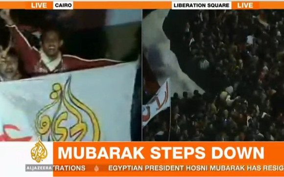
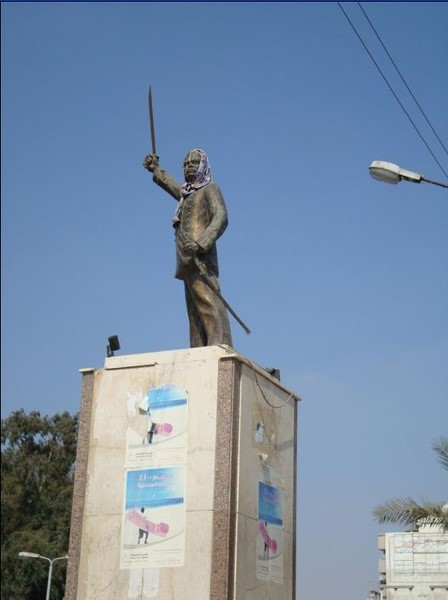

# 埃及：革命早已结束  生活刚刚开始

**舅舅们喜欢逗弄些不知普不普世的价值，其实这在埃及并不稀罕——人家搞过三套宗教体系，古往今来尤其是近代那城头变换大王旗的把戏也是见多识广。孩儿们和黑纱披头老大娘们排队买菜的时候则晓得，比神马价值更牵动人心的是那柴米油盐的价格。谁还记得本次事变的第一拨人是抗议穷得活不下去来自焚的小贩？**

### 

### 

# 埃及：革命早已结束 生活刚刚开始

### 

## 文 / 杨元伦（大连外国语学院）

### 

### 

我的笔记本突然停止工作了。就在前晚欣赏半岛电视台直播埃及解放广场庆祝实况的时候。 

### 

### 

### 

我从来没有料想过这样的情景：风扇轰响，画面凝固，扬声器发出一些无意义的音节。屏幕上一个埃及青年男子喜气洋洋，手呈V状，脸上洋溢着不怀好意的微笑，鼠标键盘通通不顶用，我疑心这是彻底杯具了。 挣扎许久，思想斗争了一时半刻之后，在下终于铁了心肠，把VISTA删掉，装了个WINDOWS-7。 还真别说，虽然这新操作系统用起来仍不十分趁手，预装的各种驱动程序版本太低，还有许许多多的细节需要调整——但它的高效、快捷和适用性，在我使用它的短短几小时之后，已经是可以预期的了。 转念一想，我所思量的那个遥远国家的变革也无非如此。有的人的电脑只需要打一些补丁，有的人的电脑则需要增删一些软件，有的人的电脑需要查杀病毒木马——所有电脑都需要，我们无法指望一个无毒无木马的世界……也有那种极其幸运或曰极其不幸的机器，在万般无奈之下需要那么一次“血雨腥风”的格式化，好腾出些旧地方，安装个新系统。做系统的时候，因为事先没有备份，总会损失一些也许得来不易的文件和数据，这在事后也可能会使当事者追悔莫及。但前人有云，“不破不立”，阵痛后的欣喜总胜过瞪着凝固不动的屏幕，目瞪口呆，听任时光飞逝。 

### 

### 

### 

埃及的显示器已经凝固不动了许多年了。可能与留洋欧美的朋友有些许不同，我所认识的旅埃归华的学子，在回国之后大抵都有那么一星半点儿的民族主义自豪感。那是因为咱国家确实很给力啊。虽说这是比上不足比下有余，如此一比既不争光彩也不促进步，但我们总得承认，与那个风貌停留在上世纪八九十年代的地区大国相比，我们的祖国真的是一派繁荣景观，相当给力。 倘使那风貌仅仅是风光倒也有旅游价值，此时我便不由想起敬爱的W老先生时常和我们讲起的一个笑话，那还是在十数年前他在开罗任职之时，别人形容他的住所是“从某广场至某街道向前行50米至第一个垃圾堆左转，继续前进至第二个垃圾堆右转，那居所便在灯火阑珊的第三个垃圾堆处是也”。多年以后他的门生们去故地怀古，岁月流转，物是人非，而往昔的垃圾堆依然随着悠悠时光而情怀依旧；埃及是考古大国，“你随便找一处垃圾堆开挖也能有收获”，一路挖下去，“你会挖到纳赛尔时代的罐头盒子，法鲁克国王时代的破烂鞋子，甚至赫迪威伊斯梅尔时代的破陶罐子，再往下，继续挖到木乃伊都算不得惊奇”。由此缘由，在穆巴拉克先生让位后的的第二天，当我看到电视直播里开罗的市民自发地清扫塔赫里里广场的情景，便不由得泪流满面。心想唯有这勤快人才能算得上会过日子，也只有勤快人才配过上好日子罢。 窗外风云变幻，总得回家吃饭。较之博联社民主舅舅们关注的普遍权力，草民从一开始关注的就是普遍贫困。舅舅们喜欢逗弄些不知普不普世的价值，其实这在埃及并不稀罕——人家搞过三套宗教体系，古往今来尤其是近代那城头变换大王旗的把戏也是见多识广。孩儿们和黑纱披头老大娘们排队买菜的时候则晓得，比神马价值更牵动人心的是那柴米油盐的价格。谁还记得本次事变的第一拨人是抗议穷得活不下去来自焚的小贩？这事甚至与横亘全球的经济困境无可分开，但鲜有人提。何哉？向高端处看，你可以望见萧条的底特律样的城市和金牛犊街倒闭的金融大鳄。平视那些小国，你可瞅见那阵子窘迫的冰岛和愤怒的希腊，并不完全因着自己的缘故，使整个国家的财富打了水漂，正是倾巢之下无完卵。要论追究责任，我们依然可以确定某大国有难逃的干系，某某大国也有推波助澜的作用。此事是穷则思变，不至穷尽处居然仍显安稳——像沙特阿拉伯这样的君主专制，各路贵族王子犯了鸡奸罪都能找到李刚的国家反而宁静。我们也显而易见必然推知，那一圈的无奈的牌局，谁是幕后的操盘手，谁本是利益的最根本的攸关者，却沦为DEAD MONEY，使他们的命运成为筹码。 幸而，解放广场上的筹码，名义上被解放了。 

### 

### 

### 

我的同学伊赫桑，模仿伟大领袖毛老太爷的三个世界理论，将世界分为三类国家：一曰发达国家，二曰发展中国家，三曰不发展国家。美国如“一”，中华属“二”，而那不发展国家，说的就是埃及。在一个个干冷的夜晚，我们曾搭乘古旧的“拉达”车和“莫斯科人”行驶在萧条的沙土地上，意识到什么叫发展才是硬道理，也意识到那些不发展的政权无论穿什么意识形态的马甲都要被时光无情地戳穿。这是普世价值的垮塌，也是埃及价值的胜利，我们真心实意地为那些街坊邻居们摆脱糟老头子的统治而喜悦，也希望他们的生活会真正掌握在自己的手里——而不再是那些买办的手里。这样的人在这样的时代曾经有很多，以后也会有很多。他们的前辈有古巴的巴蒂斯塔、菲律宾的马科斯、韩国的全斗焕和智利的皮诺切特。在从民主向更民主，从假民主到真民主的不断胜利中，埃及人民摆脱了骑在头顶的蒋家王朝，拔掉了插在背后的遥控天线，终于迎来了属于自己的发展空间。 我们关注埃及人民的事业，正如关注我们自己的事业。千里之外的我们与你们同呼吸共祷告，祈求全能的神凭他的公义襄助埃及，援助我们。 阿门~ 

### 

### 

（采编：黄理罡 责编：黄理罡）

### 

### 
