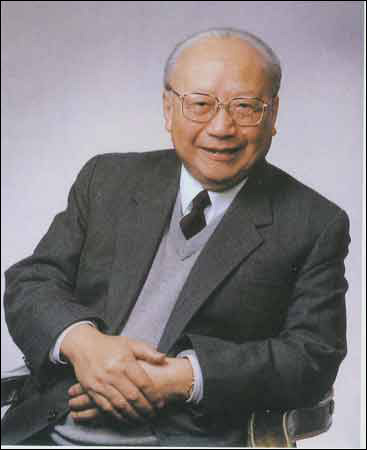
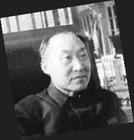
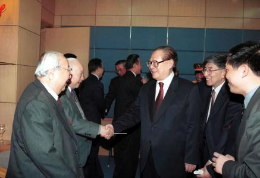
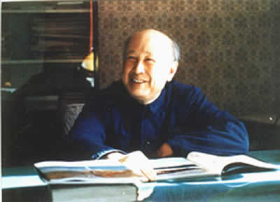
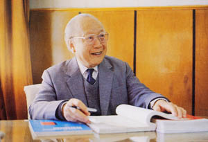

# 对纪念钱伟长的反思

**“如果说纪念的是他学贯文理，提倡通识教育的学养和真知灼见，那自然无可厚非。但如果纪念的是所谓的“科学报国”，我们就不能不保持一份警觉。在中国当代历史上，重理轻文造成的后果已经极端严重，而现在继续鼓吹这样的思想，就变成了“中学为体，西学为用”跛子改革的蹩脚辩护。”**

# 对纪念钱伟长的反思

## 文 / 元淦恭（中国人民大学）

 今天，政府为钱伟长举行了盛大的丧礼。这一位享有盛誉的科学家，极尽哀荣。自7月30日以来，中国内地的媒体铺天盖地地报道和宣传他的生平事迹，旌表他的学术成就与对国家做出的贡献。唯有一些海外媒体对于他的人品进行了质疑。 1986年12月，方励之、刘宾雁、许良英等人筹备举行“反右”三十周年的座谈会，向包括钱伟长在内的四十余人发出了邀请。钱伟长却将邀请信转给邓小平，导致该次活动破产。这一事件后，他得到邓小平的肯定，并因此在1987年成为全国政协副主席。这也是钱伟长一生最广为人诟病的事情，作为反右运动的受害者，一个科学家几十年不能从事正常的科研工作。三十年后，他竟然使用当年那种人整人的方法对待那些曾经和他一样遭受不公正待遇的人，因而被很多人看作并不光明磊落。 任何一个人都有着历史的局限，钱伟长也不例外。钱伟长“告密”的动机，我们不得而知，但是我想，经历了斯大林主义的高压统治的知识分子，对掌权者的绝对忠诚首先来源于恐惧。有人说，钱伟长从一个精神贵族沦落成精神奴隶，这话从某种程度上来说有一定道理。但是钱伟长蜕变的过程，反映的其实是中国知识分子所遭受的集体精神阉割。 柴静曾经写过一篇博文，叫做《而我却今天才知道他的存在》，说的是一位中国历史上重要的科学家叶企孙的故事，读来让人心酸。因为学生的冤案，他在文革中身陷囹圄，并在1977年悲惨死去。因而他变成了历史的伤口，至今仍然在中国科学史册上化脓。他是中共认定的“两弹一星”23位功勋人物中9位的老师，却从来不被官方提起，以至于在这个国家，他的名字鲜为人知。作为中国物理学界的真正奠基人之一，在中国内地，他几乎就像从没存在过。 

 官方所肯定的“三钱”，从来首先都强调他们的“爱国心”，然后才说他们的科学成就。钱伟长的“爱国”，比起钱学森的“爱国”，就是小巫见大巫了。一个物理学家，居然搞起生物学研究，在全国科学界都没有发言的情况下发表论文，证明“亩产万斤”是完全可能的，在中国知识人都普遍蒙祸的“文革”时期，这个“毛主席的好学生”竟然在后来被中共官方否定的“九大”上当选为中央候补委员。任剑涛先生曾写过一篇写钱学森的文章《从科学家到社会贤达》，结果没有报纸敢发，任先生曾笑谈，其实改一个字，就不是“社会贤达”，而是“社会闲杂”了。确实，中国当代历史的荒诞，就在于把科学家变成“著名的社会活动家”，又让这些“社会贤达”，逐渐沦为了“社会闲杂”。 政治权力对学术的干预是中国学术之花日益枯萎的重要原因。而钱伟长、钱学森等“社会贤达”本质上是这种畸形社会结构的代表。权力中心超越了自己的边界，成为了真理的中心。政治家除了掌握权力，还垄断了对是非的判断，这正是这个国家诸多灾难的根源。叶企孙不被提起和“三钱”被捧得老高，正是说明了政府把对政治立场，而不是把学术水平与成就作为判断一个学者的标准。自然科学都沦为了政治的婢女，更何况社会科学领域。 

 “科学报国”这样的说法，在当今时代是片面的，甚至是极其有害的。中国社会的种种危机和问题，很大程度上是因为制度的因素，而制度的问题，不是由于自然科学与技术的落后造成的，恰恰需要人的启蒙与解放，而这需要的是社会科学受到充分的尊重。 央视主持曲向东主持“大家”栏目，曾经采访过许多人，采访钱伟长的时候，问他为何要弃文从理，钱伟长说的是918了，他要“科学报国”。他以为这一个方法可以对所有科学家通吃，可丁肇中在面临这个问题的时候却说:“我感觉学中国历史找不到真理。因为中国每一次改朝换代，领导人的第一件事就是修改历史。”丁肇中的答案相对于钱伟长的，显然就多了几分讽刺的意味。 “科学报国”在一定的历史时期，一定的条件之下，是值得提倡的。但是现在继续过分地这样的精神，强化“重理轻文”的学科倾向，我认为是不合时宜的，甚至是完全错误的。成思危早年是一个著名的化学家，改革开放之后改学经济管理。“文革”期间去烧锅炉的他说，一个不好的制度，让科学家有才华也无处施展，因而他要学管理。霍懋征在先前是金牌的数学教师，“文革”中遭到冲击甚至失去孩子的她在重回工作岗位后选择教语文，因为她说人的爱与善良是最重要的。 我一直以来都认为，制度，或者说以研究制度为中心的社会科学决定了一个社会发展的方向。只有在正确的航向上行驶的船只，才可能到达彼岸。如果说舵手选择了错误的方向，科学技术这样的动力引擎只会是让错误越来越严重，而没有积极的效应。进入到21世纪的今天，中国需要的是制度的改革与创新，只有这样，才能够改变这个国家优秀人才不断外流的被动局面，只有这样，才可能赋予民众乃至于权贵在这片土地上生活的信心。 中国今天成为仅次于墨西哥的美国第二大移民来源国，政治避难（主要是裸官出逃），技术移民，合家团聚，各种各样的移民理由，正是映射出这个社会的深层次问题。为何当年的人是百般挽留都要回归中国，而如今的青年却一拨又一拨移民海外，除了“物质生活”以外，深层次的原因何在？这能通过提倡各种钱老“科学报国”的精神来解决吗？ 

 直到今日，所谓“钱学森之问”仍然在媒体中间被热炒，然而其答案就在钱学森自己。如果说一个不懂行的人可以在完全没有涉足的领域随意发表议论，如果一个科学家可以通过自己的社会活动换取行政级别和物质待遇，如果一个科学家要成为政治的奴仆，做权力的婢女，一个国家的科学事业与创新前景，显然是没有任何希望的。钱学森用自己一生的实践反动了自己的问题，如果说没有像他一样的软骨头的“科学家”，中国科学的未来本来是大有希望的。 钱学森和钱伟长，是国家主义和集体主义语境下的英雄，但就像龙应台先生所说，“国家”只是一个管理的组织，就像一个公司一样，你说我对它有什么梦嘛。但是她对这片土地上的人民和社会是有梦想的。我也一样的看法，钱学森和钱伟长，对“国家”确实做出了巨大的贡献，然而给人民到底带来了多少财富，却是值得商榷的问题。 钱学森和钱伟长，是科学上的巨人，却是人格上的侏儒。他们失去了中国传统的“士”的精神，他们有“士”的抱负，却未能始终坚持“士”的责任，他们有“士”的理想，却没有坚持住“士”的气节。他们也背离了西方历史上一直以来知识人坚守的传统，知识分子永远要站在权力的对面，对权力要不卑不亢。对权力的阿谀逢迎，在任何情况下都不应该是一个有良知知识分子的选择。 今天，我们纪念钱伟长，纪念的是什么？如果说纪念的是他的勤勉，他的学术成就，那是理所当然。如果纪念的是他的“爱国”，这中间就要打上大大的“问号”，因为我们任何一个现代公民，都必须思考怎样爱国，爱什么样的国家，“爱国”，不是对政府无条件的服从，“爱国”，更不是对于国家对公民权利的侵犯坐视不管，更不是在遭受到不公正待遇之后还用当年受到打压的方法去对待其他人。 今天，我们纪念钱伟长，纪念的是什么？如果说纪念的是他学贯文理，提倡通识教育的学养和真知灼见，那自然无可厚非。但如果纪念的是所谓的“科学报国”，我们就不能不保持一份警觉。在中国当代历史上，重理轻文造成的后果已经极端严重，而现在继续鼓吹这样的思想，就变成了“中学为体，西学为用”跛子改革的蹩脚辩护。 

