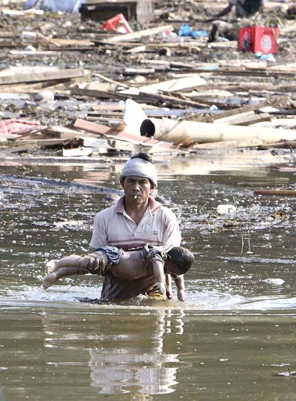

# 我不相信2012世界末日

`**当人类终于走到今天，这个文明开始战胜野蛮，爱开始超越仇恨的时代，人类仍然没有忘记末日的训诫，我觉得这是件好事。让人类就在对末日的恐惧和盼望里，过好他们在地上的每一个时日。在天灾人祸面前，今天的人类比过去表现得真的好多了。这是最值得我感恩的事情。**`

** **

# ** **

# <天枢>我不相信2012世界末日

## 文/元淦恭 （中国人民大学）

# ** **

我相信这个世界会有末日，但是我不相信2012。 习惯了死亡已经变成数字，对于日本的地震，我虽然感到震撼，感到悲痛，也愿意为之献上绵薄之力，然而放在人类大历史的尺度，这样的灾难于这样的国家，已经不再像过去那么惨绝人寰。幸好，8.9级地震发生在日本，据预估死亡人数会过千，如果不是在日本的话，这个人数，不仅会过万，过十万，甚至可能过百万。这次地震的破坏力，是中国四川汶川地震的二十多倍。 翻开历史的书页，好多好多比这次地震更恐怖的毁灭。 东亚是全世界地震最多发的区域，相对于日本和台湾，中国大陆地震发生频度不算高。可是相对于其他国家，中国大陆又是地震极端频仍的了。人类历史上有记录造成死难人数最多的地震，是中国陕西省华县1556年的地震，据推测地震在8级以上，文字记载死难人数超过83万人。 近一百年里，中国大陆遭遇的严重地震有若干次，伤亡过万的就有1920年宁夏海原地震、1927年甘肃古浪地震、1933年四川叠溪地震、1966年河北邢台地震、1976年河北唐山地震、2008年四川汶川地震。其中宁夏海原地震震级为8.5级，致超过27万人遇难，唐山地震和汶川地震，官方分别称有超过24万人和接近9万人罹难。 中国大陆在1975年发生的严重人为灾难事故，板桥水库溃坝事件，也造成约24万人因为溃坝及之后的次生灾害死亡。 中国历史上改朝换代的时候，十室九空是常态。经历了一次又一次的人祸和天灾，这个民族在整整数千年的时间里人口基本上没有太大增长，直到“摊丁入亩”。每次看到自然的大灾，我就会想，我们何其幸运，居然活到现在。我们的祖辈要多么顺服，多么幸运，才能躲过那么多的战乱、屠杀、地震和洪水，最终让我们成为来到这个世界上的生命。 参加过起义的人，多数都成了帝王将相的炮灰。不顺服蒙元的人，都成了铁蹄下的冤魂。不剃发易服的人，都变成嘉定和扬州的孤鬼。甚至那些四川的原住民，屡次成为蒙古人和张献忠屠戮的对象。甚至在那之后的几百年，超过一千万的四川人会因为一个荒唐的政策而死亡。 死亡的数字离我们远了，好多人也忘了。其实，过去的灾难一点不比现在的少。我们能活下来，是奇迹中的奇迹。尤其是这次日本8.9级的强震，让人联想到去年的海地、08年的中国和04年的印度洋。我们才知道，原来，天灾面前，人力并不是不可为。有着强烈防震意识的民族，有着高素质的公民，有着符合建筑规范的房屋，有着完善的应急机制，天灾造成的损失不因其暴虐的程度而成正比。 我相信这个世界有始有终，可是我真的不相信马上就是末日。因为，今日所有的灾难，比起往日，并没有特别地变强。只是在这个媒体和网络如此发达的时代，地球已经成为一个村落，环球同此凉热，彼此感同身受。我们今天能够在电视上看到日本的天旋地转，八十多年前，我们不在甘肃宁夏的人，看不见那里的尸横遍野。几百年前，即使是在河南的人，也不会了解渭河经历过怎样的悲伤。 所以，我特别感谢现在这个时代，感谢人类终于能够如此直接地体认彼此的伤痛，感受彼此的心跳。在没有媒体、没有图像的年代，在没有地球村概念的时代，人们对灾难是要麻木得多，无知得多的，人们对于杀戮更是司空见惯的。而在这个时代，每一场人道灾难面前的愤怒，每一次自然灾害之后的悲伤，凝聚成属于整个人类的力量。 我相信这个世界有始有终，可是我并不相信马上就是末日。 今日所有的灾难，都是上苍给予人类的考验。因为我们脆弱，因为我们悲伤，所以我们，以人类的名义，开始重新聚合。迟早每一代人都要湮灭，可是这个时代最美好的，是从巴别塔倒塌之后从未有过的民族间对话。人类是渺小的，因为她渺小，所以她因灾难而敬畏自然。人类是渺小的，因为她渺小，所以她因为爱而超越国界。 这是个每一次死亡都会让人揪心的时代，这是个每一次灾难都可能让人反思的时代。 正是因为这样，我相信地上即使全然堕落的人类，还没有到彻底的无可救药。 末日迟早会来。 当人类终于走到今天，这个文明开始战胜野蛮，爱开始超越仇恨的时代，人类仍然没有忘记末日的训诫，我觉得这是件好事。让人类就在对末日的恐惧和盼望里，过好他们在地上的每一个时日。在天灾人祸面前，今天的人类比过去表现得真的好多了。这是最值得我感恩的事情。 我们，是经过所有天灾人祸幸存下来的人的后代。 所以，当我们面对灾难的时候，我们不能麻木，我们不能退缩。因为我们，或许也该是被毁灭，被湮没的。五一二之后，好多四川人忽然“大彻大悟”了，我们的生命不是我们自己的，是神的赐予。我们能活下来，就已经是天大的幸运，所以我们不能辜负我们还活着的肉体。 所以，在我们面对灾难的时候，除了敬畏，就是爱。因为末日迟早会来，我们最需要的是，末日之前，全人类无分种族、肤色、信仰，都有兄弟姊妹一般的爱。因为，我们痛着人类的痛，我们悲伤着人类的悲伤，我们负担着人类的负担，我们快乐着人类的快乐。 

（采编：张文倩 编辑：项栋梁）
