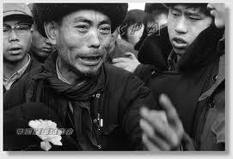
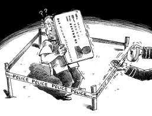

# 我们都不想如此离去

**“想到自己河大同学不少，看校内网的新鲜事儿却没一个人分享关于这件事的报道，心里总有点不是滋味。但一想到自己如此义愤填膺，是因为有着“与此事无关”的道德优势，还真没法五十步笑百步。如果这件事真的发生在自己身边，我敢如此放肆吗？这真得打上一个大大的问号。一旦涉及到自身利益，我们都得重新斟酌一下，在这个体的合法权益无法得到绝对保障的时代，谁又能真正大无畏了谁？”** ** **

# 我们都不想如此离去

## 文/沐风（山东大学）

 临近毕业，我保了研，算是把谋生的期限又拖后了三年，而周围不少兄弟姐妹早已开始为了工作四处奔波。不知不觉我就发现，大家奔的要么是公务员，要么就是国企或事业单位。没上大学前，听说大学生找工作首选外企其次才是国企，想不到真的身临其境了，完全不是这么回事儿。至少在中文系我的身边，大家首选的是国家公务员，其次是各种事业单位、国企部门，江苏邮政什么的都非常关注，但说到很多外企私企，即便是全球五百强，大家感觉也很淡漠，都说这些地方干起来太累。 站着说话不腰疼的我，其实打心眼儿里觉得这些哥们挺不争气的。就说这考公务员吧，有人就评价过，那么多大学生去考公务员，但是公务员并不直接推进发展生产力啊！大家无非就是图一个国家给的铁饭碗，稳定安逸福利好，将来还可能有上升空间，真能一步步爬上去，前途无量。但年轻人为啥不去拼搏一下？用自己的双手开创一个美好明天。 话说回来，我这番话不但是站着说话不腰疼，而且还是吃不到葡萄说葡萄酸。以我的身体，公务员乃至政府工作跟我是没啥关系的，真要“赏”给我这样一个饭碗，估计我肯定会一边义正言辞地继续声讨体制一边笑眯眯地接受，并且接受了以后让我闭嘴说不定就闭嘴了。 没办法，生活所迫，现实逼太紧。 以前觉得特权阶级离自己还是挺远的，不过最近就发生这样一件事儿。我是河北人，在河北大学有很多同学，大家都知道了吧。想当初高考报名的时候，还想过如果考砸了就报河大中文系呢。一听到那个新闻的时候，我就总有种感觉，仿佛那两个可怜的女生就是我们大学的，仿佛那场不幸就在我们校园里发生了一样。 

其实这是完全可能的。我忘了有没有发过一条微博，说在学校里看见一辆轿车以罕见的慢速在校园里行驶，愣让我吓了一跳，早就习惯许多车把校园小路当高速公路了。我还发过这样一条微博：看外国电影发现一个细节，俩人吵架了，女主角往往一生气就径自大步流星地过马路，两边传来一阵阵刺耳的刹车声，这样的情节显然不适合直接“拿来”到我们国产片中。人家是车处处让人，我们是人处处让车。没办法，体制下的生存状态，就是谁强大谁嚣张。

刚给一个好友打电话闲聊，说起找工作的问题，互道苦衷，我开玩笑说你毕竟不是撞死人的那位，只能是被撞死的，她苦笑着同意，并发奋图强地表示要努力奋斗，让自己的孩子可以在大学里整日闲玩，最后让其他同学去议论：“他反正不愁找工作，他有个好老爸（妈）！”侃来侃去，归根结底就是那句话：“我们要努力让自己的孩子当上富二代！”

其实我想说，你们不应该这么想，这种想法是不对的，我们应该奋斗，但不应该把得到某种灰色特权当成奋斗的目标。 但我一点不怪有这种想法的人们。我只希望看到我上面这句话的，不要嘲讽我天真无知就好。现实是，强大的体制与中国几千年来的等级观念，让羡慕特权、崇拜特权、追求特权成为一种思维惯性，我们都对某些人得到不该得到的利益无动于衷，并暗暗下决心一定要奔着这个地位发奋图强。为啥鲁迅文章离开课本大家都那么气愤？因为他笔下的很多角色这么多年不但没消失，反而愈发壮大，比如那一群群围观者。他们顶多换了一个新的形容词：淡定。 直到有一天，你发现他们拿走的是你自己的利益，你会愤怒，会冤屈，但依然不妨碍你原先的梦想，你反而会加倍努力，希望有一天自己也可以进入特权阶层，去尽情地攫取别人的利益。或者，彻底逃离这个世界。前几天复旦大学校长发表感叹，现在的大学生太功利，一来洋教授讲座，大家提问的全是与出国留学有关，几乎不提与专业有关的学术问题。 其实，功利的何止是大学生，我们整个时代早就得了实用主义病，大家忙忙碌碌无非是为了挣钱捞权，最终追求物质上的满足。不同只是，有的人拼死拼活刚刚能够养家糊口，有的人拿着让人羡慕的工资却为房贷忧心忡忡，有的人整日优哉游哉却可以逍遥自在，但几乎无人顾及物质以外的东西。我们当然可以把矛头指向这些功利主义者，指责他们自私、冷漠、精神匮乏。我们可以做个调查，感慨中国人读书越来越少，阅读时间连年下降；我们可以写篇文章，探讨中国人为什么丧失了慢的能力，干活做事越来越不耐烦，中国成了“急之国”；我们可以批评中学生只知道学习不知道拓展素质，批评大学生就知道考公务员或者出国，批评傍大款的女生、争职称的教授、投机钻营的商人、跑官要官的公仆，乃至糟蹋名著的导演…… 但是，又是什么造就了这样一个功利时代？仅仅是九十年代以来的商品社会大潮就可以解释吗？绝非如此。大家拼命地奔着一个好前途，不仅仅是为了过得更好，也是为了避免活得太糟糕。当今体制下，人生的选择从一道多选题变成了一道判断题。谈到理想，你也许想当科学家，当诗人，当导演，当流浪歌手，创业当老板，okok，回到现实，你只需要回答一个问题，愿不愿意当孙子？ 没人愿意当孙子，好，那就往上爬吧。当然你还可以拍拍屁股走人，不过不管哪一条路，你都得足够牛逼才行。否则的话，你就傻逼了。 我心目中的天堂，要求不高，只要所有快乐的小傻逼也能自在地活着，就像韩寒的说，写写小诗，摘点小花，弹弹小吉他。现实是，你知道，如果你甘于平庸，当一个小老百姓，只能提心吊胆地活着，即便是散步，也要当成是对自己快反能力的训练，为每一次躲开飞驰的汽车庆幸。而且，最好你身边的人也能躲开，否则你就和现在河北大学的目击学生一样，一边是良心的煎熬，一边是传说中的封口令，让你连自己的小日子都过不安稳。其实我挺想对那些噤若寒蝉的同学说几句风凉话，毕竟想到自己河大同学不少，看校内网的新鲜事儿却没一个人分享关于这件事的报道，心里总有点不是滋味。但一想到自己如此义愤填膺，是因为有着“与此事无关”的道德优势，还真没法五十步笑百步。如果这件事真的发生在自己身边，我敢如此放肆吗？这真得打上一个大大的问号。一旦涉及到自身利益，我们都得重新斟酌一下，在这个体的合法权益无法得到绝对保障的时代，谁又能真正大无畏了谁？ 

 选择犬儒主义吗？不，这恰恰是一个犬儒主义者也无法生存的年代，因为谁也不敢保证下一辆汽车撞的不是自己。我们谁都不想这么莫名其妙地离开这个世界，那就别怪大家如此功利。要治疗我们这个时代的功利病，先得让每个公民都能踏踏实实在自己的土地上散步，否则，中国人还得继续忙忙碌碌，继续迷恋物质。 最后再强调一遍，其实我心目中的那个天堂，要求真的不高。
