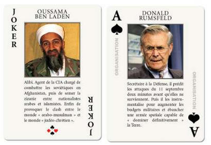
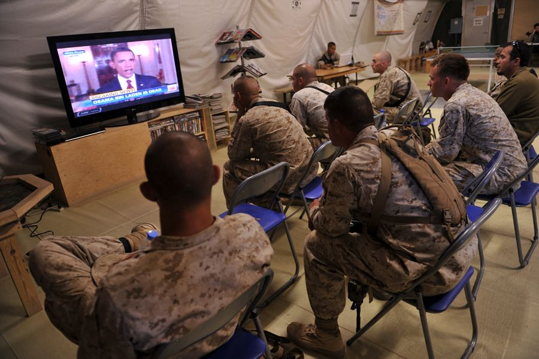
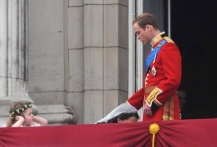

# 拉灯，世界一片光明

**有人相信大事件的背后有个隐形的推手，反对者认为这是必然和偶然的排列组合。说不定拉登一派会继续用电视讲话愚弄世界，说不定美国人又利用伊斯兰新的报复发动新的战争，其实拉登挂或不挂，阿拉伯人的战斗精神就在那里。**

# 拉灯，世界一片光明

## 文 / 张菲澳 （上海金融学院）

"BIN LADEN IS DEAD"

《纽约时报》赫然打着这样的标题。

拉登被做掉的政治意义其实并不大，美国人可以说他是被做掉的，也可以说他们以零伤亡换取了胜利。就像10年前随口一说是拉登发动了911袭击，就像有目击者称美军的一架直升机在行动中被击落。

拉登被做掉的经济意义，其实也不大。除了白银价格在最初15分钟内下滑超过8%，黄金和美元指数的波动范围都在1%到2%之内，显示市场仅对前期涨幅较大的品种进行修正。我查阅了另一位中国老百姓爱戴的领导人，萨达姆，遇害后金融市场的走势，2003年12月13日被捕，30日处死，金融市场还是该咋整咋整，全然不鸟这两条 breaking news。短期波动无法影响长期趋势，市场只是借机寻求一个平衡价格。要说杀人，我们开国领袖在文叉大叉命时期灭的人不比蒋光头少，大家还是纪念他爱戴他，希特勒执政时期是德国经济飞速发展的阶段，说到底，英雄和罪人只是立场问题。

拉登被做掉对于美国算是个不大不小的笑话。当年小布什发动斩首行动，10年了才搞定人家，我记得当时开出了2500万美元的巨额悬赏捉拿“头号人物”，本拉登这个名字被《纽约时报》称为the most wanted face of terrorism。多么形象的比喻，当时美国人弄了副扑克牌，拉登貌似是大怪，因此用face这个词，要是人大发布会的翻译一定用figure一词，赞叹下语言的美。

话说回来，一开始看到这条消息我是不相信的，还以为是网上的恶搞。

于是去了NYTimes的网站，看到奥黑report to the American people and to the world，要是在中国一定用announce，由此又看出美帝国主义领导人公仆的嘴脸，于是才确认消息。美国民众在白宫门口集会庆祝，好像当年盟军在柏林地下室发现希特勒尸体后的欢呼雀跃。（此处插播：解放区的天是明朗的天）一群人和一个游击队折腾了10年，还好意思炫耀，何况是莫须有的罪名。因为按照伊斯兰土匪的惯例，出事后肯定有组织通过电视台宣布对某某事件负责，2001年，拉登没有。（另外可以去视频网站搜索911大骗局的纪录片）

拉登被做掉或许引来更大的报复。按照中国人的习惯，斩草必除根。秦始皇剿灭嫪毐一族，亲自把他的两个儿子从城墙上推下去，拉登的子嗣和阿拉伯势力会否卷土重来，一切还很难说。要是真的盯上你了，无辜人民的苦日子还在后头。从因果报因的角度来说，你造了怎样的孽就要面对怎样的果报，对拉登、对美国人、对卡扎菲们都是必须服从的逻辑。

有人相信大事件的背后有个隐形的推手，反对者认为这是必然和偶然的排列组合。说不定拉登一派会继续用电视讲话愚弄世界，说不定美国人又利用伊斯兰新的报复发动新的战争，其实拉登挂或不挂，阿拉伯人的战斗精神就在那里。还是祈求世界和平，每个人都是同源离子的产物，世界上所有的战争都是同胞们的内战，斗来斗去，地球照转，何必呢。

投资者若相信美国投资环境改善，美元持续回流，可以买入美国股票。投资者若相信美元贬值无法扭转，金属价格下跌，应该是购入金银的好时候，白银37到40都是好价格（分别是年内高低点50%和38.2%的回档位）。两种逻辑并不矛盾，温和通胀是投资者的朋友。

红五月是个吉祥的月份，远方挚友跋涉千里与我相逢，姑娘小伙们在阳光明媚的日子里步入神圣的殿堂，在此祝晓凡新婚愉快！奥马哈小镇迎来一年一度的朝拜人群，英格兰足球的骄子，大卫贝克汉姆在受邀参加威廉王子婚礼后的第三天，迈向人生第三个轮回。演唱会，各种happy 让阴霾和疑云散去，共同迎接美好时光。

（采编：项栋梁 责编：项栋梁）

