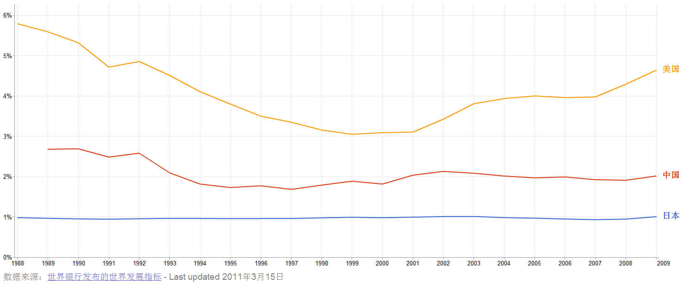
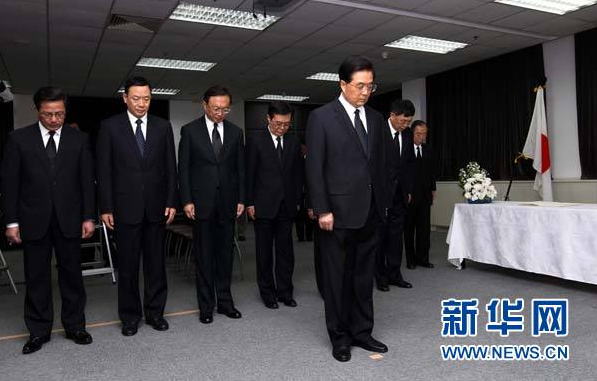

# 灾难后的中日关系

**“我们常常有意忽略了一点：中国在安全上也需要日本。如果抢钓鱼岛是为了下面的那点油或气（也许不是，也许是为了民族大义，也许是因为老百姓很high），那么就得考虑是不是值得为了独占那点油或气，和日本人、甚至美国人闹翻。毕竟中国目前没有能力单独保卫自家的航路，中国也需要拿与日本的合作与美国人讨价还价。”**

### 

### 

# 灾难后的中日关系

### 

## 文/徐阿懒（Massachusetts Institute of Technology）

### 

### 

这两天一直在关心日本的情况，参加了两个关于日本近况的讨论。根据[格雷教授](http://mit.edu/nse/people/faculty/golay.html)（MIT的核工程科学家，这两天频频在CNN出镜）的介绍，基本上可以肯定的是，切尔诺贝利那样规模的核灾难应该不会重演，因为裂变反应在地震后的几分钟内就已经停止了，不大可能发生那样规模的反应堆核心区的爆炸。但即将熔化的燃料棒和可能暴露在空气里的核废料，真是很令人担心哪！ 回过头来讲之前一次关于日本安全策略的讨论。在地震这件事件上，我觉得自己是有些分裂的。[说过了](http://kaoputive.org/?p=13448)，讨论日本的事情，如果不能回归正常人的心态，作为人是挺可怜的。但这样大的冲击，对经济和政治局势肯定有影响。 几天前系里的那次圆桌讨论，主要是三位日本学者谈他们的研究计划。国际关系或者安全研究，撑死是软科学。我没瞧不起的意思，软科学对研究者判断力的要求可能更高。但基本上，他们的“研究”就是试图穷尽未来十年内日本可能遭遇到的各种安全环境的变化，然后对每一种可能的情景提出政策建议。 说是这么说，但我听下来，主要就是两个问题。第一件事是岛国的资源约束，日本90%的石油从中东进口。中东抖一抖，日本经济就要跟着抖一抖。这也是日本这些年拼命搞核电的原因。第二件事是中国的崛起。 也不知多少年了，日本总是陷在经济泥潭里，而且这两年面临越来越严重的财政危机。到2010年底，日本的国家债务水平已经达到19万亿日元，超过GDP的2倍。同期，美国的国债余额和GDP相当。相比之下，中国政府的财政状况要好得多，国债余额仅是GDP的17%（不算地方债，不考虑地方融资平台的未必是问题的问题）。 其中一位研究者说，由于人口老龄化和经济停滞，社会保障经费日益紧张，日本新财年的军费从去年占预算总额6.1%降到今年仅占5.4%, 外交经费（主要是ODA）从1.2%降到0.7%。不知道这两个数字是否准确。中日两国军费的比较存在许多问题——比如武警不算在中国军费里、比如军费的购买力平价问题（看两位师兄的[这篇文章](http://www.usc.cuhk.edu.hk/PaperCollection/Details.aspx?id=7490)）——但国际秩序正在重构是无疑的。 

 

军费支出占国内生产总值的百分比（来自[Google Public Data](http://www.google.com/publicdata?ds=wb-wdi&met=ms_mil_xpnd_gd_zs&idim=country:JPN&dl=zh-CN&hl=zh-CN&q=%E6%97%A5%E6%9C%AC%E5%86%9B%E8%B4%B9#met=ms_mil_xpnd_gd_zs&idim=country:JPN:CHN:USA)）。

于是三位日本学者提出，要主动出击（upstream strategy）。我一听，有新意，是想要摆脱美国人，跟中国合作吗？后来发现不是这样，开始大讲担心中国突破第一岛链，担心美国退出亚洲。 但怎么个upstream法，没讲明白，或者我没听白。我不甘心，“中日合作前景怎么样？如果中国是威胁，日本手里有什么牌可以打？”在座的另外一位日本人回答得爽快：“中日有合作的可能，但必须在美国的监督（supervision）之下，因为美国是日本的盟国。”他是退休的日本海军将军，目前在哈佛进修。 原来所谓的upstream，就是拖住美国人制衡中国。我觉得，这个看法和我们许多人对日本的看法一样，相当短视。 然后地震来了，接着核危机，日本人、中国人、美国人显然要重新想想了。短期内，日本的国力和军力受到了很大打击。18架F2（接近20%）成了半废品还是小事，雪上加霜的财政负担才更加要命。 对中日关系来说，这场危机的影响很难说。一方面，日本的核电计划在政治上完全行不通了，它必定继续增加石油和天然气进口。中国的核电计划是不是会受阻还要看，能源争夺加剧是可以预见的。 第二，灾难可能加速日本向“军事正常国家”转型。这次出于救灾的需要，日本几乎在一瞬间动员了10万自卫队。如此规模的军事动员，战后是第一次。不过就算没有地震，我觉得这种“转型”也是不可避免的。 补充一句，据说中国现在并不担心日本拥有核武器，据说，中国人并不如美国人那么担心会有人用核武器攻击我们。 但是反过来说，灾难也创造了合作的空间。比如能源共同开发（包括一些技术转移），比如保卫航路（打击北非、马六甲、南海的海盗），比如维护中东和朝鲜半岛局势的稳定。日本对中国的经济依赖已经很强，这样一来，在安全上日本也将更加依赖中国。日本人自己也承认，韩国和其他东南亚国家不太可能成为日本制衡中国的伙伴。 我们常常有意忽略了一点：中国在安全上也需要日本。如果抢钓鱼岛是为了下面的那点油或气（也许不是，也许是为了民族大义，也许是因为老百姓很high），那么就得考虑是不是值得为了独占那点油或气，和日本人、甚至美国人闹翻。毕竟中国目前没有能力单独保卫自家的航路，中国也需要拿与日本的合作与美国人讨价还价。 我们已经看到，中国领导人借助这次天灾，修正先前的外交失误。不管上次撞船在战术上是赢了还是输了，战略上，中国输大了：犹豫不决的日本人重新投入了美国怀抱，美韩同盟也加强了。 

图片来自[新华网](http://news.xinhuanet.com/politics/2011-03/19/c_121205629.htm)

中国领导人显然意识到了这次失误。这次灾后的表态和救援，中美两国好像在比赛：美国的两个航母战斗群过去了，大批救援人员过去了，总统在电视上发话了；中国也不逊色，救援队派出了，虽然人数有限（是日方的考虑罢），钱也送了，帐篷也送了，油也送了，总书记该出面的时候也出面了。 灾难过后，中美日在亚太的三角关系，还是很有看头。 

### 

### 

（责编：刘一舟）

### 

### 
