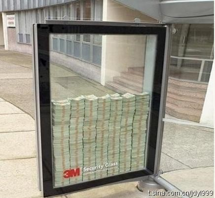

# 被代表的幸福感

**“上流社会的老爷们，自然还秉持着台湾优越于大陆的观念，怎么能忍受一个大陆人到自己的地盘高调撒钱。新北市长是国民党的“储君”，桃园县长是国民党的“官三代”。这些人是为了维护贫户的尊严？我看是标哥的钱塞进贫户的口袋之后也抽在了他们的脸上吧。”**

# 被代表的幸福感

## 文/王非（University of Southern California）

这几天，台湾最热的新闻，不是春运，也不是吴敦义面见上访户，而是陈光标。标哥在大陆名头很响，源于他的“高调行善”。他捐款无数，更号召广大先富起来的人跟着他一起“裸捐”。但他也颇受争议，曾经在某慈善活动中把人民币捆成“钱砖”，再拿“钱砖”垒成“钱墙”，曝在光天化日之下。 人们普遍憎恨炫富的人。有的人炫了宝马，把人撞死了；有的人炫了他爹的名字，把人撞死了；但标哥炫了“钱墙”，没把人砸死，而是分给了穷人。标哥行善高调的一个表现是他当面发钱给穷人，不通过政府机构和慈善机构，原因大家都清楚。 这次，标哥把这种高调带到了台湾。据他所说，为了感恩多年来台湾各界对大陆慈善的支持，他决定来一个“感恩之旅”。他带着若干个志同道合的企业家，以及五亿新台币，浩浩荡荡开进台湾，准备在许多县市举办慈善宴会，把当地的几百个贫户召集起来，每家每户当面发放一万元新台币的红包。 

 就为了这个事儿，台湾刮起一股风暴。我观察了几天舆情，颇有趣味。政界人士和诸多媒体强力反对。新北市和桃园县第一时间拒绝标哥到访，理由是让贫户抛头露面出来拿钱，有辱他们的尊严。“让人民活得有尊严”，呵呵，这个理由真棒。立法院里，蓝绿民意代表出奇地结成统一战线，对标哥的行为冷嘲热讽。政论节目里，陈挥文用他近乎马景涛式的咆哮，让这个同姓的老大哥滚回去。一个简单的入境案例，从移民署吵到陆委会，悬而不决。这些有头有脸的人士如此反对，一个原因是部分媒体盛传标哥要求受惠家户对他鞠躬致谢。后来标哥很委屈，说他的说法是捐钱者给被捐钱者一一鞠躬，然后再一一塞红包。 当然，媒体们是不会轻易承认错误的，所以许多民众以为贫户们还是要鞠躬的。即便如此，大部分民众对此事还是相当支持。桃园县府的电话被打爆，政府人员被老百姓骂成了臭头。联合网各条新闻的留言几乎是一边倒地力挺标哥，嘲讽那些不知民间疾苦的上流人士。不能排除，标哥的这次行为是为了日后在台湾的发展打前站——实际上，他也要谈一些业务。但想想张兰吧。得了个俊俏的儿媳妇，台湾媒体炒了一个月，也为俏江南在台湾曝足了光。这种“得了夫人又得兵”的好事儿，媒体们没说什么；反倒是标哥砸了五个亿，惹来一身骚。 Easterlin在讲“幸福经济学”的时候提到，有些时候，人们会感到幸福，是因为现在过得比过去好、自己过得比他人好。老爷子在最后一堂课做了个实验，说你们每个人有两个选择：一、每个人拿500块钱；二、你自己拿1000块，但其他人拿2000块。最后的结果是大部分人选择了一。老爷子嘴角飘过一丝诡异的笑容，说：我只是好奇一下。多好的实验啊，我们这些最应该成为理性经济人的人，在“让自己过得更好”和“不能让别人过得更好”之间选择了后者。 标哥的这次风波，又何尝不是两种幸福感的对决呢？即便是鞠躬致谢，也会有广大贫户抛头露面领红包。某残疾贫户更是在媒体前说：自己转两次车，也要亲自去领钱。一万元啊，可以让一个贫困家庭获得多少幸福感。上流社会的老爷们，自然还秉持着台湾优越于大陆的观念，怎么能忍受一个大陆人到自己的地盘高调撒钱。新北市长是国民党的“储君”，桃园县长是国民党的“官三代”。这些人是为了维护贫户的尊严？我看是标哥的钱塞进贫户的口袋之后也抽在了他们的脸上吧。 

 好在标哥终于可以成行了。新北市也妥协了，答应让慈善机构出面代为发放；桃园市长也跳出来说：你们桃园县不要，我要；事情似乎有了一个圆满的结局。但是，贫户们的幸福感差点就要被官老爷们给代表了，让人颇为后怕。从这一点看，台湾还真是中国不可分割的一部分。
