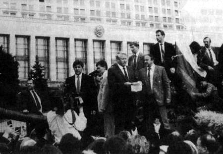
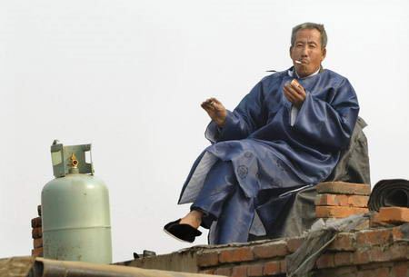

# 这些墙，你推得倒么

**换句话说，美国是先有的精神，后有的2亿傻逼；而中国是有着若干亿傻逼，不傻逼的人希望唤起这样一种精神，相较之下，难度是不可同日而语的。所以简略地说，寄希望于启蒙运动、以公民素质的提高而推动改革进程不仅是不符合国情，更是不符合“人”情的。**

# 这些墙，你推得倒么

## 文/ 刘步筑（北京大学）

 今天是柏林墙被推倒的21周年纪念日。21年前，东欧剧变拉开了帷幕：年初，苏联将军队从东欧撤回，1月，匈牙利共产党被迫放弃了宪法中保障的唯一领导党地位。（6月，中国发生了广泛的民主运动，后被镇压）在镇压的同一天，波兰举行议会民主选举，团结工会候选人瓦文萨当选总理，成功倾覆波兰。圣诞节那一天，齐奥塞斯库被推上断头台。此外还有南斯拉夫、阿尔巴尼亚、保加利亚、捷克斯洛伐克等国家这一年同时发生了剧变，“社会主义”的头号在两年之内也摘除，“社会主义阵营”成功地从占有世界上1/5的领土变成了占有1/6领土。随着两年后的苏联解体，“社会主义阵营”占有的领土逐步变成了1/7，1/8，1/9……现在大约已经是1/20。 

 记得刘小胸获得得诺贝尔奖的时候，章闻韶同学曾发表过一个状态“世界潮流，浩浩荡荡，顺之则昌，逆之则亡”，世界潮流，我们普遍认为是人权、民主、自由、法治等普世价值。在浩浩荡荡的潮流之中向我们涌来的，是激烈的全球化进程，是通过各种国际性的条约取得的共识，是每一个世界公民的善意与良知。在随着世界潮流前进的过程中，我们的国家也在朝着文明社会迈进，但是远非达到《我国已经很目田》的程度。 今天，或者说去年的今天，王箐丰同学写了一篇文章，他用标准的文艺腔表示“暗涌”的重要性，表示“洪流”这种东西具有冲垮一切的可能性但没有重塑系统的希望。我想起上周五在万圣的“V字之夜”活动，大家就东桓提出的“是否认为必要通过暴力活动推进改革进程”产生了分歧，其实界定暴力活动的命题就是区别“暗涌”和“洪流”的命题，以一个怎样的界限分隔什么是“暗涌”，什么是“洪流”呢？不妨看一看东欧剧变的那些国家，不管他们在剧变之前，民众通过怎样一种形式抗争，最终汇聚成的依然是一股洪流。 说句诛心之论，我不认为共和国这个环境能够培养出“暗涌”的氛围，适合中国国情的改革之路只能是一次又一次小型的“洪流”。在各种群体性事件中，民众和利益集团的冲突得到有效缓解，双方达成妥协是每一点社会变革的基础。有人说美国还有2亿傻逼，怎么普世价值可以实现？美国是先秉持着一种信仰，在1776年《独立宣言》的这段话“我们认为这些真理是不言而喻的：人人生而平等，他们都从他们的‘造物主’那边被赋予了某些不可转让的权利……为了保障这些权利，所以才在人们中间成立政府。而政府的正当权力，则系得自被统治者的同意”中，我们看不到中国古典理论的影子。换句话说，美国是先有的精神，后有的2亿傻逼；而中国是有着若干亿傻逼，不傻逼的人希望唤起这样一种精神，相较之下，难度是不可同日而语的。所以简略地说，寄希望于启蒙运动、以公民素质的提高而推动改革进程不仅是不符合国情，更是不符合“人”情的。 不久之前，我还是寄改革的希望于和平演变，但经过很多公共事务及社会问题的讨论后，我发现这几乎不可能，为什么呢？首先倘若在西方国家出现了一例由于被强制拆迁而自焚的事情（在今天可能不太会发生了，我们设定这件事发生在一百年前），此后是难以发生第二例的。而在我们这里，第一例发生之后，大家感慨一番，不久后若发生了第二例连题目都懒的看。这种同情心减弱现象要求我们不得不在每一次社会问题处于萌芽状态即做出一些必要且切实的行动，而不是寄希望于在民众的认知中植入“这样不对”后再提出改革的建议。这一座横置与民众与普世价值之间的墙，你推得倒么？ 其次，在由上面那个例子引发的讨论中，经常有人说，又没拆到你家，你跟着瞎嚷嚷什么。这样的声音在我身边不乏来源。一般情况下，我们没有必要跟这种人交流下去，但是一旦某些群体性事件给这个社会带来改变、给他们这个最广泛的“关我屁事”群体带来福利时，他们往往也会说，这挺好。他们不愿意充当炮灰，却要求享受炮灰们给他们带来的一切美好。他们与我们同样存在一堵墙，这是进步者与把绳子绑在进步者身上原地踏步者之墙，你推得倒么？ 

 再次，你需要了解，在双轨制的国家，体制外和体制内的青年都是怎样规划道路的。我算是出身于“他人吃肉我喝汤”的家庭，所以对于双方均是有所了解的。体制外的青年热衷于国考（公务员考试），他们依然追求着体制可能给他们带来的稳定与体面，他们想着即便是吃不到肉，肉沫也是很好的；体制内的青年开个“我爸是XX”的外挂便可以青云直上，依仗着红色政权的余荫在这个本不公平的社会中获得最精品的肉。这样的人不会是少数，也不会是全部，这样的人往往会在他们选择的路途中愈发迷信官家力量、愈发丧失理想、愈发希望阻断民主进程。他们和我们之间，有一堵“铁饭碗”思想与平等理想的墙，你推得倒么？ 在国家从极权整体走入威权政体之后的30年，也许是因为之前的“暗涌”，更多的可能是经济模式的原因，我们从一部大机器上的螺丝钉，变成了拥有部分自由的螺丝刀。至少你在一定程度上可以选择吃什么、穿什么、做什么、自由恋爱等。横置于我们面前的体制高墙，看似在一块砖一点土地瓦解，事实上它还是如此坚固。体制的高墙是人们心中一座座小墙堆砌而成的，在瓦解高墙之前，请先推倒这些小墙。 

