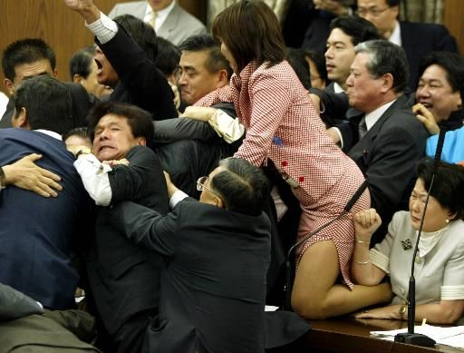
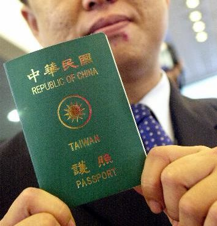

# 大猫看台湾（一）——“自己人”還是“外人”

**“這些違規的大陸人，也沒有了在大陸插隊時常見到的理直氣壯乃至於反唇相譏，甚至大打出手，而是老老實實回去排隊。也許，他們也自認為，在台灣，自己是“外人”，由不得認著性子胡來。而事實是，他們的違規和“聰明”，真正讓自己、讓一部份大陸人，在台灣這裡成了“外人”。”** ** **

# 大猫看台湾（一）

# ——“自己人”還是“外人”

## 文 / 大猫（复旦大学）

從我有機會來台灣交流學習半年那一刻起，我就知道要與這塊土地有一段不尋常的經歷，這樣的經歷是我所從未遇見過的。來台灣是一個夢想，一個很久以來就有的夢想。我想到海峽對岸的台灣，看看同文同種的台灣人是怎樣的一個生活狀態。我關心台灣，關心海峽兩岸的局勢，是因為在內心深處，我確定無疑地認為那是我們自己人。台灣問題是“內政”，是自己人自己的事。 

 隨著時間的推移，終於要到台灣了，距離這個夢想已經很近了。當飛機在桃園機場上空盤旋，透過薄薄的雲層，我開始俯視這片土地。這片土地，乍一看並不起眼，矮矮疏疏的樓房星星點點散落，遠處還有層巒疊翠的小山，群山之側，樓房中間有著大塊大塊的農田，阡陌縱橫；公路密佈，車輛往來不息；此情此景，有點像珠三角的鄉村。然而，我知道，這裡是台灣。是的，這裡就是“台灣”，一個出現頻率極高，對億萬中國大陸人來說，這卻是個陌生的世界。 飛機降落，步入航站樓，除了多多的行李，還有就是各種各樣的證件，這就意味著我雖然踏進了台灣，但我要真正“正常地”在這裡生活，還需要有很多的條件。僅就“入境”而言，我就需要大陸出具的“大陸居民往來台灣通行證”，作為一個中華人民共和國公民，我可以持此證往來台灣，有效期為五年。然後就是台灣出具的“中華民國台灣地區入出境許可證”，在這張俗稱“入台證”上，我清楚的身份是“中華民國大陸地區人民”，居留期為自入境翌日起145天。換言之，在這張證上，我應該是他們的“本國人”、“自己人”，但是，我要和“外國人”一樣，接受入出境檢查才能入境，而且要限期離境，不享受任何國民待遇。 這也許就是現在兩岸的現實：對絕大多數中國大陸人和大多數中國台灣人而言，從歷史上、情感上、地理上，我們不可分割；但從實際接觸中，我們離得又是那麼遙遠，小心地戒備著對方，甚至還不如一個真正的“外國人”那樣讓人踏實。這不禁讓我想起了韓國前總統金大中曾經這樣描述東西德剛統一時的情境：東西德人合力推倒了柏林牆，擁抱在一起，完成了統一大業。然而，幾年相處下來，西德人發現，東德人雖然和自己一樣講德語，但是其他的，諸如意識形態、經濟、政治制度完全不一樣；而鄰國法國人呢，除了語言不一樣，其他的基本都一樣。這樣看來，似乎法國人才是“自己人”，而東德人則成了“外人”。 入境檢查是一塊試金石。桃園機場入境處，一側是“中華民國國民入境處（For ROC Citizen）”，一側是“外籍人士入境處（non- ROC Citizen）”，大陸旅客是要走“外籍人士入境處”這邊的。而在“外籍人士”入境處那裡排隊等候的，真正的外國國籍的人並不多，大多數是來台旅遊的大陸人士。我認真觀察了台灣邊檢人員的態度，他們大多數人是用親切友善的面容來歡迎遠道而來的大陸旅客；但同時他們又帶著挑剔的目光，仔細地觀察著這些遠道而來的“自己人”：如果這些“自己人”彬彬有禮，遵守規章制度，他們的臉上會掛著淺淺的微笑；如果這些人插隊、大聲喧嘩，那淺淺的微笑就變成了淺淺的譏笑。在那漫長排隊等候邊檢的時間里，我看到的大多數大陸旅客表現出了良好的風範，很守規矩；但也有那麼幾個“聰明人”鑽過圍欄插隊，被當場揪出來，還要忍受台灣邊檢人員鄙夷的目光。這些違規的大陸人，也沒有了在大陸插隊時常見到的理直氣壯乃至於反唇相譏，甚至大打出手，而是老老實實回去排隊。也許，他們也自認為，在台灣，自己是“外人”，由不得認著性子胡來。而事實是，他們的違規和“聰明”，真正讓自己、讓一部份大陸人，在台灣這裡成了“外人”。 

 “自己人”還是“外人”，這是初到台灣的我，在台灣五個月生活期間，一個不可繞過的命題。我身邊的大陸人和台灣人，會給出怎樣各種面目的答案呢？
