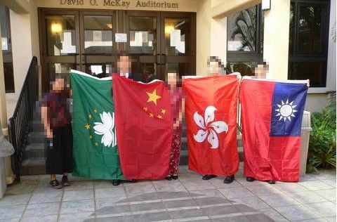
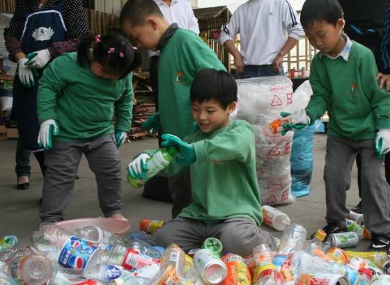

# 大猫看台湾（二）——和"大陸人""內地人”“中國人”很不一樣的“台灣人”

**“我不喜歡機車的狂野，讚賞公車司機的人情味，同是又很敬佩嚴格按政府規定分類回收垃圾的居民。在他們面前，我很有些不知所措。所以，當我在台灣聽到過兩種不同的聲音的時候，我也體會到，在很多層面，大陸距離台灣還有一段路要走。”** ** ** ** **

# 大猫看台湾（二）

# ——和"大陸人""內地人”“中國人”很不一樣的“台灣人”

## 文 / 大猫（复旦大学）

在台灣，我的方方面面看上去都和台灣的主流學生沒有什麽大的差別。一樣是穿著很休閒的衣服，有時候還會拖拉著一雙拖鞋走來走去。但是，我一張嘴說話，就暴露了：我沒有那一口台灣腔，讓人一聽，就知道我不是台灣人。接下來，不可迴避的一個問題就是，他會問我是哪裡人。但詢問的方式不外乎這麼三種： 1、——“你是大陸人？” ——“是啊，我剛從上海來的。” 2、——“你是內地人？” ——“是啊，我剛從上海來的。” 3、——“你是中國人？！” ——！@#￥%……&！ 這樣的詢問，我已經歷了好多次，每次遇到第一種或是第二種問法，我會很高興地向他介紹我自己，會有一個積極地響應。但是，有那麼幾次，我被一種驚奇的問法問到說“你是中國人？！”這個時候，我的第一反應會很不愉快。我常常在想，怎麼在一個同樣講漢語，和我長得也差不多的中國台灣人面前，怎麼我就成了“中國人”？這句話的前提是，你認為自己不是中國人。我就在想，究竟是什麽讓你覺得自己不是中國人，或者說，你身為台灣人，有哪些特質？ 

與這個稱呼相對應的，就是台灣人的自我認同問題。前段日子，中國新聞網報導說，原F4成員之一的朱孝天因為稱內地為“祖國”， 遭到許多台灣網友炮轟。他的原話是這樣的，“剛去了趟杭州火車站，看到了一些很不雅的景象。我總覺得，祖國就像是一位風姿綽約的絕代佳人。美麗的她，雙手已經碰到了天堂，雙腳卻還是踩在爛泥巴里。”這段話獲得大陸網友認同，但有些台灣人問他“何時要放棄臺灣身份證？”朱孝天第一時間在微博回應：“叫祖國很奇怪嗎？我小時候的教科書裡都是這麼寫的呀，這裡雖然不是我的家，卻是我的文，我的種，我的道德價值觀，還有我的根。”後來，他在微博上這樣寫道：“小時候在台灣被叫外省人，在新加坡念書時被叫台灣仔，在美國我是Chinese，在內地變成台胞。我希望在我有生之年可以知道我究竟屬於哪裡。” 台灣真的和大陸有好多不同，隔絕了大半個世紀，這裡確實已經有了很多不同於大陸的特質。在台灣這邊生活，開始逐步接觸到形形色色的人和事情，有一種感覺在心底裡慢慢滋生：在台灣，我和台灣人除了語言相通（也僅指普通話或是“國語”），其他的，很多都不通。這個台灣，我感覺上親切的台灣，其實我并不瞭解。而台灣人，除了和我長得差不多，一樣講普通話（或曰“國語”），但他們，和我很不同。 在台灣，大街上有呼嘯而過的機車（摩托車），旁若無人，會沖上人行道，也會超越汽車，在汽車之間鑽來鑽去。有位台灣司機問我對台灣的道路印象時，我說道台灣的機車太可怕了。而這位中年司機這樣說道：“台灣有些騎機車的年輕人，那是連死都不怕的。” 在台灣，公交車司機的態度好得讓人吃驚。你上車刷卡，他會對你點頭微笑；遇到拐彎，公車上的標誌牌會顯示說“車輛左拐（右拐），請站穩坐好”；等下車的時候，司機會挨個對每位下車的乘客說聲謝謝。這樣的人情味，讓一同來台灣的大陸高校學生也都印象深刻。 在台灣，垃圾回收的規定之嚴格和細緻，也是出乎意料。居民在丟棄垃圾之前，要把垃圾從廢棄物中挑出飲料鋁罐、塑膠包材、報刊紙類、玻璃瓶罐、電子產品、廢光碟等33項資源，作為“有用資源”一類；吃剩的果皮、剩菜等作為不可回收的“廚余”；剩下的，才是真正的垃圾，不可回收，稱之為“一般垃圾”。居民還得用專用垃圾袋裝不可回收的后兩類垃圾，才能合法丟棄。這種“政府專用垃圾袋”價格不菲，3公升的就要25新台幣，6公升的要39新台幣，按照現在人民幣對新台幣的匯率在1:4、6左右算下來，價格確實不菲。而其實那就僅僅是一個黑色的垃圾袋而已。我認為是把不可回收垃圾的處理費算到這種專用垃圾袋裡了，所以才會這麼貴。這樣也好，“攤丁入畝”式的做法，誰丟棄的不可回收垃圾多，就要多花錢買專用垃圾袋。走在傍晚北縣的街頭，伴隨著《少女的祈禱》的音樂，常常會看到兩輛垃圾車一前一後到來，居民就在街邊等候垃圾車收垃圾。前一輛是存放各種可回收垃圾的垃圾車，後一輛則是存放不可回收垃圾的車子。由於居民已經做好了垃圾的分類工作，這些垃圾車的工作很輕鬆，就是收集。這樣也就將處理垃圾的部份工作從原來的垃圾處理場，轉到了居民那裡，從而節省了大量的公共資源支出。 

當然這樣的垃圾處理，普通居民所付出的精力與金錢，當然是比以前多多了。這樣嚴格的垃圾回收制度要能夠堅持下來，還需要普通居民的高素質和政府的相關獎懲辦法。曾與同是大陸來的交換生聊天，說起這樣複雜的垃圾分類處理，還有要買昂貴的專用垃圾袋來丟棄垃圾時，該同學脫口而出：“可以把全部垃圾偷偷帶出去，找個沒人的地方扔了就行了。” 坦白的說，我也很想這麼干，但我知道這樣做，一旦發現要處以1500到6000新台幣的罰款，也就沒了下文。 上面只是台灣人的三個側面，已經讓我感到了很大的不同。這樣的和我們不同的台灣人，站在我的面前，我會有很複雜的感情。我不喜歡機車的狂野，讚賞公車司機的人情味，同是又很敬佩嚴格按政府規定分類回收垃圾的居民。在他們面前，我很有些不知所措。所以，當我在台灣聽到過兩種不同的聲音的時候，我也體會到，在很多層面，大陸距離台灣還有一段路要走。 一種是：“你是大陸來的吧？你們現在經濟上來了，但還要搞民主，老百姓的素質也要好好教育，教育好了趕緊來統一我們。” 另一種是：“你是從中國來的吧？我們台灣現在的成就，在很多方面都是世界一流的，台灣的今天就是中國的明天或者後天，中國人還要好好做。”
