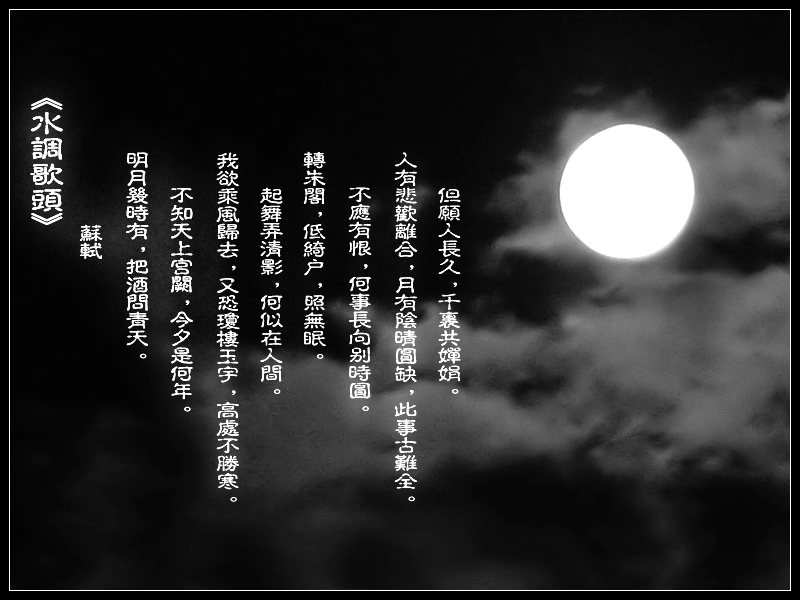

# 密州苏轼·黄州苏轼·儋州苏轼（一）

**“当我们把目光投向黄州那“一蓑烟雨任平生”的潇洒身影时，可能想不到，在此之前，他的人生已然达到了中国古代士大夫的理想境界。然而，对于这位旷古奇才来说，这竟只是一个起点，一段前奏。接下来是空前冷酷的打击，在苏轼身上，这种打击还有着另外一重考验——他向来旷达处世的人生态度，在巨大挫折面前，还能一如既往地坚守吗？”**

# 密州苏轼·黄州苏轼·儋州苏轼（一）

## 文 / 沐风（山东大学）

 提起苏轼，很多人会想到黄州。因为苏轼，黄州甚至成了后世文人心中的一块圣地。在那里，又一位惨遭迫害的天才望着东逝的滔滔江水，不但没有消沉下去，反而走出了一方旷达逍遥的新天地。当他吟啸徐行、怡然自乐之时，或许不知道，今后将有很多失意的文人正在寻找着此刻的自己，寻找着心中的那位精神偶像。 不过，苏轼的旷达绝非由此方始，而是早已有其渊源。苏轼终其一生，都对人生的无常有着莫名的敏感体悟。早在二十四岁，他就写下著名的诗喻：“人生到处知何似，应似飞鸿踏雪泥。泥上偶然留指爪，鸿飞那复计东西。”倘说此诗为一古稀老叟所作，恐怕也没有人怀疑吧。如此沧桑的感触，仿佛此人已历经许多苦难，回首往昔漂泊岁月时，慨叹人生的飘渺无定。但这确确实实出自一个青年的笔下，而且是一个高中制科不久、踌躇满志、在仕途上前途无量的青年。其实，年纪轻轻已有沧桑之感，不正体现了命运之无常？只是这种极为深刻绝妙的譬喻，又只能以苏轼的天才来解释了。 

 既然人生如雪泥鸿爪，无常无定，那么最好的态度，便是超然物外、豁达自乐。苏轼早年在诗里就曾写道：“我今身世两悠悠，去无所逐来无恋。”（《泗州僧伽塔》）此时他还不到三十岁，却已不愿多受世事牵绊。熙宁八年（1066年），苏轼翻修一座旧台，邀苏辙为其命名。苏辙是他的弟弟，更是他的知己，命其名为“超然台”，正合兄长心意。苏轼欣然作《超然台记》，又造就了一篇佳作。在此文中，他论述了世人因“游于物之内”而苦闷忧愁的可悲，自己则游于物外，“乐哉游乎！”超然于世，已经成了他理想中的人生境界。 此时的苏轼，在密州任知州。其实，密州苏轼，是我非常欣赏的一个形象。在密州前后这段时间，苏轼迎来了人生前期的创作巅峰，尤其在填词上。他那些脍炙人口的名作中，有许多诞生于此。一首《江城子·十年生死两茫茫》，沉痛悲凉，令人不忍卒读，被誉为千古第一悼亡词；同样是这个词牌，另一首《江城子·老夫聊发少年狂》，则当真恣情豪放，读来心潮澎湃，开豪放词之先河；更有家喻户晓的《水调歌头明月几时有》，这首不朽咏月名篇，其空灵飘逸不让太白，而于“千里共婵娟”之中尽显旷达，却又是苏轼独有的超然情怀。 那仅仅是苏轼的一个侧面。另一方面，他作为一方太守，十分关心国计民生。朝廷实行的新法，此时已显现出颇多弊端。熙宁七年冬，一场大雪让苏轼写下《雪后书北台壁二首》，其中两句“遗蝗入地应千尺，宿麦连云有几家”，感叹虽有大雪灭蝗，明年的麦收却依然令人不能放心。新法对农业生产的影响，已经引起了苏轼深深的忧虑。离开密州，在赴任的匆匆旅途中，他还写下“老农释耒叹，泪入饥肠痛”这样的忧民之句。也正因为这段时期的他颇多暗讽新法之作，新党视其为眼中钉肉中刺，一张残酷无情的罗网，正悄然铺开。 

 而苏轼虽然对民生之艰充满担忧，对自己的未来，倒并未觉察出真正的凶险。他的心境，用此时所作的一句词来说，正是“诗酒趁年华”。有着“西北望，射天狼”的雄心豪情的他，正值人生壮年，仕途虽称不上得意，却也较为顺利，胸中建功立业的志向，已按捺不能，喷薄而出。离开密州后，苏轼辗转一番来到徐州担任太守，不久黄河决口，洪水来袭，他毫无惧色，一马当先，率领众人加固城墙，数十天不回家过夜，颇有大禹风范。洪水退后，他又屡次上书请求继续修坝，以防患未然，其良苦用心可见一斑。 难得的是，苏轼既有治国安民的济世之志，又不慕名利，淡泊超尘。许多文人前半生汲汲于名利，一朝遭贬，始悟布衣田园之趣；而身为一方太守的苏轼，为百姓谢雨归来，用一组《浣溪沙》悠然描绘出漫步乡野之乐，不可不谓闲适。当我们把目光投向黄州那“一蓑烟雨任平生”的潇洒身影时，可能想不到，在此之前，他的人生已然达到了中国古代士大夫的理想境界。然而，对于这位旷古奇才来说，这竟只是一个起点，一段前奏。接下来是空前冷酷的打击，在苏轼身上，这种打击还有着另外一重考验——他向来旷达处世的人生态度，在巨大挫折面前，还能一如既往地坚守吗？ 很多人想到苏轼在黄州的诗词文赋，一定会毫不犹豫地回答，苏轼处世旷达，当然如此。但历史往往客观得让人失望——答案应该是否定的。 “乌台诗案”对苏轼的打击，是极其沉重的。从入狱到来黄州的最初两年，苏轼经历了人生最为痛苦的一段时期。天才也是人，从一方长吏到阶下之囚，惨遭折磨，侥幸得免死罪，被贬成一个徒具虚职的小官，实际与流放无异，且不说满腹冤屈无处倾诉，便是这种人生的巨大落差也让人万难接受。元丰三年（公元1080年），来到黄州，苏轼的心境极为惨淡凄凉。中秋佳节来临，苏轼借酒浇愁，写下了一首悲怆哀伤的《西江月》： 

**世事一场大梦，人生几度新凉？夜来风叶已鸣廊，看取眉头鬓上。**

**酒贱常愁客少，月明多被云妨。中秋谁与共孤光，把盏凄然北望。**

