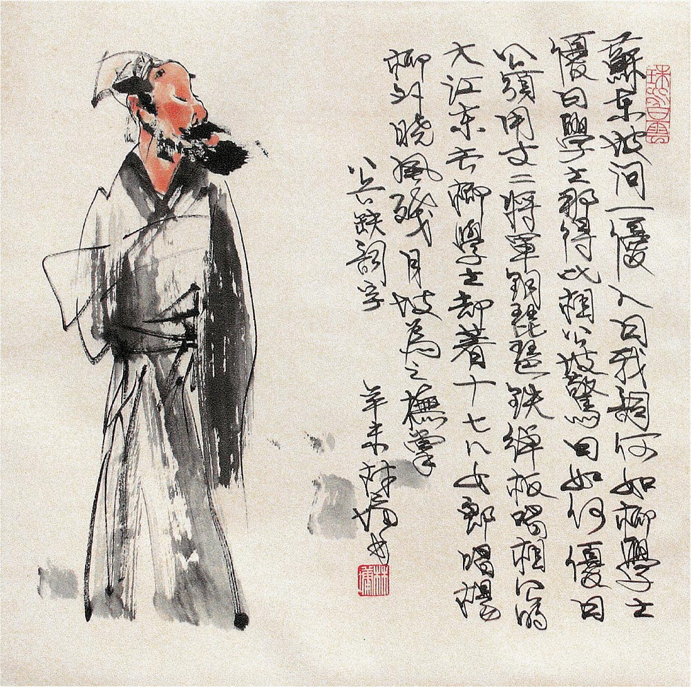

# 密州苏轼·黄州苏轼·儋州苏轼（三）

“**即便面临最困难的处境，紧皱的眉头也不妨舒展开来，给心灵以片刻的宁静，之后继续奋斗，也许会更为精神抖擞。而这种宁静的时刻，不必刻意去排入日程表里，随意率性而得，尽情沉浸其中，方为人生的一种大自在。**” 

# 密州苏轼·黄州苏轼·儋州苏轼（三）

## 文 / 沐风（山东大学）

 前文说到，晚年的苏轼，自嘲得最为彻底，也正是在这种自嘲中，达到了超然中的超然。苏轼的《在儋耳书》一文，正体现了这种状态。他先写自己来到海岛上的凄然神伤，何时出岛，难觅希望。但转念一想，“天地在积水中，九州在大瀛海中，中国在少海中，有生孰不在岛中者？”接着他写下了一个著名的譬喻：蚂蚁困在盆水覆地中的一根小草上，“茫然不知所济”，后来脱险，还向同伴感叹“几不复与子相见！”在人看来，这多么可笑，而人又何尝不是陷在这种困境不能自拔呢！写到这里，苏轼凄清顿消，转而“念此可以一笑”，惨遭贬谪海外的人生大难，就在这样一个幽默的自嘲之喻中淡然消解了。 苏轼之所以对人生有这种通透的了悟，与他晚年对过分执著的勘破有莫大关系。 苏轼的前半生，执著于治国安民的济世之愿，有着“西北望，射天狼”的宏大抱负，这自然不难理解；但黄州之后的他，走向坦然淡定，理应不再受世事牵绊，还有什么不能放下呢？ 有。这就是对“隐”的执著。 

 离开黄州，苏轼的生活也走出了低谷，从此走上了一条平步青云的仕途之路，这反倒不合苏轼心意。他在很多诗文里，表达了归隐的强烈愿望，如《次荆公韵四绝》中“劝我试求三亩宅，从公已觉十年迟”，居于汴京时所书《杜介送鱼》中“醉眼朦胧觅归路，松江烟雨晚疏疏”，七古《书王定国所画烟江叠嶂图》中“还君此画三叹息，山中故人应有召我归来篇”，在颍州时所作《淮上早发》中“此生定向江湖老，默数淮中十往来”。倘若苏轼日后没有再遭贬谪，他应会如上述诗中所说，在适当时候辞官归隐，不问世事。苏轼在汴京位极人臣，却一再请求外放，也可以看出他汲汲于隐的心态。 苏轼的“求隐”并不消极，不管他身居何地何位，依然处处尽着自己的职责，但这种责任某种程度上也是心灵的负担。何况朝廷中的党争已不再着眼于国计民生，而全然是私人争斗，更让他十分厌恶。因而，他的宦海生涯越是春风得意，他便越发欣羡田园之乐，向往东篱之趣。他把心灵的快乐，寄托在无官一身轻后的躬耕陇亩之中。这样一份牵挂，时刻郁结于苏轼的心中。 一朝遭贬，苏轼在挫折中反而无须再为仕与隐的矛盾发愁了。在困难面前，他真正放下了那种过分执著的心态。在惠州，苏轼写下了《记游松风亭》，写的是一件小事，却有着发人深省的哲理： 余尝寓居惠州嘉佑寺，纵步松风亭下。足力疲乏，思欲就林止息。望亭宇尚在木末，意谓是如何得到？良久，忽曰：“此间有甚么歇不得处？”由是如挂钩之鱼，忽得解脱。若人悟此，虽兵阵相接，鼓声如雷霆，进则死敌，退则死法，当甚么时也不妨熟歇。 我想，许多在人生之路上艰苦奋斗一心向前的人们，感到浑身疲倦时，不如看看这篇文章。最让我欣赏的，不仅在于苏轼对自己的宽容，更在于苏轼由此引发的联想。他的兵阵相接也不妨熟歇的理论，也许会为兵家所耻笑，但正是这种奇特的视角，给了我们一种全新的处世态度。即便面临最困难的处境，紧皱的眉头也不妨舒展开来，给心灵以片刻的宁静，之后继续奋斗，也许会更为精神抖擞。而这种宁静的时刻，不必刻意去排入日程表里，随意率性而得，尽情沉浸其中，方为人生的一种大自在。要得到这种自在，关键要学会“放下”，放下心中过分执著的一切，甚至要放下对“放下”的过分执著，从而也抛却了心中的繁芜与苦恼。 晚年深得佛家之真谛的苏轼，正是领悟了这一要义。临终前，友人劝他此时应着力心念西天往生极乐，弥留之际的他回道：“着力即差！”这一信念，在苏轼谪居南海的岁月中充分体现了出来，让他轻松地“享受”了这段条件最为艰苦的生活。 

 既然无须着力，不再去计较得失，心中无牵无挂，那么，又有什么生活不可以享受呢？乐亦乐，苦亦乐。如果说黄州的苏轼以一种淡看名利的旷达而具备“也无风雨也无晴”的心态，那么惠州、儋州的苏轼，则以一种随遇而安的逍遥而至于“处处风雨处处晴”的境界，纵然身外风雨如晦，心内依然晴空万里，乐得自在。这种情怀，谈不上入世，却也并非出世，我称之为“容世”。 
