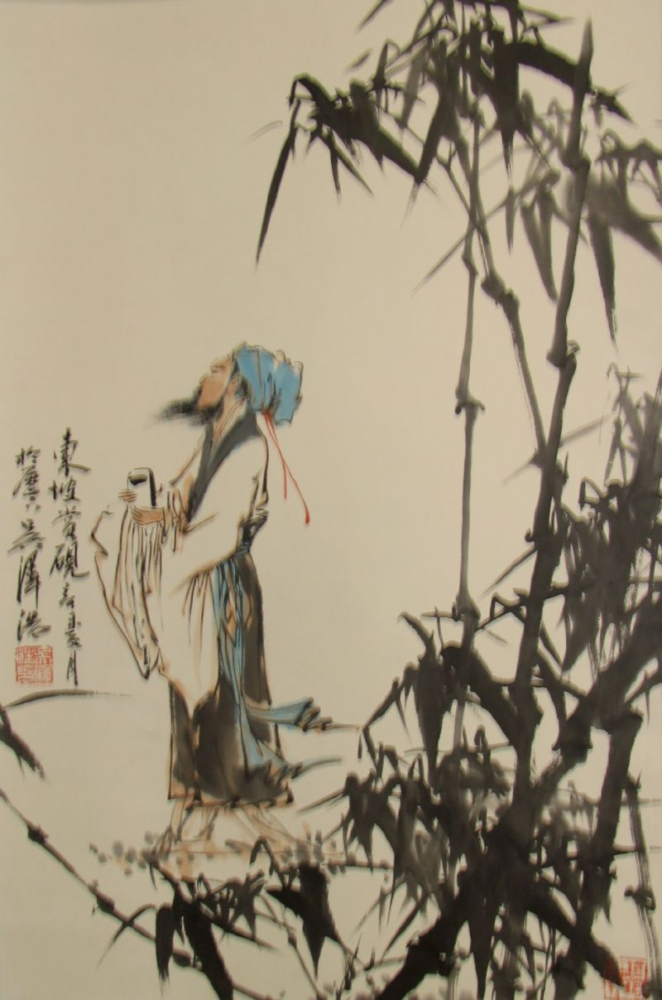

# 密州苏轼·黄州苏轼·儋州苏轼（二）

**“天才容易囿于自恋，能够自嘲的本就不多，正因如此，当他们陷入困境的时候，常常极其苦闷而难以自省。而一个天才一旦在挫折之中可以自嘲，就没有什么能够真正打败他了。令其政敌颇为头痛的一点就在于，他恰恰有着超乎常人的幽默感，遇到的各种困难都能在诙谐中释然面对。”**

# 密州苏轼·黄州苏轼·儋州苏轼（二）

## 文 / 沐风（山东大学）

 苏轼寓居在黄州的定惠院。东山上，在诸多杂花之中有一株海棠，当地人不识其名贵，这引发了苏轼无限感慨。在咏海棠的这首诗里，他开篇即道：“江城地瘴蕃草木，只有名花苦幽独。”之后以佳人拟海棠，尽写其天资国色，却幽居空谷，因而“雨中有泪亦凄怆，月下无人更清淑”。而苏轼散步中忽逢此花，情由心生，不禁“叹息无言揩病目”。诗歌的结尾感叹道：“天涯流落俱可念，为饮一樽歌此曲。明朝酒醒还独来，雪落纷纷那忍触！”苏轼借海棠一抒其身世之悲、不平之怨，读来着实令人感伤。 

 苏轼当然不会由此郁郁而终，其人生的关键转折即将来临。是的，说起苏轼的转折，众所周知是在黄州，但绝非刚到黄州之时，而是在这里的第三个年头，也就是元丰五年（公元1082年）。 这是我偶然发现的一个事实——苏轼的前后《赤壁赋》《念奴娇•赤壁怀古》《定风波•莫听穿林打叶声》《临江仙•夜归临皋》等等不朽名作，皆作于元丰五年。此前的作品，少有这些词文中的旷达淡定，而元丰五年后，苏轼便愈发坦然自在了。 这是巧合吗？应该不是。苏轼经历了一个痛苦的反思过程，前两年的低潮期，并不应被我们忽视。之后的重大转变，实际上也不突然，二者并不冲突，恰恰都是苏轼必然要经历的人生阶段。 苏轼在此之前的旷达，并非虚伪做作，只是“乌台诗案”对他的打击实在太大了。这场冤狱最残酷之处，是对他尊严根本上的粗暴摧毁。这对文人来说是最具毁灭性的。对一个有素养的知识分子来说，你可以夺走他的一切，但绝不能夺走他的自尊，一旦剥夺了他的自尊，他就很可能撑不住了。“文革”中有多少知识分子自杀，之所以走上绝路，绝不仅仅是因为肉体上的折磨，更是精神上的凌辱，彻底剥夺了他们为人的尊严。苏轼也是一个心高气傲的才子，绝不堪忍受一群无耻小人的污蔑和攻击，但他却无法辩解，身为阶下囚，只能任人凌辱，甚至被人用刑，其怨愤不平之气，自然郁结于心。来到黄州，苏轼惊魂未定，惶恐未消，又远离亲友，寂寥难耐，生活上拮据困窘，最初两年的凄凉自伤，也就不难揣测了。 但苏轼终究是苏轼。两年的黄州岁月，生活渐趋平稳，他的心态也渐趋平静，尤其是开垦东坡（值得注意的是，这也发生在“余至黄州二年”后，见《东坡八首并序》），一定程度上解决了拮据问题，更让苏轼在苦中作乐中寻回往日的闲适心境。旷达复归到这位天才身上，并真正昭示出这种精神的宝贵，让他在困顿之境实现了人生第一次超越。俯瞰大江东去，从艰险中走出的苏轼，自在吟啸徐行，尽赏清风明月，昔日超然台上纵论的物外之趣，于今痛快畅享，也留给了后人一个无限倾慕的背影。 不过，如果以为这就是苏轼人生境界的巅峰，那又错了。密州苏轼，令人敬佩；黄州苏轼，令人欣羡，但这既是转折，更是一个新的起点。当苏轼又经历一番宦海沉浮后二次遭贬，被迫来到惠州、儋州时，新的打击不但没有让他重新消沉，反而使他走向了一个崭新的境界。正是儋州的苏轼，成为了这位天才定格在我心中一个最为仰慕、最为钦服的形象。 随着新党的渐渐失势，苏轼也渐渐迎来自己政治生涯的最高峰，官至翰林学士知制诰，在起草的奏议文程中，他建言广开言路、改革吏治等措施，努力尽好一份责任。但朝廷上的党派纷争实在令其反感，他一再请求外放，终获授命杭州太守。接下来的几年宦海历程，他过得平稳而安然。随后，新的灾难又降临了，而且远比上一次更为残酷。宋哲宗元祐八年（1093年）九月，当政的太后去世；绍圣元年（1094年）四月，新党中的章惇上台，将苏轼贬至大庾岭外的惠州。苏轼不得不以将近花甲之年的老弱之躯，来到当时中原人士畏而远之的瘴疠之地。然而，让那些奸佞宵小万万想不到的是，他们这么做只不过让苏轼的生命深度又丰富了一重。即便后来章惇在愤恨中将其贬至海南，苏轼依然逍遥自得，这恐怕令这群身陷名利场的小人百思不得其解。 这么说自然绝非无凭无据。惠州、儋州的苏轼，比之黄州时的他，更为潇洒，看看他作于这两个阶段的两篇记述夜游的小品，就能感受到其中明显的不同。 首先是他在黄州写下的那篇著名的《记承天寺夜游》： 元丰六年十月十二日，夜，解衣欲睡，月色入户，欣然起行。念无与为乐者，遂至承天寺寻张怀民。怀民亦未寝，相与步于中庭。庭下如积水空明，水中藻荇交横，盖竹柏影也。何夜无月？何处无竹柏？但少闲人如吾两人者耳。 

 文章虽短，意蕴却极为丰富。关于这篇文章表达的情感，或以为旷达，或以为黯然，历来众说纷纭。其实，即便是苏轼本人，也未必能说清此时复杂的心绪。望着竹柏的澄澈月影，苏轼与友人随意漫步，心中自然十分悠然闲适，但也难免有着些许落寞，些许寂寥。一句“但少闲人如吾两人者耳”，既有讽世避世的孤傲情怀，又不乏对这种孤傲的自嘲，在孤芳自赏的惬意中，难免顾影自怜的伤感。这篇不足百字的小文之所以成为各种苏轼选本几乎必选的名作，大概正是因为寥寥数笔却勾勒出了极为复杂的情怀吧。 晚年的苏轼来到儋州，有一篇《书上元夜游》： 已卯上元，予在儋州，有老书生数人来过，曰：“良月嘉夜，先生能一出乎?”予欣然从之，步城西，入僧舍，历小巷，民夷杂揉，屠沽纷然。归舍巳三鼓矣。舍中掩关熟睡，已再鼾矣。放杖而笑，孰为得失?过问先生何笑，盖自笑也。然亦笑韩退之钓鱼无得，更欲远去，不知走海者未必得大鱼也。 同为短篇笔记，同为夜游，心境却大为不同。先看缘起，承天寺夜游是“无与为乐”而去寻友求乐，上元节夜游则是友人来邀而欣然出游。前者看似主动，实则是排遣难以消解的孤独；后者看似被动，实则是无所不可的随然而安。再看所见之景，前者是宁谧的竹柏之影，苏轼在澄澈月色中得到慰藉；后者是热闹的集市盛景，苏轼在与民同乐中开怀自在。上元节夜游归来，苏轼“放杖而笑”，笑声中的感情已没有前者那么复杂，笑的是自己曾经对得失的过分在意。在轻松的自嘲中，他度过了一个愉快的夜晚。 难得的是他不仅仅是“自笑”，最后竟笑起韩愈“不知走海者未必得大鱼也”，对人生的挫折已看得最为透彻。悠悠青史中，不知有多少人“钓鱼无得，更欲远去”，以期“走海”而“得大鱼”！唯有饱经风霜、历尽磨难的苏轼，一语道破人生之无奈——作为一个渺小的个体，失意总是在所难免，尤其是那些心中有所坚守、不愿向世俗妥协的生命，欲成就一番事业，谈何容易。然而深深觉察到这种无奈的苏轼，不但没有丝毫消沉，反而秉持他一贯的乐观，一句“孰为得失”便将这种失落远远抛在了身后。名利终究为身外之物，享受生活，当笑则笑，岂不痛快！ 这段小文，非偶然之作，乃是苏轼被贬到惠州、儋州后的心境自然而然的流露。实际上，他在这一时期的诗文中，最常见的便是一个“笑”字，所笑者往往非他，正是苏轼自己。天才容易囿于自恋，能够自嘲的本就不多，正因如此，当他们陷入困境的时候，常常极其苦闷而难以自省。而一个天才一旦在挫折之中可以自嘲，就没有什么能够真正打败他了。令其政敌颇为头痛的一点就在于，他恰恰有着超乎常人的幽默感，遇到的各种困难都能在诙谐中释然面对。而晚年的他，自嘲得最为彻底，也正是在这种自嘲中，达到了超然中的超然。 

