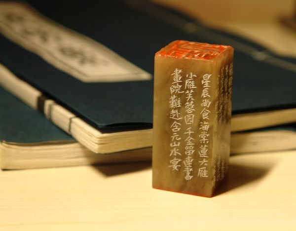

# 密州苏轼·黄州苏轼·儋州苏轼（四）

**“苏轼的伟大之处或许正在于此，当常人难以承受的灾难降临到自己身上时，苏轼担忧的依然是国家和百姓的命运，而回到自己的生活上，反而十分达观，一份美味的水果，足以令他在困苦的生活面前微笑自足。苏轼的心胸，容纳了艰辛的世人，也宽容地纳入了自己的艰辛。”**

# 密州苏轼·黄州苏轼·儋州苏轼（四）

## 文 / 沐风（山东大学）

 包容一切，享受一切，“六十而耳顺”的苏轼，也完全达到了“从心所欲不逾矩”。不必再去细分入与出的界限，苏轼只须依照自己的心意活出自己，之前的坚守也没有全部放弃，只是比过去坚守起来更加轻松，更加释然。 譬如，苏轼依然没有忘记关心民生，他的人道主义精神如他的乐观幽默一样，伴随着他的一生。惠州、广州的地方官员，与苏轼相交甚好，他也借助这层关系，帮当地百姓做了不少实事，如广为传诵的建议广州太守王古引山泉入城，解决了城内居民的吃水问题。苏轼发现惠州农民被官吏盘剥严重，便马上写信向负责的上级官员（也是他的朋友）反映。对社会，他总是抱着这样一份热心。当然，面对积弊沉疴，更多时候，他一个戴罪之人是无能为力的。如杜甫一样，他也把这种忧民刺政的情感写进了诗里。 苏轼在惠州写了许多荔枝诗，其中便有这样一首《荔枝叹》。前半部分咏史，写汉唐进贡荔枝给平民带来的危害，之后直接写本朝如今地方向皇帝贡茶、贡花，同样给百姓带来极大负担。谈起苏轼与荔枝，我们往往会想到他那两句“日啖荔枝三百颗，不辞长作岭南人”的惬意，恐怕想不到苏轼在享受这份甜美的同时，并没有忘记这小小珍果背后的一份沉重。苏轼的伟大之处或许正在于此，当常人难以承受的灾难降临到自己身上时，苏轼担忧的依然是国家和百姓的命运，而回到自己的生活上，反而十分达观，一份美味的水果，足以令他在困苦的生活面前微笑自足。苏轼的心胸，容纳了艰辛的世人，也宽容地纳入了自己的艰辛。 当我此刻在温暖的屋中，舒舒服服地写下这些文字时，想着彼时苏轼之艰难，而我屡屡用“享受”一词来形容他对生活的态度，自己都觉得有些残忍。但读着他的诗文，却又觉得这个词最为合适。“报道先生春睡美，道人轻打五更钟”，多么温馨的画面！难怪据传深居京城的章惇听了更为嫉恨，将其贬至海南，想他在朝中锦衣玉食，恐怕也未必有如此幸福的时刻！ 

 但在苏轼面前，章惇也有章惇的无奈。他只能一次次证明自己的卑鄙与愚蠢，再就是证明苏轼的随遇而安绝非虚伪标榜，让人再也无法指责其故作姿态。在惠州，苏轼写下“试问岭南应不好，却道，此心安处是吾乡”(《定风波•常羡人间琢玉郎》)，即将奔赴海南，他又写“他年谁作舆地志，海南万里真吾乡”，这首诗是赠给弟弟的，诗名很长，可视作小序，为《吾谪海南，子由雷州，被命即行，了不相知。至梧乃闻其尚在藤也。旦夕当追及，作此诗示之》，不难看出，此时二人都明白离别很可能便是永诀。而苏轼依然保持着他的乐观，告诉弟弟自己将以海南为家。读他的《上书元夜游》等文章，这位与民同乐的老翁确实是这么做的。 苏轼在儋州的诗文，数量不多，却是我最喜欢的苏轼作品。此时的诗颇有闲适之趣，但在海南的实际生活是怎样呢？苏辙曾这样描述哥哥的处境：“昌化非人所居，食饮不具，药食无有。”我们也只能在苏辙这里读到这样的真实，因为在苏轼那里，生活充满了情趣。也只有在如此艰苦中的闲适，才不是“伪闲适”，而是真正超越物质上的束缚，达到了不为形役的自由自在。同时，这不仅不意味着逃避世事，反而是以一种悠然享受的态度对待日常生活。他写的《纵笔三首》、《被酒独行，遍至子云、威、徽、先觉四黎之舍》三首、《汲江煎茶》等诗，于凡俗中寓雅致，在困顿中见谐趣，读来着实令人钦服苏轼苦中作乐的品格，这才是一份真正毫不伪饰的逍遥。 读苏轼笔记，他好梦中得诗。在海南，苏轼同样有此奇妙的经历，写出的诗题目很长，依然可以说诗题即序，即本身无题，从中也可以看出苏轼并非刻意作诗，只是意兴所致，得句即书，率然自乐。这首诗名为《行琼儋间，肩舆坐睡，梦中得句云“千山动鳞甲，万古酣笙钟。”觉而遇清风急雨，戏作此数句》，这梦中所得的两句诗果然颇有气势，但我更欣赏全诗中的另两句：“幽怀忽破散，永啸来天风。”当苏轼想通了心中的不平之后，仰望高天，长风呼啸，景象何等苍凉，而又何等开阔！也只有如远天长空般阔大的心胸，才能在困苦中依然注意到如此广袤的旷景，而这份旷景，本就一直在我们的头上，从未消失过。 密州苏轼，积极入世而淡泊高远；黄州苏轼，孤高出世而旷达自得；儋州苏轼，宽心容世而逍遥自乐。我一度以为，这乃是人生由低而高的三个境界。但跳出这种思维方式，忽又发现，其中任何一种境界，不都是理想的生活状态么！也许，我们应该再次记起苏轼的随然，对这三种处世态度，取其所长，活出我们自己，也不枉千年前，曾为后人留下了那样一个灵动的形象。 

 （全文完）
