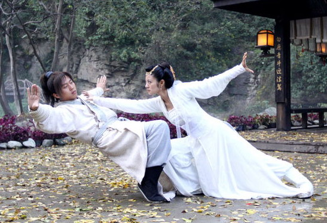
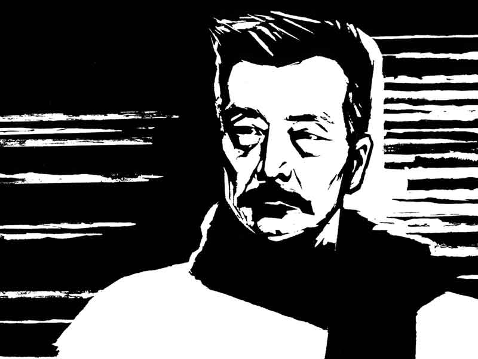

# 少女藏刀（一）关于阅读与梦想及其他

****于冷峭中我读见热肠，于刻薄中我读见沉挚，于决绝处我读见痛哀，白纸黑字里，有大无畏，有大爱大憎，有先知先觉者的孤愤，有荷戟独彷徨的激楚。是以读过的那些书中，最打动我的文字始终是鲁迅。不在其文字本身，而在于一种人格的重量。****

### 

### 

# 关于阅读与梦想及其他

### 

## 文/花爷（复旦大学）

### 

### 

从小读书颇杂，难成体系，姑且以人物为线索吧。若要谈我的所谓阅读史，则不得不从鲁迅先生开始。印象中第一次自己买书，便是八岁左右某日放学回家的路上，五块钱搬回了砖头似的两套盗版鲁迅杂文集。尽管十有八九是读不懂的，却隐约能够感到，有些什么很重很重的东西在里头，吸引着懵懂年幼的我，去反复揣摩那艰涩的造句。 小学后两年是金古梁温一统江湖的时代，一度很是沉迷，真正的刀枪入梦。那大概也是我最耽于幻想的岁月吧，仗剑载酒快意恩仇，是我所能想象最浪漫的生活，心中“侠之大者，家国天下”的种子，或许便是那时深深种下的。顺带一提，我小时候颇男孩子气，风风火火、大刀金马，我娘还一度为此而忧心忡忡。 去年假期里在阁楼整理旧物，翻出来初一初二时候的作文本，其中一篇读书笔记开头写道：“以下三人吾最爱，鲁迅金庸张爱玲”。大笑。犹记当年读张爱玲，为之倾倒不已，连带着读了不少的朱天文、李碧华、简貞以及三毛等等，也很是“华丽而苍凉”了一阵子；不过那时喜欢的女作家们，尽管小儿女情态，字里行间或多或少还是有些“一杯看剑气”的豪情的。初三时已开始蓄长发，仍不改少年心性，读诗则喜唐人，“仰天大笑出门去”、“天下谁人不识君”这样的句子，读史则魏晋三国事，癫狂与醉侠的血腥浪漫，小说则是福尔摩斯或基督山伯爵三个火枪手一类“法国金庸”，四大名著里最喜三国演义，一句“吾乃常山赵子龙”，绕梁三日余音未绝，令我怀想至今。先生的书还是断断续续地读着，仍然不得甚解，却渐渐能从嬉笑怒骂里读出彻骨悲凉，并持续地予我以某种强烈的精神冲击。 高中以后多是读名家杂文散文，钱钟书、林语堂、梁实秋、汪曾祺、王小波，至后来的摩罗、张承志等，各领一时风骚，均给我带来过一定程度的影响。武侠已不再看，而有时读史记或民国人事，却仿佛当年挑灯夜读乔峰大战聚贤庄，“举卷方诵，血脉贲张”。我的英雄梦想一直没有死去，却不再是剑雨飞花、白骨红颜，而是真实地发生在这片千百年来日升月沉的土地上、一群平凡之又平凡的中国人的身上。 

### 

 这时再读先生的书，别有一般滋味在心头。从一开始全然的高山仰止，到后来逐渐深入的由理解而至同情，而愈敬爱之，随着我不断成长，先生之于我亦是血肉渐丰：于冷峭中我读见热肠，于刻薄中我读见沉挚，于决绝处我读见痛哀，白纸黑字里，有大无畏，有大爱大憎，有先知先觉者的孤愤，有荷戟独彷徨的激楚。是以读过的那些书中，最打动我的文字始终是鲁迅。不在其文字本身，而在于一种人格的重量。他让我知道世上竟还有这样的人：日复一日锤炼着内心的火焰和毒，铁与血，恢复与复仇，用最痛苦的灵魂，向世界施以最恶毒的诅咒，唱出最血腥的歌声。他的内心未必有甚么希望，却留给青年以希望；他双眼只见墨浓般黑暗，却指给青年以光明。甚至内心里我将他当作精神导师，尽管先生早已有言在先：青年不应寻什么乌烟瘴气的鸟导师，他也坚决不要做什么鸟前辈。可是每当困惑迷茫时，渴望能有一个我至敬至信之人给予指点时，总会想起那沉默背影。他给予我的，也许是一种生命的底色。 大学一年里基本在阅读学术论著，为我开辟另一广阔天地，方才惊觉从前视域多么狭隘，说到底我的年少时光只是被一股意气裹挟而去罢了，于贫瘠的思想未尝有过多大建树，我的情感丰富流变，思考却似仍停留在少年时。我震撼于文字的另一种美，源于严谨的逻辑推演与雄辩的论证，给予我的刺激以及思想的光芒，已然令小说的所谓智慧变得狼狈，杂文的所谓幽默变得索然无味。我战战兢兢匍匐于大师脚边盲人摸象，却在一片支离破碎与彼此冲撞中丧失方向。更遑论生活中种种琐碎事，如意或者不如意，日复一日磨蚀青春岁月的峥嵘。这个世界倒塌了不是轰然一响，而是唏嘘一声，艾略特如是说，我其实不赞成他，可是，你是否也有过这样的时刻，感觉到自己什么都没有做，而生命的热力渐渐冷却，不知道流向何方？我习得了细枝末节的技巧，却似乎失去了往日天真、光洁而完整的情怀，或许还有一些别的，或许要留待十年以后方才明白。 

### 

 但至少那套盗版鲁迅杂文还摆在案头。从广州千里迢迢带来上海，又从东区搬到南区，我暂时地没有力气去翻开它，然而它一直在那里，告诉我勿忘初心。他说：“有些人毕生追求的就是有些人与生俱来的。在生命完结的时候，有些人得到了他们毕生追求的东西，有些人却失去了他们与生俱来的东西。”总有一天I will be back，那时我将脚踏七色彩云迎接最初的梦想。 

### 

### 

（采编：黄理罡 责编：黄理罡）

### 

### 
