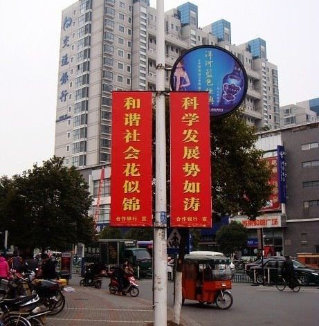

# 旅美日记（一）：理想国 ideal of the west

**现时各种自称民主的政权如过江之鲫，而且大多振振有词：我也有选举啊，我也投票啊，我也很民主啊。咋一听不免犯了糊涂，有投票算不算民主呢？其实民主的判断标准很简单，就是选民的意志能不能得到体现。如果大家喜欢巧克力政府非塞给你香草，那就不是民主。哪怕形式上装饰得再像。而强制替代程度的大小，正好可以作为一个民主程度大小的参考标准。**

### 

### 

# 旅美日记（一）：理想国 ideal of the west

## 文 / 许子辰（香港大学）

### 

萨缪尔·亨廷顿曾经概括过西方的理想，以之描述西方文明，区别于非西方文明。其核心总的说来是消费者主权（consumer sovereign），公共主权（public sovereign）和公民自治（civic empowerment），分别对应经济、政治、社会三个领域。 什么是消费者主权呢？简单来说，就是市场上的商品和服务由消费者的喜好来决定。如果消费者喜欢巧克力，不喜欢香草，那么生产商就应该去生产巧克力冰淇淋而不是香草。道理看似简单，但是现实生活中常常有反例。比如移动通信领域，各种套餐有时让人觉得不尽如人意，买多了用不完，买少了又贵，大家无奈地接受现实，这就是强制替代（forced substitution）。越是自由公平的市场，消费者主权越大，强制替代越少。反之，改革开放前就那么几种商品，你喜欢也得买，不喜欢也得买，吃不到小麦只能拿米代替，那就没有消费者主权。 由此引申到政治领域，就是公共主权。何谓一个民主政体，就是选民的喜好能在政治市场中得到体现。现时各种自称民主的政权如过江之鲫，而且大多振振有词：我也有选举啊，我也投票啊，我也很民主啊。咋一听不免犯了糊涂，有投票算不算民主呢？其实民主的判断标准很简单，就是选民的意志能不能得到体现。如果大家喜欢巧克力政府非塞给你香草，那就不是民主。哪怕形式上装饰得再像。而强制替代程度的大小，正好可以作为一个民主程度大小的参考标准。 那么以上两种主权从哪里来呢？来自公民自治。简单地说，在政府和个人之间有一个公民社会，所有公民在这个领域里与人交往，组成兴趣小组，参加各种活动，做各种自己想做的事情。公民社会的运作很多时候不是靠法律，而是靠社会上的约定俗成。公民社会中的个人，都有着完整的意志，做自己想做的事，不受约束和压迫。在这样环境中培养出来的个人是有很强的行动力的。 美国与西方的理想国度的理念最为接近。强大的公民社会是其力量的源泉。在美国感受最深的就是生而为人，有权利在制度的框架之内去实现自己的潜能。凡是允许做的事，都可一试。记得乘大巴去华府，司机在还没到达目的地前就要乘客下车，一个黑人妇女站起来义正辞严动员大家去网上投诉巴士公司。看她慷慨激昂的样子宛如总统动员选民。还有，UNC的学生在校长办公楼外演说，要求校方废除清洁工人工作时间不准坐下的规定。观其言行，好似当年的马丁·路德·金。作为一个个人，在这样的环境中是很有力量的，很难受到侵犯。在利益受损的时候会自发的起来争取权益，这正是美国制度运行的根本。没有强大的公民社会，民主无法得到保证。因为总有人想通过扭曲制度来为自己谋取最大好处。假如人人都有投票权，但是大部分人习惯于接受安排，那么最终的结果就是少数人凌驾于多数人。而在美国，这种情况得到了最大程度的抑制。美国制度设计的理念是创造各种各样的利益群体让他们相互制衡。假如没有强大的公民社会，没有勇于采取行动的公民个人，他们的利益是无法得到保障的。这也是美国和中国很大的不同。中国的民习惯被代言，往往寄希望于“士”，习惯于接受安排，内心渴求的不是民主，而是善治。当美国式民主移植到中国土壤上，很可能出现问题。根本在于美国人所受的约束少，不单是政治上的，而且是文化上的。美国个体有想法而且愿意付诸行动。中国人所受约束多。当你想想自己选专业要受到父母多少裁定的影响，就能体会到那种无处不在的文化约束。在约束条件下长大，行动力自然弱小，也比较怯于挑战权威，挑战未知，不愿声张自我利益。 那么东方的理想国应该是什么样的呢？除了加大民的行动力外，士人阶层的复兴也是必不可少的。中国人再怎么个人主义，也不可能超过美国人。你上有老，下有小，都指望着你，你的约束必然比美国人多。在这个角度中国是比不过美国的。但是中国有一个特殊的士人传统，知识分子以天下兴亡为己任。这在西方要淡得多。东方的理想国，应该是在士的复兴和民的觉醒两个前提下，去创造一个有序的社会。或许是和谐社会。 

### 

### 

### 
