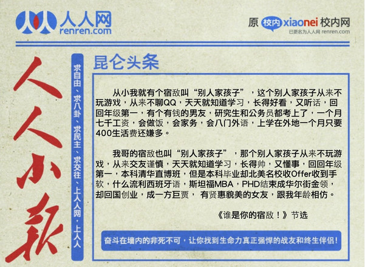
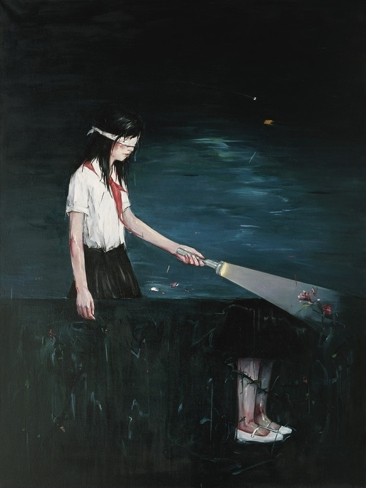

# 旅美日记（三）：历史的后门

**那么是哪里出了错？难道好好学习天天向上是一种过时的观念，一种腐烂致病的霉菌么？难道他们从小到大含辛茹苦挑灯夜读就一文不值么？问题就在与他们在一次次地实现“打怪升级”的目标的同时，没有给自己留下历史的后门。**

### 

### 

# 历史的后门

### 

##  文 / 许子辰（香港大学）

### 

### 

来了北美后，开始知道有一种人叫北美猥琐男。他们大多是到美国来读理工科专业的研究生。终身问题没有解决，年纪一大把了还茕茕孑立，见到中国女生脸上经常性地挂着被称为“猥琐”的笑容。难为他们了。他们中的很多，都是从小被父母教育两耳不闻窗外事，一心只读圣贤书。读书于他们就如同打怪升级，从小学升中学，在从中学升大学，最后升入研究生。他们中的很多，也许从小心怀理想兼济天下，坚信通过科举之途一定能实现飞黄腾达，为帝王师的宏愿。然而现实是残酷的。研究生毕业后，无级可升，面临找工作，他们才发现自己竟然一无是处。和那些经常把妹，泡吧，吃喝玩乐不务正业的飞禽走兽相比，他们的视野太窄太窄，他们的选择太少太少，他们的社交能力还很匮乏，连个女朋友都找不到。最后只能把猥琐往脸上一戴，跑到academia或industry去当廉价劳动力。当然，这也是一种生活，但是和他们当初的预期相去何止千里！ 那么是哪里出了错？难道好好学习天天向上是一种过时的观念，一种腐烂致病的霉菌么？难道他们从小到大含辛茹苦挑灯夜读就一文不值么？问题就在与他们在一次次地实现“打怪升级”的目标的同时，没有给自己留下历史的后门。 中国的教育制度，在高考之前，可以概括成一种单任务模式。所有学生的任务，就是在高考中取得尽量好的成绩。当然还有很多其他的次要任务，比如说社团活动，演讲比赛，体育比赛。但是这些次要任务，都是可以被牺牲的。没有教师和家长会因为孩子被占用课余时间来上课而留下鳄鱼的眼泪。所以这样的制度最后培养出很多“应试”机器来。应试不单单是考试，它可以是任何一种明确定义的任务。比如，老板下达个命令，要求编出符合什么什么要求的程序，学生就能做得挺好。但是让他自己找事情做，他就迷茫了。 

### 

### 

### 

真正的人生，需要面对各种各样的任务。比如社交，交友，结婚生子，享受快乐，为自己确定方向等等。它要求一个成功的人必须能够同时应付不同的任务，排出先后主次，拟定计划方针，一一从容应对。而习惯于单任务的“应试”模式的人，我称之为单功能思维的人，他们在面对一个多任务的复杂局面时表现就不尽如人意。在这个时候，我们需要多功能思维。 然而，多功能思维也有成本。一个很大的代价就是精力的分散。这也是为什么家长老师视早恋为仇寇，视电子游戏为洪水猛兽。因为他们担心这种多功能思维，会不利于孩子的学业发展。确实，单纯的小孩容易把书读好，就如同笨笨的郭靖练成了降龙十八掌，而花花公子杨康始终只有花拳绣腿。然而，杨康比郭靖混得潇洒自在，人人羡妍，香车宝马，楚楚风流，这是不争的事实。于是乎有了一种策略，小时候学郭靖苦练降龙十八掌，长大后转性当杨康四处风流，碰到个小贼还能一掌拍死以显英雄本色。岂不乐乎？ 遗憾的是，行为模式是有惯性的。郭靖就是因为单纯才练成绝世武功。他长大后依然单纯，没有可能变成杨康，自然也享受不到杨康的乐趣。他习惯于别人告诉他做什么，然后一丝不苟地完成，而不是动脑自己去想。这也是合乎经济学原理的。郭靖的比较优势就是打架，社交谈吐实在不是他的专长。当郭靖们精专于打架，而杨康们精专于雇佣郭靖们打架，这个社会的生产力有了最大的提高，郭靖杨康各自实现效用最大化。而且，当郭靖们越打越纯熟，他们会发现，花时间社交带来的收益，还不如提高武力受杨康雇佣带来的收益大呢。于是他们会愈发把时间投入到习武上而不是社交。随着时间的推移，郭靖会愈乎精于打架而疏于社交。因而当郭靖小时候决定单纯习武时，他未来的人生模式很大程度上就已经被决定了。这就是路径依赖。最后，单功能的郭靖和多功能的杨康在发展道路上越岔越远。选择郭靖式的人生也没什么不好，问题是，你愿意吗？ 单功能应试教育到多功能全人教育，本身就是一对矛盾。没有强大外力的推动，谁愿意变？这就是为什么有些人从小到大考试出类拔萃，最后泯然众人，这就是为什么港大毕业生往往是那些拿B的人最后雇佣那些拿A的人替自己赚钱。 对于国家而言结果是同样的。中国现在的制度无疑适合于实现那些明确定义的刚性的单一目标，比如GDP增长。因为中国的制度，依靠上位者去识别当务之急，拟定对策。当有一个明确的当务之急时，上位者是有可能做出准确判断的。 但是随着社会的发展，各种各样的诉求浮诸水面。比如环境保护，社会公正，言论结社集会。经济发展很重要，但是房子不被强拆的权利也重要，自由说真话的权利也很重要，不喝毒奶粉的权利也很重要，不接种毒疫苗的权利也很重要，保育长江黄河很重要，退耕还林很重要，医疗改革很重要，教育公平很重要，调整计生政策很重要，农民工性爱的权利很重要……面对如此多的当务之急，现行体制是很难辨别出主次的。指望领导人英明神武，就如同指望计划经济去实现共产主义一样。领导也是人，也会被各种各样的任务烦得头晕脑胀的。面对多任务的复杂局面，建立一种让各种诉求自由竞争以确定轻重缓急的制度势在必行。 

### 

### 

### 

遗憾的是，制度有路径依赖。假使当年早有预见，就应该留下历史的后门，让转型得以实现。蒋委座当年剿匪不力，无疑是多功能思维惹的祸。没有集中力量办大事的单功能制度，党国何以胜出？也许我们早已进入委座的乌托邦。 然而，中国还要在郭靖的道路上走多远呢？ 

### 

### 

（编辑：黄理罡）

### 

### 
