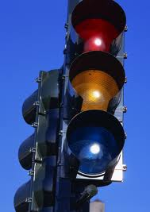

# 旅美日记（二）：秩序与约束

**“现代社会，用法律去代替伦理道德和宗教在前现代社会中扮演的维持社会秩序的角色，正是以一种精确的约束趋代替那些模棱两可的约束，以此在保障社会秩序的同时给予个人更多的自由。”**

### 

### 

** **

** ** 

# 旅美日记（二）：秩序与约束

## 文 / 许子辰（香港大学）

### 

### 

以下为北卡罗来纳州的经历： 在美国感触颇深的一点是其执法之严。我最熟知的例子是对未成年人的禁酒令。说未成年人其实并不恰当，美国人合法饮酒的年龄是21岁，而合法结婚和考驾照最早的年龄是16岁。和中国比起来，确实很不一样。中国人大概很小就可以饮酒了。但是驾照要18岁才能考，而结婚——男22女20。 美国的禁酒令严格到什么程度呢？假设你年满21岁，如果你在大街上或宿舍走道里拿着一个打开的酒瓶，或盛酒的容器，那么恭喜你，你犯法了。如果你领着超过一瓶没开封的酒在公开场合招摇过市，恭喜你，你又犯法了。理由是公开场合饮酒会诱唆未成年人饮酒。北卡的酒吧，进入前都要检查证件，如果未满21周岁就会被拒之门外。即使躲在宿舍里偷偷喝，也得小心。但凡有人举报，警察必来敲门。在中国喝酒是鸡毛蒜皮的小事，没有哪个警察会管这些闲事，除了酒后驾车。在美国，警察不见则已，见者必纠。 咋一看，美国这个崇尚自由的地方，怎么条条框框这么多？相比之下在中国的日子就好似自由散漫无法无天了。其实约束越是精确合理，自由越能得到保障。以饮酒为例，假如未成年人饮酒是绝对不能被容忍的罪恶行径，那么作为政策制定者，你怎么办？一个最粗暴的办法，就是禁止所有人喝酒。这样市场上自然没有酒卖，也就自然没有未成年人饮酒。但是，在这种规定下，所有成年人喝酒的自由都被剥夺了。为了杜绝未成年人饮酒的恶，所有人都付出了不能饮酒的代价。 另一种选择是如开篇所言，限制酒在公共场合的出现，这样虽然对成年人有些不便，但至少喝酒的自由被保存了。而且防止未成年人喝酒的目的也达到了。 比较两种做法，后者之所以能给予人们更多的自由是因为其约束的精确。 

### 

 前现代文明到现代文明的转化，从社会秩序方面看就是约束由粗糙到精细。比如最早的时候，调侃皇帝要被杀头。后来进步一点了，就抓去坐牢或流放。再进步一点的话，只要不涉及诽谤，随你去说：是为言论自由。中国传统宗族社会中，大家长的权力是难以想象的。族中子弟的娶嫁，工作，财产分配，家长都要干涉甚至裁定。即使到了今天，仍有不少家长觉得为孩子选择前途是天经地义的事。究其道理，就是宗族社会中，宗法是社会秩序的保障。为了维持社会的稳定，必须对个人实施人身约束。如果没有一个强大的家族首脑，在家族财产的分配方面就会出现很大的争端，严重的引起械斗。而让所有人服从于一个大家长，就能解决这个问题。问题是，以这种方式的人身约束来维持社会稳定有很多负面效果。比如子女没有婚姻自由，没有选择职业的自由。体现在经济层面，就是人的潜能没有被挖掘，社会创造力被抑制，生产力水平低下。假如放到现代社会，用遗产法规、财产法规去明确家庭成员的权力与义务，就无需一个独断专行的大家长去限制大家所有的自由了。 现代社会，用法律去代替伦理道德和宗教在前现代社会中扮演的维持社会秩序的角色，正是以一种精确的约束趋代替那些模棱两可的约束，以此在保障社会秩序的同时给予个人更多的自由。 再举一个例子，美国的警察在被认为受到威胁时可以开枪。“受到威胁”的定义其实相当宽泛。相反地，在中国，警察开个枪就得写长长的报告解释前因后果，并且在很多情况下都不能带枪执勤。究其原因，美国警察做错事后有办法找他算账，中国警察做错事有时候没办法找他算账。权衡下利弊，上级领导只好限制限制警察的权力，以减少对社会可能造成的伤害。 

### 

 中国目前的情况，是社会缺乏规则意识。例如超速，虽然路旁的限速牌写得清清楚楚，很多人还是不当一回事。有一种论调，是这些规则并不是我们想要制定的，而是被统治者强加的，因而心中对其毫无敬意。由此引申一个问题，就是“恶法”当不当遵守。不过无论如何，追求正义都很难成为暴力和动乱的充分理由。 

### 

### 
