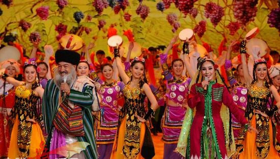
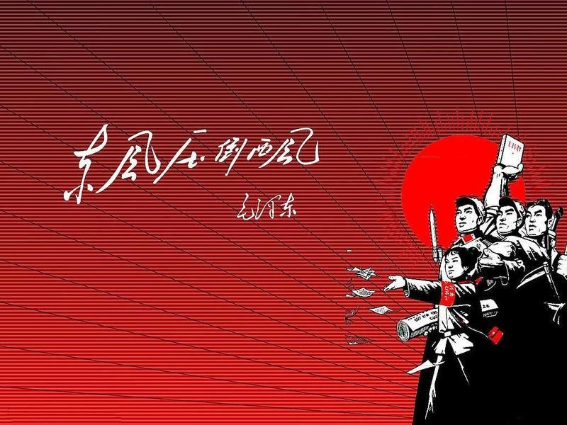
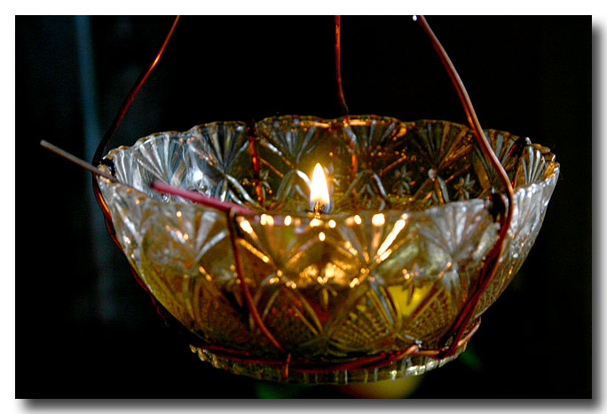

# 朝夕散记（二）——无关普世，有关和平

**根本没有一件事，利于人类而损害民族。没有一件事，利于生命而损害国家。根本没有一种狭隘是正确，没有一种理论叫真理。没有一种GDP是因为流血流汗、杀人越货而光荣。没有一种经济增长是印钞机的游戏。没有一种竞争能靠挥霍下等人的尊严和命脉达到胜利。没有一种爱可以僭越个人发自内心的需求。**

# 无关普世，有关和平

##  文 / 朝夕（《北斗》特约撰稿人）

10月8日，新疆大学一片欢腾，汉族和维族学生聚在一起，唱歌跳舞，汉族学生穿着维族服装，融入到维族学生之中。他们一起放烟花，他们像是从来都是同袍。你能想象促成这一切的人他在牢房里独对寒露的月亮。 

 你能想象刚刚一年多前的7月5日。整个新疆剑拔弩张，维族人和汉族人在路上分开走路，眼中都是敌视和愤怒，对待彼此像残暴的食物链上层。那天我在网吧砸桌子，痛苦得呼吸困难。因为我知道这两队人类，本不该有这样深刻的仇恨。你能想象将这一切陷入更痛苦的深渊的人步步高升，走到政治权力的心脏。 昨天警察玩命地干活，学校政治工作小组枕戈待旦。朋友被不断骚扰，老师被带走，聚众喝酒吃饭放鞭炮的人们被相继控制。可是我们还是喝酒，吃饭，放鞭炮。像从来没有被狗咬过吠过一样，像从来没有失去过自由一样。像我们从来没有愤怒过一样。 一个伟大的属于民族和国家的英雄，劳心劳力饿死了几千万同袍，发动了亘古以来最干净的大清洗。白茫茫大地真干净。他一手拿着权杖，一手拿着原子弹，将敌人和民族都驱赶着冻死在寒冷的西伯利亚。 

 一个民族和国家的罪人，简简单单的结束了这一切。不会再有几亿人活在原子弹的阴影下，不会再有人被驱赶到森林里被大雪掩埋。等待他的没有欢呼和胜利，只有寥落和巨大的烂摊子。 所以。其实什么西方价值观，什么国家民族与普世价值的矛盾根本是个伪命题。根本没有一件事，利于人类而损害民族。没有一件事，利于生命而损害国家。根本没有一种狭隘是正确，没有一种理论叫真理。没有一种GDP是因为流血流汗、杀人越货而光荣。没有一种经济增长是印钞机的游戏。没有一种竞争能靠挥霍下等人的尊严和命脉达到胜利。没有一种爱可以僭越个人发自内心的需求。但是总有那么一种事物，可以随时化身为民族，国家，正确，真理，光荣，胜利和爱。 没有一片土地堕落到可以摒弃人类的价值而生息。如果可以，它不是圣地，就是索多玛。和平不是意识形态，和平是驱逐狭隘，珍重尊严。和平不是民主，和平也不是共和，更不是哪一种姿态的孤傲，哪一种理论的精神胜利。和平是每个普通人不受饥寒侵扰、暴力威胁的美好设想，是不允许谁以个人名义化身民族，国家，正确，真理，光荣，胜利和爱的严正陈词。 和平不是和稀泥的老好人。是对真理最朴素的诉求。是坚定的方向。和平不是谁对可怜人的施舍。是对苦难深深的的怜悯。是照亮灰暗角落的灯。 

