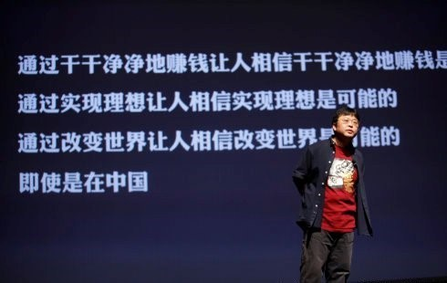

# 朝夕散记（四）——不要用操蛋去对抗操蛋

**“比拼谁更操蛋的做法，只能让世界越来越操蛋。几个刚毕业的学生在一起比谁喝的多，谁更能陪人喝酒吃饭，争相投入颠倒而奴颜婢膝的人生，下次的招聘会老板会将门槛从一斤提高到一升。”**

# 不要用操蛋去对抗操蛋

##  文/朝夕（《北斗》特约撰稿人）

 记住。这不是一个你努力学着操蛋，就能让世界不再操蛋或者给你牛逼的机会的世界。很多人不明白这个道理，经常会想，我都这么操蛋了，我往后退，一只脚站在地狱门口，结果还是劳劳碌碌，卑躬屈膝，即便可以跟那些穷死鬼，饿死鬼，冤死鬼吆五喝六，神气活现，但是却还只是一只拿命小鬼，永世不得超生。 实际上这事情很简单，又一次在公子家煮河蟹，锅壁很滑，迦南说，你看那些螃蟹会踩着同类的身体爬上来耶。如果任由它们爬出来，总有一些还是会安然待煮的，实际上真正爬得出来的并没有多少。 我想人类的特别之处恐怕就是不喜欢同类也被煮，发明了各种办法救其于热火之中，然而肯定不会人人都意气风发笑容洋溢，是文明人，高尚人，腰缠万贯的人，人类的目标是消灭釜底之薪，并非攀比谁爬的高。人类还有一个发明是超越性，超越性最重要的是，消灭靠人体极限构架来的价值体系。 

比如从前人类热爱芭蕾舞，然而自从伊莎贝拉邓肯发明了现代舞，舞蹈所能承载的价值变得更加丰富，人们不需要只用眼睛更能够用肢体和精神接近并创造优雅和高贵。很多征服者曾经沉溺于物质的征服和肉体的消灭，而威尼斯这样的小小城邦，却在熙熙攘攘的交汇与繁华之中享受着虚怀的和平，从未被外力所征服。 肉体和资源的枷锁分外困扰着油滑，贪婪和自私的人类，而拯救自己是永久的课题。靠冥想，靠宽慰，靠审美，靠沉吟，靠苍茫的时空之旅，靠新的契约，靠争论，靠从屠刀到法庭，从武器到交易，靠暗墟之灯的照亮。 所以人类更伟大的发明是，用宗教关怀，政治制度，科学技术，文学艺术来将超越性和基本需求结合——多样的价值才会构成多样的成功，让无用技能有用，让无聊变有趣，让幸福的道路通向百万个新罗马，这是终极关怀的基本素质。人类就应该是不满足于争抢一个蛋糕，所以决定把蛋糕做大的物种。 然而比拼谁更操蛋的做法，不仅愚蠢，而且下流，更重要的是，如果世上只有一种成功叫成功，那么也将只有零星几个人可以达到真的成功，有人说杜拉拉很成功，我却觉得她疲于奔命而且始终处于中层，有人说杜拉拉不成功，我却觉得她学会了如何聪明且不油滑。学会成功不如学会靠谱。 比拼谁更操蛋的做法，只能让世界越来越操蛋。几个刚毕业的学生在一起比谁喝的多，谁更能陪人喝酒吃饭，争相投入颠倒而奴颜婢膝的人生，下次的招聘会老板会将门槛从一斤提高到一升。 比拼谁更操蛋的做法，只是比谁大学时候千方百计得到一个牛逼的GPA，谁三十岁以后能泡十八岁的大学生，谁四十岁以后能坐在台上讲话，谁六十岁以后能还有美女打滚要跟着你，八十岁以后享受最高贵的医疗手段——但是比不得谁大学时候给你一个妞，三十岁以后不阳痿，四十岁以后不高血脂，六十岁以后妻子还活着且是原配儿子是自己的，八十岁以后不会忍着病痛能够有安乐死的权利。 操蛋的王朔是个穷酸文人，他没跟这操蛋的世界做任何交易，他活的真好，女人数不清，个个很服帖，女儿健康成长，出本书版税数一数就顶你们奋斗多少年，还能拿来资助朋友。操蛋的郑渊洁没什么大出息，也没跟这操蛋的世界做任何交易，就是写写童话，有时带点黑色幽默，儿女成双，还有一个不读书，什么择校费，人情费，都省了。 

尽管你吼着给我说这个中国的价值取向不是不是不是这样的——但是，当你走到归途的时候还是会发现：全中国和你一起走在谬误的阳关道上，和全世界逆行。那时的你还那么年轻，现在你垂垂老矣——而你爱的人在遥远的过去向你招手，她张了张嘴，跟你说了五个字：“怜惜眼前人”。
