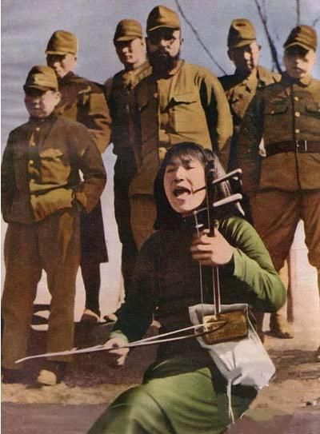
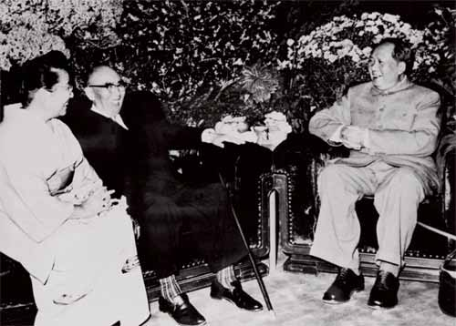

# 走哪算哪（二）：没有好感的民族 ——关于一幅照片的争论

**B说，战争中，他们都是人，那些被巨大的国家机器操控在战场上的人，他们并不想要战争。只是，他们有选择吗？** **我没有说话，我很难想象在漫长八年的侵袭与抗战中，中国和日本的官兵，曾有哪一天，甚至哪一刻，在遍布着国人死尸的战场上，和平的踢球，或者用彼此陌生的语言，尝试着像普通人一样交流。**  

# 没有好感的民族

# ——关于一幅照片的争论

## 文 / 树（中国政法大学）

  事情源于一星期之前。 在校内上看到某好友上传的大篇幅抗日战争时期的图片，浏览的时候，一边的德国朋友B也伸过脑袋来看。见到一幅照片，是中国国民党军队的官兵与他们所看押的日本战俘的合影。照片黑白，如那个年代所有的照片一样，模糊不清的脸庞和臃肿不堪的衣裳。半晌，B指着照片上的日本战俘说，他们很可怜。我想也没想的冷笑一声，他们可怜?! B 沉默，困惑的看我，然后问我，为什么他们不可怜？他们在照片中的处境，不是一样是被战争摧残的人？ 轮到我沉默，第一反应是，他们可怜，那死在他们刀下的中国百姓可不可怜？那被他们的刺刀开肠破肚的孕妇可不可怜？那在人世行走不满十载便被当做野猫野狗一样一枪解决的孩子可不可怜？语言的匮乏与自身的谨慎，让我没有将这些瞬间浮现在脑海的话语倾盆倒出，但那一瞬间在心头燃起的憎恨与厌恶，竟让我明显的感到有涌动的热流在皮肤表面下疯狂奔走，脸都烧了起来。 想了想，我说，我对这个民族，没有好感。 

 朋友也看出我明显的不快，但他对于自己的观点，并没有妥协的意思。他严肃地看着我，问，这些日本战俘们，他们对于战争，可有自己的选择？ 我冲口而出，那被他们杀掉的中国人，难道就有自己的选择？ B沉默，想了想，讲给我一个故事。一次世界大战的时候，英法德三国混战。战争漫长持久，久战无果。而到了圣诞节的那一天，三国的士兵都不听上级的指挥，就这一天，为庆祝他们有着共同渊源的节日，三国的士兵都爬出了战壕，在曾经彼此厮杀横尸遍野的战场上，一起踢足球。那些被政治挑起的血腥，被强行割裂的敌我，在三百六十五天的中的那一天，暂时还给了虚无。 B说，战争中，他们都是人，那些被巨大的国家机器操控在战场上的人，他们并不想要战争。只是，他们有选择吗？ 我没有说话，我很难想象在漫长八年的侵袭与抗战中，中国和日本的官兵，曾有哪一天，甚至哪一刻，在遍布着国人死尸的战场上，和平的踢球，或者用彼此陌生的语言，尝试着像普通人一样交流。但是B所说的话中，又似乎有着什么，是我无法反驳，或者，被长久以来灌输在脑海中的憎恨所遮蔽了的东西。B说，如果简单地对一个民族加以憎恨，是很危险的东西。 探讨了许久，脸庞之下涌动的热流渐渐降温，渐渐平息。但是一个星期以来，内心被这次争论所引起的惊涛骇浪，却仍是一波一波地袭来。 我多次回想在我看到照片的一瞬间那一声冷笑。 我一向不认为自己是个过分极端的人。所以当我对于某些现象，有着明显情绪时，我可以想象，我的同龄人，对此应该皆有着类似或更甚于我的强烈情绪。或许当时站在B面前随意换一个更为直接的中国人，不但要对他的话冷笑，还要对照片上被俘的日本官兵感到咬牙切齿的痛恨和得以复仇的痛快吧。 但是，设想，如果那照片没有中日战争作为背景，如果不看标题不看注解，呈现在面前，是一群被战争折磨的面目模糊衣衫褴褛的人，无论是那站着的官兵，还是那蹲着的战俘。他们手脚被捆绑，面容疲惫而绝望，在抖索的寒风里目光痴呆。不难想象是怎样不堪的外界折磨与内心重负，让这些人，渐渐都失了做人的神采，不过是行尸走肉的姿态。 而若，隔着时空，作为观者的你，不看标题不假思索，第一的反应，该是本能的，对“人”的怜悯和体恤，是对“人”的悲伤和同情，是从一个最基本的人类的角度出发，对于战争的憎恶与痛恨。 但是，不对，这一切理应从“人”的角度出发的情绪，在当你知道蹲着的面目不堪的人是日本战俘的时候，发生了天翻地覆的变化。你的脑海以你自己都尚未意识到的迅速，将那些人贴上血腥的标签，划为不义的种群，旋即以自己都未察觉的偏激与仇恨，将那几个人的身影，扩大为一个庞大的民族，一个拥有一亿多人口的国家，然后用一声冷笑为这个照片贴上封签。那声冷笑背后，只是被礼节隐藏起来的一声：活该。 错了么？很难说。那些被凌虐致死的奴工和慰安妇已然没有仇恨的权力，那些被活埋的眼神与臂膀，如今在地下也已成历史的尘埃，那些在血腥的记忆中侥幸存活的人们，不可能去苛求他们对于短短人生中惨痛之极的经历抱有慈悲的心怀。而那个理应背负起这沉重历史罪责的国家，仍在冥顽不化的试图去轻描淡写中国人的人头与血色。 但是，对的么？很难说。我，我的同代人，距离抗日战争已经过去了半个世纪。半个世纪里，沉淀下来的究竟是对战争的理性反省，还是对某个民族不问青红皂白的一腔仇恨？半个世纪里，我们对于这个以弹丸之地便可凌辱中华于股掌之间的民族，究竟是有了客观的分析与了解，还是多流于憎恨的白眼与口头的叫骂？半个世纪里，我们对于人类自相残杀背后的成因与始动力，究竟是找到了确切的答案与戒备的方案，还是不厌其烦地玩着被凌辱、仇恨、复仇他人的思维游戏？那游戏玩起来令人胸襟大爽，但是，在战火中熊熊燃烧了一个世纪的人类家园，汩汩流淌了一个世界的血流成河，是这游戏，最后的代价。 六百万犹太人被毫无理由地屠杀时，唯一的理由，不过是日耳曼先生说：我对这个民族，没有好感。 而今天，被屠杀被凌虐的犹太人幸存者，犹太人后裔，可以在欧洲守护着他们相对宁静的家园与灵魂，与德国总理的下跪道歉有关，与德国政府的国家赔偿有关，与德国国民的深思反省有关。被伤害的灵魂，要有应得的体恤和安抚，才可再次找到通往理性，宽容，与宁静的路。这是为什么，十几亿中国人需要日本政府一句诚心实意的道歉，一个真诚忏悔的低头，和对幸存者在有生之年尽心尽力的赔偿。这不是可以轻易妥协的问题——讽刺的是，七十年代中日建交之时，竟是由我们伟大的领袖与敬爱的总理大笔一挥，便秉承泱泱中华大气派，直接放弃向日本索偿权利。 

 但同时，更为必要的，更为实际的问题，是我们，未亲历战争，却成长在《地道战》《游击队》电影中的我们，受着铺天盖地单向宣传的爱国主义教育中的我们，永远只能学到一半历史了解一半世界听到一半声音的我们，如何去保有一个人之为人的独立思想？一个人之为人的基本良知？一个人之为人的客观自重？要如何，在看到任何的战争图片时，才能不让那瞬间燃烧的民族主义之火，遮蔽了人之为人的柔软悲悯？  

### 【作者注】

附上另一篇文的链接，在一个星期的思索后读到这篇文字，那份契合，心下暗惊。但遗憾的是，我找不到这篇文字的未删节版。需要反省的，不只是日本人，德国人，也不只是二战的历史。被埋葬的文革历史，恐怕如被捂着不被人见的伤口，正在发脓，正在溃烂。龙应台 [《反省之可疑》](http://www.douban.com/group/topic/4193094/)  

### 【编者注】

主标题为编者所加。  

（采编：黄理罡 责编：黄理罡）

 
