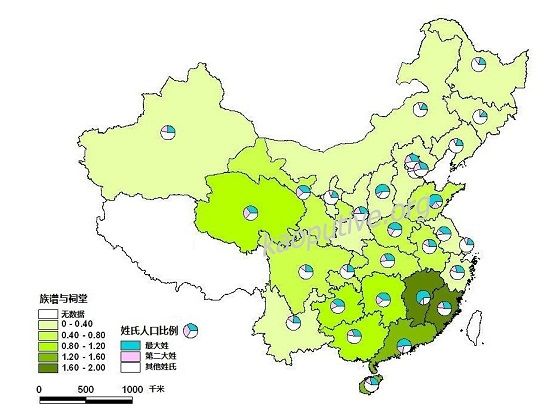

# 靠点儿谱（六）——没有选举，村民拿什么来问责？

**改革往前推，城市化工业化往前推，满足这三个条件的乡村社会组织即使过去存在，也可能正在瓦解。不要忘记费孝通、吴晗等老先生写过，清末民初农村衰败重要原因之一，是乡绅大批向城市移民，留下些走卒问农民收租。天高皇帝远的时代，这些乡绅是农村公共品的主要来源。现在我们好像面临着类似的情况。村级没有财政，乡里给村干部发不了几个钱。村民要有本事，干嘛要留在村里为人民服务？这个问题不是村级选举能够解决的。不过选举兴许能够帮着把村里人拧到一块儿，要么在上级政府侵犯村民权益的时候，集体自卫一下；要么被跨省遣送回来，在家门口能有个照应。** ibeidou.org **ibeidou.org **

### 

### 

# 没有选举，村民拿什么来问责？

ibeidou.org

## 文 / 徐阿懒（Massachusetts Institute of Technology）

ibeidou.org ibeidou.org 如果你生活在中国农村，上世纪80年代初到本世纪初的20年，对你来说可能是噩梦般的经历。艾晓明的一部纪录片，讲述这段时间里河南一些地方从卖血村变成艾滋村，其实就是一个极端的写照。农民是走投无路才去卖血的。最近几年，因为较大规模的政府转移，农村的情况似乎有所改善。争论仍然有，从数据上看是有进步的。进步了多少值得以后细说。 这段时间农村的问题，大部分跟乡村治理的衰败与农民缓慢的收入增长有关。农民增收难，是扭曲的城市政策的结果。但是农村基层治理是好是坏，收入并不能完全说了算。90年代中期以前，许多村子靠开砖场、开造纸场等等挣了不少钱，但是村干部并没有把钱拿来给村里修路、造桥、建小学。大部分钱还是进入乡、村两级干部的腰包，小部分给村民分掉了。这件事情Jean Oi写过、北大的张静老师也写过。后来乡镇企业没落了，一些乡、村背着很重的债务，基层政府和村集体以各种明目向农民收费都来不急，更谈不上关心老百姓需要什么了。 村里的事情没有人管，或者管得很糟，就会有几件事情让人特别烦心。第一件是村里的公共设施。乡里一般只管把路修到村口（这也近几年的事），很多村里根本就没路。不是没有水泥路、柏油路，而是连石子路也没有。稍微下点雨，土路就没法走。不仅出路难，生活条件也很差，用水难是问题之一。西部的村子如果缺水，每家每户每天就得走上一两里路去打水。有些井是私人打的，打水通常要给钱。水的安全卫生状况也没有什么保证。 村民生活在贫困边缘，教育就显得奢侈了。八、九十年代，国家对农村基础教育的投入很少。村小年久失修是普遍现象。乡里要么没钱，要么不给钱，给村小教师的工资也发不出来。在这种情况下面，农民的选择非常少。到城里打工，孩子在大城市读不起书。就算打工挣了些钱，能把小孩送到乡里、县里读书的是极少数。那时候别说读书了，能把三提五统交了就不错了。 这是对当年农村状况的一个大致描述。 但在有些地方，情况就没有那么糟。穷还是穷的，但该修的路可以修起来；学校基本上能给孩子们遮风挡雨；村里有时候还能凑钱搞了一些公共工程，解决人畜饮水的基本问题。集体企业有钱了，农民能够得到一些实惠。从数据上看，这样的村子大约有三、四成的样子。这些村子里，农民的日子苦归苦，基本上还能过。 2000年左右，哈佛政治系的博士生Lily Tsai观察到这种差异，拿来做博士论文。这篇论文后来成了她的成名作。她当时跑了不少地方（山西、河北、江西、福建）做调研，又搜集了300多个村子的数据。她发现，基层情况好的那些地方，通常是村里有菩萨庙、道观、教堂，或者宗族组织比较发达的地方。如果这样的团体满足两个条件，那么农村的状况就会比较好。第一、这种团体要基本上能覆盖村里所有人，那么它基本上就能够代表大部分人的“公共利益”。第二、村干部要参加这些组织的活动，所以村干部也受这种团体的“道德约束”。 有个故事很精彩，不过从经济学的思路想，这个故事讲得通么？ 上个礼拜， Abhijit在课上说，政治问题有两个主要议题。一个是集结社会成员的偏好。民众想要影响政策，需要联合起来一起行动，所以偏好集结问题其实也是集体行动问题。另一个是控制政策执行者。不管是选出来的，还是上面派下来的，民众控制不了官员，官员就要腐败。 Lily的社会团体“模型”基本上回应了这两个问题。第一，这些团体的覆盖面足够广，因而能够反映大多数村民的诉求；并且它们强制要求村民的参与，因此顺带解决了集体行动问题——比如说，村里要修小学，你不出钱，大伙就“鄙视”你，或者族长不让你的名字进家谱。第二，它可以通过“道德约束”这种传统得甚至有点落后的方式控制村里的干部。 从逻辑上来说，这个模型是说得通的。 Lily Tsai的博士论文产生了非常大的影响。缩减版后来发表在《美国政治学评论》上。听人说，这是近几年这本杂志发表的少数几篇以中国为主题的文章之一。Tsai的书那么受欢迎，有两方面的原因。首先，它是比较政治学家用统计方法考察政治议题的早期尝试。统计学在政治学里的应用要比经济学落后许多年。但这两年因为Angrist、Duflo等人的实验思路大行其道（被一些学者戏称为“搞reduced form的”），政治学实证文章的质量在迅速提高。但在理论层面，我感觉比较政治学还远不如经济学清晰。 第二个原因也许更重要。她的发现不仅为普特南等人的社会资本理论提供了一个中国版的注解，而且顺应了西方政治学界近来的学术潮流：现代化不是必然的、单向的；没有西式民主，民众也可以问责政府。在这种大背景下，汪晖老师的书可以在欧美那么红就不难理解了。 我上次说，Lily Tsai的故事在逻辑上是说得通的。想象得到，“没有选举也可以问责”这个观点会引起很大的争议（作为学者，引起争议显然不是一件坏事）。她在书里写道： 没有证据表明，中国的村委会选举对农村的公共品提供有任何实质性的影响……并且，作为非正式制度的社会团体有可能阻碍正式制度发挥作用。 这话是说得比较节制的。她没有说选举没用，只是说没有观察到效果。这和她的实证方法很有关系——横截面数据是看不出选举**前后**的变化的。在同一个时间截面上比较“有宗族、没选举”的村子和“有选举、没宗族”的村子，是无法识别出选举的效果的。 Tsai其实是想说，不管没有选举有没有用，只要有这些非正式制度，民众就能对行政者问责。从统计上看，我们不能非常牢靠地接受这个结论。这涉及一个技术细节：如果我们识别的关系是在一个横截面上的，而差异的来源——这里的“有没有靠谱的社会团体”——又不是外生的，那么它可能代表了任何东西，气候宜人、土地肥沃、村民生性乐天，等等等等，控制是控制不过来的。这时，如果我们没有更好的统计识别方法（这是可能的），那么对现象的看法只是依赖作者（和读者）的“判断力”了。 好在作者做过实地调研，那么我们姑且相信她的判断力，相信村里有管事儿的宗族或者祖庙，村官就会对村民负责。 我们自然要问，这种中国特色的NGO到处都有吗？它们靠得住吗？念硕士的时候，我碰巧用数据画过一张图。这张图里面，背景色越深，表示这个省里抽样的村子宗族越发达（指数在0到2之间，用有家谱算1、还有祠堂算2），小圆饼表示这个省抽样的村庄里面第一大姓、第二大姓比例的中位数。从我画的这个图上看，Lily Tsai选福建厦门附近的村子作案例，还真是没选错。她观察到的现象普遍吗？见仁见智。我觉得不能说完全没有代表性。 ibeidou.org

 ibeidou.org 宗族靠得住吗？我有很深的疑问。对于一个社会理论，最忌讳的是只接受结论，不接受逻辑。我在前面一篇文章里说了，宗族这样的社会团体之所以有效，是因为它们能够做到三件事，(1)反映绝大多数民众的诉求、(2)防止搭便车、(3)控制行政者。地方上的政治是不是清明，这三件事缺一不可。缺少(1)，当权者可以轻易地把一部分人牺牲掉；缺少(2)，社会就没有足够的资源修路、造桥，搞基础设施建设，或者给民众提供基本的社会保障。缺少(3)，官员就要腐败。 在现代西方社会里，相应的制度设计是投票（选政策，或者选候选人），交税以及权力制衡。一个民主社会做不成这三件事，也可能很糟糕。反过来，新左派也好，工团主义也好，搞些新概念并不顶事，关键是要用逻辑和经验证据证明，搞出来的人类社会新模式大体上能够做到上面三点。 改革往前推，城市化工业化往前推，满足这三个条件的乡村社会组织即使过去存在，也可能正在瓦解。不要忘记费孝通、吴晗等老先生写过，清末民初农村衰败重要原因之一，是乡绅大批向城市移民，留下些走卒问农民收租。天高皇帝远的时代，这些乡绅是农村公共品的主要来源。现在我们好像面临着类似的情况。村级没有财政，乡里给村干部发不了几个钱。村民要有本事，干嘛要留在村里为人民服务？这个问题不是村级选举能够解决的。不过选举兴许能够帮着把村里人拧到一块儿，要么在上级政府侵犯村民权益的时候，集体自卫一下；要么被跨省遣送回来，在家门口能有个照应。 忘记高深的理论，回归常识和庸见。我们可以问一问，在比较一般的情况下面，除了选举，村民还可以拿什么来问责？如果问责村干部仍然很重要的话。 ibeidou.org ibeidou.org 

### 【作者简介】

本期天玑一共有三位作者，但都来自同一个博客 [“靠点儿谱”](http://kaoputive.org/)。 ibeidou.org ibeidou.org

（采编：吴志伟 责编：刘一舟）

ibeidou.org

ibeidou.org
