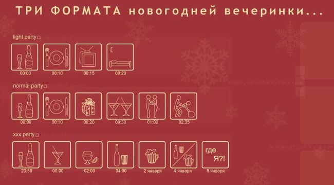
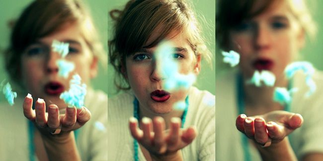

# 有性别的人

**如果可以选择的话，我愿生为一个女人而非一个男人。理由有很多，我只说一个：在这个世界上，女人因自己性别而经历的体验和被赋予的规定性，以及就这些可以引发的关于自我、存在和本质的思考与感悟远远丰富于男性，而就连每次去超市看到新出品的一种饮料我没有喝过，我都会遗憾很久。**

# 有性别的人

### 

## 文/张舒迟 (北京大学)

 最近在读《第二性》的全译本，之前读过湖南文艺出版社很老的那个版本，没有翻译第一卷。第一卷也如此精彩，甚至更精彩。 借机反思一下我从小到大对性和性别的种种曾经有和正在有的认识与思绪吧。 

### 

### 

最早在思维中触及性的问题，我与很多人一样，是很小的时候对两件事的好奇和不解，一个是男女排泄方式的不同，一个是人是从哪里来的。关于第一件事，直到很久以后，大概上初中的时候，我才有了正确而形象化的知识，之前则摇摆在模糊而错误的幻想情景之中。而关于第二件事，我记得在上幼儿园的时候，有一次缠着家长想知道，我父亲突然很认真地问我，你真的想知道？我说是啊。他便和我并肩在床上平躺着，对我讲了起来。为什么采取这样的姿势，现在想起来我觉得有两个原因，一是父亲觉得和我面对面说很尴尬，俩人都朝着天花板压力小一些，二是这是一场“男人与男人之间的交谈”，我清楚地记得母亲没有参加，在别的房间忙其他事情，而父亲的语气就像一个比我大不了多少的兄长，在和我说一些只是我不知道而他知道的事情，褪去了长辈和家长的那种官方和正式，以及高高在上的权威性。我记得他说得很慢也很详细，只是说到性器官不同时简单地说“女孩子下体那里有一条缝”就没有再具体。而我听得非常认真，一句话不敢说，感觉既紧张又强烈好奇，可是这是类似于当我得知宇宙起源于一次大爆炸，或巨大的恒星死亡后会形成黑洞那种紧张和好奇，是面对某种有着深刻意义的神秘知识，一时无法完全理解其中的内涵，只怕听漏任何一点细枝末节的信息的那种感觉。父亲提到的精子、卵子、授精、受孕、生产等等在我听起来就像太阳火星冥王星之类的既存在，又非常遥远模糊的概念，完全没有和现实中的情景和意义对应起来。 经过这次谈话，从幼儿园直到初中，在性的问题方面，我在同龄人面前始终暗自保持了一种知识上的优越感，感觉我已经什么都知道了，很久很久以后才发生新的疑问。其实现在想起来，有一些重要的细节被父亲有意忽略了，比如关于授精的过程他只是说精子“流进”了那条“缝”里，于是长期在我的想象中性交过程是没有插入的，某种液体很自然也很巧妙地就“流”了进去，情景一般是在两个人一起洗澡的过程中吧；再比如他没有讲射精，于是直到第一次遗精前我还一直认为精子就存在于尿液之中，只是小孩的尿液里没有，长大了就有了；还比如他没有讲女性排尿与月经、生产是用两个不同的通道，以致后来这一点在生物课上被老师隐晦地提到时，我还震惊了好久，仿佛自己以往信奉的都是地心说似的。不过当时我也才上幼儿园而已，所以我还是真的很感谢父亲那一次给我的坦诚的启蒙。 以上这些除了很少模糊的想象碎片，全部停留在文字意义上。我第一次亲眼见到女性的性器官，是上小学时参观自然博物馆。以前去过北京自然博物馆的同学一定有印象，那个展厅对于小孩来说是挺可怕的，各种正常的和畸形的人体部分都被泡在大大小小的福尔马林罐子里，苍白而萎缩，每个前面只有一个小标签，写着这是什么（比如“正常肺”和“吸烟肺”），没有更多的解释。还有一男一女两具完整尸体标本被浸泡在长方形的透明柜子里，男的站着面目狰狞（一点不夸张），女的躺着，面部和手脚用黑布盖着。就在这一个洁白、神圣而令人窒息的展厅里，我强忍着哆嗦从“吸烟肺”走到“肝癌”再走到“无脑儿”，突然面前出现了一个叫做“完整处女膜”的展品。一直以来停留在记忆深处的那条“缝”一瞬间具象化了！我呆立着观察了好久，心跳剧烈。 

### 

### 

首先，我错误地以为，女性的整个性器官的学名，就叫“处女膜”。其次，我感觉一种强烈的矛盾和不可思议，这个神秘的部位竟然是如此不规则、多皱褶、不平滑，简直缺乏一种可以明确把握的固定形状可言。这与我对男性性器官的经验形成了鲜明对立。无论勃起还是不勃起，男性的性器官总有一个大体固定的、较为规则形状，而且是可以通过视觉加以确认的，而“处女膜”（错误的名称）却像……不知道像什么，当时我想不出自己见过的任何一样东西的外貌可以拿来与它相比较。总之是松散的、结构不明显的、不确定的、难以准确言说的。这彻底颠覆了那条“缝”在我印象中平滑、曲线、紧凑的形象。我时而觉得它类似于一个未经良好处理的愈合后的伤口，时而又觉得类似某种“病变”组织，不够“正常”，很难想象是人体必不可少的一种器官。它没有完全确定的形状，使得它变得更加神秘不可知。 最重要的是，我无法把它和其他一切有关女人身体的印象联系在一起。女人的身体给我的印象是曲线、规则的对称、平滑、富有弹性、具有很明确的外延和边界，等等，难道那些电视上的女明星、女演员，街上的女售票员、女营业员，学校的女老师、女同学，家中的女性亲属——所有女人，她们身体的这个部分都是这个样子的吗？她们都长了一个这样的部位？那时我实在无法把这两种形象结合在一起，似乎其中一个注定会否定另一个，二者绝不能并存。 在那以后很久我都把女性性器官和处女膜划等号，认为是一件事物的不同名称。至今我提起“处女”，心里总会渗出几滴在手术台前无影灯下的汗液，莫名的紧张和些许畏缩，其中有一部分就是这个词又把我带回到了那个吸烟的无脑儿的展厅里的缘故。 还有一个重要的细节。在认真观察“完整处女膜”的时候，除了以上感觉，我还勃起了。当时我只有不到十岁，并不知道性交需要插入，并且尽管观察很仔细，我仍没有发现尿道和阴道是有区别的。我不知道这是不是生理上的一种设计，雄性的机体在看到雌性器官时，不论你知道还是不知道，都会机械性地产生反应。但后来的经验表明，见过的次数多了，这种不知是否真的存在的“条件反射”会逐渐减弱乃至消失。 头一次见到女性性器官带来的震撼，只有头一次得知性交需要插入的震撼能够相提并论。那时我上初中，在混杂着性欲的好奇心的强烈驱动下尽可能地利用手头所有的资料（包括：1979年版《辞海》，《中国少年儿童百科全书》，在父亲书柜深处找到的一本八十年代出版的《性知识手册》，还有同样在那里找到的一本很薄很粗糙也是八十年代翻译的美国女性主义介绍读物《一本女人写给女人的书》，一共就这些），外加和班里男同学反复进行近乎面红耳赤的关于女性身体结构的事实性争论（我们不敢去问女生），我终于在隐晦到不能再隐晦的字里行间，在拼凑了所有男生的一知半解之中，得出了两个确定的结论：一，尿道和阴道不在一起；二，性交需要阴茎插入阴道，第一次性交时处女膜（正确的名称）破裂。 其实第一个结论给我的震撼也是很强的。我再一次感觉到女性的身体超乎我想象的复杂、繁琐和神秘。这主要源于凭借那时的信息量，我完全无法想象作为一个女生身体的感觉，想象比如她们排尿时的感觉，就像我无法想象月经——尤其是月经流出体外的感觉，那种传说中有时感觉得到，有时又感觉不到，但就算感觉到自己也无法控制的身体经验，在我当时的男性身体体验中寻找不到对应物或相似物，无法类比。因而我觉得月经也是很神秘的。相伴而来的还有一种强烈的失落感，我发现作为男性，我终生都无法经历这些体验了。那时对于我，的确是遗憾到无以复加的地步，正如小时候得知男人不能生小孩，不能经历分娩一样。在我和异性之间，陡然出现了一座高不可攀的障碍，像一块顶天立地的光滑钢板一样将两个世界无情地截然分开，你过不去，没有办法。 可能由于得不到的东西才显得愈加宝贵，所以从那时起直到现在，我从未觉得女性排尿的姿势不雅观，或者月经是脏的或者会带来晦气等等。由于月经和“流血”联系在一起，“流血”又和“受伤”乃至“牺牲”联系在一起，所以我始终觉得女性在月经期间因“更需要保护、安慰”而变得更动人，更娇弱，更楚楚可怜，更有某种独有的女性气质，还有一种淡淡的，神秘的“自我奉献、牺牲”的意味在其中。 回过头来再说第二个结论。这个结论首先是打破了以往我幻想中那种非常表面化、儿戏化的性交中的“男女平等”。打针、插胃管、做手术，一切“插入”身体的经验只能让我联想起不愉快、粗暴、疼痛、被侵犯、异物感等等，由此我又感觉女性是“忍辱负重”、“不情愿”、“被迫”的一方，因而又是更为“高尚”、“无私”、“圣洁”的一方。我实在很难把自己和一个粗暴的、邪淫的、为了满足自己低级快感而去强迫、侵犯女性的形象联系在一起，因而那时在我的幻想中将来降临在我身上的爱情必须是无性的。即使必须要有性，也把它推到无限远的将来，“等我们结婚以后，必须要生育的时候……”，这对于一个初中生来说基本就和共产主义实现同样遥远了。即使这样，我还是不能想象我将来的妻子是一个处女，必须由我“撕裂”她的处女膜，那个想象中的场景对我真是太血淋淋，太残忍了，无法接受。因而我对自己下了决心，必须找一个非处女恋爱结婚，她的第一次已经被某个粗野而缺乏自制的家伙在不情愿中夺走了，那么我就可以扮演一个安慰她、抚平她伤痛的角色。那时只要一想到新婚之夜，在洁白的婚床上的我的新娘如果竟然是一个处女，我就会变得十分心神不宁，就像自己犯了强奸罪一样自责和惶恐不安。然而，这并不是说那时的我没有所谓“处女情结”。因为所有这些想法都建立在一个基础上，即那时我把性交看作一种为生育和延续人类种族的“必要的恶”。但除此以外，我仍会认为处女是“纯洁”的，是“完整”的，甚至是神圣的——只是千万不要让我来背负“第一次”这个“恶中之恶”。我对“完整”有一种特殊的眷恋，比如我经常不忍心将一个完整的西瓜切开（而且我特别讨厌听我父亲把“切开一个完整的西瓜”叫做“哎，咱们来把这个瓜杀了吧？”）。所有我喜欢的女演员、女作家和漂亮的女人，我都强迫自己认为她们是“处女”，一旦听到某些关于她们的绯闻，对我就是严重的打击，仿佛这就意味着她们不再纯洁，变得道德败坏了。 时至今日，我仍对处女心怀某种芥蒂。不过主要的原因已经变为处女才是真正的“不完整”者。两个人打乒乓球，如果水平差距太大，要么就总得捡球，要么一方必须给对方“喂球”，无法产生那种“棋逢对手”、“你来我往”的热烈和兴致。某种角度来看，处女就像一个“初学者”，一个正在读小学的学生，相对来说在知识、经验、感受、思维乃至人生经历等诸多方面都是“不完整”的，有空白的。与之发生性爱，就像一支11人的足球队和一支只有5人的球队踢比赛那样，没有饱满的热情，也难以迸发出旗鼓相当时才会有的火花和快乐。而“纯洁”与“无知”，“性爱”与“不纯洁”之间的区别，我也早已了然了。 

### 

作为一个男性，我感觉穿着衣服的女人要比裸体女人更加性感。面对一个裸体女人时，她对于我只是另一个“人”了，一个和上课、工作、休闲娱乐、睡觉等等日常事务关系更为紧密，而与性感关系更疏远的人，胸部稍大一点，性器官不相同，其他方面和我差别很小的“另一个人”，一个同学、同事或者别的什么人，而比较少地是一个性爱的对象。裸体时女人的身体最多地属于她自己，是她生存、行走和工作的媒介，对于她自己来说，无论是洗澡、换衣服还是睡觉，都是和我作为一个男人一样的日常生活，更多地是一些物理活动，很少带有与性相关的含义，也没有异性之间的吸引和神秘的意味。而在她穿上衣服的时候感觉则完全不同，或许是因为我们的社会文化使女性的服装更多地为了吸引异性的关注和兴趣而设计。我会感觉她是一个明显的“异性”，一个潜在的性爱的对象，从而她的一切举止言行也都多少可以从性爱的角度予以解读和附会。对于我来说，“在街上看美女”往往是看“美女的衣服”，看她的服饰怎样地在线条、形状以及风格、气质等方面与她的外貌、神态、动作互相映衬，合二为一，形成了一个社会文化性的“异性”的美丽形象，引起我的注目和联想。而面对裸体的女人，无论是图片影像还是实体的，总有诸如“人就是一堆肉的堆积”这样的念头不由自主地在我心中闪过。你可以和“一堆肉的堆积”聊天、吃饭、打电脑游戏，当然也可以性爱，不过这时性爱的念头在我心中所激起的反应很类似于一起做俯卧撑（原义）。 在性爱中我很难理解“占有”的概念和感觉，那让我联想起静止不动和紧紧地抱着、抓着某件事物，似乎是僵死的状态，和性爱难以相容。相比之下“充满”和“补完”的感觉是很容易理解的，那是一种有机的结合，一种主体与客体、自我与他者间界限消失的同一，一种整全性之下完满的高度愉悦感。同时我感觉到，性爱中男性的快感更多来自于观察、想象、临摹、试图体会、分享女性的快感，是一种目睹自己所努力创造的事物并将自己投射到其中的满足，可以说类似于建筑师仰望自己设计的大楼，钢琴家陶醉在自己所弹奏的乐曲之中，但又多了在同他人共享和互动中的交流、理解过程和复杂性愉快感。若没有这些，性爱对于男性基本就是一种机械性的活塞运动，甚至会在半途突然感到十分虚无，十分无聊，毫无目的性。若是将女性完全物化，完全他者化，看做和自己截然不同的另一种事物，性爱的体会对于男性而言就很难与手淫有明显的区别。 谈到手淫，我又想起了一个经典的问题：为什么作为男人的我，注定为女人所吸引乃至被这种欲望摆布呢？我想，单从肉欲的层次，手淫和爱情动作片就可以替代满足男人对女人的需要的绝大部分。但性冲动并非男人对异性需要的全部甚或主要部分，而我的经验则是，纯粹肉欲的满足在性爱中仅占很小的比重。很多时候“性”不是关键，“性别”才是关键。而一谈到性别，人就远不再是生物学或生理学意义上“肉的堆积”那么简单。从性别的角度可以抽引出极丰富的思考和话题，而这些甚至在我开始思考和讨论之前，就已经作为深刻影响甚至决定“我”之为现在之我的原因而早已在那里存在和起作用了。这样说来我永远是一个有性别的我，无法真正想象一种没有性别的存在方式，或者说任何没有性别的“人”的内在生活，就像你无法想象一个没有大脑的“人”的内在生活。“人”本身就包含了“有性别”这一属性，然而“有性别”并非一种先验的本质，一种内涵确定无疑的命运，它在不同的时代、社会、文化和处境可以呈现截然不同的复杂形态。“我是有性别的人”固然不错，但如何去理解、阐释、规定我的性别的意义以及有性别的我的意义，则是完全不同的另一回事了。 如果可以选择的话，我愿生为一个女人而非一个男人。理由有很多，我只说一个：在这个世界上，女人因自己性别而经历的体验和被赋予的规定性，以及就这些可以引发的关于自我、存在和本质的思考与感悟远远丰富于男性，而就连每次去超市看到新出品的一种饮料我没有喝过，我都会遗憾很久。 

### 

### 

(编辑：陈轩)
