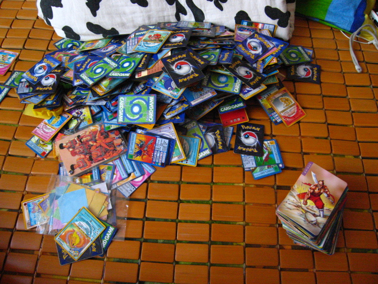

# 下棋和九品官人

**“從第二段的倒數第一句話可以看出，我喜歡和自然數系雙射的生活；從第一段的正數第二句話可以看出，我喜歡簡單的生活。總結一句就是我喜歡有規律的簡單的生活。任何人都喜歡有規律的生活，包括曹操。”** ** **

# 下棋和九品官人

## 文 / Domain 香港中文大學

 我小的時候喜歡下棋，現在不知道喜不喜歡下了。小時候與大了的時候下棋有不同。小的時候希望對手牛逼一點，你出奇招，我出奇奇招，你再出奇奇奇招，這樣才有意思。直到有一天我發現贏棋比下棋本身還要爽，我就希望對手傻逼了。每當布下一個陷阱，便在心中百轉千迴：上鉤吧上鉤吧。可惜我在這個時候的暗爽會變成明爽，於是別人就會從我的舉手投足中發現我的圈套。在中大上課也是一樣，哪個班沒有牛人就想往哪個班上鑽，可惜這個世界的規律是到處都是平均分佈的牛人，牛人十步之內必有傻逼，正如毒蛇十步之內必有解毒草，傻逼十步之內必有牛人，正如解毒草十步之內必有毒蛇。所以我的想法很不現實，中大根本沒有沒有牛人的班。 這與打三國殺不一樣，你不能希望周圍的人個個都是傻逼。因為你一夥的人若是傻逼，會讓你鬱悶到想讀《細說英語粗話》的目錄。三國殺這個歷史加遊戲的想法在中國並不是首次。曾經有一種面，叫做小浣熊乾脆麵，在我小學四年級的時候出了一種卡，叫做水滸英雄卡，這個卡出的很好，因為大家可以翻原著去查，一查就知道哪些出了哪些沒出，而且每一批只出有限的幾張，這就給了人以時間來緩衝經濟壓力從而收集齊。比如我就集齊了，當然是不擇手段的，曾經用四個空袋子換了兩張。但是後來都送給了別人，因為我覺得收集本身比收集品來的有意思。後來小浣熊出完了水滸開始出三國，這個時候小浣熊開始犯戰略性失誤了。第一，三國卡沒有一個總目，告訴人們它將會按什麼樣的次序出哪些人。第二，三國卡具有遊戲性，算是一種桌面卡牌遊戲，但是基本沒有人懂得應該怎麼玩，而且在集齊之前根本沒法玩。第三，三國卡從某個時間起開始在卡牌背面編號，這使得之前的卡和之後的卡放在一起很別扭。熟悉我的人知道，我做事是有完美主義傾向的，比如一套從書，可能第五本是最好玩的，是我最想看的。但是我若直接去看第五本，我就會很難受。一定要把前四本讀完，再去讀第五本，方才舒服的緊。 

 從第二段的倒數第一句話可以看出，我喜歡和自然數系雙射的生活；從第一段的正數第二句話可以看出，我喜歡簡單的生活。總結一句就是我喜歡有規律的簡單的生活。任何人都喜歡有規律的生活，包括曹操。曹操最初的想法就是要重新恢復天下的秩序，有秩序才能有規律。後來曹操認識到社會處於經學崩壞的初級階段，於是決定惟才是舉。這個時候反對曹操的聲音還算很強烈的，因為有很多人認為德在非常時期也是非常重要的。比如陳群就整天說郭嘉人品不好。可能郭嘉人品確實不好，不過我看是因為陳群嫉妒郭嘉進了三國殺而自己沒有進。但是假如三國殺裡有陳群，估計肯定有一個特技叫做九品，因為陳群發明了九品中正制度。 

 我覺得“九品”可以這樣：在回合結束階段你可以進行一次判定，若為黑，則你可翻出張數等於在場除你外武將人數的牌（稱為“九品牌”）並依翻出之順序置於其他武將前，然後從下家開始，除非打出一張點數小於所對應的九品牌的牌，否則須進行判定，若不為梅花，則跳過此回合摸牌階段。 我們都知道，九品官人這種制度助長了門族的發展。但是清華大學歷史系某教授認為這並不能看作是曹丕對於門族世家們的妥協。我們都知道清華大學歷史系的教授是靠不住的。他們有的在剽竊英文文獻時把蔣介石翻譯成常凱申，有的把孟子翻譯成門修斯。但是那篇文章由於是完全的從中文對中文，所以沒有出簍子，因為把古文整成現代文，沒有一個官方的公理，所以公說公有理，婆說婆有理。 說到這裡，我想對“公說公有理，婆說婆有理”的意思表示質疑。公和婆這兩個字，公表示女子的丈夫的父親，婆表示女子的丈夫的母親。在古時候女子是必須聽公婆的話的，所以公說公有理，婆說婆有理。意思放在現代文裡，就是“你們個個說的都有道理，就我錯好了吧”。 言歸正傳，九品官人的制度，有兩種觀點，即對平民是否適用。有人認為，九品官人是曹魏勢力為了增強自己人在官場上的實力而對於所有官員進行的一次評價，如果牽涉到太多在野人反而對自己不利。我總覺得，一個制度在一開始總是對制定方有利的，但是關鍵在於制度之後的修改。我們知道魏朝是不大封同姓王的，但是這導致了曹爽被司馬懿幹掉之後曹氏立即成為傀儡。而晉朝是吸取了教訓封王的，所以有了八王之亂。這就好比確定公理的時候，對人們總是有好處的，人們一下子證明出好多東西，但是隨著越來越深入人們發現不行了，就喜歡自己再改進或者加一些東西進去，比如在集合論上加入選擇公理(axiom of choice)這種既不可能被證實也不可能被證偽所以乾脆不顧一切使之成為公理的東西。 

 我們知道，讀選擇公理的敘述本身就像在做哲學，所以我腦袋繞不過來。我腦袋生鏽了，生鏽在無盡的不規則作息裡，生鏽在無數逢千進位的逗號裡，生鏽在無窮無盡一篇又一篇不知所云的校內日誌裡。
