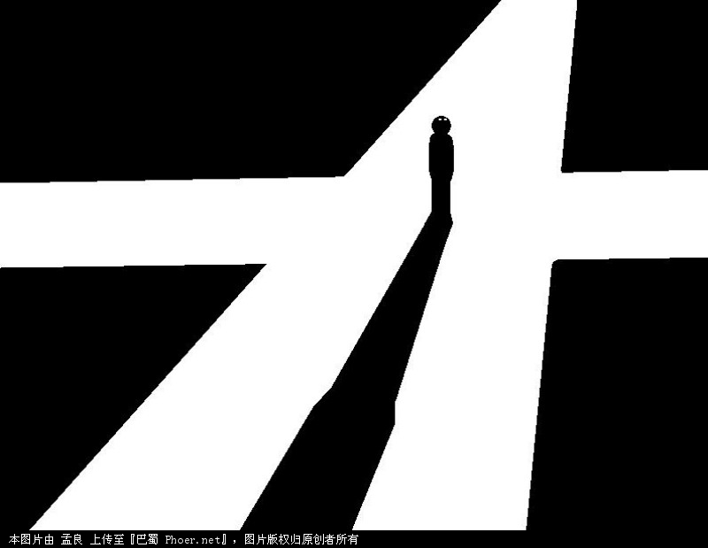

# 东西南北

**“我要说的并不是让大家要知足，也不是要大家相信每晚七点电视上的动人图景，回到那个火热地年代，而是要提醒大家，我们需要一点想象力。当我们看到情人节的时候，能不能别想着自己的老婆不知躺在谁的床上，哪怕自己怀里还躺着个姑娘，而是希望踏踏实实找一个姑娘，并且决定她再也当不了别人的老婆；”**

### 

### 

# 东西南北

### 

## 文/汪雨萌 复旦大学

### 

### 

我小时候生活在一个很小的小镇，因为地方小，所以房子啊路啊什么的，还保留着原始城镇规划的气息，方方整整，豆腐一样。平时走路的时候，也没有什么近路可插，就算走进小巷，也还是走直角，只不过多了一点绕弯的乐趣罢了。我的小学扩建在一座孔庙之上，规规整整地朝着南，因为镇子不大，所以放学回家的时候，孩子们多是走路回家，一个班四个路队，东南西北。所有的路队在大操场上排好队伍，齐声高唱：“老——师——再——见！同——学们——再——见！”然后走出校门，东路向左，西路向右，南路向前，北路向后，各自回家。 我不知道是不是只有我一个人有这样的疑惑，每当我在课堂上背诵上北下南左西右东的时候，总是忍不住联想到放学回家的格局，那个时候，不是上南下北左东右西吗？这个问题在我心里盘桓了很长时间，我总是为概念和现实之间的截然相反感到不安——就像我很小的时候曾经提出的问题：“妈妈，为什么我站起来比你矮这么多，躺下却和你一样高了呢？”在我的心中，决定高矮的，是“个头”，而不是“个脚”。 现实和概念之间的剥离并不仅限于此，我记得我小学的课本中，有一篇课文讲述的是沪宁高速公路。那是江苏省的第一条高速公路，课文的描述很详细，也很专业，说沪宁公路很宽，有“双向四车道”。双向四车道是什么？我完全无法将它拉入我生活的现实，那个时候的小镇，连汽车都很少看到，会车更是难得一见，何况四车道？如果它这样写：“沪宁高速公路很宽，有我们的操场那样宽”，我反而会比较容易理解，操场多宽啊！——但这同样难以让我想象操场那样宽的路会怎样延伸，以及会有怎样的车水马龙交汇其上——这不是概念的难题，而是描述的难题。这篇课文里还有另一句：“沪宁公路的路面好平啊，一杯满满的水放在驾驶座前，开了好久，一滴水都没有洒出来。车前挂着的熊猫挂件，连晃都没有晃一下。”这实在是太夸张了，怎么会有这么平的路面呢？现在回想起来，都觉得可笑。但是当时的我却坚信不移，尽管小镇的路面坑坑洼洼，我依然相信，在远处，有一条像丝绸一样平滑的路面，开在上面，连一滴水都不会洒出来。 等到大了一点，才逐渐开始明白，概念和描述，实在是不能对现实直接代入的，总要做一些变化。高中政治不是反复强调吗？概念和现实，是共性和个性的关系。描述和现实，是再加工与原材料的关系。经过多年反复的自我催眠一般的训练，经过多年逐渐成长的世俗生活，概念和描述变得越来越远，消失不见。我记得初中高中的时候，我还能够依稀判断东南西北，只不过要假设自己是站在小学的校门前，然后判断出我的左边是东，右边是西，前方是南，背后是北。但这两年，我的这一已经十分糟糕的方位判断也变得不灵光了，我再也不能凭着想象来确定我的校门是朝哪里开的，也就更无从判断我的前后左右究竟是什么方位。我很恐慌，我的方向感彻底的失去了，我的世界之剩下了前后左右，可是前后左右不是常数，他们随时在改变。我无法向别人说明一个地方到底在哪里，我再也说不出“花开四季在龙凤花园的东南”这样的话，我说不出东南西北，又无法用前后左右来代替，因为我不知道，你到底是面对着龙凤花园，还是背对着它，甚至侧对着它。 我从未发现别人有这样的焦虑。不是因为他们都能分辨东西南北，不是因为我特别的笨，而是因为现在已经很少有人说东西南北了，大家都说前后左右。如果出现难以指路的情况，大家就会说：“你背对着龙凤花园的大门，花开四季就在你的左前方。”大家根本不觉得，不知道东西南北这件事，也算是个事儿。我有时候对着地图找路，哪里哪里向东，哪里哪里向西，我男朋友都会嘲笑我：“还看东西干嘛啊！找个参照物，看看左右拐不就行了嘛！” 可能不单单是方向这一个概念的淡化，不只是因为我们长大了才不相信概念和描述，从60年前那个红红火火的日子开始，我们就惊心动魄地生活在描述和概念对现实的虚张声势和扑朔迷离中。从能够躺人的麦田，到不会滴出一滴水的高速公路，到一个月多少钱就租得起的大房子，这之间实在是没有什么变化，连腔调都没有改上一改，也难怪我们会视若无睹，埋首与自己的经验，任凭自己的生活经验越来越狭窄和现实，直到放弃了对描述和概念进行想象和联想的能力。 

 也许这样就可以停止被欺骗，这样就可以停止自我催眠，我该说这是一件好事吧？我们都变得理智了。但为什么我们的生活越来越焦虑和烦躁呢？为什么我们的幸福感如此之低？最近同学聚会挺多，我和我的男朋友总是恬不知耻地相携前往，到了大四，聚会上的话题总离不开今后的出路。别人常常问他找了什么工作，他总是谦虚地说：“普华永道，不好不好。”我看看他，发现他并不是在谦虚，他紧紧皱着的眉头说明，他是真的不满意这份工作。再看看我的同学，不管是出国的，读研的，还是工作的，露出满意神色的，还真是不多，谈到去了MIT的，去了斯坦福的，都是一脸羡慕嫉妒恨的表情。我有点想笑，想看看如果哪次同学聚会的时候，那个斯坦福的同学也到了场，她的脸色，会比在座的好看多少呢？四大的光环没了，美帝的光环也没了，国内的大学，哪怕是重点高校，985，211，也不过是一堆狗屎。 离题了离题了，我要说的并不是让大家要知足，也不是要大家相信每晚七点电视上的动人图景，回到那个火热地年代，而是要提醒大家，我们需要一点想象力。当我们看到情人节的时候，能不能别想着自己的老婆不知躺在谁的床上，哪怕自己怀里还躺着个姑娘，而是希望踏踏实实找一个姑娘，并且决定她再也当不了别人的老婆；看到网上分享的20平到30平的漂亮的小户型，不要质问国内有没有这么小的房子，也不要质问楼主卫生间在哪儿厨房在哪儿，楼主是不是傻逼富二代每天都下馆子。这就是想象力，一种刻画自己当下生活之外的美好图景的能力，这本是很简单的事情，现在却无比复杂，我们一是没有那么多的脑子想的那么远，二是多了那么多的参照物。就像指路，现在都没人会说“你一直向东走！走个200米！”，而是说“哎！你往前走！看到花开四季了没？左拐左拐！”换句话说，我们的生活，总是处在被当下所不断切割的片段中。 其实这事儿没这么简单，我们早就形成了自己的生存智慧，我们不再憧憬，并且将批判和愤怒娱乐化，诅咒化。即使每天都在辛勤读书，辛勤工作，我们还是不在认真生活，就像再没有人认真地去学东西南北一样。 

### 

### 

（编辑：陈轩）

### 

### 
