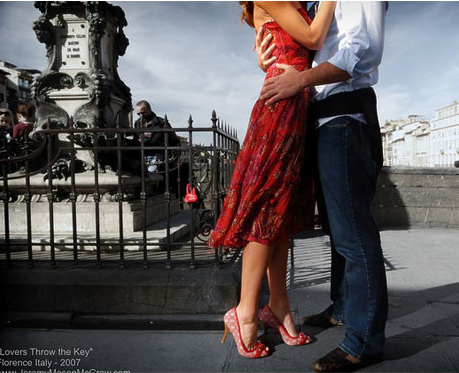

# 乡村没有爱情故事

**这样看来，乡村和城市的爱情似乎是没什么不同的。然而这却也恰恰是最大的不同所在。城市的爱情，多半是为了满足一方或双方寂寞或饥渴的心理生理需求，男女朋友分分合合，虽以婚姻为名，但往往多证明无关婚姻，却都需要用浪漫烘托；而乡村的爱情，多半是为了生孩子过日子，简单朴实，结亲前也许讨价还价，结亲后便是实实在在的一辈子。**

### 

### 

# 乡村没有爱情故事

### 

## 文/张玮（清华大学）

### 

### 

昨天一个表妹领证了。 表妹小我一岁，表妹夫大我两岁。表妹家在县城周边的一个村子，表妹夫家在本县周边山区的一个村子。二人都没有上过大学，是普通的农民和打工者，二人交往，也不过一个月的时间。两家都是本分人家。是我爸做的媒，因为两边都知根知底。 再前些日子，我刚放寒假回家的时候，就听妈妈说起过这事了。妈唠家常似的和我说，人家男方已经答应结婚后在县城买楼房，买汽车，姑姑家还非要人家8万块的彩礼钱才肯嫁表妹，后来爸帮两家做了主，彩礼钱定在了6万6。我当时和妈说，婚姻的基础本应是爱情，可在表妹的这桩婚事中哪里看得到爱情，分明就是一桩买卖。说这话时，我不确定自己是否带着鄙夷的神情。我也是曾在大学校园里尝过爱情滋味的人。 大前天，我开车陪妈出去办事。回来的路上，妈和我说，今天是她和爸结婚二十五周年纪念。二十五年的婚姻，便是所谓的银婚了。我顿时心有愧疚。腊月十八，爸爸娶妈过门的那个大雪天，这故事我本是知道的，可偏偏到这天却几乎忘记了。然而我知道，无论何时，妈妈不会忘记，爸爸也不会忘记。 再早几天，我们去邻村给外婆过生日。从外婆家出来的时候，我在前面走着，爸爸牵着妈妈的手在后面跟着。爸爸突然大声说，看你妈，二十多年了还是像个小孩子。接着又说，他们刚结婚的时候，妈妈还在这娘家的村子里教书，每天晚上爸爸就走路来接妈妈回家。那些年冬天总下大雪，他和妈妈就像现在一样，牵着手，在黑夜的风雪里，两个人一路唱着跳着，一起向家里走去。我就回头看着他们，笑。我自然还知道他们很多这样的故事。我当时突然想，这多么像爱情啊。 

### 

 因为读大学，我用了几年时间慢慢习惯着城市的生活，也知道自己可能将要在城市生活更久，而离自己生长的乡村，可能越来越远了。渐渐的我也便习惯了在城市和乡村的思维中穿梭。记得小时候看看城市的一切时，总是那么好奇，而如今，长大的自己再回首看自己曾经熟悉的乡村的一切时，居然也慢慢觉得不可思议。比如，当我听到表妹的婚事时，便坚定的认为，这一定不会有爱情。 我所熟悉的经历的爱情，城市的爱情，绝没有彩礼上的讨价还价，而实在要浪漫的多。爱情的模板，一定是要与约会、看电影、逛街、吃饭、牵手、拥抱、接吻、玫瑰、红酒、巧克力联系着的。而乡村没有电影院，没有步行街，没有星巴克、也没有法国风情的餐馆。所以无论如何，乡村是没有爱情的。 可是，当我看到爸爸为哄更年期的妈妈用蹩脚的普通话唱着歌，当我看到爸爸牵着妈妈的手慢慢的走了二十五年，我总会忍不住很羡慕他们，我总想将来能和自己心爱的人这样过一辈子就很好了；当我听到爸爸很多次亲口和我们说，他和妈妈现在还在恋爱，每天都有新鲜感时，作为再了解他们不过的儿子，我又是真的相信的，是不能不相信的。 我想了很久，城市和乡村的爱情究竟有什么同与不同。然而得出的却是一个很让自己发笑的结论：城市的爱情，多半的目的是上床，乡村的爱情，多半的目的是上炕。 这样看来，乡村和城市的爱情似乎是没什么不同的。然而这却也恰恰是最大的不同所在。城市的爱情，多半是为了满足一方或双方寂寞或饥渴的心理生理需求，男女朋友分分合合，虽以婚姻为名，但往往多证明无关婚姻，却都需要用浪漫烘托；而乡村的爱情，多半是为了生孩子过日子，简单朴实，结亲前也许讨价还价，结亲后便是实实在在的一辈子。 多少年来，乡村基本还是黑白的，而城市却越来越五彩缤纷了。 

### 

 依旧黑白的乡村也许没有那么多爱情故事，但似乎也是有爱情的。五彩缤纷的城市到处都是爱情故事，可是让人心安的爱情，为什么总感觉那么少呢？ 

### 

### 

（采编：陈锴 责编：陈锴）

### 
