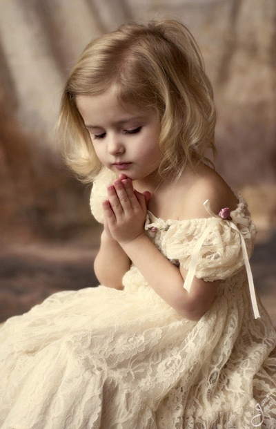
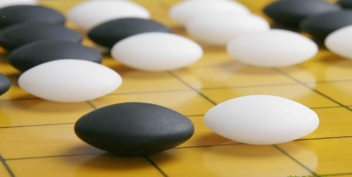

# 偶遇 这件事

**有时当我们走完了人生一个阶段，我们会不由自主地停下来，回头看。这个关键的“回头看”的动作，即是你的刺绣作品翻到正面之时。只有当这时，你才会明白——原来之前那些乱七八糟的线头，在另一面都是有意义的，背面的“无意义”其实正是指向正面的“有意义”。**

### 

### 

# 偶遇 这件事

### 

## 文/周雨霏（中国人民大学）

### 

### 

如果没有在科研楼收到快递公司发来的短信，今天下午4点我就不会从学校东边向品园走去取包裹。如果我在走到世纪馆时没有选择向右拐，而是向左拐了的话，我就不会路过一勺池。 而没有路过一勺池的话，我就不会遇见一个戴眼镜、背挎包的男生。这个男生就不会停在我面前，问我一句： “同学，你听说过《圣经》吗？” 而我也不会突然笑起来， 说：“我是基督徒。” 也许会有人说：“哎呀，好巧呀。正好他是个传福音的，而你又正好是个基督徒。居然就这样偶遇了。概率多小啊。”可对我来说，这样的事早已经不构成任何惊喜或所谓“巧”了。也无所谓“偶遇”或者“概率”这回事。 在创世之前，宇宙洪荒依然混沌难分之时——在创世之初，神对着未开的天地说出那句“要有光”时——我们于创世之后的今天的相遇，就是计划好了的。有首歌唱：“是谁为我们安排下幸福的生活？”对此，王怡总说：“我们的生命是有剧本的。”他博客的首页以前一直是一句话：“我们成了一台戏，给天使和世人观看。”而正因如此，我宣称我不相信偶遇，我只相信一切，都是命中注定。 

### 

### 

### 

菲茨杰拉德的《本杰·明巴顿》里有一段叙述可以成为文学史上不可取代的经典。和我本文开头的句式一样（其实我就是模仿它），他用了好多的“如果没有……”来告诉我们，如果没有这一连串的巧合，黛西，就不会在她舞蹈事业的巅峰时刻，被车撞到下半辈子再也不能跳舞。 而米兰·昆德拉的《生命不能承受之轻》里也是用了几乎完全相同的笔调，向读者传达这样的信息：如果不是因为这一天连续发生的6个偶然，男女主角就不可能相遇，然后共度一生。而每当男主角想要离开女主角的时候，就会想到这6个偶然，最后决定留下来。 “但是如果一件事取决于一系列的偶然，难道不正说明了它非同寻常且意义非凡？ 在我们看来只是偶然的巧合才可以传达一种信息。凡是必然发生的事，凡是期盼得到、每日发生的事，都悄无声息。唯有偶然发生的巧合，才会言说。人们试图从中读出某种含义，就像吉普赛人凭借玻璃杯底咖啡渣的形状来做预言。” 所以每次读《出埃及记》，我都好感动。摩西的母亲把他放在竹篮里，他就这样顺水而下漂到了法老女儿的面前。总结起来说，几乎就单单是这条河里的水，决定了后来摩西带领以色列人出埃及到迦南，这篇伟大的史诗。 那天下午我们激动万分地去了王怡家，想要告诉他他的文字给了我们多么大的力量。坐在他家的沙发上，望着几面墙的电影碟子，我简直不敢相信我居然正坐在这里。仅仅是两年前一次偶然的机会让我读到他在《人物周刊》上的专栏。从那以后开始迷恋、追看他的每一篇影评，在他的文字里慢慢成长起来，成为现在坐在他家沙发上的，这个样子。这一路走来回头看，我不想也不能把与王怡文字的相遇，以及自己的成长、自己的生命历程归结为一次偶然，或一个纯粹的概率事件。 还记得去年写的日志《妈妈的日记》。那天妈妈在QQ上跟我留言，我和朋友看到之后都要哭了。如果有人再在这里告诉我；“醒醒吧，这些都是偶然！”我就要反问，没有这些“偶然”，哪里还有我的存在，我的生命？ “所以你就是杀了我，我也不会相信这是偶然。” 说到那篇文章里的那个朋友，我们的相遇则又是另一个关于无数偶然的故事。像《出埃及记》一样，总结起来就是，那天晚上嘉联咖啡的wi-fi，以及我另一个好朋友的耿直，决定了我和他所有从半年前到现在的，神奇的经历。所以我们再怎么吵架，我们都该知道，我们不可能真正断绝这段友谊。因为他就像摩西一样，是被放在竹篮里顺水漂到我面前的。我怎么可以怀疑河水那伟大的判断力呢？我怎么可以转身走开，无视那个篮子？ 我一直有个得意的理论（比“姿态主义”还让我得意）叫刺绣理论。以前我对它还不怎么确信，就只告诉我最好的那几个好朋友。它是对生命的必然性的，除“剧本”之外的另一种比喻。 我们的人生就像一幅刺绣的完成过程，只是在它被完成的过程中，我们只能看到它的背面。那个背面简直不堪入目——乱七八糟的线头，乱七八糟的配色，进进出出没有规律可循的针头。它就像人生给我们的表象——没有道理，没有逻辑，蛮横无理，毫无希望，没有“好人有好报”以及人品守恒。走在人生路上我们总要怀疑命运，用解构主义去质疑它，却得不到任何回答，有如屈原的天问。最后得出结论“我就是广漠宇宙之中的弃儿”（弗洛伊德），被抛在虚无的时间轴上，在无意义的苦难中寻找无意义的生命价值，无意义地活着，最终无意义地死去，仿佛不曾来过。 

### 

### 

### 

然而看过《贫民窟的百万富翁》的人，也许听得懂这句话：“你若相信苦难是化妆的祝福，你就是杰玛；你若不信，你就永远活在自己的不信理面。”（王怡） 有时当我们走完了人生一个阶段，我们会不由自主地停下来，回头看。这个关键的“回头看”的动作，即是你的刺绣作品翻到正面之时。只有当这时，你才会明白——原来之前那些乱七八糟的线头，在另一面都是有意义的，背面的“无意义”其实正是指向正面的“有意义”。 《贫民窟的百万富翁》开头时屏幕全黑，有一段字幕。它问观众，杰玛这个来自贫民窟的孩子是怎么答对了所有问题赢得千万奖金的。选项有四个。作弊，运气好，天才，以及“It is written.”命中注定。看到最后一个选项时我和王怡一样，立刻爱上了这部电影。 一直有人说：“有信仰的人是有福的。”其实有时甚至不需要有完整的信仰，光是相信命运的人，就是有福的。然而这个相信，不是绝望的认命。周云蓬说：“能看见什么，不能看见什么，那是我们的宿命。我热爱自己的命运，她跟我最亲。她是专为我开，专为我关的，独一无二的门。” 每个人都有这扇门，这部剧本，这幅刺绣。生命不缺少必然，而是缺少发现必然的眼睛。 今天真是谈论“偶遇”的最好时机。遇见这个传福音的男生之前，我在人人上“重新偶遇”了我的一个高中同班同学，突然发现彼此竟然有这么多共同点，而以前几乎没有任何交往。他让我直接想到老许（那又是另一个关于偶然与必然的故事！）。而更早的上周末，我又和我从小玩到大的多多姐姐“重新认识”了。于是又想到胜博，我总觉得他该是小说男主角（小说男主角不需要很帅的！）。他那本有魔力的笔记本，让我和施济在庐山牯岭的青年旅社里一同震惊了——今天才相遇的我们居然都写过胜博的那本笔记本！而发生在胜博自己身上的那些“偶遇”的故事那就更不用提了。我写这一篇日志，就仅仅是罗列这些我所知道的有关偶然与必然的事实，就够长的了。而我们所有人生命中所有的必然，又怎么罗列得完。 正因罗列不完，我才珍视从过去到现在，从现在到未来的，所有与我相遇的人。一个今天才认识的陌生人，10年后就可能成为你生命的主角。对必然的信仰导致了面对生命众多可能性的谦卑。而我认为，正是有了谦卑，人才能够真正，得到幸福。 

### 

### 

（采编：陈锴 编辑：陈锴）

### 

### 
