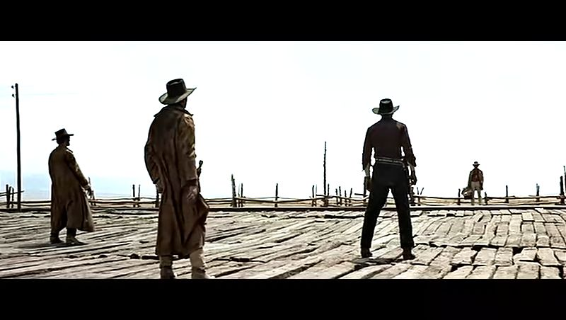

# 傻逼如你我者

**“逍遥法外的英雄、大侠们已既挨不了国家暴力机关的枪炮，也敌不过商人们的斤斤算计，至此人被彻底地规训，离经叛道的家伙们要么不为世人所容，要么无法养活自己。”**

# 傻逼如你我者

## 文 / 鸿渐方

当年我还年轻的时候，偶尔会看看武侠小说，意淫自己学尽世间武学，败尽天下英雄自此再无敌手，就像年轻时的李腾常会梦回唐朝以慰藉自己身为李家后人却无所作为的孤寂之心一样。

后来我们醒悟了，低智、孱弱且没有一个牛逼老爹如我者，要真进了江湖，估计也就能在类似云来客栈的地方当一个店小二，在托着菜盘喊着：“客官您的两斤黄牛肉来咧！”的时候被某反角的小喽啰以“好刚猛的剑气”一下劈成两半；或是在张着嘴准备喊出“啊！”的一声后再死的当儿被某男猪脚以“好犀利的指力”飞来一只酒杯弹开剑刃救下一命，然后猛然跪下，头如捣蒜大喊：“多谢大侠救命之恩。”假如我够勤奋且运气不错，顶多能当个尹志平或是田伯光，虽然这看上去也不错……

而四体不勤、进无力追杀退不得逃命的李腾要真梦回唐朝，怕还没当上个百夫长，便被敌人——有时候是自己人——割下脑袋别在腰间晃荡着拿回营地邀功请赏去了。所以吧，年纪大了之后，李腾的“唐”氏综合症就自我痊愈是有道理的。

能做大侠、将军的就那么几个，传说中的荣光并不属于你我。不单你我明白这点，那些传说的作者也明白。于是春秋时期的阿青能凭根竹枝大败三千甲士，而到了鹿鼎记，再牛逼的武林高手都比不过韦小宝的西洋火枪——更比不上他的钻营功夫。

而电影西部往事里有心“走向新时代”、与商人合作的牛仔弗兰克最后忍不住去找那谜一般的口琴男（多么内涵的描述...）与之决斗。最后俩人绕了半天圈圈后，弗兰克被口琴男一枪毙命——以古典的方式终结了自己。但得胜的口琴男最后也得离开，因为在贯穿西部的铁轨上建起的甜水镇和轰隆的火车声意味着牛仔们的旧西部已然逝去，新西部只属于警察和商人。

哪怕在不可饶恕里缧绁于猪圈多年的老牛仔最后变身超级赛亚人一下子秒了几个条子，但这也不过是次激动人心的回光返照，英雄们的时代一去不复返。你瞧，纽约黑帮里的本地帮老大屠夫比尔不是被阿姆斯特朗用他亲授的“肾击”干掉——阿姆斯特朗老爸就是被比尔两刀从腰间刺中肾脏挂掉的啊——而是在俩人决斗的时候被政府的海军一炮轰得没了性命。

逍遥法外的英雄、大侠们已既挨不了国家暴力机关的枪炮，也敌不过商人们的斤斤算计，至此人被彻底地规训，离经叛道的家伙们要么不为世人所容，要么无法养活自己。我们欢欣鼓舞地迎来了庸人的时代，这样傻逼如你我者，才能活得人模狗样，安然度过此生，最后在病床上带着一屁股的褥疮哼哼唧唧着死去。
