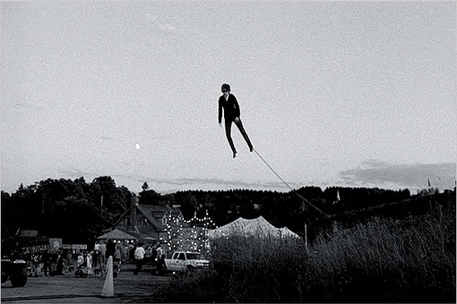
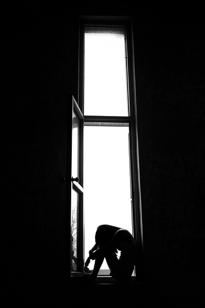

# 剧透你的生活

**单是从体制中逃脱这一概念就浪漫得让人想入非非：再不会有一个声音在耳边精确地预报 “明年该申请商学院了”、“两个月后你预期可以升职”。这种对生活无穷无尽的剧透只能让所有人的发迹线都以同样的曲率往后倒退，只能让所有的婚戒都用同一克拉数度量，只能把所有的住所归入同一邮编，只能把所有人埋进同一座墓场，而所有的墓碑上早已规定好了墓志铭……** ** **ibeidou.org

ibeidou.org

# 剧透你的生活

ibeidou.org

## 文/沈诞琦（普林斯顿大学）

ibeidou.org ibeidou.org 一、重 进investment banking不难，只要读[Vault Guide to Finance Interviews](http://www.amazon.com/Vault-Guide-Finance-Interviews-7th/dp/1581315295),，上[Mergers & Inquisitions](http://www.mergersandinquisitions.com/)网站，上[Wall Street Oasis论坛](http://www.wallstreetoasis.com/forums)（把它当作金融界的CUUS），面试前背两个近期的M&A实例。 进sales and trading不难，除了读[Vault Guide to Finance Interviews](http://www.amazon.com/Vault-Guide-Finance-Interviews-7th/dp/1581315295)和上[Wall Street Oasis](http://www.wallstreetoasis.com/forums)论坛外，面试前背两个冷门股票的数据和推荐原因，面试前三天开始看华尔街日报，面试当天早晨记大盘指数。 进quant或quantitative trading不难，只要读[Heard on the Street](http://www.amazon.com/Heard-Street-Quantitative-Questions-Interviews/dp/0970055277/ref=sr_1_1?s=books&ie=UTF8&qid=1289711470&sr=1-1)和[A Practical Guide to Quantitative Finance Interviews](http://www.amazon.com/Practical-Guide-Quantitative-Finance-Interviews/dp/1438236662/ref=sr_1_1?ie=UTF8&s=books&qid=1289711500&sr=1-1), 上[Wilmott论坛](http://www.wilmott.com/index.cfm?NoCookies=Yes&forumid=1)。虽然大公司如Citadel, D.E. Shaw, Jane Street面试题几乎无重复的可能，许多小型prop trading 公司面试题一百年不变，面试前搜索 “XX Firm Interview Question” 经常有意外惊喜。 进management consulting不难，只要读[Case in Point](http://www.amazon.com/Case-Point-Interview-Preparation-Anniversary/dp/0971015856/ref=sr_1_1?ie=UTF8&s=books&qid=1289711564&sr=1-1)，上[Management Consulted](http://managementconsulted.com/)网站，以及Rice University的[这个网站](http://www.ruf.rice.edu/~jgsmcc/index.htm)。 进economic consulting不难，除了读[Case in Point](http://www.amazon.com/Case-Point-Interview-Preparation-Anniversary/dp/0971015856/ref=sr_1_1?ie=UTF8&s=books&qid=1289711564&sr=1-1)外，只要复习计量经济学课堂笔记。 从今年一月起，我陆陆续续被金融和咨询公司面试了一百多次，拿到过几张录取通知，以上就是个人经验总结，仅对美国Target School在读本科生申请美国本土全职工作或实习有效。如果是Non-Target School的学生，主要靠校友networking。如果是美国本科在读想申请香港的工作，主要参考[应届生论坛](http://bbs.yingjiesheng.com/)上的面经。 我写下面试经验，无非是为了减轻这些凌乱无章的技巧在我心中的重量感。昨天回绝了最后一份金融界的录取，于是以上的这一切都不再和我有关。 ibeidou.org 二、轻 今年暑假在纽约的一家投资银行里做销售交易部的实习生。五点起床、习惯性加班、三餐面对着六台电脑屏幕，这些都给我的夏日平添了许多无谓的重量。而我仍然想讲讲暑假里遇到的一件轻盈的小事，因为正是轻盈为我们灵巧地掀起了生活的真相。 公司每周会安排些身处高位的领导给实习生讲讲自己的人生经历。某一周的演讲嘉宾Blythe Masters是销售交易部高层领导中唯一的女性，年仅四十岁，美丽、聪慧、勤奋。她在怀胎十月被推进产房的那一刻手里还捧着手机查股价，孩子降生后她的第一反应不是想抱抱婴儿而是想查查股票，可想而知她的演讲是关于如何分秒必争努力拼搏。提问阶段我举手问她关于信用衍生品和两年前金融危机之间因果关系的看法，她反问我在哪个组实习，我报了老板的名字。然后，这个苍白瘦弱的英国女人开怀笑了，她只字没有回答我的问题，而是说：“十多年前，你的老板曾是我的部下，有一晚我们在一间伦敦酒吧里玩真心话大冒险，我问他的问题是那晚他的右脚拇指上有没有戴着戒指。你回到组里能不能帮我问他一下，还记不记得那天我的问题和他的回答。” 那个周末老板请组里所有人去他在南安普敦的别墅玩，我们到的时候老板穿着沙滩裤赤着脚正在烤香肠。我低头看见他右脚拇指上果真戴着一枚严重磨损的戒指，我问他这戒指戴了几年。他说，从大学毕业那天直到现在。他去翻动滋滋作响的香肠，“你知道，这不过是大学时代人人都做过的疯狂事。大学毕业那天，我突然觉得自己轻得可以飘起来。不是体重轻，而是心情轻。我生怕自己太轻了，于是买了枚脚趾戒指，想给心情加一点分量，把双脚扎在地上。”他的身后一双小女儿正在游泳池里嬉戏，她们从出生一个月起就上专业游泳课，每年夏天她们无所事事，只是泡在水里把身体折叠成各种违抗重力的形状。她们的好爸爸用陈旧的戒指让自己扎入大地，只是为了女儿们轻飘飘地浮在水中…… ibeidou.org 三、轻与重 香肠熟了，老板请我们吃并不怎么好吃的热狗。所有人坐在沙滩椅上吃热狗喝啤酒，老板的小女儿们仍旧在游泳，他似乎并不介意她们进餐不规律，反而骄傲地对属下说：“你看，整个夏天泡在水里，她们的头发都褪色了。”而后我们打了场水球，开电视看德国对阿根廷的世界杯，老板随口聊起了他的老上司Blythe Masters，谈她的商业敏感，谈她的领袖风范。十多年前Masters领导的组首创了风光一时的CDS （Credit Default Swap，信贷违约掉期），十多年后正是CDS触发了金融危机的连锁反应，尽管CDS市场的倾塌源自交易员的滥用，与Masters无关。 老板谈起Masters如何真诚坦率，不避讳和属下讲她的私生活。 “有一次我们组出去喝啤酒，Blythe喝多了，她就和我们讲她的女儿，讲她和女儿多长时间没有说话，她就和我们讲她的丈夫，他们离婚全都怪她太忙，那天她讲了很多对家庭的愧疚……”所有人都鸦雀无声，小女儿湿漉漉地跑进来求他陪她们玩，他抚摸着她们褪色的长发，“不过，这实在太古怪了！她讲了那么多伤心事，可你知道她是用什么样的语气讲的？她讲起这些事，完全不像一个母亲、一个女人。她听上去就像一个交易员在谈论某个特别糟糕的交易日，那种一天输了几千万的日子，那种老板找你去谈话的日子，那种你做了全部努力最后还是一败涂地的日子，那种你踌躇满志结果市场走向把你吓个半死的日子。她像是个交易员一样谈论生活，分析她所有做错的步骤，最后还不忘记说，‘我今天不过手气太差。’” 即使这样的故事都没有吓倒我。我对幸福从未期望过高，甚至认为婚姻和家庭可有可无。美国金融界私生活极度公开化，可是我的童年也是在毫不尊重隐私的环境中生长起来的。在那一条条毫无隔阂的办公桌前，二三十个交易员毗邻而坐，任何一秒都能从办公桌的一头传来紧迫的命令，于是我站起来，双手做成喇叭状，将可笑的紧迫感传到另一头。我目睹过女交易员用公司电话预约妊娠检查，周围的男交易员侧耳倾听着她最后一次经期的时间，于此同时还倾听着四面八方的各种数据更新。妊娠检查的电话讲了一半，另一只电话响了，女交易员对电话里的医生说“你等等”，然后向另一通电话的客户谈最近一笔交易的细节。这种无休止的毫无情欲的凝视，这种对隐私的麻木不仁的忽略，时常让我想起在上海读初中时的集体宿舍生活。我在澡堂赤裸着身子排队等空位，毫无兴趣地打量着那些正在发育的年轻的裸体。我睡在二十人的寝室里，互相捆绑的上下铺位，夜里能感觉到任何一个室友的翻身，我的小床因此摇了好几下。我们在寝室里斜着拉起许多绳子，大家晾起潮湿的内衣内裤，顺便知道了谁刚来了例假谁的罩杯多大……即使这样的麻木都没有把我逼疯，于是大学的前三年我一直以为我理应忍受毫无隐私的投资银行，因为我的朋友们都在忍受同样的生活…… 暑假的一天安排公司的CEO向所有实习生演讲。大家向自己的组请了假，赶早到礼堂抢前排的位子，许多人破天荒带了笔记本，想记下这位英俊风趣、最受政界宠爱的金融骄子所提供的人生格言。CEO说他不想发表一通没有目的性的谈话，他把整个演讲时间都留给提问，欢迎各种各样的问题。在一堆关于市场长期走向或者金融危机成因或者公司未来发展的问题后，一位实习生提问，“CEO先生，你最喜欢读什么书？”CEO眉毛扬了扬，显然觉得这个问题比之前所有问题更有趣。他告诉我们他和其他高级经理人最大的不同就是他的日程表上永远都有四分之一的时间空着，他利用这些时间阅读。他喜欢所有的历史书，所有的政治书，所有的科普书，所有的金融书，他最喜欢的书是《万物简史》。然后，他顿了顿，“可是，我从来不读小说或诗歌。在这点上你们得信我，如果你们想在这一行里搞出些什么名堂，你们就别再读小说读诗了。这些虚构的东西，能教会人们什么呢？” 这些虚构的东西，能教会人们什么呢？那一刻我脑中想到的是布罗茨基在诺贝尔文学奖颁奖礼上的演说，“如果说有什么东西使我们有别于动物王国的其他代表，那便是语言，也就是文学，其中包括诗歌，……，它就是我们这一种类的目标。”我环顾四周，大家刷刷写下了CEO建议的书单，而我和周遭如此格格不入。演讲后我回到组里，大家都想知道CEO给实习生讲了什么。我谈起CEO对小说和诗的看法，老板当即表示他完全同意，他甚至觉得图书馆的存在完全没有必要。 那一天，我第一次确信我不可能成为一个交易员，也不可能成为金融界的任何角色。 ibeidou.org

ibeidou.org 这也许很难说服人，也许要被大多读者看成一个在书海中幽游过久的呆子不能适应现实的典型例证，但是对想象和诗意的无条件忠诚的确是我说服自己放弃金融业和咨询业所有录取通知的唯一理由。我想讲的并不是无视现实，逃逸入梦中，而是换个角度看问题。我曾经在做很多决定前权衡利弊，患得患失，最后却常常懊悔。可我从未因多读一本小说、多背一句诗而后悔，这纯粹美学角度的判断要比任何伦理学和价值观的判断容易得多，直接得多。我走进服装商店，别人挑了一件蓝衣服，我挑了一件红衣服，并非因为红衣服更保暖更舒适，而是因为我喜欢红色。大多数情况下，我唯一确知的事实就是我喜欢红色。 我们面对着一个巨大而且似乎坚不可摧的体制，用工资单的数额标定人的价值，用住宅的大小判别恋爱对象的优劣。在体制面前，人免不了想出各种策略应付：耍小聪明挤进体制、向体制内的成员称兄道弟、努力表演吸引审判官的目光……如此种种之间，我选择了逃走。我并不觉得逃走比适应体制更加英勇，我只是恰好热爱想象胜过现实。单是从体制中逃脱这一概念就浪漫得让人想入非非：再不会有一个声音在耳边精确地预报 “明年该申请商学院了”、“两个月后你预期可以升职”。这种对生活无穷无尽的剧透只能让所有人的发迹线都以同样的曲率往后倒退，只能让所有的婚戒都用同一克拉数度量，只能把所有的住所归入同一邮编，只能把所有人埋进同一座墓场，而所有的墓碑上早已规定好了墓志铭…… 昨天谢绝了最后一封录取后，我躺在床上，冥想着是究竟哪一本小说哪一首诗让我对文学产生了如此忠诚。第一个跳入脑海的不是艾略特、凯鲁亚克、赫拉巴尔或者我成年后痴迷上的任何作家，而是《雾都孤儿》、《茶花女》，是“姑苏城外寒山寺，夜半钟声到客船”“葡萄美酒夜光杯，欲饮琵琶马上催。”没有博尔赫斯，还有马尔克斯。没有里尔克，还有曼德尔施塔姆。可是哪句晶莹剔透的诗行都替代不了“举头望明月，低头思故乡”在我心中漾起的第一丝乡愁，令人沉醉的哀伤。从这些小学课本里的绝句、从语文老师无心布置的并不深奥也不现代的暑假阅读作业，我汲取到的同情和爱心，要胜过所有的历史课、政治课，胜过我所有真实的经历。有时候半夜醒来，恍恍惚惚，忘记了自己的身份，亦不知今夕何夕，窗外的月亮并不能让我想到任何一句奥登或者策兰或者兰波，我只是下意识默诵出李白的《静夜思》，然后明白我从何处长大，会对何处忠诚——我指的并非是疆域或政体，而是本尼迪克特•安德森笔下的“想象的共同体”(Imagined Communities)，也即文化与经验交叠重影后的意象。将这些诗意与想象深埋于潜意识中是启蒙教育的全部意义。 ibeidou.org

ibeidou.org 在我们的童年，大环境的约束与欺骗并没有败坏我们审美的趣味，我们都爱黛玉多过宝钗；而今同样是来自制度的拜金热潮也不该败坏我们对生活的选择。善恶对错多么难辨，可我相信世间存在一种映射，在灵光乍现下能把所有的价值判断都转换成美学判断，能把所有的是非题转换为简单的一句“你喜不喜欢红色？” 而对于后者，所有人都能在一秒内作答。我们永远都辨不清刘晓波该不该得诺贝尔奖，永远都辨不清两岸关系谁是谁非，就像我们永远都辨不清自己是不是适合金融适合咨询。可是我们永远都知道，喜欢这一个故事胜过另一个故事，喜欢这一句诗行胜过另一句诗行。我们永远都知道，在虚构中我们可以爱歹徒胜过圣人，因为歹徒飞檐走壁的表演比圣人的布道更让人感官愉悦。我们永远都知道，即使在那些最沉重的讲述死亡或者瘟疫或者世界末日的诗篇里，都有一只鸟，高傲的长喙，空心的羽毛，那么轻盈，扑腾着翅膀，越飞越高。 ibeidou.org ibeidou.org

（采编：陈轩 责编：陈轩）

ibeidou.org ibeidou.org
